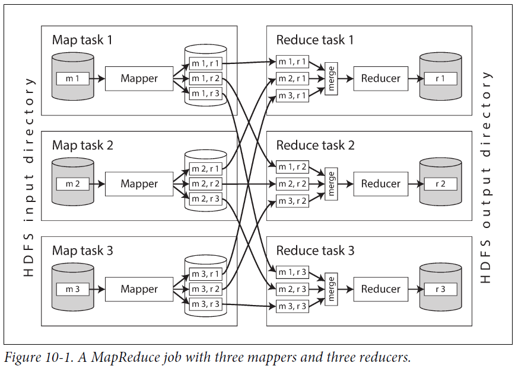

# III. Derived data
- Systems of record (normalized) vs derived data systems (redundant, denormalized)
## 10. Batch processing
- 3 types of systems:
  - Services (online systems): request - response model, focus on response time
  - Batch processing systems (offline systems): operate on fixed set of input, focus on throughput
  - Stream processing systems (near-real-time systems): operate on events shortly after they happened
### 10.1. Batch processing with Unix tools
- Philosophy:
  - Use chain of commands: combine simple programs, input of one is output from another
  - Experiment with prototypes
- Example:
  - Sort data by key, then iterate & merge (reduce)
  - Adv over program using in memory hash table:
  can handle case when there is not enough memory: write sorted segments to disk (like LSM tree)
- Use a common interface: file (sequence of ASCII text)
- Separate logic & wiring: use stdin as input & stdout as output
### 10.2. MapReduce & distributed filesystems
- MapReduce job:
  - Run on multiple machine
  - Input & output: files in distributed filesystem
  - Immutable input & no-side-effect output
- HDFS (Hadoop distributed filesystem):
  - Daemon process running on each machine, allow other nodes to access files stored on that machine
  - Central server (NameNode) keeps track of file blocks stored on each machine
  - File blocks replicated on multiple machines
- MapReduce data processing pattern:
  - Read input files, break into records
  - Call mapper function to extract key & value from each record
  - Sort all key-value pairs by key
  - Call reducer function to iterate over sorted key-value pairs to combine values
- Parallelization: based on partitioning:
  - Run mapper on each replica storing the input files
  - Run reducer on configured num of replicas. Partition reducer by hash of key.
  - Mapper partitions its output by reducer, each output partition written to a sorted file on the mapper disk 
  - -> Notify corresponding reducer to download the output file when finished
  - Reducer merge downloaded files, then reduce & write output to a file on distributed file system
  - 
- Chain jobs into workflow: no support, implicitly by directory name 
- -> Need to use external workflow scheduler
- Reduce-side joins & grouping:
  - Joins must be local to a single machine to be efficient
  - 2 mappers for 2 sides of join: partition in the same way (eg hash of key)
  - Reducer download & merge both sides of join
  - Handle hot keys:
    - 1 side of join sharded
    - Other side of join replicated to all shards
    - Reduce in each shard then merge result
- Map-side join:
  - Make assumptions about size, sorting & partition of input datasets
  - Output partitioned & sorted in the same way as the large side of join
  - Broadcast hash join: small side of join broadcast to all mappers, loaded into hash table/index on local disk
  - Partitioned hash join: if both sides of join are partitioned in the same way, mappers load only the needed partition for join
  - Map-side merge joins: if both sides are partitioned in the same way & sorted (eg result of previous job),
  mappers just read both sides incrementally
- Batch processing output examples:
  - Search indexes
  - Key-value store (eg recommendation for users): wait for batch job to finish, then bulk load result into DB 
  - -> Increase performance & avoid duplicating side effect of failed and retried jobs
- Hadoop (HDFS + MapReduce) vs massively parallel processing (MPP) database:
  - MPP: focus on parallel execution of SQL queries on multi machines
  - Hadoop: general-purpose OS that can run arbitrary programs:
    - High diversity of storage: dump data first, process later -> flexible
    - Diversity of processing model: not constrained to SQL
    - Design for frequent faults (eg preemption, termination)
### 10.3. Beyond MapReduce
- Materialization of immediate state: write files to HDFS after each job:
slow down execution, have to wait prev job to finish 
- -> Dataflow engines (Spark, Tez, Flink):
  - Handle entire workflow as one job. Advs:
    - Don't have to alternate map & reduce: only operator functions chained together
    - Don't have to sort when not required
    - Can optimize base on workflow info
  - Need to recompute data/save checkpoint in case immediate state on RAM is lost 
  - -> Operator functions must be deterministic
- Graphs & iterative processing: Pregel model:
  - Vertex sends message to another
  - Vertex saves state in memory between iterations, process only incoming message
  - Hard to partition frequently communicating vertexes together
  - -> Lot of mes sent via network
  - -> Running on 1 machine is usually more efficient
- Optimizations:
  - Include declarative API (eg to optimize join)
  - Reusable implementation for specialized domains (eg ML algo)
