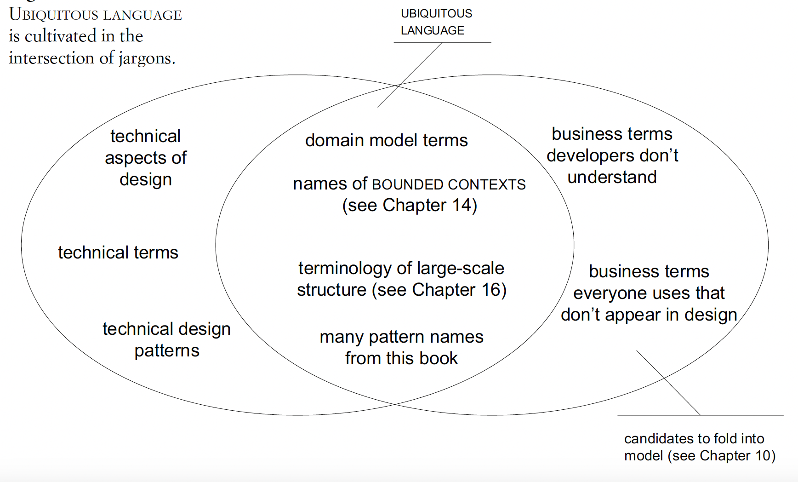

## 2. Communication and the use of language
- Model needs to pervade every medium of communication
- Communication aspects:
  - UML diagrams
  - Docs
  - Informal diagram/casual convo
  - Code & tests
### Ubiquitous language
- From domain model
- Bridge the gap of language used by domain experts & devs
- -> Remove the need of translation by which info is lost
- Vocab:
  - Names of classes & prominent operations
  - Terms to discuss rules
  - Explicit terms from high-level organizing principles imposed on the model (eg context maps, large scale structures)
  - Names of patterns commonly applied to the domain model
- Difficulty: incompleteness/ambiguity/contradiction of the language
- -> Need commitment to use the language in all comm to discover issues & improve the model/language
- -> Deal with difficulty by experimenting with alternative expressions, which reflect alternative models
- -> Then refactor code to conform to the new model
- Where to look for problems in the language:
  - Terms/structures that are awkward or inadequate to convey domain understanding
  - Ambiguity/inconsistency that will trip up design
- Should be closely tied to spoken lang
- -> Utilize human talent in lang for model development
- 

### Documents, diagrams, code
- Use informal UML diagrams to anchor a discussion:
sketch a diagram of 3-5 objects central to the issue at hand. Update during the discussion.
- Limitations of UML: doesn't show:
  - Object meaning
  - Object explicit behavior
- Diagram best practices:
  - Should be minimal, focus on imp parts. Avoid putting in every details
  - -> Avoid using diagram of the entire object/DB model
  - Talk about objects' meaning during the discussion to supplement the diagram
- Detail about the design should be captured in code
- Design docs:
  - Problem: irrelevant, stale docs
  - Best practices:
    - Code to document details
    - Written docs to illuminate meaning, to give insight to large-scale structure & to focus attention on core elements
    - Docs should be involved in project activities
    - Docs should use ubi lang
    - -> Should either update or archive
- Avoid misleading code: code should be based on ubi lang

### Explanatory models
- Can have other models (eg larger-scoped, background topic) for educational/explanatory purposes
- -> Shouldn't be object models