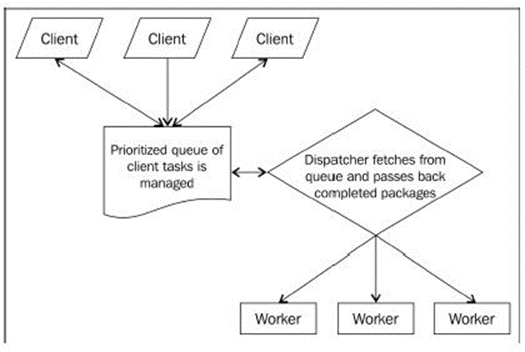

# 1. The Node environment
- Google V8 engine: compile node, not interpret
- Node design:
  - Simplicity > complexity
  - Use simple Portable Operating System Interface Unix, not try to improve: many functions are wrappers around POSIX functions
  - Event not thread
  - Use existing C library, not reimplement
  - Text > binary format
- Deferred tasks are encapsulated, entering and exiting the execution context via callbacks. I/O operations generate evented data streams, and these are piped through a single stack. Concurrency is managed by the system, abstracting thread pools, and simplifying shared access to memory.
- Design principle: operations never block
  - Single thread, ordering execution via event loop
  - Fast IO
  - Program flow directed through async callbacks
  - Expensive CPU operations should be split off into parallel processes, emitting events as results arrive
  - Complex program assembled from simpler programs
- Events are instances of events.EventEmitter:
  - on = addListener('event', callback)
  - removeListener
- libuv: create & manage event loop

# 2. Async event driven programming
- 
- Event loop runs in the same thread Js code run, starts when process starts.
- Event loop delegate IO to libuv. libuv manages these operations, notify the event loop when results are available.
- Event-driven: app has main loop, divide into 2 sections:
  - Event detection
  - Event handling
- Fork process for parallelization
- Important phases of event loop:
  - Timers: Callbacks deferred to some time in the future specified in milliseconds, such as setTimeout and setInterval
  - I/O callbacks: Prepared callbacks returned to the main thread after being delegated to Node's managed thread pool, such as file system calls and network listeners
  - Poll/check: Mainly the functions slotted on the stack according to the rules of setImmediate and nextTick
- Tick: processing of instruction queue. When data arrive for callback while main thread is executing instructions, callback instructions will be added to the queue.
- Signal: event for inter-process communication.
- process.nextTick:
  - Defer execution, before timer & IO callback, after sync Js code.
  - Constructor function. Use to delay broadcast of event, to wait for program to bind the event callback.
```javascript
    const events = require('events');
    function getEmitter() {
        let emitter = new events.EventEmitter();
        process.nextTick(() => {
            emitter.emit('start');
        });
        return emitter;
    }
    let myEmitter = getEmitter();
    myEmitter.on('start', () => {
        console.log('Started');
    });
```
- process.setImmediate:
  - Defer execution, before timer within the same IO cycle.
  - Run after timer & IO callback
- Timer unref: when timer is the only event source remaining, stop the process
- Promises:
  - Avoid callback pyramid
  - Can be pass around as a variable
  - Manage errors across many async actions
  - Parallel run with Promise.all
- Async/await:
  - Not block the process, but halt the execution of the program until resolved.
  - Resemble sync codes, easy to follow and reason about.
  - Can catch sync errors.
- Generator: handle sequence of future values. Work like iterator.
- Error and exception: reverse of other languages:
  - Error: non-fatal condition to be caught and handle (input error….). 4 errors context:
    - Sync
    - Async
    - Event
    - Promise
  - Exception: serious system error

# 3. Testing your application
- Native debugging tool: console.log, util.inspect, debugger, assert module, vm module for sandboxing.
- Mocha:
  - Test runner. Not concern with assertion.
  - Use to organize test with describe and it.
  - Hooks: use to run code before/after test. Before, beforeEach…
- Chai: assertion lib with more expressive syntax.
- Sinon: simulate external services, emulate functions, track function calls:
  - Spies: function that records arguments, returns value, the value of this and exception thrown (if any) for all its calls.
  - Stubs: function with pre-programmed behaviors, extend spies functionality.
  - Mocks: function with pre-programmed behaviors and expectations.
- Headless testing: Nightmare and Puppeteer.

# 4. Miscellaneous
- V8 compiler optimization:
  - Number: no change from integer to float
  - Array: no sparse array (slow hash table), no delete operation, no preallocate large array
  - Object: no property assignment to object after initialization, initialize all members in the constructor function in the same order
  - Function: no try-catch, no polymorphic (variable arguments)
- New JS features:
  - let [executable, absPath, target, ...message] = arr;
  - function (a, b, ...args) (args is an array)
  - array1.push(...array2);
  - for(let c of 'Mastering Node.js')
  - console.log([...'Mastering Node.js']);
- Async Event Driven:
```javascript
    process.on("SIGINT", () => {
        console.log("We received the SIGINT signal!");
    })
    process.on("SIGUSR1", () => {
        console.log("Got a signal!");
    });
```
- get PID: ps aux | grep ipc.js
- kill –s SIGUSR1 123
- let intervalId = setInterval(() => {}, 1000);
  - intervalId.unref();
  - intervalId.ref();
