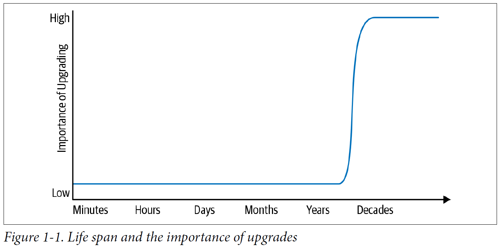

# I - Thesis
## 1. What is software engineering
- SE vs programming: 2 dif problem domains with dif constraints, values & best practices -> dif tools
- 3 difs between SE vs programming: time, scale & tradeoffs
### Time & change (most imp)
- Time add a new dimension to programming: code needs to be sustainable
  - 
- Require planning & managing impact of required change
- -> Need practice & expertise
- Hyrum's law: given enough time & users, all observable behaviors of a system will be depended on by sb,
no matter what you promise in the contract
- -> Changes always introduce breakage -> have to consider tradeoffs of such breakages
- Why change is needed:
  - Issue: underlying tech change (eg fix security issue)
  - Opportunity: efficiency improvement
  - Product requirement
### Scale & efficiency
- Everything your org relies upon to produce & maintain code (do repeatedly)
should be scalable in terms of overall cost & resources consumption (eg human, compute resources of dev, codebase)
- SE is team effort: need to be able to scale both projects & org
- Examples of policies that don't scale:
  - Dev branch: merge overhead
  - Forcing users to do deprecation
  - -> Should update in-place or migrate the users -> make use of expertise
- Take adv of scale:
  - Automation
  - Consolidation/consistency -> low level changes have limited problem scope
  - Expertise
  - Find problems earlier in the dev workflow to reduce cost
### Tradeoffs & costs
- Complex decisions: need to consider cost when deciding between 2 engineering options
- Stay rational: adjust decision when new data is available
- Types of cost:
  - Financial
  - Resources
  - Personnel
  - Transaction (cost to act this way)
  - Opportunity
  - Societal
  - Psychological (employees' happiness)
- Types of decision:
  - Quantifiable cost & benefit
  - -> Straightforward: consult table of cost of dif types of resources
  - Not quantifiable:
    - Should treat with same priority & greater care
    - Rely on exp, leadership & precedences