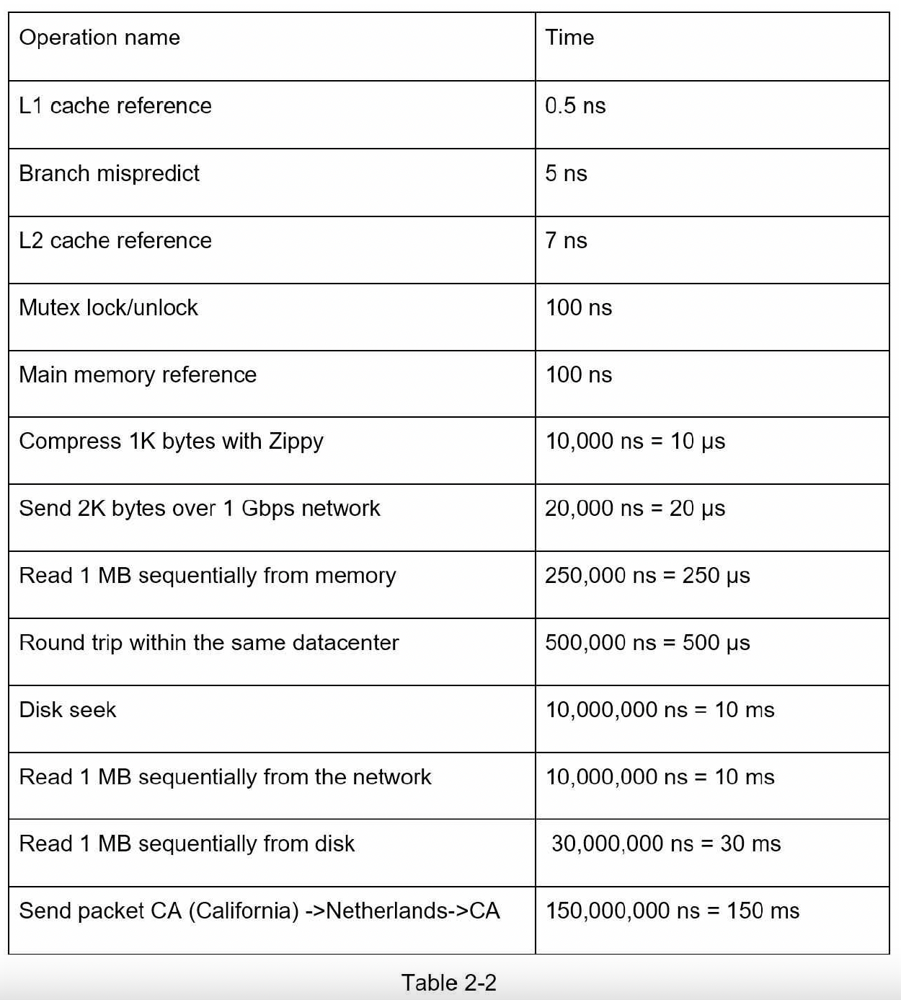

## 3. Rough estimation
- 1 ASCII char = 1 byte
- Compress data (fast) before send (slow network read)
- Write down assumption with unit
- Common estimations:
  - QPS, peak QPS (can assume x2 QPS)
  - Storage
  - Cache
  - Number of servers
- Latency numbers:
  - 
### Materials
- [Google back-of-the-envelope estimation](http://highscalability.com/blog/2011/1/26/google-pro-tip-use-back-of-the-envelope-calculations-to-choo.html)