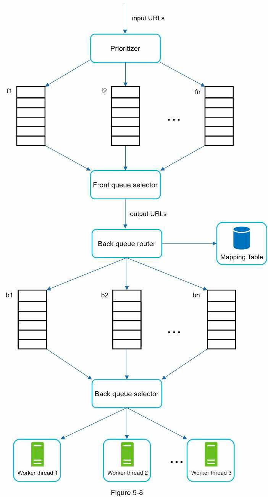

## 9. Web crawler
### Web crawler overview
- Used to discover new/updated content on the web
- Mechanism: start with a few pages, go to other pages in each page, traverse in tree-like style
- Purposes:
  - Search engine indexing
  - Web archiving (store web content)
  - Web data mining
  - Web monitoring (e.g., copyright)
### Requirements
- Purpose
- Num pages/s
- Content type: HTML, image
- Need to update data (ie new/updated web page)?
- Storage duration?
- Store duplicate content?
### High level design
- 
### Details
- How to choose seed URLs:
  - Popular sites
  - By category
- Traversal algo: usually BFS. Improvement:
  - Avoid flooding the same page
  - Visit important page first
- -> URL frontier:
  - Ensure politeness: each domain as a queue, handled by 1 worker
  - Prioritization: use queues with dif weights, workers choose queue randomly based on weight, put to queue router
  - Freshness: ensure content updated, can use page's update history
  - 
- HTML downloader:
  - Multi nodes, pull from queue pushed by URL frontier
  - Read & cached robot.txt (file in each site specifying which web can be downloaded)
  - Cache IPs returned by DNS resolver
  - Geographically distributed -> improve download time
  - Timeout
- Add new modules for other tasks: URL seens? ->
  - Image downloader
  - Web monitoring (eg monitor for copyright issues)
- Avoid problematic content:
  - Redundant content: use hash/checksum
  - Spider traps:
    - Blacklist/other filters
    - Max URL length
  - Noise: ads, spam URL
- Server-side rendering page to obtain dynamically generated content
- Filter: avoid low quality/spam pages
- Scale: DB, downloader
### Materials
- [Mercator web crawler paper](https://courses.cs.washington.edu/courses/cse454/15wi/papers/mercator.pdf)
- [Web crawling survey](http://infolab.stanford.edu/~olston/publications/crawling_survey.pdf)
- [Web crawling - Standford lecture](https://www.ics.uci.edu/~lopes/teaching/cs221W12/slides/Lecture05.pdf)
- [PageRank citation ranking paper](http://ilpubs.stanford.edu:8090/422/1/1999-66.pdf)
- [Google dynamic rendering](https://developers.google.com/search/docs/advanced/javascript/dynamic-rendering)
- [IRL bot web crawler design](https://irl.cse.tamu.edu/people/hsin-tsang/papers/www2008.pdf)
- [Detect spamming content paper](http://airweb.cse.lehigh.edu/2006/urvoy.pdf)