# Category
Practical, IT, System design

# Structure
- Foreword: intro problems, purpose of system design interview (SDI), goals of the book
- Chap 1: scaling techniques
- Chap 2: estimation techniques
- Chap 3: interview framework
- Chap 4-15: different design problems
- Chap 16: references of real world system

# Author's problems & solutions
- Problems: SDI is challenging:
  - SDI questions are big scoped & vague
  - SDI processes are open-ended without a standard/correct answer
- Goals:
  - Provide a reliable strats to approach the system design question
  - Provide solid knowledge in building a scalable system

# Presentation & styles

# Terms
- SLA: service level agreement, defining the uptime the service provider promises to deliver

# 1. Scaling techniques
## Overall Diagram
- 
## Multi data centers diagram
- 
## Notes
- Split DB server - service server: scale independently
- Limit of vertical scaling:
  - Hardware limit
  - No failover/redundancy
  - Non-linear cost
- Load balancer:
  - Scalability: add/remove server easily (auto-scaling)
  - Performance: distribute traffic, reduce load to single server
  - Availability: redirect in case of failure
- Master (write) - slave (read) DB replication:
  - Better performance
  - Availability
- Sharding DB: scale horizontally. Design issues:
  - Reshard (move) data
  - Celebrity key: overload 1 shard
  - Join operation across shard: complex
  - -> Need de-normalization to reduce write to only 1 table/row
- Cache tier:
  - Adv: performance: faster read, lower DB read
  - Design issues:
    - Usage: frequent read, infrequent write
    - Availability
    - Consistency
    - Eviction policy: when cache is full, need to discard data when add new data:
      - Least recently used (LRU): most common
      - Least frequently used (LFU)
      - First in first out (FIFO)
- CDN for static content:
  - Mechanism: when content not exist/expire, CDN requests to file server & cache the file
  - Adv: faster read for static content
  - Considerations:
    - Cost of using CDN: should only cache frequently used data
    - Availability: fallback to file server when CDN is unavailable
    - File invalidation:
      - Choose cache expiry time -> avoid stale data
      - Call CDN APIs to invalidate objects
      - Use object version, request by version
- Stateless server: move session data out to NoSQL, memcache/redis:
  - Scale servers
  - No need to direct same user to same server
- Multiple data centers:
  - Each with server, DB, cache. Need DB sync.
  - Use geoDNS to route to the closest data center.
- -> Availability, better response time
- Message queue:
  - Availability: request not lost in case of failure
  - Scalability: scale producer/consumer independently
- Logging (detect issues), metric (system status, business) & automation (CI/CD to improve productivity)
## Materials
- [Should you go beyond relational databases?](https://blog.teamtreehouse.com/should-you-go-beyond-relational-databases)
- [Caching strategies and how to choose the right one](https://codeahoy.com/2017/08/11/caching-strategies-and-how-to-choose-the-right-one/)
- [Netflix multi-regional resiliency solution](https://netflixtechblog.com/active-active-for-multi-regional-resiliency-c47719f6685b)
- [What it takes to run Stack Overflow](https://nickcraver.com/blog/2013/11/22/what-it-takes-to-run-stack-overflow/)
- [Common NoSQL use cases by survey](http://highscalability.com/blog/2010/12/6/what-the-heck-are-you-actually-using-nosql-for.html)
- [Scaling memcached at Facebook](https://www.cs.bu.edu/~jappavoo/jappavoo.github.com/451/papers/memcache-fb.pdf)

# 2. Interview framework
## Overview
- Purpose of SDIs: test communication & problem-solving skills:
  - Technical design skill
  - Collaboration skill
  - Ability to work under pressure
  - Skill to resolve ambiguity constructively
  - Ability to ask good question
- Red flags:
  - Over-engineering, ignore tradeoffs: costly system
  - Narrow-minded
  - Stubborn
## 4-step process
- Problem & design scope: clarify requirements & assumptions:
  - What specific features to build
  - Scope: mobile/web?
  - Load: num users, CCU, request/s, anticipation of growth (scale in next month/year)
  - Availability
  - Scalability
  - Existing services/stack to fit into or can be reused for the design
- High level design (10-15 min) & ask feedback:
  - Main components
  - Use cases
  - APIs (optional)
  - DB schema (optional)
  - Rough calculations (optional)
- -> Suggest multiple approaches if possible
- Deep dive design (10-25 min): ask which aspect/component to prioritize. Can be based on feedback from prev step.
- Wrap up (3-5min): actively:
  - Discuss bottleneck, improvement
  - Recap the design
  - Identify error/edge cases
  - Operational issues: monitoring, deployment
  - Handle the next scale (eg x10 users)

# 3. Rough estimation
- 1 ASCII char = 1 byte
- Compress data (fast) before send (slow network read)
- Write down assumption with unit
- Common estimations:
  - QPS, peak QPS (can assume x2 QPS)
  - Storage
  - Cache
  - Number of servers
- Latency numbers:
  - 
## Materials
- [Google back-of-the-envelope estimation](http://highscalability.com/blog/2011/1/26/google-pro-tip-use-back-of-the-envelope-calculations-to-choo.html)
  
# 4. Rate limiter
## Overall
- Def: used to control the rate of traffic sent by a client or a service
- Mechanism: block excess request when threshold is reached
- Advs:
  - Prevent resource starvation/server overload (eg when there is DDoS attack)
  - Reduce cost (eg there is cost to call third party API)
## Design
### Requirements
- Client side or server side?
- Throttle based on which attribute of the request? (eg user ID, IP)
- Scale of the system? (eg QPS, distributed?)
- Infra level or app level rate limiter?
- Need to inform throttled users?
- Resource usage?
### High level
- Considerations whether to implement in API gateway or in service:
  - Service tech stack
  - Currently have an API gateway?
  - Rate limiting algo that fits business need supported by API gateway?
  - Dev effort
- Rate limiting algos:
  - Token bucket
  - Leaking bucket
  - Fixed window counter
  - Sliding window log
  - Sliding window counter
- High level design:
  - 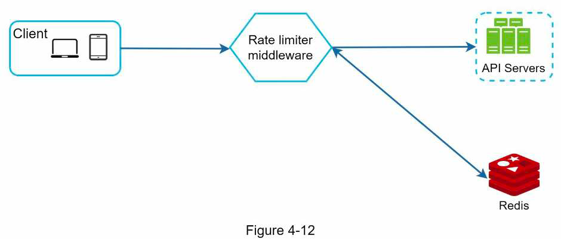
### Details
- Info to return to client (via header for flexibility):
  - Request remaining
  - Limit
  - Retry after
- Handle throttle request:
  - Return error
  - Add to queue to be processed later
- Where to store rule:
  - In files on disk with workers read & update to cache frequently
  - Configuration server
- Prevent lost update when updating counter:
  - Lock
  - Lua script?
  - Redis sorted set
- Multi data centers: sync rate limiting data using eventual consistency model
- Monitoring: gather data about num of dropped requests & window to ensure rate limiting rules & algo are effective
- Soft (vs hard) rate limiting: request can exceed threshold for a short period
- Rate limit at upper layer (eg by IP at layer 3 using IP table)
- Client logic to avoid being rate limited:
  - Caching
  - Adjust request rate based on limit
  - Retry with backoff
- Detailed design:
  - 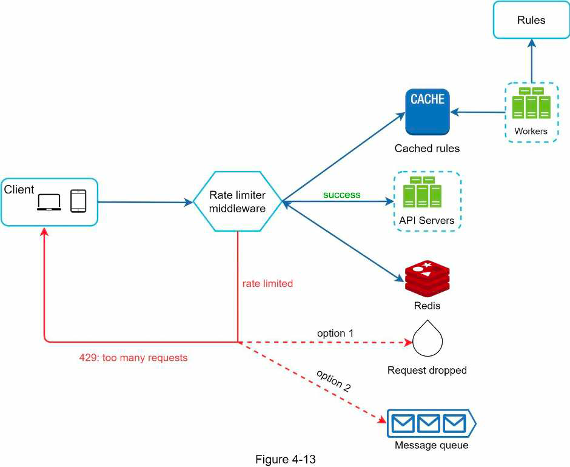
## Materials
- [Rate limiting with Redis sorted set](https://engineering.classdojo.com/blog/2015/02/06/rolling-rate-limiter/)
- 

# 5. Consistent hashing
- Problem: use normal hash function eg hash(key) % num server
- -> Most key are redistributed when add/remove server
- Hash space -> connect 2 ends to create hash ring
- Basic approach:
  - Hash server by name or IP -> map to the hash ring
  - Find a server by going clockwise, get the closest server
  - Problem: server hashes distribute not uniformly when init/add/remove 
  - -> Most key end up in one server
- Virtual node approach:
  - Add virtual nodes for each server, num nodes depend on server capacity
  - Adv: balanced distribution, based on server capacity
- Add/remove node:
  - Straightforward for cache system: don't need to care about moving keys
  - Storage system:
    - Remove: straightforward: run background task, write all keys in removed node to other nodes?
    - Add: 
      - Index keys in each node by key range, then query keys to be moved?
      - Not possible for hash index: need to scan all keys in all node?
- 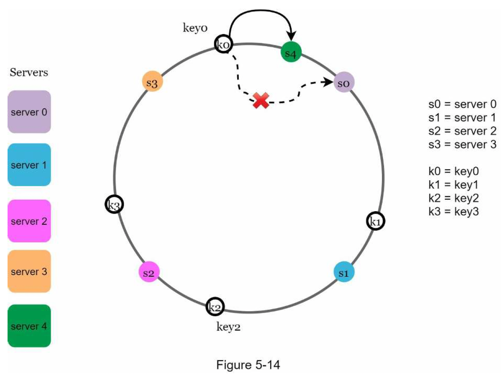
## Materials
- [Wiki consistent hashing](https://en.wikipedia.org/wiki/Consistent_hashing)
- [Amazon Dynamo paper](https://www.allthingsdistributed.com/files/amazon-dynamo-sosp2007.pdf)
- [Cassandra paper](http://www.cs.cornell.edu/Projects/ladis2009/papers/lakshman-ladis2009.pdf)
- [Stanford consistent hashing lecture](http://theory.stanford.edu/~tim/s16/l/l1.pdf)

# 6. Key-value store
## Requirements
- Main operations: get & set
- Read, write latency
- Memory usage
- Consistency vs availability
- Amount of data
- Autoscale?
## High level design
- Design issues:
  - Data partitioning & auto-scaling: consistent hashing with virtual nodes
  - Data replication: store in the first x unique servers on the hash ring
  - Tunable consistency: read & write quorum, CAP
  - Inconsistency resolution: version vector
  - Availability: handling failure:
    - Failure detection: gossip protocol
    - Handle partial failure: sloppy quorum & hinted handoff
    - Handle permanent failure: sync data using anti entropy background process, comparing hash tree of buckets in each node
      - 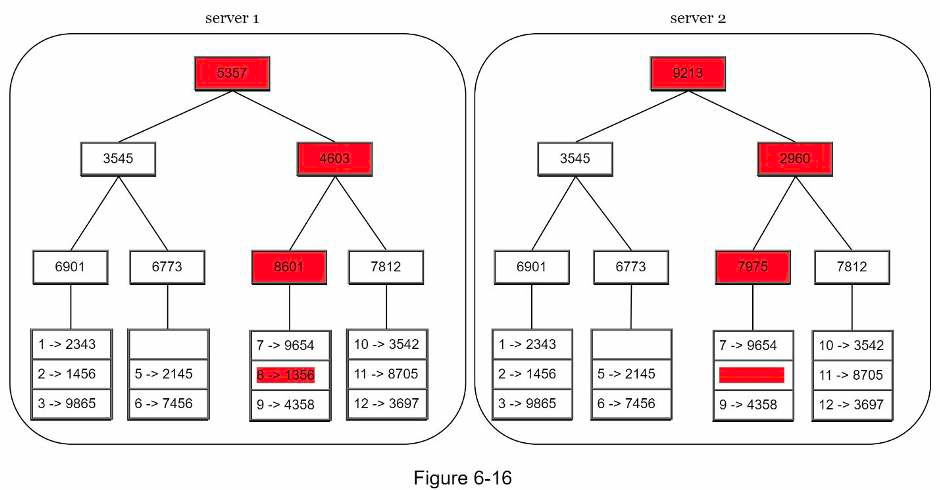
    - Multi-datacenter replication
- Design:
  - Overall architecture:
    - 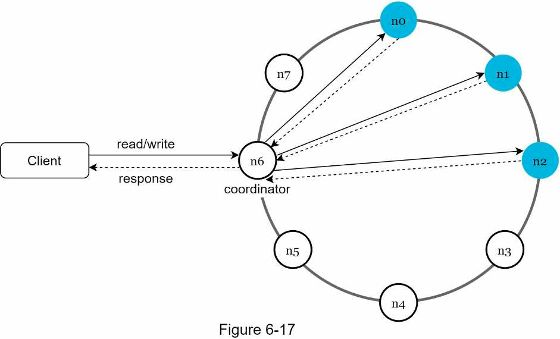
  - Write path:
    - 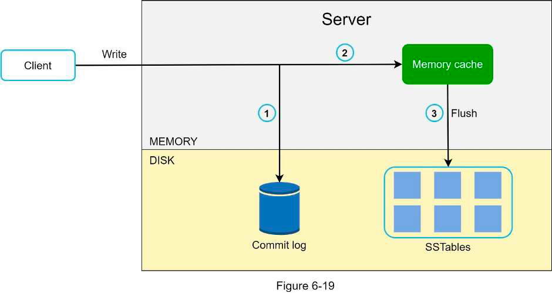
  - Read path:
    - Read from in-memory SSTable if found
    - Read from disk if not found in SSTable
      - 
## Additional info
- CAP theorem:
  - Def: it is impossible for a distributed system to simultaneously provide more than 2 of 3 guarantees:
    - Consistency: client always sees the same data no matter which node it reads from
    - Availability: the system continues to work (eg support read, write) even if some nodes are down
    - Partition tolerance: the system can handle network partition (some nodes can't communicate with others)
  - For distributed system, network partition is unavoidable. So the system must choose between consistency and availability.
  - For distributed data system:
    - Choosing consistency means blocking all writes to avoid unavailable node serving stale data
    - Choose availability means allow writes, unavailable node continues to serve stale data, sync later
## Materials
- [BigTable paper](https://static.googleusercontent.com/media/research.google.com/en//archive/bigtableosdi06.pdf)
- [Cassandra architecture](https://cassandra.apache.org/doc/latest/architecture/)

# 7. Distributed unique ID generator
## Requirements
- Chronologically ordered?
- Increment by?
- Numerical?
- ID length/size?
- Scale: how many IDs/s?
## High level design
- Approaches:
  - Multi leader replication:
    - Mechanism: k DB, each auto increment by k
    - Disadvs:
      - Not chronologically ordered
      - Hard to add/remove ID gen server
  - UUID:
    - Advs:
      - Easy to generate
      - Easy to scale
    - Disadvs:
      - Not chronologically ordered -> can use UUID v6
      - 128 bit long
  - Ticket server:
    - Mechanism: ticket servers use a single DB server. Use auto increment feature.
    - Disadvs:
      - Single point of failure: DB
      - Performance bottleneck: DB
  - Twitter snowflake:
    - 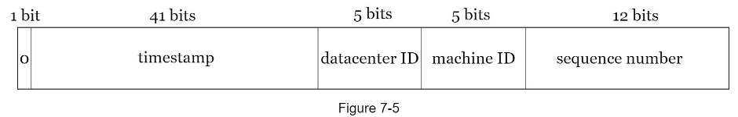
    - Timestamp: from a defined epoch
    - Constraints:
      - 41 bit timestamp -> ~69 years
      - 32 datacenters, 32 machines each center
      - 4096 IDs/s each machine
    - -> Tunable by changing the number of bits
    - Problem: sync time between different machines
## Materials
- [Twitter snowflake](https://blog.twitter.com/engineering/en_us/a/2010/announcing-snowflake)
- [UUID v6](https://www.percona.com/blog/2014/12/19/store-uuid-optimized-way/)

# 8. URL shortener
## Problem & design scope
- Total URL
- Req/s
- URL length
## High level design
- API:
  - POST: add URL
  - GET: return original URL
- Redirect: 301 client cache, 302 not cache
- Mapping by hash
## Deep dive
- Data model:
  - ID
  - ShortURL
  - OriginalURL
- Hash function:
  - Common hash function:
    - Handle hash collision by appending a string
    - Check URL exist: bloom filter
  - Base 62 conversion of ID: predictable
- Flow: Client <--> Load balancer -> Servers -> Cache -> DB
## Wrap up
- Rate limiter
- Scaling server & DB
- Analytic
- Availability, consistency, reliability

# 6. Web crawler
- Used to discover new/updated content on the web
- Tree-like style
- Purpose:
  - Search engine indexing
  - Web archiving
  - Web mining
  - Web monitoring (e.g., copyright)
## Problem & design scope
- Purpose
- Num pages/s
- Content type: HTML, image
- Store data? Duplicate?
## High level design
- 
## Deep dive
- Traversal algo: BFS
- URL frontier:
  - Ensure politeness
  - Prioritization
  - Freshness: ensure content updated 
- -> Distribute URL into queue to be downloaded
- HTML downloader:
  - Multi nodes
  - Cached DNS resolver
  - Geographically distributed
  - Timeout
- Avoid problematic content:
  - Redundant
  - Spider traps
  - Noise: ads, spam URL
## Wrap up
- Server-side rendering page
- Filter
- Scale: DB, downloader
- Availability, consistency, reliability
- Analytics

# 7. Noti system
## Problem & design scope
- Noti type
- Num noti/day
- Client/server-send?
- Real time?
## Design
- 2 flows:
  - Gather contact info
  - Send noti
- Gather info: 1 user -> N devices:
  - User -> Load balancer -> API servers -> DB
- Send noti:
  - 

# 8. News feed system
## Problem & design scope
- Scope
- Features
- News feed order
- Num friends of user
- Traffic volume: num DAU
- Feed content: image, video?
## High level design
- 2 flows:
  - Feed publishing
  - Feed building
## Deep dive
- News feed cache: store post ID by user ID
- Post cache, DB: store post content by post ID
- User cache, DB: store user info, follow/unfollow info…
- Feed publishing design:
  - Fanout on write: fast retrieval, heavy computation, waste resource on inactive use
  - Fanout on read
  - 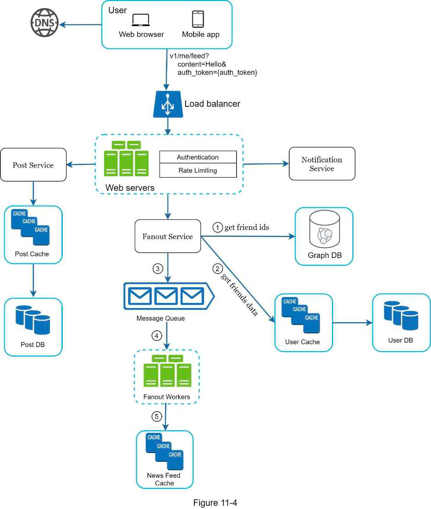
- Retrieval:
  - 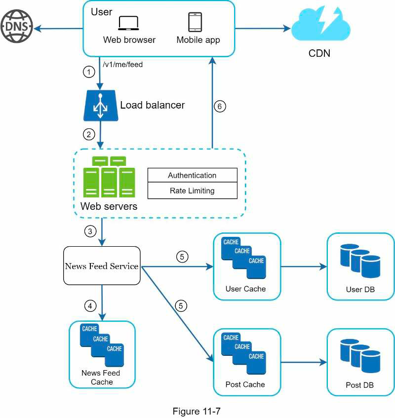
- Cache architecture:
  - News feed: feed IDs
  - Content: hot, normal
  - Social graph: followers, following
  - Action: like, rep…
  - Counter: like, reply

# 9. Chat system
## Problem & design scope
- Type of chat app: 1-1/group
- Scope: mobile/web
- Num DAU
- Group size limit
- Text size limit
- Encryption
- Chat history storage duration
- Multi devices/user?
- Noti
## High level design
- Sender (HTTP keep-alive/web socket) -> Chat service (store, relay) (web socket) -> receiver
- Service -> receiver protocol:
  - Polling: inefficient when no new mes
  - Long polling:
    - Close when: new mes/timeout
    - Problem:
      - Multi servers
      - Can't detect disconnection
      - Inefficient
  - Web socket: need to manage connections
- API servers: auth, user profile, service discovery
- 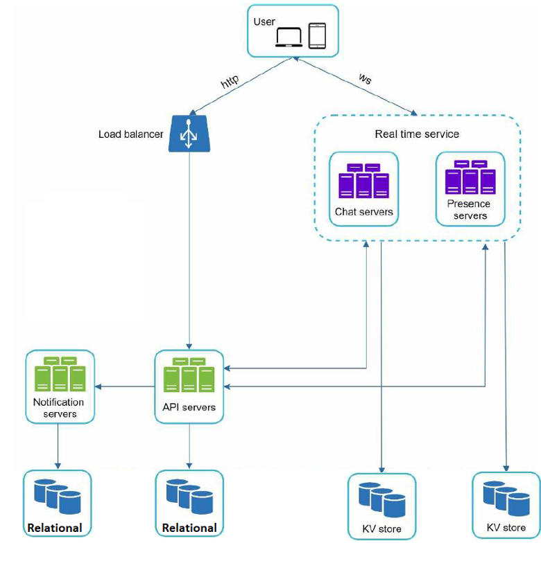
## Deep dive
- Service discovery (e.g., Zookeeper): pick chat server for client
- 1-1 chat flow:
  - 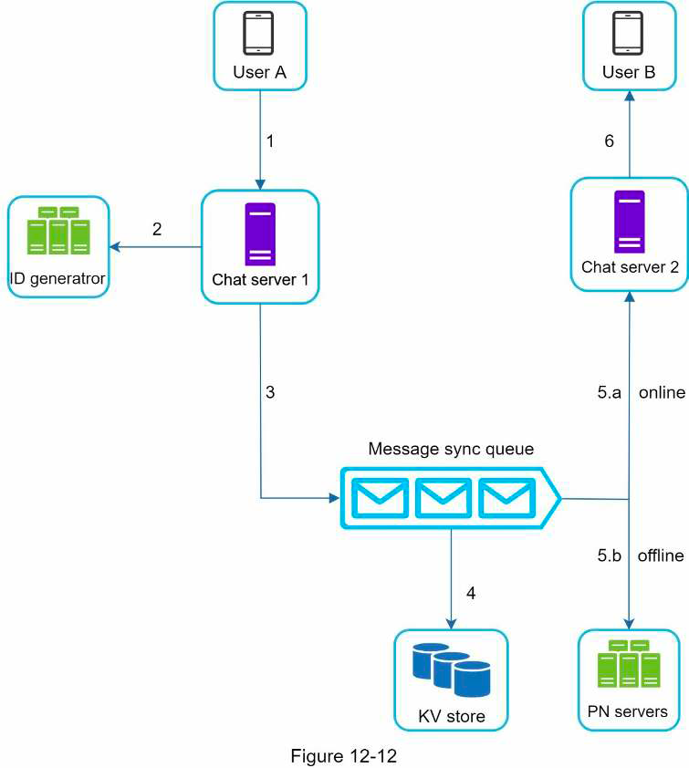
- Sync across device: use cur ID on device -> fetch new mes
- Group chat flow: mes sync queue for each user in group:
  - A -> C queue -> C 
  - A -> D queue -> D 
  - B -> C queue -> C
- Online status:
  - Heart beat
  - Friends sub to channel (e.g., A onl channel)
## Wrap up
- Media: compression, cloud storage, thumbnail
- Client-side caching
- Resend

# 10. Search auto complete system
## Problem & design scope
- Matching: beginning/middle?
- Num of suggestion
- Spell check?
- Multi languages?
- Case sensitive?
- Num users/day
- Sort by?
## High level design
- Data gathering service:
  - Query
  - Frequency
- Query service
## Deep dive
- Trie with optimizations:
  - Limit prefix max length
  - Cache top search query at each node 
  - -> No need to search and sort all children
  - 
- Data gathering service:
  - 
- Query service:
  - User -> Load balancer -> API servers -> Filter layer -> Trie cache -> Trie DB
  - Other optimizations:
    - Efficient dynamic content update (react)
    - Browser caching

# Criticisms
- Chap 6 assume leaderless replication models without acking it first

# Takeaway