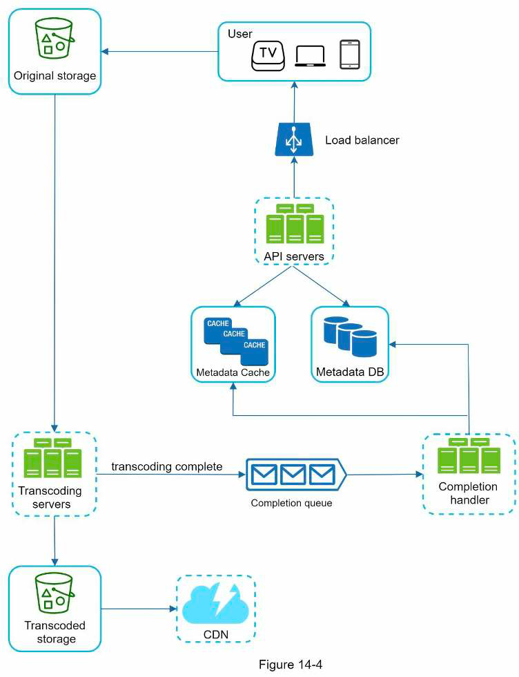
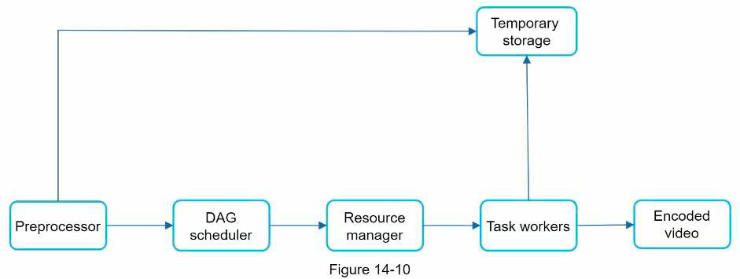
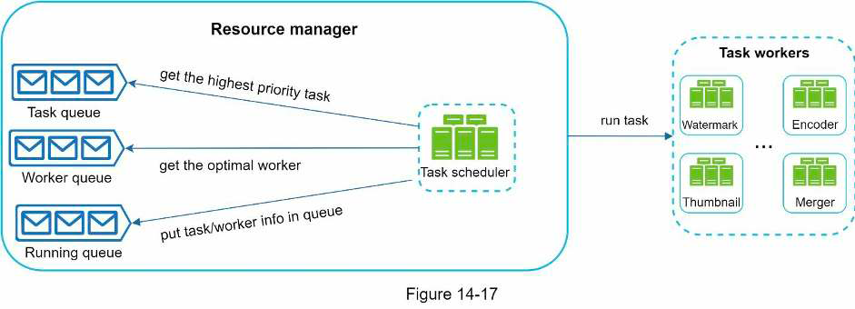
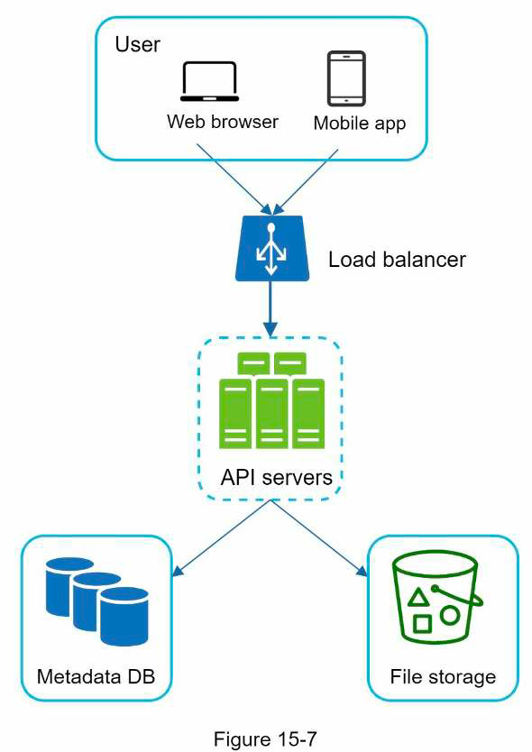
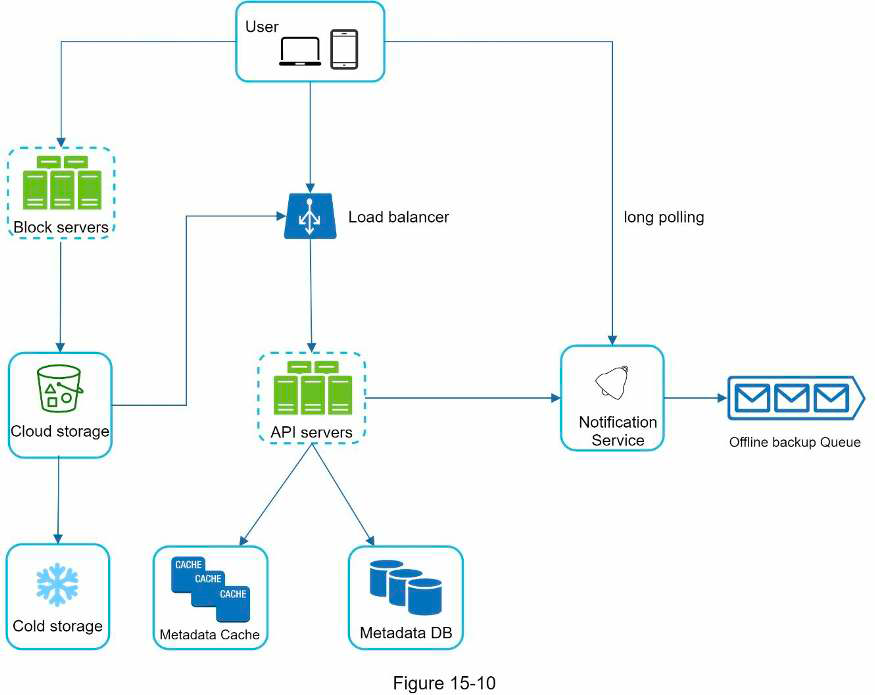
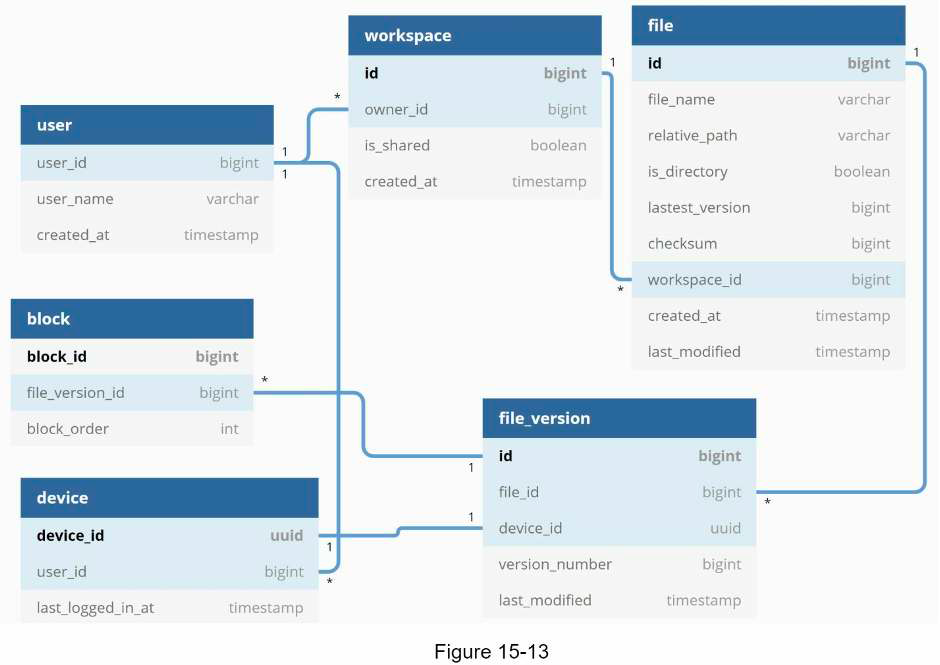

# Category
Practical, IT, System design

# Structure
- Foreword: intro problems, purpose of system design interview (SDI), goals of the book
- Chap 1: scaling techniques
- Chap 2: estimation techniques
- Chap 3: interview framework
- Chap 4-15: different design problems
- Chap 16: references of real world system

# Author's problems & solutions
- Problems: SDI is challenging:
  - SDI questions are big scoped & vague
  - SDI processes are open-ended without a standard/correct answer
- Goals:
  - Provide a reliable strats to approach the system design question
  - Provide solid knowledge in building a scalable system

# Presentation & styles

# Terms
- SLA: service level agreement, defining the uptime the service provider promises to deliver

# Content
## 1. Scaling techniques
### Overall Diagram
- 
### Multi data centers diagram
- 
### Notes
- Split DB server - service server: scale independently
- Limit of vertical scaling:
  - Hardware limit
  - No failover/redundancy
  - Non-linear cost
- Load balancer:
  - Scalability: add/remove server easily (auto-scaling)
  - Performance: distribute traffic, reduce load to single server
  - Availability: redirect in case of failure
- Master (write) - slave (read) DB replication:
  - Better performance
  - Availability
- Sharding DB: scale horizontally. Design issues:
  - Reshard (move) data
  - Celebrity key: overload 1 shard
  - Join operation across shard: complex
  - -> Need de-normalization to reduce write to only 1 table/row
- Cache tier:
  - Adv: performance: faster read, lower DB read
  - Design issues:
    - Usage: frequent read, infrequent write
    - Availability
    - Consistency
    - Eviction policy: when cache is full, need to discard data when add new data:
      - Least recently used (LRU): most common
      - Least frequently used (LFU)
      - First in first out (FIFO)
- CDN for static content:
  - Mechanism: when content not exist/expire, CDN requests to file server & cache the file
  - Adv: faster read for static content
  - Considerations:
    - Cost of using CDN: should only cache frequently used data
    - Availability: fallback to file server when CDN is unavailable
    - File invalidation:
      - Choose cache expiry time -> avoid stale data
      - Call CDN APIs to invalidate objects
      - Use object version, request by version
- Stateless server: move session data out to NoSQL, memcache/redis:
  - Scale servers
  - No need to direct same user to same server
- Multiple data centers:
  - Each with server, DB, cache. Need DB sync.
  - Use geoDNS to route to the closest data center.
- -> Availability, better response time
- Message queue:
  - Availability: request not lost in case of failure
  - Scalability: scale producer/consumer independently
- Logging (detect issues), metric (system status, business) & automation (CI/CD to improve productivity)
### Materials
- [Should you go beyond relational databases?](https://blog.teamtreehouse.com/should-you-go-beyond-relational-databases)
- [Caching strategies and how to choose the right one](https://codeahoy.com/2017/08/11/caching-strategies-and-how-to-choose-the-right-one/)
- [Netflix multi-regional resiliency solution](https://netflixtechblog.com/active-active-for-multi-regional-resiliency-c47719f6685b)
- [What it takes to run Stack Overflow](https://nickcraver.com/blog/2013/11/22/what-it-takes-to-run-stack-overflow/)
- [Common NoSQL use cases by survey](http://highscalability.com/blog/2010/12/6/what-the-heck-are-you-actually-using-nosql-for.html)
- [Scaling memcached at Facebook](https://www.cs.bu.edu/~jappavoo/jappavoo.github.com/451/papers/memcache-fb.pdf)

## 2. Interview framework
### Overview
- Purpose of SDIs: test communication & problem-solving skills:
  - Technical design skill
  - Collaboration skill
  - Ability to work under pressure
  - Skill to resolve ambiguity constructively
  - Ability to ask good question
- Red flags:
  - Over-engineering, ignore tradeoffs: costly system
  - Narrow-minded
  - Stubborn
### 4-step process
- Problem & design scope: clarify requirements & assumptions:
  - What specific features to build
  - Scope: mobile/web?
  - Load: num users, CCU, request/s, anticipation of growth (scale in next month/year)
  - Availability
  - Scalability
  - Existing services/stack to fit into or can be reused for the design
- High level design (10-15 min) & ask feedback:
  - Main components
  - Use cases
  - APIs (optional)
  - DB schema (optional)
  - Rough calculations (optional)
- -> Suggest multiple approaches if possible
- Deep dive design (10-25 min): ask which aspect/component to prioritize. Can be based on feedback from prev step.
- Wrap up (3-5min): actively:
  - Discuss bottleneck, improvement
  - Recap the design
  - Identify error/edge cases
  - Operational issues: monitoring, deployment
  - Handle the next scale (eg x10 users)

## 3. Rough estimation
- 1 ASCII char = 1 byte
- Compress data (fast) before send (slow network read)
- Write down assumption with unit
- Common estimations:
  - QPS, peak QPS (can assume x2 QPS)
  - Storage
  - Cache
  - Number of servers
- Latency numbers:
  - 
### Materials
- [Google back-of-the-envelope estimation](http://highscalability.com/blog/2011/1/26/google-pro-tip-use-back-of-the-envelope-calculations-to-choo.html)
  
## 4. Rate limiter
### Overall
- Def: used to control the rate of traffic sent by a client or a service
- Mechanism: block excess request when threshold is reached
- Advs:
  - Prevent resource starvation/server overload (eg when there is DDoS attack)
  - Reduce cost (eg there is cost to call third party API)
### Requirements
- Client side or server side?
- Throttle based on which attribute of the request? (eg user ID, IP)
- Scale of the system? (eg QPS, distributed?)
- Infra level or app level rate limiter?
- Need to inform throttled users?
- Resource usage?
### High level
- Considerations whether to implement in API gateway or in service:
  - Service tech stack
  - Currently have an API gateway?
  - Rate limiting algo that fits business need supported by API gateway?
  - Dev effort
- Rate limiting algos:
  - Token bucket
  - Leaking bucket
  - Fixed window counter
  - Sliding window log
  - Sliding window counter
- High level design:
  - 
### Details
- Info to return to client (via header for flexibility):
  - Request remaining
  - Limit
  - Retry after
- Handle throttle request:
  - Return error
  - Add to queue to be processed later
- Where to store rule:
  - In files on disk with workers read & update to cache frequently
  - Configuration server
- Prevent lost update when updating counter:
  - Lock
  - Lua script?
  - Redis sorted set
- Multi data centers: sync rate limiting data using eventual consistency model
- Monitoring: gather data about num of dropped requests & window to ensure rate limiting rules & algo are effective
- Soft (vs hard) rate limiting: request can exceed threshold for a short period
- Rate limit at upper layer (eg by IP at layer 3 using IP table)
- Client logic to avoid being rate limited:
  - Caching
  - Adjust request rate based on limit
  - Retry with backoff
- Detailed design:
  - 
### Materials
- [Rate limiting with Redis sorted set](https://engineering.classdojo.com/blog/2015/02/06/rolling-rate-limiter/)

## 5. Consistent hashing
- Problem: use normal hash function eg hash(key) % num server
- -> Most key are redistributed when add/remove server
- Hash space -> connect 2 ends to create hash ring
- Basic approach:
  - Hash server by name or IP -> map to the hash ring
  - Find a server by going clockwise, get the closest server
  - Problem: server hashes distribute not uniformly when init/add/remove 
  - -> Most key end up in one server
- Virtual node approach:
  - Add virtual nodes for each server, num nodes depend on server capacity
  - Adv: balanced distribution, based on server capacity
- Add/remove node:
  - Straightforward for cache system: don't need to care about moving keys
  - Storage system:
    - Remove: straightforward: run background task, write all keys in removed node to other nodes?
    - Add: 
      - Index keys in each node by key range, then query keys to be moved?
      - Not possible for hash index: need to scan all keys in all node?
- 
### Materials
- [Wiki consistent hashing](https://en.wikipedia.org/wiki/Consistent_hashing)
- [Amazon Dynamo paper](https://www.allthingsdistributed.com/files/amazon-dynamo-sosp2007.pdf)
- [Cassandra paper](http://www.cs.cornell.edu/Projects/ladis2009/papers/lakshman-ladis2009.pdf)
- [Stanford consistent hashing lecture](http://theory.stanford.edu/~tim/s16/l/l1.pdf)

## 6. Key-value store
### Requirements
- Main operations: get & set
- Read, write latency
- Memory usage
- Consistency vs availability
- Amount of data
- Autoscale?
### High level design
- Design issues:
  - Data partitioning & auto-scaling: consistent hashing with virtual nodes
  - Data replication: store in the first x unique servers on the hash ring
  - Tunable consistency: read & write quorum, CAP
  - Inconsistency resolution: version vector
  - Availability: handling failure:
    - Failure detection: gossip protocol
    - Handle partial failure: sloppy quorum & hinted handoff
    - Handle permanent failure: sync data using anti entropy background process, comparing hash tree of buckets in each node
      - 
    - Multi-datacenter replication
- Design:
  - Overall architecture:
    - 
  - Write path:
    - 
  - Read path:
    - Read from in-memory SSTable if found
    - Read from disk if not found in SSTable
      - 
### Additional info
- CAP theorem:
  - Def: it is impossible for a distributed system to simultaneously provide more than 2 of 3 guarantees:
    - Consistency: client always sees the same data no matter which node it reads from
    - Availability: the system continues to work (eg support read, write) even if some nodes are down
    - Partition tolerance: the system can handle network partition (some nodes can't communicate with others)
  - For distributed system, network partition is unavoidable. So the system must choose between consistency and availability.
  - For distributed data system:
    - Choosing consistency means blocking all writes to avoid unavailable node serving stale data
    - Choose availability means allow writes, unavailable node continues to serve stale data, sync later
### Materials
- [BigTable paper](https://static.googleusercontent.com/media/research.google.com/en//archive/bigtableosdi06.pdf)
- [Cassandra architecture](https://cassandra.apache.org/doc/latest/architecture/)

## 7. Distributed unique ID generator
### Requirements
- Chronologically ordered?
- Increment by?
- Numerical?
- ID length/size?
- Scale: how many IDs/s?
### High level design
- Approaches:
  - Multi leader replication:
    - Mechanism: k DB, each auto increment by k
    - Disadvs:
      - Not chronologically ordered
      - Hard to add/remove ID gen server
  - UUID:
    - Advs:
      - Easy to generate
      - Easy to scale
    - Disadvs:
      - Not chronologically ordered -> can use UUID v6
      - 128 bit long
  - Ticket server:
    - Mechanism: ticket servers use a single DB server. Use auto increment feature.
    - Disadvs:
      - Single point of failure: DB
      - Performance bottleneck: DB
  - Twitter snowflake:
    - 
    - Timestamp: from a defined epoch
    - Constraints:
      - 41 bit timestamp -> ~69 years
      - 32 datacenters, 32 machines each center
      - 4096 IDs/s each machine
    - -> Tunable by changing the number of bits
    - Problem: sync time between different machines
### Materials
- [Twitter snowflake](https://blog.twitter.com/engineering/en_us/a/2010/announcing-snowflake)
- [UUID v6](https://www.percona.com/blog/2014/12/19/store-uuid-optimized-way/)

## 8. URL shortener
### Requirements
- Give example of how it works
- Req/s
- URL length
- Support update/delete?
- -> Calculate storage requirement
### High level design
- API:
  - POST: return short URL, add short-long URL mapping if not exist
  - GET: redirect to original URL
- Mapping by hash
### Details
- Data model:
  - ID
  - ShortURL
  - OriginalURL
- Hash string length = log(total number of records, num possible characters)
- Hash function:
  - Common hash function:
    - Handle hash collision by appending a string
    - Check hash exist in DB exist: use bloom filter for efficiency
  - Base 62 conversion of auto incremented ID: predictable
- Flow: Client <--> Load balancer -> Servers -> Cache -> DB
- Redirect codes:
  - 301: permanent: browser will cache & not send subsequent request to short URL
  - -> Reduce load
  - 302: temporary: browser won't cache
  - -> Better for tracking short URL usage
### Wrap up
- Rate limiter
- Scaling server & DB
- Analytic: number of click, scenario when click happens
- Availability, consistency, reliability

## 9. Web crawler
### Web crawler overview
- Used to discover new/updated content on the web
- Mechanism: start with a few pages, go to other pages in each page, traverse in tree-like style
- Purposes:
  - Search engine indexing
  - Web archiving (store web content)
  - Web data mining
  - Web monitoring (e.g., copyright)
### Requirements
- Purpose
- Num pages/s
- Content type: HTML, image
- Need to update data (ie new/updated web page)?
- Storage duration?
- Store duplicate content?
### High level design
- 
### Details
- How to choose seed URLs:
  - Popular sites
  - By category
- Traversal algo: usually BFS. Improvement:
  - Avoid flooding the same page
  - Visit important page first
- -> URL frontier:
  - Ensure politeness: each domain as a queue, handled by 1 worker
  - Prioritization: use queues with dif weights, workers choose queue randomly based on weight, put to queue router
  - Freshness: ensure content updated, can use page's update history
  - 
- HTML downloader:
  - Multi nodes, pull from queue pushed by URL frontier
  - Read & cached robot.txt (file in each site specifying which web can be downloaded)
  - Cache IPs returned by DNS resolver
  - Geographically distributed -> improve download time
  - Timeout
- Add new modules for other tasks: URL seens? ->
  - Image downloader
  - Web monitoring (eg monitor for copyright issues)
- Avoid problematic content:
  - Redundant content: use hash/checksum
  - Spider traps:
    - Blacklist/other filters
    - Max URL length
  - Noise: ads, spam URL
- Server-side rendering page to obtain dynamically generated content
- Filter: avoid low quality/spam pages
- Scale: DB, downloader
### Materials
- [Mercator web crawler paper](https://courses.cs.washington.edu/courses/cse454/15wi/papers/mercator.pdf)
- [Web crawling survey](http://infolab.stanford.edu/~olston/publications/crawling_survey.pdf)
- [Web crawling - Standford lecture](https://www.ics.uci.edu/~lopes/teaching/cs221W12/slides/Lecture05.pdf)
- [PageRank citation ranking paper](http://ilpubs.stanford.edu:8090/422/1/1999-66.pdf)
- [Google dynamic rendering](https://developers.google.com/search/docs/advanced/javascript/dynamic-rendering)
- [IRL bot web crawler design](https://irl.cse.tamu.edu/people/hsin-tsang/papers/www2008.pdf)
- [Detect spamming content paper](http://airweb.cse.lehigh.edu/2006/urvoy.pdf)

## 10. Noti system
### Requirements
- Noti type: push noti, SMS, email?
- Real time?
- Type of supported device?
- Triggering mechanisms:
  - Other services
  - Scheduled noti
- Allow users to unsubscribe?
- Num noti/day
### High level design
- 2 flows:
  - Gather contact info
  - Send noti
- Gather info: 1/N user -> N devices:
  - User -> Load balancer -> API servers -> DB
  - User schema: userid, phone, email
  - Device schema: device token
- Send noti:
  - 
### Details
- Noti template for consistency & performance
- Retry mechanism
- Deduplicate message mechanism
- Rate limit
- Authenticate sender services with app key & app secret
- Monitor: user engagement, num noti sent
- Check user settings before sending
### Materials
- [You cannot have exactly once delivery in distributed system](https://bravenewgeek.com/you-cannot-have-exactly-once-delivery/)

## 11. News feed system
### Requirements
- What does news feed mean?
- Supported clients?
- Main features?
- News feed order: chronological or by weight?
- Num friends of user
- Traffic volume: num DAU
- Feed content: text, image, video?
- Send notification to followers when feed is published?
- Support muting? Support selective sharing with some friends only?
### High level design
- 2 flows:
  - Feed publishing
  - Feed building
### Details
- News feed cache: store post ID by user ID (friend ID?)
- Post cache, DB: store post content by post ID
- User cache, DB: store user info, follow/unfollow info…
- Feed publishing design:
  - Fanout on write: fast retrieval, heavy computation, waste resource on inactive use
  - Fanout on read
  - 
- -> Should use hybrid approach: fanout on read for users with many followers, otherwise fanout on write
- Retrieval:
  - 
  - CDN for media content
- Cache architecture:
  - News feed: feed IDs
  - Content: hot, normal
  - Social graph: followers, following
  - Action: like, rep…
  - Counter: like, reply
### Materials
- [How facebook newsfeed works](https://www.facebook.com/help/327131014036297/)

## 12. Chat system
### Requirements
- Type of chat app: 1-1/group?
- Scope: mobile/web
- Num DAU
- Group size limit
- Text size limit
- Support media?
- Support voice/video call?
- Encryption
- Chat history storage duration
- Multi devices/user?
- Noti
- Side function: seen? Online/offline status? Searching?
### High level design
- Sender (HTTP keep-alive/web socket) -> Chat service (store, relay) (web socket) -> receiver
- Service -> receiver protocol:
  - Polling: inefficient when no new mes
  - Long polling: 
    - Mechanism:
      - Client holds connection open until there is new mes/timeout
      - After new mes/timeout, client opens another connection
    - Problems:
      - Multi servers
      - Can't detect disconnection
      - Inefficient
  - Web socket: need to manage connections
- API servers: auth, user profile, service discovery
- DB choice:
  - User profile, settings, friend list: relational DB for robustness
  - Chat history: noSQL DB:
    - Fast read & random access
    - Scale
- 
### Details
- Unique message ID PK: snowflake
- Service discovery (e.g., Zookeeper): pick chat server for client
- 1-1 chat flow:
  - 
- Sync across device:
  - 1 session on each device
  - Use current mes ID on each device -> fetch new mes
- Group chat flow: mes sync queue for each user (or each server?) in group:
  - A -> C queue -> C 
  - A -> D queue -> D 
  - B -> C queue -> C
- Online status:
  - Send heart beat to presence server
  - When status change, publish to friends' presence server via message queue
- Handle large group: read when user opens the group or manually refresh
### Wrap up
- Support media file: compression, cloud storage, thumbnail
- Client-side caching
- Resend mechanism
- End-to-end encryption
### Materials
- [Erlang at Facebook](https://www.erlang-factory.com/upload/presentations/31/EugeneLetuchy-ErlangatFacebook.pdf)
- [Messenger & Whatsapp process 60B messages each day](https://www.theverge.com/2016/4/12/11415198/facebook-messenger-whatsapp-number-messages-vs-sms-f8-2016)
- [Facebook messages technology](https://www.facebook.com/notes/10158791457767200/)
- [Whatsapp end-to-end encryption](https://faq.whatsapp.com/791574747982248/?locale=en_US)
- [Slack uses app-level cache to scale](https://slack.engineering/flannel-an-application-level-edge-cache-to-make-slack-scale/)

## 13. Search auto complete system
### Requirements
- Matching: beginning/middle?
- Num of suggestions
- Sort by?
- Spell check?
- English or multi languages?
- Case sensitive?
- Num users/day
- Response time
- -> Estimation: num of search query -> num of search autocomplete request -> amount of data saved (eg 20% search queries are new)
### High level design
- Data gathering service:
  - Gather & aggregate search queries
  - Data model: query, frequency
- Query service: return n suggestions sorted by popularity
### Details
- Trie
  - Use to store string compactly & retrieve it quickly
  - Basic usage: traverse using prefix, get all children, sort children by popularity
  - Optimizations:
    - Limit prefix max length -> traverse take O(1)
    - Cache top search query at each node
    - -> No need to search and sort all children
    - -> Trade space for time complexity
    - 
- Data gathering service:
  - Top searches are unlikely to change & updating tree for every search is costly
  - -> Need optimization
  - 
  - Log search data: sampling to reduce amount of logs
  - Store trie data:
    - Document store
    - Key-value store: prefix:data
- Query service:
  - User -> Load balancer -> API servers -> Filter layer -> Trie cache -> Trie DB
  - Other optimizations:
    - Efficient dynamic content update (React)
    - Browser caching
- Approaches to scale data layer:
  - Shard by n first level (eg aa-ac in 1 node)
  - -> Can result in uneven distribution
  - Store mapping from prefix to shard using a shard-manager DB/service
- Support real-time update:
  - Aggregate more frequently
  - Stream processing
  - Reduce amount of data updated by sharding
  - Change ranking model: more weight to recent search
### Materials
- [The life of a typehead query FB](https://www.facebook.com/notes/10158791367817200/)
- [Prefix service sharing Medium](https://medium.com/@prefixyteam/how-we-built-prefixy-a-scalable-prefix-search-service-for-powering-autocomplete-c20f98e2eff1)
- [Prefix hash tree paper](https://people.eecs.berkeley.edu/~sylvia/papers/pht.pdf)

## 14. Video sharing platform
- Example: Youtube, Netflix
### Requirements
- Main features: eg share/watch video, subscribe, comments, like, save to playlist
- Supported FE clients
- Scale: DAU, average time spent/user/day
- Supported video resolutions
- Video size restriction?
- Can leverage existing cloud infra? Need to optimize cost?
- Quality requirement: upload speed, streaming quality
- -> Estimation: average video size, average uploads/user
  - Amount of storage each day
  - Amount of data stream each day -> CDN cost
### High level design
- Cloud services to leverage: CDN & blob storage
- 3 main components:
  - FE
  - CDN: stream video
  - API servers: serve other requests
- 2 main flows:
  - Video uploading flow:
    - 
  - Video streaming flow: need to understand & choose the right video streaming protocol
### Details
- Use DAG to determine & parallelize video-transcoding tasks
- Video transcoding architecture:
  - 
  - DAG scheduler decide tasks to run & put tasks into task queue
  - Resource scheduler:
    - Get task from task queue, pick the suitable worker from worker queue to run the task
    - 
- Upload flow:
  - Steps:
    - FE -> API server: pre-signed URL: give access permission to the object in the URL (eg object in Amazon S3)
    - FE -> Object storage: upload using pre-signed URL
  - Split & upload video in small chunks
  - -> Fast & resumable upload
  - Upload to close data center
- Copyright/permission:
  - Use digital right management system (eg Google Widevine)
  - Encrypt when uploading & decrypt when playing back
  - -> Only authorized users can access
  - Watermarking
- Reduce CDN cost:
  - Serve frequently accessed video from CDN, serve other videos from your own video server
  - Store less encoded versions for short video
  - Store region-specific video in one region only
  - Build your own CDN
- -> Need to analyze historical viewing patterns
- Live streaming: dif latency requirement, smaller chunks of data
- Analyze videos & users to flag & take down unwanted video
### Materials
- [Netflix on AWS](https://aws.amazon.com/solutions/case-studies/netflix/)
- [Streaming protocols](https://www.dacast.com/blog/streaming-protocols/)
- [Distributed video processing on FB paper](https://www.cs.princeton.edu/~wlloyd/papers/sve-sosp17.pdf)
- [Delegate data access with shared access signature](https://docs.microsoft.com/en-us/rest/api/storageservices/delegate-access-with-shared-access-signature)
- [Scaling Youtube](https://www.youtube.com/watch?v=w5WVu624fY8)
- [Internet short video sharing paper](https://arxiv.org/pdf/0707.3670.pdf)
- [Predict content popularity to maximize infra efficiency at Netflix](https://netflixtechblog.com/content-popularity-for-open-connect-b86d56f613b)

## Cloud storage service
### Requirements
- Main features: upload/download files, view file info, sync files, share files
- Supported clients?
- Supported file formats?
- Need encryption?
- File size limit?
- Scale: DAU, number of requests or uploads each day
- -> Estimation:
  - Storage needed
  - Upload QPS
### High level design
- Simple design:
  - 
- 3 main APIs:
  - Upload file
  - Download file
  - Get file's metadata
- Resolve conflict:
  - First version that got processed win
  - Second version will be presented with the original file. User manually resolves the conflict.
- High level design:
  - 
  - Block server:
    - Break files into small blocks before uploading to cloud storage
    - Reconstruct file from blocks when requested
### Details
- Block server: split -> compress -> encrypt -> upload changed blocks to cloud storage (delta sync)
- Data schema:
  - 
- Fetch new data flow:
  - Block service -> file meta service -> noti service -> client: file uploaded
  - Client -> file meta service: changed blocks
  - Client -> block service: download changed blocks
- Save storage:
  - Limit number of file versions
  - Deduplicate unchanged blocks
  - Move data to cold storage
### Materials
- [Differential synchronization](https://neil.fraser.name/writing/sync/)
- [Differential sync Youtube video](https://www.youtube.com/watch?v=S2Hp_1jqpY8)
- [Scaling dropbox talk](https://www.youtube.com/watch?v=PE4gwstWhmc)
- [Rsync algo paper](https://www.andrew.cmu.edu/course/15-749/READINGS/required/cas/tridgell96.pdf)
- [Rsync lib github](https://github.com/librsync/librsync)
- [Dropbox security whitepaper](https://www.dropbox.com/static/business/resources/Security_Whitepaper.pdf)

# Criticisms
- Chap 6 assume leaderless replication models without acking it first
- Some concepts are a bit confusing (eg web server are used instead of API gateway in chapter 11)
- Chap 13 Feed service and Post service share the same Post cache & DB

# Takeaway
- Basic scaling techniques
- How to design popular systems (eg noti, chat)
- References to blogs/papers of actual system