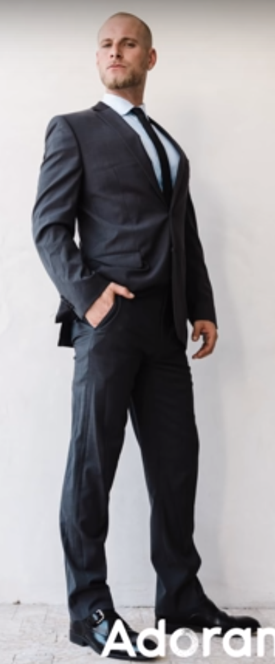

# Master Your Craft

## Info
- Type: course
- URL: https://www.classcentral.com/course/youtube-master-your-craft-54711

## 10-step guide to stutter drag portraits
- Env stutter drag
- Signature portrait: unique to you/your studio
- 10 step:
  - Time of day: **dust** (around/after sunset) or dawn
  - Scout your angle:
    - Safe place
    - Env movement
  - Tripod placement:
    - Stability
    - Extend only the bottom leg, clean it after
  - Secure camera
  - Wide angle lens
  - -> Capture & exaggerate the motion
  - Composition:
    - Subject at center of frame
    - -> No distortion due to wide angle
    - Tip cam down a bit
    - -> Exaggerate movement coming down to the lens
    - Subject either above or above the horizon
  - Exposure: before bringing subject into the frame
  - Stutter speed: ~0.25. Depend on how long the subject can hold still. Higher = capture more motion.
  - Add subject: instruct them to hold position & breath when told to hold & relax when told to relax
  - Use high frame range, shoot through the motion (multiple images)
  - Verify, repeat if not satisfied

## How to work with mixed lightning
- Mixed lightning: dif colored lights landing on the subject's face (eg indoor event)
- Solutions:
  - Turn out the lights. Angle the subject to the strongest light source.
  - Find the dominant light source, use a gel (eg magnetic CTO gel)
- Use mixed light: avoid background light on the face of the subject, reduce background light

## Story telling
- When the scene is average or when camera can't capture the beauty/entirety of it
- Shooting steps:
  - Wide: establishing
  - Medium: tell story
  - Tight: details
- Editing steps:
  - Edit: make images look cohesive/consistent (eg color)
  - Crop
  - Layout

## Utilizing phone
- When encounter a grand, ultra-wide scene:
  - Change vantage point: avoid unnatural objects, get better view
  - Focus on a portion of it
- Turn grid on: get the horizon on the top/bottom third depending on whether the sky/ground is more interesting

## Posing tips for men
- Feet:
  - Toes pointed out
  - Feet shoulder width apart
- Hip: lean to one side
- Hands: have some purpose (eg 1 hand at chest/in pocket, other can droop)
- Spine: straight
- Neck: push forward a bit
- Light:
  - Angle body away from the light
  - Turn chin (face) toward the light
- Lower camera to elongate the legs
- Perform action & take detail shots
- 

## Tips
- Person in motion: let them lead to the open side of the frame
- Cropping: avoid cropping at joins. Crop at narrowing points (eg thigh, above hip)