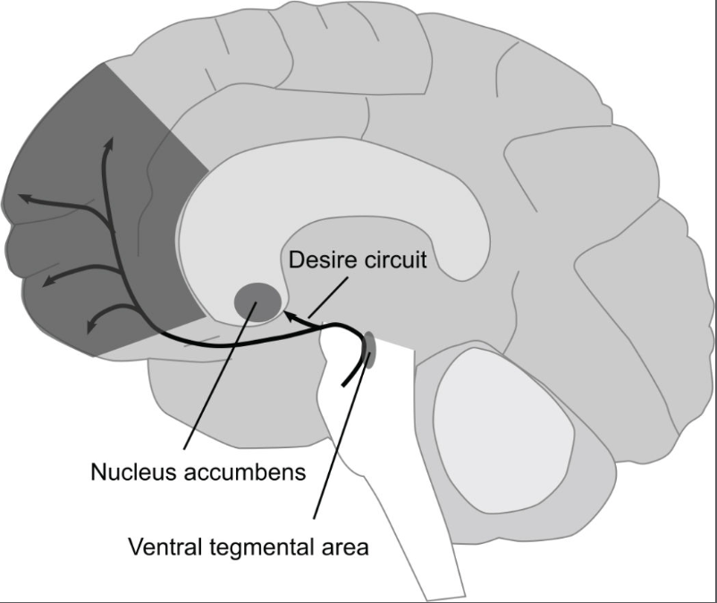
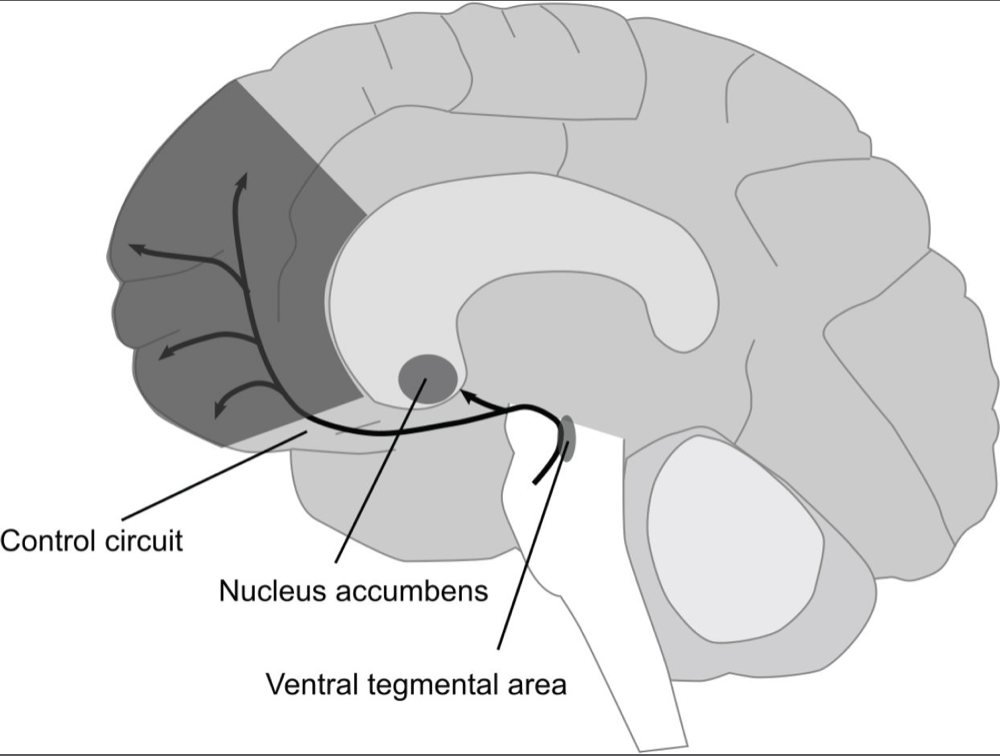

# The Molecule Of More

## Info
- Type: book
- Author: Daniel Z. Lieberman, Michael E. Long

## Category
- Biology
- Psychology

## Summary
Explaining different aspect of human behaviors, especially those driven by dopamine.
Arguments are supported by data, experiment results, evolutionary history and biological mechanisms.

## Structure
- Introduction:
  - Distinguish between 2 dif types of things: within reach (peripersonal) & out of reach (extrapersonal)
  - 2 corresponding modes of thinking: H&N chemicals & dopamine
  - Introduce problems in some chapters
  - Some notes about presentation & style
- Chap 1: Introduction to dif types of molecules & their effects. Effects on behaviors regarding love & sex.
  - Set the problem: what is the function of dopamine if not pleasure?
  - Dopamine & H&N terms & mechanisms
  - Anticipation of new possibilities
  - Evolutionary explanation of dividing into 2 modes of thinking
  - Glamour: definition & issue
  - Gambling behavior
  - H&N molecules, love & sex implication
  - Effect of testosterone
  - How dopa drive sexual behavior & prevent enjoyment of sexual experience
  - Effect of suppressing sexual behavior
  - Chapter summary
- Chap 2:
  - Set the problem: conflicting desires, decisions lack of consideration for ultimate goal
  - Evolutionary explanation of desire
  - Buyer remorse: cause & solutions
  - Drug abuse: cause & mechanism
  - Factors affecting level of addiction. Dif between cocaine & crack.
  - Drunk vs high
  - Diminishing stimulation of drug use. Shutdown of dopamine system when there is no reward.
  - Liking chemicals. Effects of dual drugs.
  - Impulsiveness. Effect of nicotine.
  - Effects of dopa boosting medicines
  - Porn addiction, similarity with drug addiction. Effect of easy access on addiction.
  - Addictive factors of video games
  - Future-oriented (control) dopamine vs desire dopamine - introduction of next chapter
- Chap 3:
  - Dopamine control circuit: mechanism, functions, evolutionary explanation
  - Persistence
  - How dopa influence effort
  - Confidence. How others react to dominance & submissiveness.
  - Effect of amphetamine
  - Self-efficacy role in sport comeback
  - Agentic & affiliative relationship
  - Submissive behavior in achieving goal & in social context
  - Effect of high dopamine level in control circuit
  - Effect of low dopamine level in control circuit. ADHD: symptoms, consequences, treatments.
  - Other consequences of ADHD
  - Cheating behaviors of winners
  - Spontaneous & planned violence
  - Suppression of emotion
  - Limited will power
  - Psychotherapies to treat addiction:
    - Motivational enhancement therapy
    - Cognitive behavioral therapy
    - Twelve-step facilitation therapy
- Chap 4:
  - Schizophrenia: definition & symptoms
  - Salience. Dopamine connection.
  - Cause of schizophrenia
  - Blocking dopamine receptors: mechanism & side effect
  - Latent inhibition
  - Model: definition & role
  - Mental time travel
  - Problem with wrong models
  - Models breaking & creativity
  - Brain region related to creativity & schizophrenia
  - Experiment with activating creative brain region
  - Dream: mechanism & similarity with schizophrenia
  - Harvesting creativity from a dream
  - Dream incubation
  - Similarity between scientific & artistic thinking
  - Dopamine related problems of geniuses
- Chap 5:
  - Personality trait related to political view
  - Connection between dopa personality & liberal view
  - Dopamine & intelligence
  - IQ & emotional intelligence
  - Other factors affecting individual behavior
  - Liberal & conservative approach to helping the poor
  - Political view & other aspects: sex, marriage, happiness
  - Some issues & difficulty with social study
  - Why rational political decision is hard to make. Strategy of political campaign.
  - Critical analysis in the age of TV & Internet
  - Neural mechanism of loss aversion
  - Dif in level of loss aversion between liberal & conservative
  - Ways to increase conservativeness
  - How serotonin affect moral judgement of fairness
  - Attitudes toward immigrants
  - Ways to increase liberalness
  - Dif in political engagement & trust in gov
  - Why politics is dopaminergic
  - Why gov keeps growing
- Chap 6:
  - Why early migration is imp to avoid extinction
  - Correlation between 7R allele and behavior
  - Correlation between dopa and distance moved
  - Advs & disadvs of dopaminergic gene
  - Theories about role of dopa gene in early migration
  - Set the question: relation between dopa gene and modern immigration
  - Bipolar mania: cause & symptoms
  - Correlation between bipolar mania & immigration
  - Historical accounts of the US to prove the above point
  - Immigrants' achievement in the US. Some dif with other countries.
  - Identify ourselves with dopamine functions
  - Complex brain & body activity in simple movement
  - Another way to identify ourselves. Trade of when focusing on dopa part.
  - Introduce the threats
- Chap 7:
  - Set the question: how to achieve balance between dopamine & H&N
  - Mastery
  - Paying attention to reality
  - Role of nature in enhancing cognitive functions
  - Negative effect of multitasking
  - Hands-on activity & creativity
  - Book & chapter summary

## Author problems & solutions
- Explain the biological mechanism of dopamine: OK at a basic level
- Explain how it is related to different behaviors: OK in early chapters, not complete in chap 5, 6
- Offer ways to achieve balance & happiness: OK

## Presentation & style
- Author notes:
  - Some parts are speculative, esp later chapter
  - There are simplification to make things easier to grasp
  - Select studies:
    - Reflecting general consensus, not all contradicting studies
    - Highlight anomaly, sensitive behaviors
- No outline
- Use lots of individual examples & stories
- There are some things in common between parts in each chapter, but the connections are not strong enough
- There are digressions but usually interesting enough

## Terms
- Reward prediction error
- Peripersonal vs extrapersonal
- Romance: dopamine thrill at the start of relationship
- H&N (here and now) chemicals: serotonin, oxytocin, endorphins, endocannabinoids chemicals
- Passionate (usually 12-18 months) vs companionate love (after)
- Impulsiveness
- Self-efficacy
- Agentic vs affiliative relationship
- Submissive vs dominant behavior/posture
- Planned vs spontaneous violence
- Dopaminergic personality
- Schizophrenia
- Attention deficit hyperactivity disorder (ADHD)
- Salience
- Latent inhibition
- Mental time travel
- Harm aversion
- Dopamine receptor D4. DRD4 gene. 7R allele (more active dopamine circuit).
- Bipolar mania
- Internal vs external locus control

## Arguments
### 1. Love
- Dopamine is not a marker of pleasure. It is a reaction to the unexpected - possibility and anticipation
- Reward prediction error:
  - We constantly make predictions about what is coming next
  - Dopamine rush comes:
    - When what happens is better than expected
    - There is a possibility of it: promising surprises (eg new, unexpected messages (content not revealed), new people...)
  - -> Stop when things become regular events
- Peripersonal vs extrapersonal things:
  - Brain deals with peripersonal & extrapersonal in dif ways
  - Peripersonal:
    - Def: up close, in direct contact, focused on the present moment
    - Getting those requires effort, time & planning
    - -> Dopamine exercise control to maximize resources in the future, to pursuit better things
  - Extrapersonal:
    - Def: at a distance, thinking abstractly, focused on the future
    - H&N chemicals give pleasure from sensation & emotion from peripersonal space
- Dopamine doesn't react to having things, only to getting new things
- -> Need to transition to H&N chemicals to enjoy things we have
- Same with acquiring (extrapersonal) & maintaining love (peripersonal)
- -> Need to transition to experience the H&N (satisfaction) after early romance/passionate love (pursuit)
- Sex:
  - First stage: desire & arousal: dopaminergic, future-looking
  - Physical contact & orgasm: H&N experience (endorphins), dopamine region (prefrontal cortex) shut down
  - -> Need to focus on present to enjoy sex
- Naturally high level of dopamine correlates with:
  - High number of sexual partners
  - Low age of first sexual intercourse
- Unpredictable/random reward -> more dopamine -> more attempts
- -> Gambling behaviors
#### Additional info
- Glamour: when we see things that stimulate our dopaminergic imagination, drowning out our ability to accurately perceive H&N reality
- -> Create desires that cannot be fulfilled because they are only in our imagination
- Long term rela chemicals: oxytocin (more in female) & vasopressin (male)
- Testosterone:
  - Related to muscular features: facial hair, increased muscle mass, low-pitched voice
  - Vary mostly between individuals
  - H&N chemical, create sexual desire (any partner can satisfy) in both male & female
  - Not suppressed but work together with dopamine
  - Suppressed by long term rela chemicals (oxytocin & vasopressin)
- -> Related to marry behavior: naturally high = less likely to marry. Marry = reduced testosterone level.
- Suppressing sexual behavior can prolong passionate love

### 2. Drugs
- Aristotle's idea: ultimate purpose of all actions: happiness
- -> Issue: usually lack of consideration for purpose: just do what we want at that moment
- Desire dopamine mechanism:
  - Circuit: mesolimbic pathway (dopamine desire circuit):
    - 
    - Cells wind through ventral tegmental area (old part of brain) to nucleus accumbens
    - These cells activated -> release dopamine to nucleus accumbens -> motivation feeling
  - -> Evolved to promote survival & reproduction
  - Dopamine desire system constantly scans the env for evolutionarily attractive resources & opportunities
  - Desire circuit are activated when those things appear, whether or not these things are actually needed
  - Effect on behavior:
    - Send signal to pay attention
    - Feeling: increased energy, desire, enthusiasm, hope & usually excitement
    - -> Feel good
    - -> People pursuit this feeling of anticipation, of life is about to get better
    - -> Sensation of wanting is not a choice to make but a reaction to things encountered
  - Also contribute to the formation of memories related to those things
  - -> Shaping brain to make surprising events predictable to maximize resources
  - -> Important to neuroplasticity
  - -> No more surprise & reward prediction error
  - Might be opposed by dopamine control circuit
  - -> Evolutionary explanation: systems containing opposing forces are easier to control
- Liking circuit (H&N): tiny, fragile & harder to trigger compared to dopamine desire system
- Drug abuse:
  - Cause: addictive drugs hit the desire circuit with intense chemical blast, > all natural behaviors
  - Mechanism:
    - Dif vs natural behavior: bypass circuitry of surprise & prediction 
    - -> Desire circuit doesn't shut down after performing the behavior
    - -> Always want more
    - Stimulate dopamine release no matter the current situation
    - -> Connect drug use to everything -> drug becomes answer to all aspect of life
    - Level of addiction: depend on
      - Level of dopa stimulation. More dopa = more addictive.
      - On set time: faster = more addictive. Fastest: smoking, intravenous injection.
    - Diminishing stimulation: only craving is intense, high is less
    - Usually also boost impulsiveness (see impulsive behavior below)
    - Drug that trigger both desire & liking circuit: heroin, OxyContin, marijuana
    - Marijuana effect:
      - Dopa boosting:
        - Engage with things that are usually perceived as unimportant
        - Lost in thoughts, float in imaginary world
      - Other situation: suppress dopamine, mimicking H&N
      - -> Activities associated with wanting and motivation seem less important
    - Nicotine effect: main effect: triggering compulsive use. Little stimulation.
  - Addiction also depends on easy access: easier = more common
  - -> Porn addiction (has sth in common with drug addiction) becomes more common after the internet
- When expected reward fails to materialize, dopamine firing rate drops to zero (compare to normal of 5 times/s)
- -> Dopamine shutdown creates feeling of resentful & deprived
- -> Drug abuser will continue to use to get a relief from the low when diminishing stimulation set in
- Impulsive behavior: occur when too much value is placed on immediate pleasure, not on long term consequences
- -> Desire dopa overpowers rational parts of the brain
- Side effect of dopa boosting drug (effect possibly depends on genetic vulnerability):
  - Boost impulsive behavior (eg risk taking)
  - Expect to win bigger
  - Hypersexuality (high sexual urges)
#### Additional info:
- Imagination of future possibilities tend to be idealized
- Buyer's remorse:
  - Cause: failure of the H&N experience (enjoyment) to compensate for the loss of dopa arousal (excitement)
  - Solutions:
    - Make a wise purchase
    - Purchase sth that triggers more dopa expectation after the purchase
    - Purchase less
- Drunk vs high:
  - High: depend on how fast alcohol gets into the brain
  - -> Drink drinks that are more concentrated & easier to drink (eg mixed drink > beer)
  - Drunk: depend on total amount of alcohol consumed
- Parkinson's disease: dopamine deficiency in pathway that's responsible for controlling muscle movement
- -> Treatment: dopamine boosting drug
- Adolescent brains: not fully developed, esp the frontal lobes (only after early 20s)
- -> More impulsiveness & bad decisions
- -> More negative consequences from video games
- Addictive factors of video games:
  - Surprising factors from unpredictable rewards
  - -> Reward prediction errors (eg opening chests)
  - Endless possibilities of open environments to explore
  - Display of progress to trigger pursuit of more
  - Social pleasure:
    - H&N: company of others
    - Dopaminergic: work together towards a shared goal (better future)
  - H&N: beautiful scenery

### 3. Domination
- Dopamine control mechanism:
  - Circuit: meso-cortical circuit:
    - 
    - Start from ventral tegmental area, end in frontal lobes (specialized in logical thinking)
  - Evolutionary aim: secure as many resources as possible
  - -> Reward: feeling good
  - Roles:
    - Manage uncontrolled urges of desire dopamine. Decide what sort of "more" is worth having.
    - Take the energy of desire and guide it toward profitable ends
    - Give us the ability to use abstract concepts, construct plans, strategize
    - -> Gain control, dominate the world to get the things we want
    - Source of imagination: imagine consequences of decisions -> help make decision
    - -> Also work in the unreal world of the possible
    - Give us ability to consider: ideas, plans theories, abstract concepts, worlds yet to be
    - Source of persistence & effort: willingness to do more work to get better things
    - Source of ability to suppress emotions
    - -> Stay calm in complex situations, develop plan to secure more resources
  - Behavior towards others: can be aggressive or submissive, depends on context
- Dominant vs submissive behavior:
  - Dominant behavior:
    - Posture: expand body, take large amount of space
    - May stem from personal insecurity or imperfect education
  - Submissive:
    - Posture: constrict body
    - Can be a sign of elevated social status (courtesy)
  - People are more likely to unconsciously adopt complementary posture rather than mirror the same dominant/submissive posture (unlike other actions during a talk)
  - -> Like & feel more comfortable compared to mirroring posture
- -> Submission to self-efficacy
- Some goals require working with other people
- Agentic vs affiliative relationship:
  - Agentic rela:
    - Formed for the purpose of accomplish a goal
    - Orchestrated by dopamine
    - The other person acts as an agent assisting you in achieving your goal
    - Can be passive, as long as can achieve the goal
  - Affiliative rela:
    - Purpose: enjoy social interactions
    - Pleasure: being with another person (H&N)
  - Most relationships have both affiliative & agentic elements
  - Preference depends on individuals:
    - Agentic people (prefer agentic rela): cool & distant
    - Affiliative people: affectionate & warm, social, turn for others for support. Likely to be friendly, accessible followers.
    - Good at both: friendly, accessible leaders
    - Bad at both: distant & isolated
- Effect of high level of control dopamine, imbalance between dopamine & H&N neurotransmitters:
  - Work relentlessly toward goals but never stop to enjoy the fruits of achievement, don't even brag about those achievements
  - -> Achieve sth, move on to the next
  - Usually unhappy
- Effect of low level of control dopamine:
  - Struggle with internal control: impulsive, facing difficulty when trying to focus on complex tasks
  - Can result in ADHD
- Spontaneous vs planned violence:
  - Spontaneous violence: set off by passion (H&N), dopamine is suppress
  - -> Degrade the inflicter's future well-being
  - Planned violence:
    - Effective strategy, planned in advance, sometimes in detail
    - Aim at gaining resources or control
    - Low emotional content (cold violence) -> advantage in the midst of conflict
- Dopaminergic personality: focus on making the future more rewarding at the expense of being able to experience joys of the present
  - Active desire circuit naturally: impulsive, difficult to satisfy, constantly seeking more
  - Active control circuit naturally:
    - Cold & calculating
    - Ruthless & devoid of emotion, better ability to suppress emotion
    - Interested more in winning competitions
  - Creative genius (info from Chap 4):
    - Good at abstract thinking & creativity
    - Suppressed H&N functioning (empathy is needed to understand what is going on in other people's mind)
    - -> Poor at social interaction & human relationship
    - Focus on internal world of ideas, neglect things in the real world
    - Passionate about people but have little patience for them as individual
    - Risk of mental illness
#### Additional info
- Early success can positively influence persistence: having a confident expectation of success (self-efficacy)
- Attention deficit hyperactivity disorder (ADHD):
  - Symptoms: poor focus & concentration, poor impulse control
  - Seen most often in children: not fully developed frontal lobes
  - Consequences:
    - High-risk, pleasure-seeking behavior: drug addiction, early sexual activity, obesity
    - Unable to focus -> can't extract resources from the env
    - Difficulty making friends
    - Overreaction
  - Treatment: medication to increase dopamine level
- Dopamine can suppress feelings of guilt (H&N emotion) -> can lead to deceit/violence
- Cheating to win: dopamine surge from winning (evolutionary cause) make us want to win more
- Norepinephrine (adrenaline in the brain): H&N chemical of fight or flight (panic)
- Out of willpower: give up easily when frustrated
- Psychotherapy to treat addiction:
  - Goal: pit one part of the brain against another:
  - Popular types:
    - Motivational enhancement therapy: encourage patients to talk about healthy desires
    - -> Use as source of endurance when dopamine circuit shuts down without drug
    - Cognitive behavioral therapy: plan to handle cues of desire
    - 12-step facilitation therapy (Alcoholic Anonymous):
      - Form relationship with other members of group
      - Use H&N experience of guilt (letting others down)

### 4. Creativity and madness
- Madness and creativity both depend on dopamine
- -> Closely connected to each other than either is to the way ordinary brains work
- Salience:
  - Definition: degree to which things are important or easy to notice
  - Types:
    - Unusual
    - Valuable
  - Depends on individuals
  - Things are salient if:
    - Important
    - Have potential to impact your well-being
    - Have potential to affect your future
  - -> Trigger desire dopamine
  - Function: filter irrelevant things/details in familiar env (latent inhibition)
  - Malfunction: low latent inhibition:
    - Too many thoughts going on, unable to hold back (high activity of desire dopamine overwhelms control dopamine)
    - -> Disorganized, illogical thoughts
    - Mild form: letting things come in creative arts
- Schizophrenia:
  - Def: a form of psychosis (serious mental illness) notable for the presence of:
    - Hallucinations: see/hear (most common)/touch/smell things that aren't really there
    - Delusions:
      - Fixed beliefs inconsistent with generally accepted view of reality
      - Held with absolute certainty
  - Cause:
    - Salience function of the brain malfunctions: too much salience/salience at the wrong time (low latent inhibition)
    - -> Think that irrelevant things are imp/related to you
    - -> Delusions
  - Treatment:
    - Aim: reduce activity in the desire circuit
    - Mechanism: medications block dopamine receptors -> remove delusions & hallucinations
    - Side effect: affect dopamine control circuit -> difficulty paying attention & reasoning abstractly
- Model:
  - Definition: imaginary presentation of the world that we build to better understand it
  - Contain only elements of env that model builder believes are essential
  - -> Make the world easier to comprehend & to imagine ways to manipulate it for maximum benefit
  - Model building & updating process is automatic
  - Allow us to abstract, take specific exp to make broad, general rules
  - -> Classify, then predict & deal with new situations
  - Mental time travel: go through each possible option in imagination, choose the one leading to the best outcome, then make decision
  - -> In constant use to make every conscious choice in life
  - Bad model:
    - Not fit the real world -> bad prediction -> bad choice
    - Causes:
      - Lack of info
      - Difficulty with abstract thinking
      - Stubborn persistence of wrong assumptions
  - Basis of wisdom: build better models as experience with the world increase
  - Disadvantage: lock us into a particular way of thinking
  - Model breaking:
    - Brain region right ventrolateral prefrontal cortex (right, front of brain)
    - Same region is related to creativity & schizophrenia. Possible explanation: both attach salience to things once considered irrelevant.
- Drawing connection between 2 unrelated things:
  - Requires abstract thinking (dopaminergic): pull out abstract essence of a concept & match it with similar essence of other
  - Important to creativity
  - Can be simulated via direct current or dopaminergic drugs
- Problems of creative genius: see Dopaminergic personality, type Creative genius
#### Additional info
- Culture shock: in new env & country, so many new & unusual things -> can't inhibit -> confusion & disorientation
- Receptor:
  - Molecule locates on the outside of brain cells & catch neurotransmitter molecules
  - Dif receptors for dif neurotransmitters
  - Effect on brain cell: depend on receptors:
    - Stimulate
    - Tranquilize
  - -> Changing cells' state = processing information
- Superstition might be a mild form of delusion, related to dopamine
- Dream:
  - Take material from external world, arrange it in ways unconstrained by physical reality
  - -> Similar to abstract thinking
  - Mechanism:
    - Reality-focused H&N is suppressed due to no sensory exp
    - Frontal lobes (responsible for filtering irrelevant details) are shut down
  - -> Dopamine circuit can generate bizarre connections by attach salience to irrelevant things (similar to schizophrenia)
    (dif with Why we sleep's model: connections of regions far apart)
  - Dream incubation: technique to solve problems using dream.
    - Steps:
      - Choose a problem important to you
      - Think about the problem before sleep. Put in form of visual image if possible.
      - Make sure to have a pen & paper next to bed
      - Write the dream down right after waking up from a dream
    - Usually takes a few nights
    - Answer can be disguised
    - Solution might not be the best, but probably a novel one
- Similarity between scientific & artistic thinking: both require ability to abstract (is art only abstract?)
- -> Many scientists have artistic hobby

### 5. Politics
- Personality trait (could be attributed to genes) related to political view:
  - Liberals:
    - Manipulative, tough-minded, practical; risk-taking, sensation-seeking, impulsive, authoritarian
    - Pro-change via technology/policy
  - Conservative:
    - Altruistic, well socialized, empathic, conventional
    - Suspicious of change, prefer existing way
- Correlation between dopa receptors and political view: variant of gene DRD4 called 7R correlates with liberalness also related to dopaminergic traits:
  - Novelty seeking
  - Impulsive
  - Quick-tempered
  - Extravagant
- Examples of indirect link to dopamine: liberal academics & Hollywood celebrities
- Correlation of political view with:
  - Intelligence:
    - Liberals (IQ 106) vs conse (IQ 95)
    - Atheist(IQ 103) vs very religious (IQ 97)
    - -> Overall different is small
    - Mental flexibility: liberals have faster error detection & adaptation of changes in circumstance
  - Approach to helping the poor:
    - Liberals: use policy: act at a distance with plan
    - -> Maximize resource (money)
    - Conse: charity
    - -> More flexible & individualized, with emotional benefits
  - Sex & marriage: liberals are:
    - Less likely to marry, more likely to cheat after marriage
    - Have more sex: possibly because less likely to be in companionate rela
    - Sex less likely to end in orgasm: less H&N activity
    - Value orgasm less, conquest more
    - Less likely to divorce. Possible explanation: marry late & have more experience 
  - Happiness: liberals are less happy
  - Loss aversion: liberals have less
  - Threat: conse focus more on
  - Group/individual differences:
    - Liberals: focus on largest group of all
    - Conse: focus more on individual, family, country
  - Attitude towards immigrants:
    - Liberals: prefer indiscrimination, allow immigrants, but don't want direct contact with them
    - Conse: prefer policy to keep immigrants out to preserve current ways of life, but take care of close by immigrants
  - Engagement in political process & trust in gov:
    - Liberals more engaged, more likely to pursue advance degree in public policy
    - Conse: less trust in gov, esp federal gov (act at a distance). Prefer local gov.
- -> Fundamental, biological dif make it hard to understand each other, but both sides want what they think is best
- Can increase conservativeness by:
  - Triggering threats, even subtle ones
  - Increase serotonin (H&N) level (eg via medication): focus less on abstract concepts of justice, more on protecting individual from harm (increase harm aversion)
  - -> Less willing to punish to enforce standards of fairness
- Can increase liberalness by:
  - Increase dopa pathway activity by:
    - Reducing feeling of vulnerability
    - Imagining
    - Thinking abstractly
  - Trigger empathy feelings (H&N) towards concrete individuals/stories
- Loss aversion:
  - More desire dopamine decrease after loss than increase after win
  - Loss also involve amygdala activity (H&N fear & other negative emotions)
- Rational vs irrational decision:
  - Rational decision:
    - Based on control dopamine
    - Easy to change, open to revision as new evidence comes along
    - Hard to make: need arguments
  - Irrational decision:
    - Based on desire dopamine & H&N
    - More enduring
    - Easier to make
- Aim of political campaigns:
  - Trigger irrational decision. Tools: desire, sympathy, esp fear as it involve loss aversion.
  - Stir up hostility between 2 sides to strengthen allegiance of followers
- Politics is basically dopaminergic:
  - Abstract laws, act at a distance
  - -> Can tolerate harm to ensure greater good
  - Desire for control & prefer change: must always do sth, make new laws
  - -> Govs keep growing
  - -> Usually require revolution to reverse the trend
  - Political candidates are highly motivated, willing to sacrifice for long term goals
#### Additional info
- Limitation of personality measures:
  - Measure of one domain (feature) only reflect a part of personality, not whole person
  - -> There are other domains as well
  - Usually group average score is reported
  - -> Help predict average group behavior, not individual behavior
- Intelligence measurement:
  - IQ test:
    - Not a measure of general intelligence
    - Only measure ability to make generalizations from incomplete data & figure out new information using abstract rules
    - -> Domain of control dopamine
  - Intelligence as ability to make good day-to-day decisions: most decisions can't be approached in a purely rational way: lack of or too much info
  - -> Emotions (H&N) might be essential
- Factors influencing human behaviors: nature & nurture
- -> Genes has only a small effect
- -> Studies increase understanding of how brain works but not good at predicting individual behaviors
- Difficulty of social study:
  - Political parties composed of groups with conflicting beliefs
  - Data can be mistakenly interpreted
  - Information gathered from thousands of surveys will have more error than supervised clinical trials
  - Surveys depend on truthfulness of the respondents
  - Results of dif studies can be inconsistent with each other
- Critical analysis in the age of TV & Internet:
  - News acquired many of the characteristics of entertainment:
    - Keep everything brief. Attentions only required for a few seconds.
    - Provide constant stimulation through variety, novelty, action & movement
  - Cause of preferring entertainment to serious thoughts: desire dopamine: short, noticeable story is salient
  - -> Deliver quick hit of dopamine & grab attention
  - -> Control dopamine is overpowered by flood of those infos
- -> Information env move rapidly into trivial pursuit

### 6. Progress
- Evidences that early migration is critical to avoid extinction:
  - Human genome is less varied compared to other primate species
  - -> Descendants of small number of ancestors
  - Unknown events killed off large portion of human
- -> Migration is crucial to avoid disaster when population concentrates in a small area
- 7R allele (and other long-form allele):
  - Correlation with adventurous behaviors:
    - Risk-seeking
    - Likely to pursue new exp, low tolerance for boredom
    - Exploratory: places, ideas, foods, drugs, sexual opportunities
  - Correlation with distance moved in early migration: longer distance
  - Advs:
    - Explore new, just-settled env to seek out opportunities & maximize resources
    - Learn faster, esp in response to rewards. Competitive, response stronger to both wins & losses.
    - -> Try harder in new env to avoid failures
    - Experience less stress from change in env
  - Disadvs:
    - Difficulty with rela
    - -> Cooperate less well
- -> Fit for new env, but is a disadv in familiar env where cooperation counts the most
- Theories about dopa gene role in migration:
  - 7R allele made people migrate
  - Sth else made people migrate. 7R allele increase survival rate of the carrier.
  - -> Correct because evidence of gradual change in proportion of carrier: population travel more has higher proportion
- Modern immigration:
  - 7R doesn't seem to play a role
  - Correlate with bipolar tendency/disorder
- Example of relation between proportion of immigrants in the population and dopaminergic achievement: US & several countries (not convincing enough)
- Threat: dopa is necessary in ancient time for survival, but keep desiring for more might not be good in modern world:
  - Nuclear weapon
  - AI
  - Reduction in population: reduced reproductive desire
  - VR
#### Additional info
- Bipolar mania:
  - Def: disorder consisting of periods of very high and very low mood
  - Consequences: unable to hold a job or maintain a healthy rela
  - Cause: problem with dopamine transporters: unable to suck dopa molecule back (~ cocaine effect)
  - -> Dopamine released keeps interact with its receptor
  - Severity: range from mild to severe
- Usually we identify ourselves with abilities related to dopa:
  - Free will
  - Knowledge & understanding
  - Pursue of more pleasure
  - Creativity
  - Imagination, abstraction
- -> Yet:
  - Only a tiny percent of brain cells are dopa-related
  - Dopa is only the decision maker. Execution of the decision requires many parts of brain and body.
  - Most actions are habitual, automatic
- How others identify/recognize us:
  - Via unconscious, non-dopa actions/postures
  - Usual moods/emotions
- Tradeoff when focusing on dopa parts:
  - Neglect emotions -> become less sophisticated over time
  - Neglect affiliative rela -> less happy
  - Lose sensory pleasure
  - Ignore facts & reality

### 7. Harmony
- Effect of too much H&N: happy indolence
- Dopamine & H&N evolved to work together
- -> Need to balance them to live a good life
- How:
  - Mastery:
    - Def: ability to extract maximum reward from a particular set of circumstances
    - Require lots of effort, constant learning & improvement
    - Highest point of dopa goal: get everything out of available resources
    - -> No more treadmill effect. Reduced dopa activity.
    - -> Can enjoy the present
    - Create a feeling internal locus control
  - Pay attention to reality:
    - Reality is the richest source of the unexpected
    - -> Keep the pleasure of reward prediction error
    - Maximize flow info into brain
    - -> Accumulate data to build better model, inspire creativity
    - Focus when dopamine system make us pay attention -> make sensory exp more intense
  - Immerse in nature:
    - Nature is complex & unexpected, made from systems with many interacting part
    - Simulate both desire & control dopa
  - Don't try to multitask:
    - Reduced productivity
    - Increase error rate
    - Consume mental energy -> reduced ability to concentrate
    - Increase level of stress
  - Try hands-on activity:
    - Ordinary form of creativity that promote balance: imagine the project -> develop plan -> carry it out physically
    - Activities: painting, fixing things, cooking, gardening, sports
#### Additional info
- Internal vs external locus control:
  - Internal locus control: tendency to view one's choice and exp as being under one's control as opposed to being determined by fate, luck or other people
  - -> Feel good & work more effectively
  - External locus control:
    - Often blame others for failures
    - Not put the best effort on a consistent basis
    - Not accept responsibility for their own circumstances

## Criticism
- Focus on biological factors. A complete analysis of behaviors would need to take into accounts the nurture factors. Some warrants on p.153-154.
- Some examples & stories are irrelevant
- Not very well-structured. Need to reorganize when taking notes in order to form a complete picture.
- Chap 2 use an actual example (Buzz Aldrin) but there is no data supporting the claim that he has high level of control dopamine
- Chap 5 - Politics might go too far: studies are mainly about correlation between political view and behaviors, not inner mechanism (dopaminergic or not).
One study on of dopa gene and political view on page 154.
- Chap 6: predictions are too pessimistic, uncritical, far-fetched, shallow & technologist

## Takeaways
- Distinction & interplay between dopamine & other H&N molecules: mechanism, feeling, effect on behavior
- Distinction between control & desire dopamine: mechanism, effect on behavior
- Lots of info regarding neural mechanisms, scientific studies, behaviors
- Provide a new perspective towards my own and others' behaviors, esp desire, motivation, creativity & rationality
- New way to think about political view: from a biological perspective
- Understanding of dopa-related negative effects, risks & mental disorders
- Provide some important terms, which might make it easy to understand & remember concepts/mechanisms