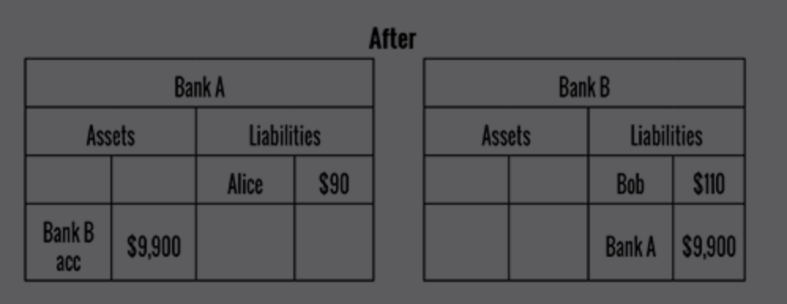
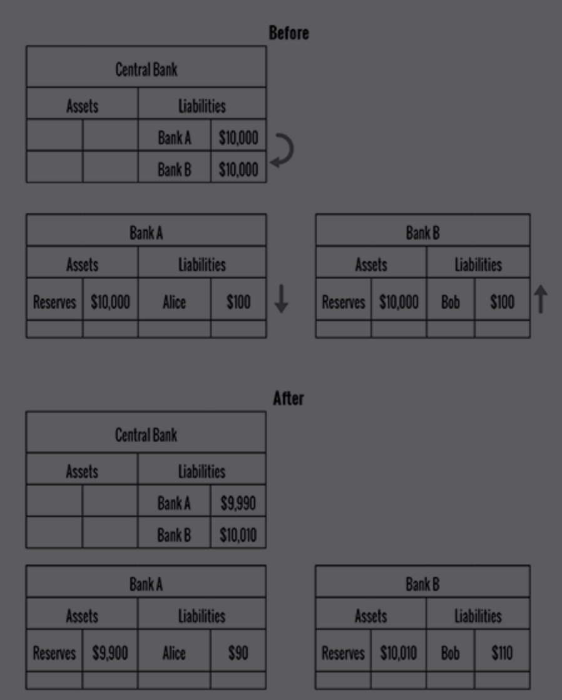
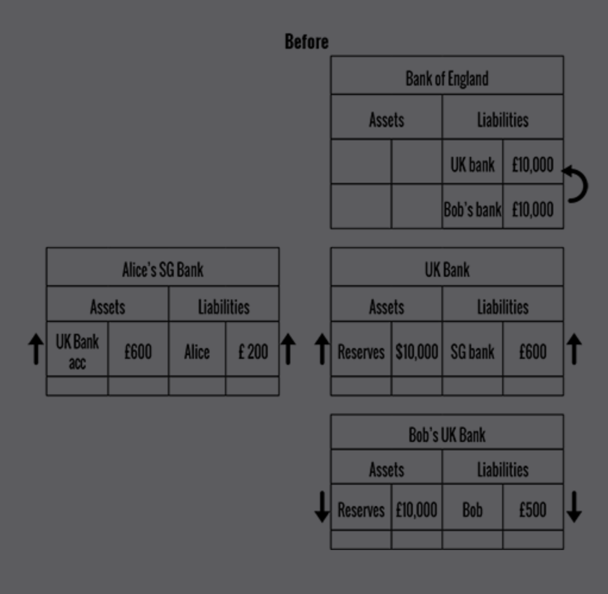
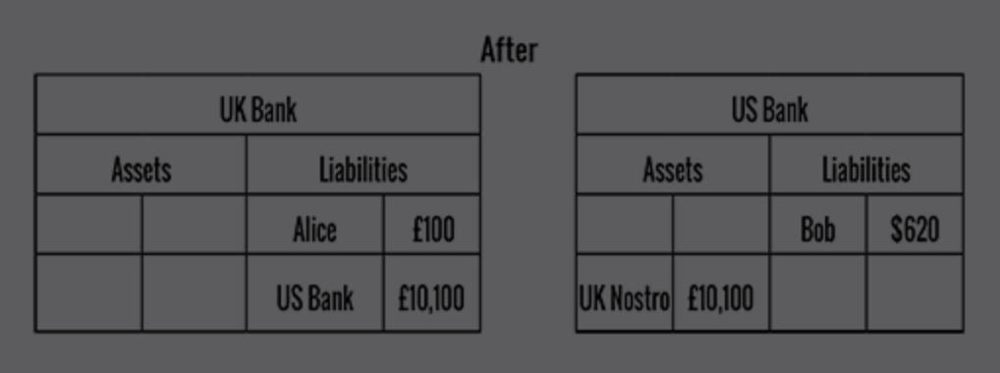
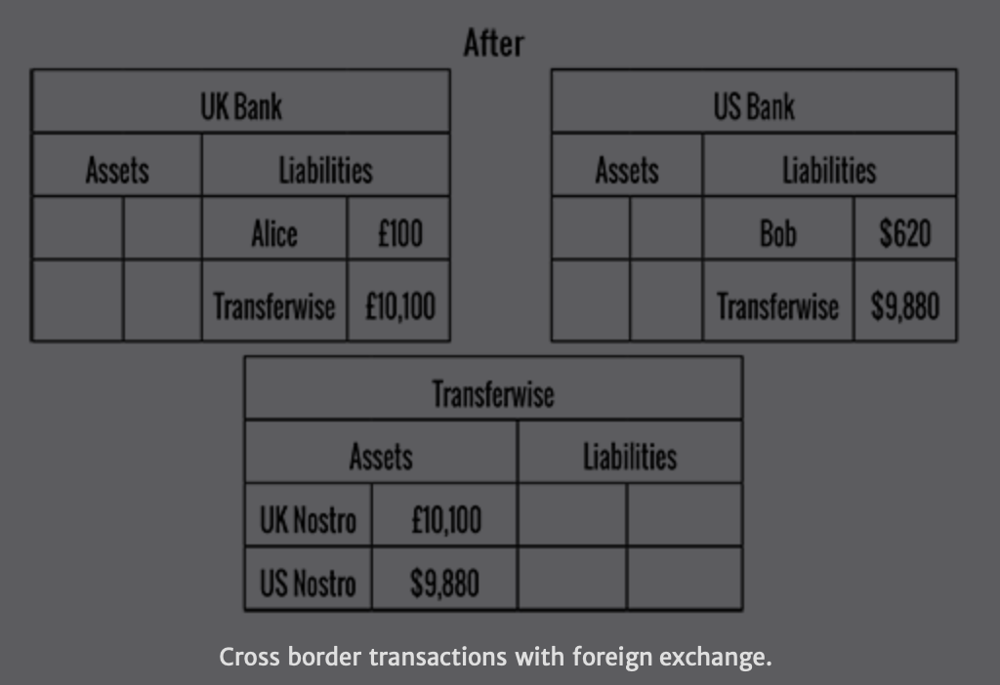
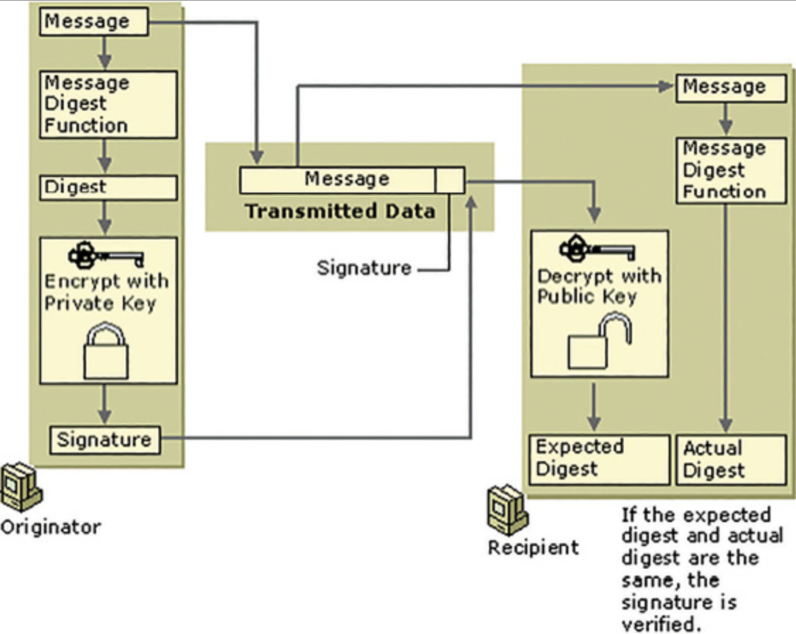

# The Basics of Bitcoins and Blockchains
#### An Introduction to Cryptocurrencies and the Technology That Powers Them
Antony Lewis 2018

## Category
Blockchain, Finance

## Structure
- Introduction: introduce basic terms & concepts
- Chap 1-2: money & digital money
  - Money:
    - Cash vs digital money: advs & disadvs
    - What functions money serves
    - How Bitcoin fit into the picture
    - Fiat vs representative money
    - History of money
    - Policy regarding money: currency peg, quantitative easing
  - Digital money:
    - How bank transfer works:
      - Same currency payment:
        - Same bank
        - Different banks
      - International payment:
        - Same bank
        - Different banks
    - -> Issues when there are multiple intermediaries
    - How e-wallet works
- Chap 3: cryptography:
  - Basic concepts: encryption, hash, digital signature
  - How these are applied to Bitcoin
- Chap 4-5: cryptocurrencies & digital tokens:
  - Bitcoin:
    - Aim
    - Functions of Bitcoin software
    - How Bitcoin solved digital money problems
    - Payment process
    - Characteristics: transparency, peer-to-peer, security
    - Reality: software & protocol upgrade, miners, hardware, ownership, transaction fee, price
    - Wallet types & functions
    - How to buy & sell: directly, via exchanges & over the counter brokers
    - History
    - Satoshi Nakamoto: possible impacts
  - Ethereum:
    - Aim
    - Functions of Ethereum software, dif vs Bitcoin software
    - Proof-of-stake mining
    - Dif vs Bitcoin
    - Smart contract:
      - Definition
      - Characteristic
      - Programming languages
      - Steps to run
    - Softwares
    - History
  - Forks:
    - 2 types: fork of codebase & fork of live blockchain
    - Hard vs soft fork
  - Digital tokens:
    - Definition of token
    - Types of digital tokens & their functions:
      - Blockchain-native token
      - Asset backed token
      - Utility token
- Chap 6: blockchain technology:
  - Features
  - Dif vs normal & distributed database
  - Types of blockchain & their applications: public vs private blockchain
  - Questions to ask about blockchain technology
- Chap 7-8: investment:
  - Initial coin offerings:
    - Ways for companies to raise money
    - Whitepaper
    - ICO steps
    - Types of ICO tokens: security & utility tokens
    - Types of token sale: conservative route & other route
    - Treasury (tokens in project's reserve)
    - Exchange listing
    - Regulations
  - Investing:
    - Pricing of dif types of tokens:
      - Asset backed token
      - Cryptocurrencies
      - ICO utility token
    - Risks & mitigations:
      - Market risk
      - Liquidity risk
      - Exchange risks
      - Wallet risks
      - Regulatory risks
      - Scam: causes & popular scams
- Chap 9: summary & predictions:
  - New values created by blockchain technology
  - Public blockchain predictions
  - Private blockchain predictions

## Author's problems & solution
- Cover the basics of bitcoins, blockchains and cryptocurrencies without requirement of any specific expertise: OK

## Presentation & style
- Author's promise:
  - Be unbiased
  - Use analogy but not excessively
- Lots of graphs, diagrams & illustrations: well-used & aid understanding
- Well-structured chapters
- Important distinctions clearly highlighted

## Terms
- Public/permissionless (vs private/permissioned) blockchain: list of transactions can be written by anyone
- Representative & fiat currency
- Quantitative easing
- Clearing bank
- Correspondent bank account
- Interbank settlement system
- Nostro: a bank's denominated bank account with another bank in other country
- Euro-currency
- MTO: money transfer operator (eg Transferwire)
- KYC: know your customer: regulatory responsibility of identifying all customers
- Unspent transaction outputs (UTxO)

## Arguments
### 1. Money
- Cash advs:
  - No third party involved
  - Not contains identity info
  - Transaction can't be undone
- Cash disavd: can't transfer remotely
- Digital money:
  - Relies on trusted bookkeepers to keep track of accounts' balance (how much they owe you):
    - Pay when demanded
    - Transfer to someone else when requested (increase/decrease account balance)
  - Require identify information by laws
- Online (card not present transaction): higher rate of fraud, need to check detailed info
- Money definition by 3 functions:
  - Medium of exchange: payment mechanism, widely accepted in the context of exchange
  - Store of value: will be worth the same in the near future
  - Unit of account: can be used to compare value of 2 items or count up total value of your assets
- Bitcoin as money:
  - Medium of exchange: can be used as payment mechanism but not widely accepted (accepted case is just a workaround: convert to current price -> payment made -> trade to fiat)
  - Store of value:
    - Not stable due to price volatility (inelastic supply)
    - Has potential to keep value over the long term because of inelastic supply
  - Unit of account:
    - Can't be, due to price volatility
    - Exception: value other cryptocurrencies
- -> Might need to be put in a new asset class, not existing ones (eg asset, money, digital gold)
- Stable coin: need to be backed 1 to 1 with an asset, otherwise the peg is likely to break
- Inherent value of Bitcoin:
  - Most recognized instrument of value that can be transmitted across the internet without permission from intermediaries
  - Censorship resistant
- Representative money: backed by an underlying asset, can be used to claim the asset with a third party
- Fiat money:
  - No intrinsic value, not convertible to an asset
  - -> Doesn't matter, as it has utility
  - Value derive from utility:
    - Legal tender: declared by law that it must be accepted as valid payment mechanism including tax
    - Govs only accept their own fiat for tax payment
- Gresham Law: bad money drives out good: people keep good money (eg more gold content) & use bad one
- -> Good money no longer in circulation
- US central bank:
  - Monopoly on the price and quantity of money
  - Responsibility: maximize employment & ensure prices stability
- Currency peg:
  - Declaration by authority that one currency worth a fixed amount of another currency
  - Maintained by:
    - Threat
    - Matching supply and demand: have enough of both currencies to match any amount traders want to exchange
    - -> Easy with home currency (can create more), but harder with the other currency
- Quantitative easing:
  - Central bank buy assets (usually bonds) from private sector (commercial banks, asset managers, hedge funds...) in secondary market
  - -> Might be risky assets -> Damage its balance sheet
  - Buy from: clearing banks (directly or clearing banks as brokers)
- -> Increase amount if fiat money in circulation to stimulate slow economy
- History of money: "whatever form it takes, it gets watered down either through debasement or by excessive creation until a certain limit, then there is a reform"

### 2. Digital money
- Aims:
  - How digital money is currently used to settle debts
  - How money moves around the financial system
- Note: there is one typo in the figures: should be 9990, not 9900

- Money in customer accounts is a liability of the banks:
  - The bank owe the account owner this amount
  - Should pay the account owner on demand or pay someone else when instructed by the owner
- Same bank payment: increase/decrease corresponding accounts
- Interbank payment:
  - Need to pay each other to balance the changes in liability
  - How:
    - Transfer physical money
    - Use correspondent bank accounts (accounts that banks open with other banks)
      - 
      - 
    - -> Difficulty in maintaining bank accounts with all banks
    - Use central bank payment system:
      - Each banks hold an account with central bank (clearing account), to be used for interbank payment
      - Interbank settlement system: system that manage those accounts:
        - Deferred net settlement systems: add up payments, sum up and pay after a given period (eg 1 day)
        - Real time gross settlement systems: pay in real time
        - -> Banks need more capital to settle all payments immediately
          - 
      - Clearing banks: banks allowed to have accounts with central bank
      - -> Smaller/foreign banks need to open clearing accounts with clearing banks
    - -> Only work within one jurisdiction and one currency
- International payment, same currency:
  - No central bank of the world to clear international commercial payments
  - -> Need to rely on correspondent banking systems
  - Bank uses a correspondent bank account with a bank in other country for all its customers' foreign money
  - 
  - Cases:
    - Currency leaves/returns its domestic currency zone:
      - 
      - 
    - Currency moves outside its domestic currency zone:
      - Both banks have correspondent accounts in the home country of the currency
      - Money transfer between those accounts
  - Banks consider risky might not be able to open account in foreign country
  - -> Need to open account with big local bank which has account in foreign country
  - -> Payment is longer and costs more
- International payment, dif currency (foreign exchange):
  - Need a third party exchanger to take one currency and give other currency
  - Cases:
    - Bank of sender as exchanger:
      - 
    - Bank of receiver as exchanger:
      - 
      - 
    - Money transfer operator (eg Transferwire) as exchanger:
      - 
      - 
  - -> Hold more a currency and less the other currency
  - -> Risk from FX rate fluctuation
- Euro-currency:
  - Currency exists outside its home zone
  - Created when banks loan out foreign money
- -> Not all currency is control by its respective central bank
- E-money wallets:
  - Licence:
    - Easier to obtain compared to banking licence
    - Usually not allowed to loan out money
    - All customers' money must be backed by an equivalent amount in the company's bank account
  - Operation principles:
    - A separate, restricted bank account to contain only customers' money, no other operation allowed
    - Deposit into wallet = transfer money into this account
    - Withdrawal from wallet = transfer from this account to customer's account
    - Transfer to other customer: the wallet provider changes their records of sender/receiver wallet
    - Customers can be companies/organizations
  - Sitting between banks and customers
  - -> Getting more popular due to convenience compared to banks
  - -> Banks need to:
    - Offer better UX
    - Focus on becoming efficient in the background

### 3. Cryptography
- Encryption:
  - 2 types: symmetric & asymmetric (public for encryption, private for decryption)
  - Transaction data on blockchain is in plain text, not encrypted
  - Bitcoin key: private (random big number) -> public -> address (account ID)
- Hash function:
  - 2 types:
    - Basic: deterministic
    - Cryptographic:
      - Deterministic: same message -> same hash
      - Quick to compute hash value
      - Can't go backward
      - Small change in message change hash value extensively
      - Not feasible to find 2 messages with the same hash
      - Optional: output of fixed length (eg MD5, SHA-256)
  - Brute force attack: try every message to find the one with the same hash
  - Usage: to prove that 2 things are the same without revealing the 2 things
  - Usage in Bitcoin:
    - Mining
    - Transaction identifier
    - Block identifier
    - Data tampering detection
- Digital signature:
  - Usage in Bitcoin: sign transaction message:
    - Authenticate transaction
    - Ensure integrity of the message
  - Mechanism:
    - Signing: message encrypted using private key -> digital signature
    - Validating: digital signature decrypted using public key -> message -> compare with original message -> valid/invalid
    - Usually only the hash of the message is signed
    - -> Reduce signature size
    - 
  - Adv over normal signature: dependent on the message -> no tampering with message after being signed

### 4. Cryptocurrencies
- Many cryptocurrencies with dif rules & mechanisms
- -> Hard to generalize
#### Bitcoin
- Better to think of as electronic asset, not currency
- Definition: peer-to-peer version of electronic cash, which allows online payment to be sent directly without going through a third party
- Aim:
  - No third party
  - No censor: anyone can join the network, send & receive payment
- -> Solution: use blockchain
- Rule: Bitcoin protocol
- Most common implementation: Bitcoin Core. Functionality:
  - Connect with other nodes
  - Chain:
    - Download blockchain from other nodes
    - Store the blockchain
  - Transactions:
    - Listen for new transactions
    - Validate new transactions
    - Store new transactions
    - Relay valid transactions to connected nodes
    - Create & send transactions
  - Blocks:
    - Listen for new blocks
    - Validate new blocks
    - Store new blocks on its chain
    - Relay valid blocks to connected nodes
    - Create new blocks
    - Mine new blocks
  - Manage addresses
  - -> Usually only used for bookkeeping function
- Problems with digital money & Bitcoin solutions:
  - Authentication: public - private key, digital signature
  - Centralized bookkeeper: replicate the transactions on all nodes
  - Concurrent transactions ordering: store transactions in batched in a block
  - -> Slow down data entry, higher chance of consensus
  - -> Trade off with transaction confirmation time
  - Control block creation time:
    - Proof-of-work: hash(hash of prev block + block data + random number) < target number -> can create block
    - Adjust when more miners join: auto-adjust target number
  - Incentivize block-creators:
    - Voluntary transaction fee, miners can choose transaction with higher fee
    - Block rewards: miner can add a transaction to create coin at the start of the block
  - -> Payment come from the protocol itself
  - Immutability: include hash of prev block -> avoid tampering, esp when block are deep into the chain
  - Consensus: longest-chain rule:
    - If 2 valid blocks of the same height, choose one and keep the other temporarily
    - When new blocks added on top of either block, choose the longer chain
  - -> 51% attack: create its own transaction, include in block in alternative chain
  - Avoid double spend: wait until the block with your transaction to be buried deep
- Payment process:
  - Transaction created and signed by sender
  - -> Broadcasted to neighbor nodes, validated according to:
    - Business rules (eg not overspent)
    - Technical rules (eg valid signature)
  - -> Kept by bookkeeper nodes in pool of unconfirmed transactions (mempool)
  - -> Propagated to neighbors
  - -> Reach miners
  - -> Miners decide to pack into a block & mine the block
  - -> Block is mined & propagated to other nodes
  - -> Recorded as confirmed transaction
- Characteristics:
  - Transparency: transaction also refer to previous transactions' hash
  - -> All Bitcoins can be traced
  - -> No individual unit, only lumps (outputs of transactions)
  - -> Account balance = unspent transaction outputs
  - Peer-to-peer: still go through intermediary nodes, but Bitcoin intermediary nodes: non-specific & can act instead of each other
  - Security: impact of malicious nodes:
    - Bookkeeper: not passing transactions
    - -> Can be verified with other nodes' data -> No impact
    - Miners:
      - Not include transactions
      - -> Transactions can't be confirmed -> Not a big impact
      - Attempt to mine a longer chain to double spend
      - -> Only works when having significant proportion of the network's hashing power
      - Can't steal Bitcoins from other accounts: no private key
- Bitcoin reality:
  - Main software & protocol upgrade: Bitcoin Core
  - Miners: centralized by few organizations which can mine profitably
  - Hardware: specialized chips: ASICS
  - Ownership: most coins centralized in a few hands
  - Transaction fee: very low compared to block reward
  - -> Can't replace in the near future
  - Price: fluctuate wildly
- Bitcoin & other cryptocurrency transaction in general can be taxed depending on jurisdiction
- Bitcoin wallet:
  - Store private keys
  - Link transactions together to show account balance
  - Types:
    - Software wallet:
      - Create & store addresses & private keys
      - Display address
      - Display account balance
      - Make payment
    - Hardware wallet
- Buy & sell via exchange:
  - Exchange matches buy & sell order
  - Central clearing counterparty: trades appear to be against the exchange -> anonymity to customers
  - Cash & asset custodian: hold customer money & cryptocurrencies
  - 4 steps to trade:
    - Create account: procedure usually similar to banks
    - Deposit
    - Trade:
      - Tradable pairs defined by exchange
      - Can match order or submit own order in order book & wait for match
    - Withdraw
  - Types of fee:
    - Transaction fee: may be cheaper for big order
    - Withdrawal fee
  - Regulation: depends on jurisdiction, usually in legal grey area
- Buy & sell via Over the counter (OTC) brokers:
  - Aim: anonymity & avoiding moving the market
  - Usually for large amount of money
  - Types of deal:
    - Trade with the broker
    - Trade with other customers via the broker
- Buy & sell directly: websites (eg localbitcoins.com) to match order, then do face to face trade
- Satoshi Nakamoto possible impact:
  - Bitcoin in account -> trade is visible -> affect Bitcoin price
  - Opinion can dominate Bitcoin future
#### Ethereum
- Aim: trustless validation and distributed storage and processing of data and logic
- Dif vs Bitcoin software:
  - Can create smart contracts
  - Can run smart contracts
- Roadmap to move to Proof-of-stake mining: chance of creating valid block proportional to number of ETH coins in wallet
- -> Similar to interest rate
- Dif vs Bitcoin:
  - Smart contracts run on Ethereum Virtual Machine (EVM)
  - ETH can be used in automated ICO
  - Types of transactions:
    - Payment
    - Create smart contract
    - Run smart contract
  - Transaction fee: gas (amount of ETH specified by user):
    - Depending on computational complexity of the transaction
    - Transaction with higher gas is prioritize
  - Lower block time: ~14 seconds
  - -> Higher block crash rate
  - -> Reward miners who mine orphan block
  - Block size:
    - Smaller in KB
    - Block limit: computational complexity
  - 2 types of accounts:
    - Store ETH
    - Contain smart contract: activated by a transaction sending ETH to it -> become address
  - Source of ETH:
    - Pre-mine: created for initial crowd sale
    - Block rewards
    - Orphan rewards: when orphan block are referred by later block. Later block which refers it also get rewards.
  - Supply of ETH: infinite, only limit per year
  - Other components:
    - Swarm: peer to peer file sharing. Storage nodes rewarded when data are stored and retrieved.
    - Wisper: encrypted messaging protocol
  - Has an active, identified creator: Vitalik Buterin
  - -> Impact from his vision, commentary, change proposal
- Ethereum smart contract (dif platforms might have dif definition of smart contract):
  - Short programs stored on Ethereum blockchain
  - Replicated across all nodes
  - Can be inspected by the public
  - Turing complete: fully functional & can perform any computation available in other programming languages
  - Programming languages:
    - Most common: Solidity
    - Other: Serpent (similar to Python), LLL (deprecated)
  - Steps to run:
    - Upload smart contract to blockchain via a transaction -> it exists at an address
    - Run smart contract via a transaction:
      - Miners run first
      - When mined, broadcasted to other nodes. Other nodes run the contract.
- Softwares:
  - CLI: geth (Go, popular), eth (C++), pyethapp (Python), Parity (Rust, popular)
  - GUI: Mist: run on top of geth or eth
- Ethereum's history: notable event: DAO hack & reversal of transaction

#### Forks
- Common in blockchain community
- 2 types:
  - Fork of codebase: create new empty chain with adjustment (eg alt-coins)
  - Fork of live blockchain (chainsplit):
    - 2 types:
      - Accidental:
        - Due to incompatibility in update
        - Can be resolved quickly by updating to newest version & discard incompatible blocks
      - Deliberate:
        - Due to disagreement from network participants
        - Split to a new chain from a defined, incompatible transaction following a plan
        - -> Create a new coin that share history with the old coin
- Hard vs soft fork:
  - Hard fork: stricter rule -> incompatible with old version
  - Soft fork: loosened rule -> compatible with old version

### 5. Digital tokens
- Token: issued by an issuer and can be used in a specific context/marketplace, under specific conditions/timings
- -> Has value only in that context
- Types:
  - Blockchain-native token (eg Bitcoin, ETH)
  - Asset backed token
  - Utility token
- Transaction can change state of token
- Can't be used to track physical object
#### Blockchain-native token
- Better called cryptocurrency
- Essential for the underlying blockchain to work and be incentivized
- Nothing backs the token
- Value derive from:
  - Usable in the corresponding blockchain
  - Speculative value
#### Asset backed token
- A claim on a custodian for the financial asset
- Types:
  - Depository receipt token: usable once, to claim an item. Advs:
    - Transparency & security
    - Ease of transaction
    - Segregation of responsibility:
      - Transaction responsibility moves entirely to owner
      - Issuer only cares about storing items, issuing tokens & delivering items upon when claimed
  - Title token: digital document represent proof of ownership of an asset
  - Contract token: represent contractual obligation between the issuer of the token and the bearer of the token (eg a share)
#### Utility token
- Can be redeemed for a product or service

### 6. Blockchain technology
- Features:
  - A database that records transactions
  - Replication of data across a number of systems in realtime
  - Peer to peer architecture
  - Cryptographic methods. Eg:
    - Digital signature to prove ownership & authenticity
    - Hashes to ensure completeness of data
- -> Put together existing technologies to create new capabilities
- Comparison with other types of databases:
  - Dif vs normal database: automatically:
    - Connect to other peers & listen for new data
    - Validate new data against agreed rules
    - Store & broadcast new data to other network participant
  - -> Blockchain = database with additional features
  - Dif vs distributed database: participants don't have to trust each other
- Blockchain work best when everything is recorded on the chain
- Blockchains are distributed ledgers, which have blocks of data chained together & broadcasted to all participants
- Terminology: blockchain technology vs ledger:
  - Technology: rule/standard for how a ledger is created and maintained
  - Ledger: specific instances of ledger
- Types:
  - Public/permissionless blockchain:
    - Anyone can create block or be a bookkeeper without permission from an authority
    - Anyone can create an address & make transaction
  - Private/permissioned blockchain:
    - Only allow approved participants to join
    - Don't need native token to incentivize
    - Don't need proof of work
    - Transaction performed on data that can be trusted to be up-to-date, approved & signed off by appropriate parties
- -> Different tools to address dif problems
- Applications:
  - Public blockchains:
    - Speculation
    - Buy items from underground markets: not ideal since it is tracable
    - Cross border payment: not ideal since have to exchange twice: fiat 1 to crypto, crypto to fiat 2
    - -> Costly
    - Initial coin offerings
  - Private blockchains:
    - Cross-organization communication
    - Single source of truth of data, with transparent changes to it
    - Shared workflows in the form of smart contracts
    - Remove the need for third party record keeper
  - Currently being experimented for many use cases that involved data
  - -> Might trigger spill-over benefits from digitalizing the workflow
- Questions to ask about blockchain technology:
  - Which blockchain?
  - Public or private one?
  - What data is represented on the blockchain and what data is ‘off-chain?’
  - What do the tokens represent?
  - When a token is passed from one party to another what does this mean in real life?
  - What happens if a private key is lost or copied? Is this acceptable?
  - Are all parties comfortable with the data that is being passed around the network?
  - How will upgrades be managed?
  - What’s in the blocks?
  - Public blockchains:
    - Will all parties run nodes or will some trust others?
    - If the blockchain is backlogged (bottleneck), what impact might have this have on users?
    - How will the project deal with forks and chainsplits?
    - How will data privacy be achieved?
    - How will operators comply with evolving regulations?
  - Private blockchains:
    - Who will run the nodes? Why?
    - Who is going to write blocks?
    - Who is going to validate blocks and why?
    - If this is about data sharing, why can’t a web server be used?
    - Is there a natural central authority whom everyone trusts, and if so why aren’t they hosting a portal?

### 7. Initial coin offerings
- New way for companies to raise money without diluting ownership or having to pay investors back
- Ways for companies to raise money:
  - Equity
  - Debt
  - Pre-ordering of products (eg books, computer games)
- Crowdfunding:
  - Raise fund by getting small investment from large number people
  - Usually through a platform to bring together projects, investors & customers
- Whitepaper:
  - Official definition: authoritative report or policy paper
  - ICO whitepapers usually describe commercial, technical and financial details:
    - Goal: problem & solution
    - Development milestones
    - Project team's background & exp
    - Expected total fundraise value
    - How the funds will be managed and spent
    - Purpose & use of the tokens
    - Initial & ongoing distribution of the tokens
- Steps:
  1. Describe project in whitepaper, announce ICO
  2. Investors send funds (usually cryptocurrencies) to receive tokens/promise of tokens in the future
  3. Tokens might be listed on exchanges
  4. Product/service created, tokens become redeemable
- Types of ICO tokens:
  - Security token: tradable financial securities
  - Utility token: to be exchange later for product/service
- 2 types of token sale:
  - Conservative route: for projects whose tokens may fall under securities regulation:
    - Not advertise widely
    - Offer to rich people/experienced investors
  - Other route: private sale -> presale -> public token offering
    - Private sale:
      - Negotiate directly with each investor
      - Investor sign an agreement to pay now to receive tokens at a later date
    - Pre-sale:
      - Sale before public sale, usually with a discount
      - Create hype for public sale
    - Public sale:
      - Via a smart contract containing:
        - Whitelist logic: to identify the investor
        - Bonus/discount logic
        - Caps: min & max amount expected
      - Investors send money to the smart contract and receive tokens automatically
      - Tokens can be:
        - Ethereum standard tokens
        - Ethereum standard tokens to be redeemed later for tokens on the new blockchain
      - Usually well-hyped
- Treasury:
  - Definition: tokens in reserve (not for sale) to reward founders, pay staff/contractors, to stabilize price of tokens on exchanges
  - Project may self-impose limits on how fast the reserves can be spent to increase investors confidence
  - Can create value on company's balance sheet after token is listed on exchange
- Exchange listing:
  - Important event for project:
    - Increase liquidity
    - Investors expectation to trade the tokens
  - Usually no requirement for listed companies (eg public disclosure of financial information)
  - -> Exchanges are willing to list any tokens to make profit -> Risk
- Regulations:
  - Standards start to appear to classify tokens as securities or not
  - ICOs are increasingly regulated
  - -> Increase clarity for investment, allow project to focus on business
  - Dif across jurisdictions
  - -> Projects can select favourable jurisdiction

### 8. Investing
- Aim: describe considerations to help decide whether to invest in cryptoassets
#### Pricing
- Asset backed token: price ~ price of underlying asset
- Cryptocurrencies:
  - Points to consider:
    - Current price: refer to popular exchanges with the highest trade volume
    - Factors affecting price: like other financial asset:
      - Sentiment
      - Gossip & chatter on forums/social media
      - Technical successes/failures
      - Celebrity endorsements
      - Regulatory issues
      - Market manipulation (eg large buy/sell)
    - What should the price be: no existing method to value cryptocurrencies/token yet
- ICO utility token:
  - Initially:
    - Hard to value because redemption is always describe generally, not quantified
    - -> Subject to normal market forces
    - Issuer might try to manipulate price by buying tokens when price falls
  - Later: project need to decide to set prices (eg for 1 GB storage in 1 year) in fiat or tokens:
    - Price in fiat: token might increase in value due to scarcity as long as project doesn't issue new tokens
    - Price in token:
      - Project has control of the token price by referring to substituted product/service. Example:
        - Substitute price: 10$ for the product
        - Set price = 2 tokens/product -> price = 5$, 1 token/product -> price = 10$
      - Project founders if hold tokens are incentivized to keep token price high and stable
#### Risks & mitigations
- Market risk: price fall to zero due to: time, hack/vulnerability
- Liquidity risk:
  - Market cannot support transaction at price you expect
  - When:
    - Coin is unpopular
    - Coin is de-listed
- Exchange risks:
  - Hack by third party
  - Staff stealing customers' money
  - Exchange/users of exchange engage in illegal/unethical activity
- -> Mitigation:
  - Research & choose exchange carefully
  - Only use exchange when necessary & withdraw as soon as possible after trading
- Wallet risks: tradeoff between security & convenience: offline vs online wallets
- Regulatory risks:
  - ICO might be considered illegal
  - Tax
- -> Check the law of current jurisdiction
- Scam:
  - Causes: hype, technical complexity, regulatory uncertainty, naive investors
  - Popular scams:
    - Ponzi schemes: pay old investors with new investors' money
    - Exit scam: founders run off with customers' money
    - Fake hack: profit from short position
    - Pump & dumps: illiquid coins bought cheaply by fraudsters, then create hype to sold at higher price to new investors
    - Scam ICOs: raise money without delivering products
    - Spoof ICOs: fake ICO website
    - Scam mining schemes: not disclose info such as difficulty of mining scheme
    - Fake wallets

### 9. Conclusion
- Blockchain industry, including cryptocurrencies, business blockchains & tokenization of assets is still in its infancy
- 2 new values:
  - Crypto:
    - Censorship resistant financial assets
    - Direct peer to peer transfer without third party
    - Transparent automation with smart contract
  - Blockchain:
    - Remove duplicative business processes
    - Allow digital assets & records to move freely between businesses without intermediaries
- Public blockchain predictions:
  - Public cryptocurrency industry: innovation will continue accelerated as developers & staff are incentivized by tokens & cryptoassets increasing in price
  - Tokenization of assets, products & services will continue: new markets of digital collectables, esp computer games & e-sports
  - ICOs will continue to be popular, with more standardized practices & regulations
  - New stablecoins - tokenized fiat currency
  - -> Will enable new cycle of innovation
  - New solutions (eg sharding, state channels) to reduce backlogs, increase transaction volume & throughput for public blockchains
  - Forks & chainsplits will become more problematic because of the confusion they create
  - Proof of stake mechanism by Ethereum if successfully implemented will create precedence
  - Governance will become more important as amount of value recorded on blockchains increase
- Private blockchain predictions:
  - Will be adopted by businesses, in small groups first, then will form larger networks
  - Will enable moving documents across organizational boundaries. Blockchain will ensure:
    - Authenticity of documents
    - Completeness of the set of data
  - -> Increase speed & reduce cost of business transaction within and across borders
  - -> Impact on the economy
  - Smart contract will enable guaranteed business-to-business automation
  - Enable atomic transaction: reduce risk between businesses, remove need for third party escrow service
  - There will be a shift from improved processes to evolved processes
  - -> Change the way businesses interact
  - Reduce in number of intermediaries
  - -> Financial intermediaries & other companies at risk of disruption will need to adopt blockchain & evolve business models to work in the new env
  - -> A few will succeed & many will fail due to unviable models, insufficient interest, or insufficient network size. Those that succeed could become extremely relevant.
- Other prediction: distinction between public & private blockchains might fade away or assets can move between blockchains with ease

## Criticism
- Since the industry is evolving rapidly and this book is published in 2018, many important new technologies/concepts weren't covered. Eg:
  - Decentralized exchange
  - Stablecoins
  - Non fungible token (NFT)
  - New blockchains
- Some parts cover not in depth
- Histories of money, Bitcoin & Ethereum are boring to read and don't contain many important points

## Takeaway
- Understanding about money:
  - Functions
  - Advs & disadvs of dif types of money
  - How Bitcoin fit into the picture
- Understanding about digital money & banking system:
  - How bank transfer works
  - How e-wallet works
- -> Understand the issues of multiple intermediaries: costly, approval needed, complex system
- Understanding of Bitcoin protocol at a high level, how dif concepts of cryptography are applied to it, including:
  - Hash
  - Digital signature
- Understanding of Bitcoin & Ethereum, smart contract, dif types of digital tokens
- Understanding of blockchain technologies, types of blockchains & their applications
- Understanding of ICO