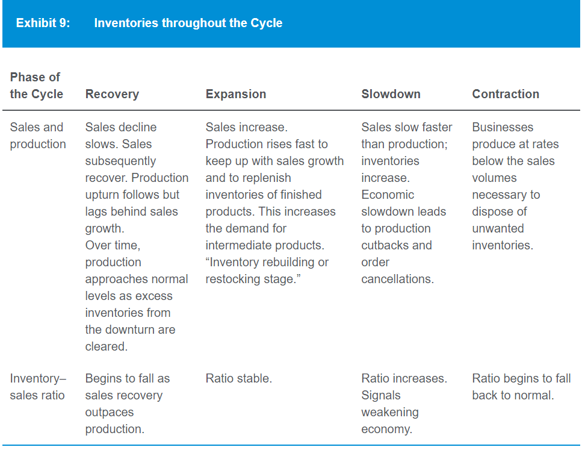
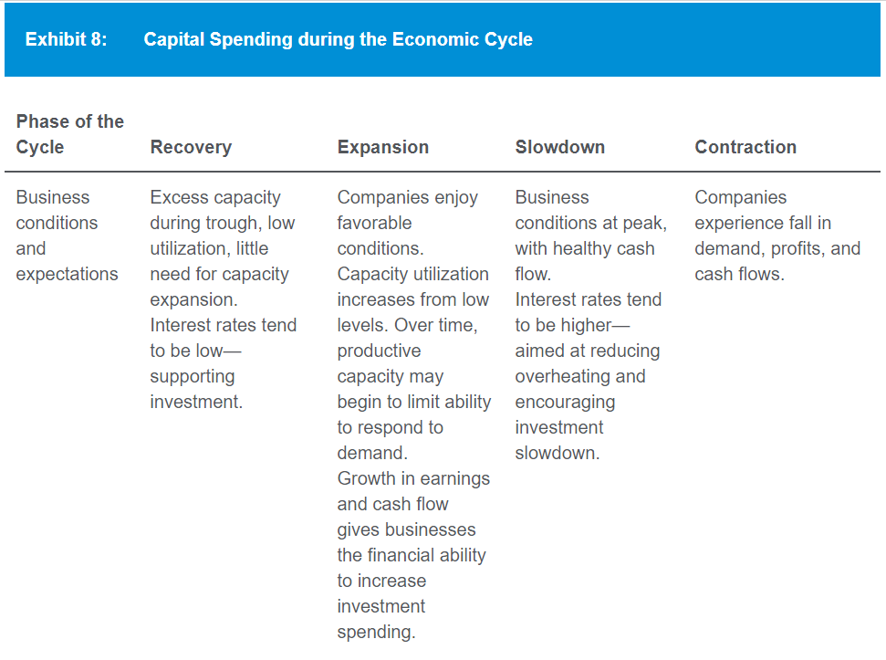
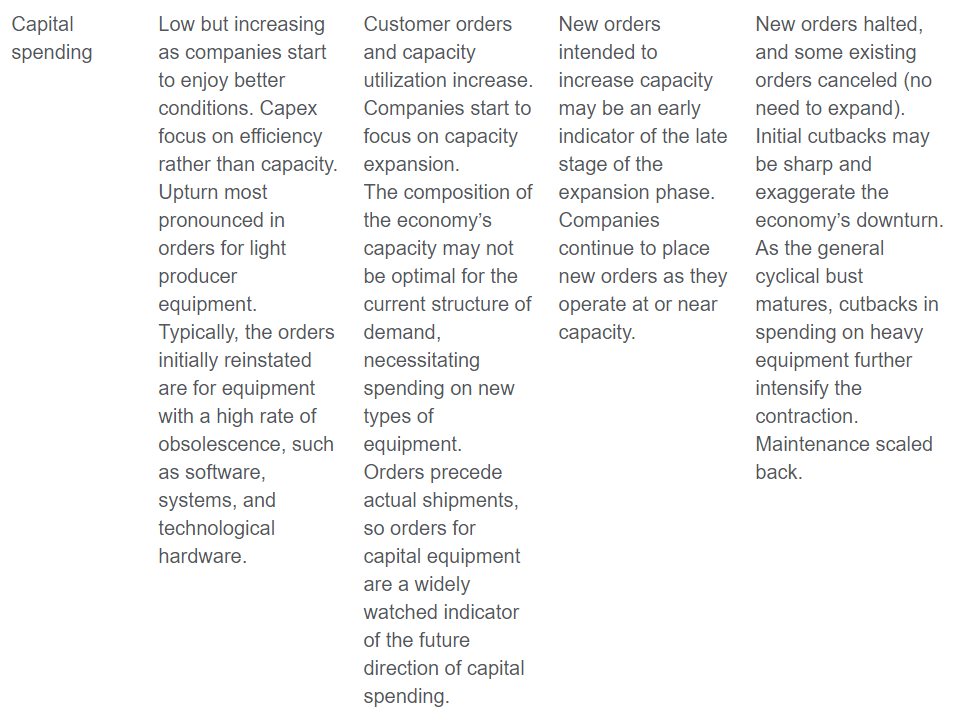

# Quantitative methods
- Calculate number of compounding period using calculator: log a(b) = ln(b)/ln(a)
- Type of graph for each visualization purpose (TODO read official materials):
  - Line chart: visualize trend in variables over time. Can use bubble to add 3rd dimension.
  - Heat map: the degree of correlation between different variables
  - Histogram: shape, center, and spread of the distribution of numerical data
  - Scatter plot matrix: organize scatter plots between pairs of variables:
  to inspect all pairwise relationships in one combined visual
- Correlation from covariance matrix:
  - Diagonal line: standard deviation ^ 2
  - Others: covariance between variables: std 1 x std 2 x correlation(1,2)
- Covariance from joint probabilities
- Continuous compounding rate = ln(1 + return rate)
- Desirable statistical properties of an estimator:
  - Unbiased: expected value equal to the parameter that it is intended to estimate
  - Consistent: accuracy of the parameter estimate increases as the sample size increases
- Percentile calculation: (n + 1) x percentile / 100. Then use linear extrapolation if value is not an integer.
## Hypothesis testing
- Type 1 & type 2 error:
  - Type 1: commit: reject null hypo when it is actually true (accept alternative when it is false)
  - -> Level of significance (alpha): probability of rejecting a true null hypo (prob of type 1 error)
  - Type 2:
    - Def: omit: failure to reject the null hypo when it is actually false
    - -> Contrast to type 1 & significance level:
    smaller significance level -> lower prob of type 1 error & more likely to not reject null hypo -> higher prob of type 2
    - Power of test: prob of rejecting null hypo when it is false. = 1 - P(type 2 error). Can increase by:
      - Increase significance level
      - Increase sample size
- Relation between level of significance (eg 0.05) & rejection region:
higher level of significance ~ wider rejection region (edges of the distribution) -> less confidence in result
- p-value:
  - Prob of obtaining a test stat that would lead to a rejection of the null hypo assuming the null hypo is true (type 1 error)
  - Smallest level of significance for which the null hypo can be rejected
  (eg p-value of test = 6% -> significance must be >= 6% to reject the null hypo)
- t table: p column = 2 tail. Need to x2.
- Use 1 or 2 tail test: test range vs test equality. Also applied to chi-square & F tests
- Type of test by purpose:
  - t: mean, difference in means of 2 independent population, means of pair difs between 2 dependent populations
  - Chi-square: variance of a normally distributed population:
    - Degree of freedom: n-1
    - Test stat: (n-1) x sample variance ^ 2 / hypothesized population variance ^ 2
  - F: equality of variances of 2 normally distributed populations:
    - Degree of freedom: n1 - 1, n2 - 1
    - Test stat: larger variance / smaller variance
- Non-parametric test usages:
  - Assumptions of parametric tests are not met (eg small sample size, non-normal distribution)
  - Data not suitable for parametric test (eg ranked data)
## Linear regression
- Residual = actual value - predicted value
- Assumptions:
  - Linear rela exists
  - Variance of the residual term is constant for all observation (homoskedasticity)
  - Residual term is independently distributed (eg residual for one observation is not correlated with that of another obs)
  - Residual term is normally distributed
- F test stat whether the slope coefficient = 0: MSR/MSE. Degree of freedom: 1 & n - 2.
- t test stat whether slope coefficient = x: (estimated slope coefficient - x) / standard error of slope coefficient.
Degree of freedom: n - 2.
- Standard error of the estimate (standard deviation of the regression residuals) = sqrt(MSE) = sqrt(SSE/n-2)
## Detailed points
- Uni/bi/trimodal: having 1/2/3 peaks in frequency distribution graph
- Target semi/downside deviation: include only below target. Denominator still n - 1.
- Coefficient of variation = standard variation / mean
- Mutually exclusive events are dependent: when one happens, the prob of the other is affected (becomes 0)
- Parameter def: any descriptive measure of a population characteristic
- Time period bias: relation does not hold over other time periods. Occur when:
  - Period studied too short
  - Period studied too long: a structural change in relationship occurred DURING the period

# Economics
## Demand & supply analysis
- Price elasticity for Q = b - a x P: P0 / Q0 x a. P0: price at point x0.
- Normal profit is the level of accounting profit such that implicit opportunity costs are just covered
- -> = 0 economic profit
- Giffen good: inferior good with income effect > substitution effect
- -> Increase in price increase quantity demanded
- Veblen goods: highly valued, high-priced "status" goods
- -> Consumers may tend to buy more if its price rises
- Dif degree of price discrimination for monopoly:
  - First degree: a monopolist can charge each customer the highest price the customer is willing to pay
  - -> Capture all consumer surplus
  - Second degree: monopolist offers a menu of quantity-based pricing options designed to
  induce customers to self-select based on how highly they value the product (eg volume discount, bundling)
  - Third degree: customers are segregated by demographic or other traits
- Neoclassical/Solon growth model
- Money neutrality
- Direct & indirect quote
- Quote: price/base currency
## Aggregate output, prices, and economic growth
- GPD by consumption = C + G + I + (X - M)
- C + S + T (national income) = C + G + I + (X - M)
- -> (X - M) = (S - I) + (T - G)
- GDP inclusion criteria:
  - Within the period
  - Has market value. Exception: owner-occupied housing & gov services
  - Final good, not intermediate
- GPD as income/output:
  - 
- Mixed income = income from unincorporated business (eg farm, rental)
## Business cycles
- Cycle: recovery -> expansion (peak) -> slowdown -> contraction (bottom)
- Economics indicators:
  - 
- Leading economics indicators & reasons to use:
  - 
  - 
- Draw a 4-column table for the 4 phases:
  - 
  - 
  - 
  - 
- Business cycle & inventory-sale ratio:
  - 
## Geopolitics
- Tools of geopolitics:
  - 
## Balance of payments
- Foreign direct investment increases capital account surplus -> increase current account deficit
## Currency exchange rate
- Appreciation to be affective to reduce trade surplus -> decrease in capital account deficit
- (export = + current acc, buy capital abroad = -capital acc) -> export decrease = buy less capital abroad
- -> Domestic sell more capital to foreign/foreign sell less capital to domestic
## Detailed points
- International monetary fund (IMF) aids countries that are experiencing an economically detrimental current account deficit
- Austrian school: gov intervention as primary cause of business cycle. Not intervene when there is cyclical downturn.
- Collusion is less likely when companies have similar market shares -> higher competitive force

# Financial statement analysis
- Pay attention to the year above each column
## Income statement analysis
- Always calculate basic EPS and compare with diluted EPS, in case diluted EPS > basic EPS
- P/E ratio calculation
## Balance sheet analysis
- Remember all the types of assets/liabilities/equities & their examples
## Financial ratios
- Total debt only include interest-bearing debts (not account payable and other long-term debts)
- Interest coverage ratio
## Income tax
- Higher tax base = less depreciation = higher taxable income = more tax paid = tax asset
- Income tax expense (provision for income tax) = tax payable + dDTL + dDTA
## Long-term debt
- Unamortized discount + current bond liability = face value

# Corporate issuers
- Financial leverage = EBIT/EBT -> more debt = higher leverage
- Operating leverage = revenue/EBIT -> lower profit = higher leverage
## Capital investment
- Discount rate (in NPV calculation) = opportunity cost of capital (COC)

# Equity
## Market structure
- Bid = dealer buy in = lower price
- Offer = dealer sell out = higher price

## Security indexes
- Value weighted index = market capitalization weighted index

## Price multiples
- P/E ratio based on the Gordon growth dividend discount model = D1/E1 / (r−g) = dividend payout ratio / (r-g)

# Fixed income
- Original issue tax provision
- Discount margin