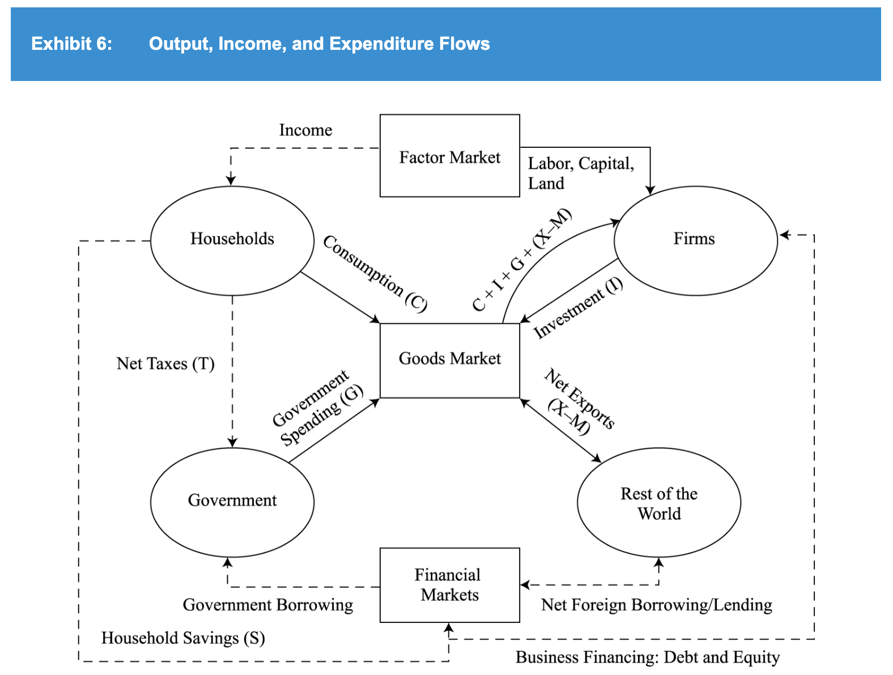

# Quantitative methods
- Calculate number of compounding period using calculator: log a(b) = ln(b)/ln(a)
- Type of graph for each visualization purpose (TODO read official materials):
  - Line chart: visualize trend in variables over time. Can use bubble to add 3rd dimension.
  - Heat map: the degree of correlation between different variables
  - Histogram: shape, center, and spread of the distribution of numerical data
  - Scatter plot matrix: organize scatter plots between pairs of variables:
  to inspect all pairwise relationships in one combined visual
- Correlation from covariance matrix:
  - Diagonal line: standard deviation ^ 2
  - Others: covariance between variables: std 1 x std 2 x correlation(1,2)
- Covariance from joint probabilities
- Continuous compounding rate = ln(1 + return rate)
- Desirable statistical properties of an estimator:
  - Unbiased: expected value equal to the parameter that it is intended to estimate
- Type 1, type 2 error def & relation with significance level & p value. Power of test:
  - Level of significance: probability of rejecting a true null hypo (type 1 error)
- Distinguish between level of significance & confidence interval
- p-value def
- t table: p column = 2 tail. Need to x2.
- TODO Review reading 6
## Detailed points
- Uni/bi/trimodal: having 1/2/3 peaks in frequency distribution graph
- Target semi/downside deviation: include only below target. Denominator still n - 1.
- Coefficient of variation = standard variation / mean
- Mutually exclusive events are dependent: when one happens, the prob of the other is affected (becomes 0)
- Parameter def: any descriptive measure of a population characteristic
- Time period bias: relation does not hold over other time periods. Occur when:
  - Period studied too short
  - Period studied too long: a structural change in relationship occurred DURING the period

# Economics
## Aggregate Output, Prices, and Economic Growth
- GDP inclusion criteria:
  - Within the period
  - Has market value. Exception: owner-occupied housing & gov services
  - Final good, not intermediate
- GPD as income/output:
  - 
- Mixed income = income from unincorporated business (eg farm, rental)
## Business cycles
- Economics indicators:
  - 
- Leading economics indicators & reasons to use:
  - 
  - 
- Draw a 4-column table for the 4 phases
- Business cycle & inventory-sale ratio:
  - 

## Geopolitics
- Tools of geopolitics:
  - 

## Currency exchange rate
- Appreciation to be affective to reduce trade surplus -> decrease in capital account deficit
- (export = + current acc, buy capital abroad = -capital acc) -> export decrease = buy less capital abroad
- -> domestic sell more capital to foreign/foreign sell less capital to domestic

# Financial statement analysis
- Pay attention to the year above each column
## Income statement analysis
- Always calculate basic EPS and compare with diluted EPS, in case diluted EPS > basic EPS
- P/E ratio calculation
## Balance sheet analysis
- Remember all the types of assets/liabilities/equities & their examples
## Financial ratios
- Total debt only include interest-bearing debts (not account payable and other long-term debts)
- Interest coverage ratio
## Income tax
- Higher tax base = less depreciation = higher taxable income = more tax paid = tax asset
- Income tax expense (provision for income tax) = tax payable + dDTL + dDTA
## Long-term debt
- Unamortized discount + current bond liability = face value

# Corporate issuers
- Financial leverage = EBIT/EBT -> more debt = higher leverage
- Operating leverage = revenue/EBIT -> lower profit = higher leverage
## Capital investment
- Discount rate (in NPV calculation) = opportunity cost of capital (COC)

# Equity
## Market structure
- Bid = dealer buy in = lower price
- Offer = dealer sell out = higher price

## Security indexes
- Value weighted index = market capitalization weighted index

## Price multiples
- P/E ratio based on the Gordon growth dividend discount model = D1/E1 / (r−g) = dividend payout ratio / (r-g)

# Fixed income
- Original issue tax provision
- Discount margin