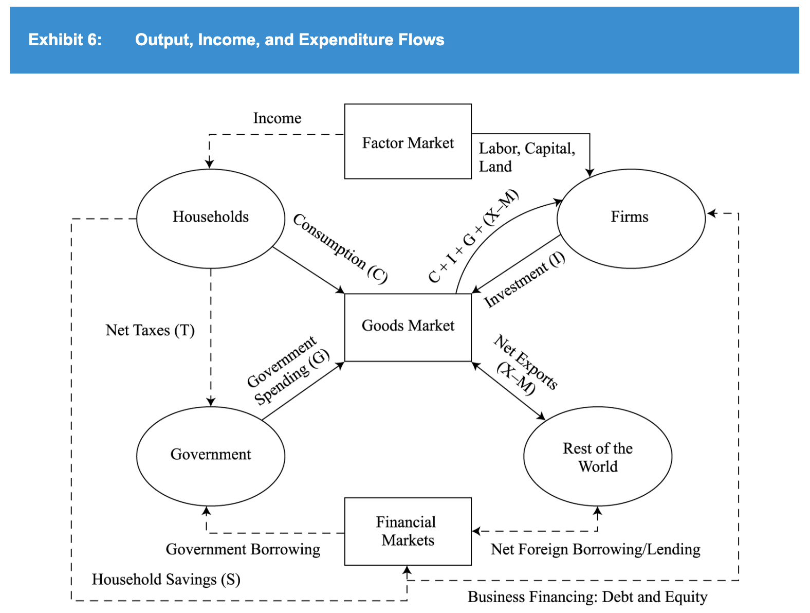
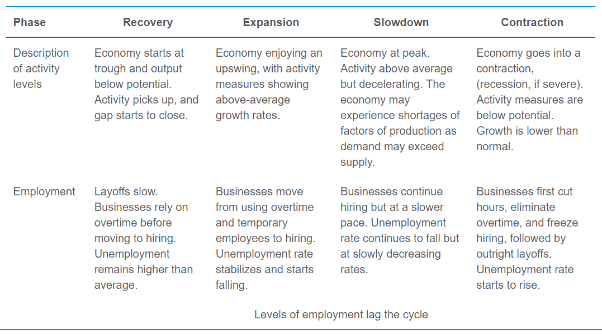
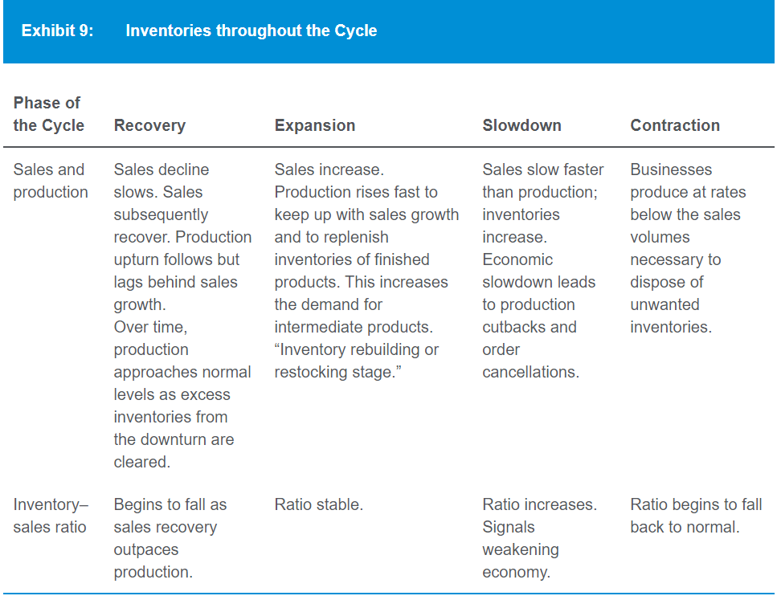
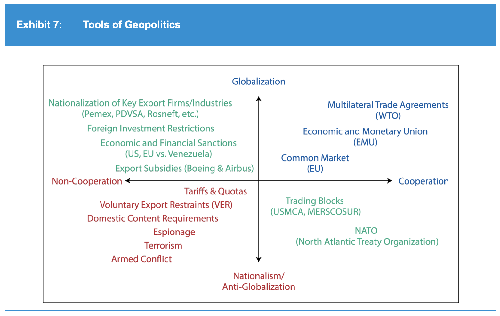

# Economics

## Demand & supply analysis
- Normal profit is the level of accounting profit such that implicit opportunity costs are just covered
- -> = 0 economic profit
- Giffen good: inferior good with income effect > substitution effect
- -> Increase in price increase quantity demanded
- Veblen goods: highly valued, high-priced "status" goods
- -> Consumers may tend to buy more if its price rises
- Slope of demand curve is slope of function of price in terms of demand (b) : P = a - b.Q
- -> Demand curve: P is y-axis, Q is x-axis -> present P in terms of Q

## Business structure
- Collusion is less likely when companies have similar market shares -> higher competitive force
- Dif degree of price discrimination for monopoly:
  - First degree: a monopolist can charge each customer the highest price the customer is willing to pay
  - -> Capture all consumer surplus
  - Second degree: monopolist offers a menu of quantity-based pricing options designed to
    induce customers to self-select based on how highly they value the product (eg volume discount, bundling)
  - Third degree: customers are segregated by demographic or other traits

## Aggregate output, prices, and economic growth
- GPD by consumption = C + G + I + (X - M)
- C + S + T (national income) = C + G + I + (X - M)
- -> (X - M) = (S - I) + (T - G)
- GDP inclusion criteria:
    - Within the period
    - Has market value. Exception: owner-occupied housing & gov services.
    - Final good, not intermediate
- GPD as income/output:
    - 
- GPD calculation:
  - Expenditure approach: add statistical discrepancy
  - Income approach: add capital consumption allowance
- Mixed income = income from unincorporated business (eg farm, rental)
- Increase in expected income -> decrease saving -> decrease supply of financial capital -> increase interest rate

## Business cycles
- Cycle: recovery -> expansion (peak) -> slowdown -> contraction (bottom/trough)
- Draw a 4-column table for the 4 phases:
    - 
    - 
- Credit cycles tend to be  longer, deeper, and sharper than business cycles
- Fiscal policy is the use of taxes and government spending to affect the level of aggregate expenditures
- Monetary policy:
  - Def 1: action taken by a nation's central bank to affect aggregate output and prices
    through changes in bank reserves, reserve requirements, or its target interest rate
  - Def 2: central bank activities that are directed toward influencing the quantity of money and credit in an economy

## Geopolitics
- Tools of geopolitics:
    - 

## Balance of payments
- Foreign direct investment increases capital account surplus -> increase current account deficit

## Currency exchange rate
- Appreciation to be affective to reduce trade surplus -> decrease in capital account deficit
- (export = + current acc, buy capital abroad = -capital acc) -> export decrease = buy less capital abroad
- -> Domestic sell more capital to foreign/foreign sell less capital to domestic
- Quote: price/base currency
- Direct & indirect quote:
  - Direct quote: domestic/foreign
  - Indirect quote: foreign/domestic
- Forward premium/discount is relative to the base currency (B in A/B quote). Quote by:
  - Point: add/subtract directly
  - Percent: multiply

## Concept review
- Income effect
- Long run average total cost curve
- National income, personal income
- Aggregate demand/supply fluctuation:
  - Inflationary gap
  - Recessionary gap
  - Stagflation
- Credit cycle
- Neoclassical/Keynesian/monetarist/Austrian economics & business cycle & suggested actions
- Economic indicators:
  - Leading indicators
  - Coincident indicators
  - Lagging indicators
- Frictional unemployment
- Structural unemployment
- Cyclical unemployment
- Unemployed
- Disinflation, deflation
- Headline/core inflation
- Laspeyres price index, Paasche index & Fisher index & their biases
- Cost-push inflation
- Demand-pull inflation
- Non-accelerating inflation rate of unemployment (NAIRU)
- Functions of money
- Main objective of central banks
- Effective central bank's characteristics:
  - Independent
  - Creditable
  - Transparent
- Real trend rate
- Neutral interest rate
- Fiscal policy delays
- 4 geopolitics category
- 3 types of geopolitical risk
- GNP vs GDP
- Comparative adv models:
  - Ricardo
  - Heckscher & Ohlin
- Trade restriction:
  - Minimum domestic content
  - Voluntary export restrain (VER)
- 5 types of trade agreements
- Current acc components
- Capital acc
- Financial acc
- Current account surplus meaning
- Role of:
  - IMF
  - World Bank
  - WTO
- Sell side in FX market
- Point in FX quotation
- Exchange rate regimes:
  - No currency
  - Have its own currency:
    - Currency board agreement
    - Conventional fixed peg arrangement
    - Pegged exchange rate with horizontal band (target zone)
    - Crawling peg
    - Crawling bands
    - Managed floating
    - Independent floating
- Structural deficit

## Concept answers
- 211: income effect
- 212: long run average total cost curve
- 249: national income, personal income
- 260:
  - Inflationary gap
  - Recessionary gap
  - Stagflation
- 280: credit cycle: cyclical fluctuation of interest rate & credit availability
- 281: neoclassical/Keynesian/monetarist/Austrian economics & business cycle & suggested actions:
  - Neoclassical:
    - Cycle driven by technological change
    - Non interventionism approach: wage & input price will adjust rapidly
  - New classical (real business cycle theory):
    - Cycle due to utility maximizing actors responding to real economic forces (external shock, change in technology)
    - Non interventionism approach
  - Keynesian:
    - Cycle due to excessive optimism/pessimism by managers, contractions can persist due to slow adjustment of wage/input price
    - Intervention by fiscal policy
  - Monetarist:
    - Cycle due to inapt money supply
    - Approach: maintain moderate & predictable money supply growth
  - Austrian:
    - Cycle due to gov intervention that drives interest rate to low level
    - Non interventionism approach
- 270:
  - Leading indicators: equity index, new orders of manufacturers, building permit, consumer expectation
  - Coincident indicators: industrial production/manufacturing, income
  - Lagging indicators: inventory/sale, unemployment, leading/loan, CPI (inflation)
- 282:
  - Frictional unemployment
  - Structural unemployment: long term economic changes that require workers to learn new skills to fill available jobs
  - Cyclical unemployment: positive/negative when economy producing less/more than potential real GDP
  - Unemployed
  - Disinflation, deflation
  - Headline/core inflation
  - Laspeyres price index (constant basket of good), Paasche index (current basket of good) & Fisher index & their biases
  - Cost-push inflation: decrease in aggregate supply due to increase in input price
  - Demand-pull inflation: increase in aggregate demand
  - Non-accelerating inflation rate of unemployment (NAIRU):
  unemployment rate below which upward pressure on wages is likely to develop
- 306: functions of money:
  - Medium of exchange
  - Store of value
  - Unit of account
- 307:
  - Main objective of central banks: control inflation
  - Effective central bank's characteristics:
    - Independent: politically
    - Creditable: follow through the stated policy
    - Transparent: make clear which indicators are used & report the state of those indicators
  - Real trend rate: long term sustainable real growth rate of an economy
  - Neutral interest rate:
    - Real trend rate + target inflation
    - Benchmark for whether monetary policy is expansionary/contractionary
- 309: fiscal policy delays: recognition/action/impact lag
- 316: 4 geopolitics category
- 317: 3 types of geopolitical risk: event, exogenous, thematic (known factors that have long term effect)
- 331:
  - GNP vs GDP
  - Comparative adv models:
    - Ricardo: labor productivity due to difference in technology
    - Heckscher & Ohlin: relative amount of labor & capital
- 332:
  - Trade restriction:
    - Minimum domestic content: requirement that some % of product content must be from domestic country
    - Voluntary export restrain (VER): self-imposed export restriction -> the self-imposer (not importer) captures all surplus
  - 5 types of trade agreements
- 333:
  - Current acc components: import/export goods & service, interest/dividend received, unilateral transfer
  - Capital acc: transfer for fixed asset purchases, purchases of non-financial assets, asset bought/taken by migrants
  - Financial acc: ~fin assets own by domestic/foreign
  - Current account surplus meaning: export > import -> surplus money -> buy foreign asset -> financial/capital account deficit
  - Role of:
    - IMF: money coop, exchange rate stability, international payment system setup, help with balance of payment problem
    - World Bank: loan, credit, grant -> reduce poverty
    - WTO: multilateral trade agreements
- 349:
  - Sell side in FX market: large international bank (not central bank)
  - Point in FX quotation
- 350: exchange rate regimes:
  - No currency: formal dollarization, monetary union
  - Have its own currency:
    - Currency board agreement: explicit commitment to exchange domestic currency for a specified foreign currency at fixed rate
    - -> Import inflation rate, no independent monetary policy (~dollarization)
    - Conventional fixed peg arrangement: peg with 1% margin
    - Pegged exchange rate with horizontal band (target zone): peg with wider margin
    - Crawling peg: periodical adjustment of peg rate for inflation
    - Crawling bands: increasing peg band
    - Managed floating: monetary authority influence rate in response to specific indicators (eg inflation, balance of payment)
    - Independent floating: market-determined rate
  - -> Wider band -> more flexibility in conducting monetary policy
- Structural deficit: gov budget deficit that would persist when the economy is at full employment