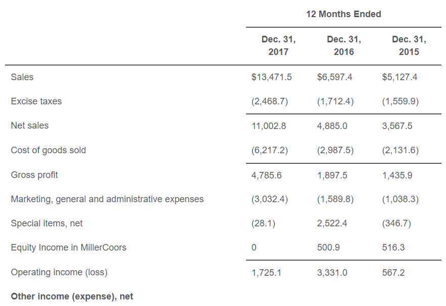
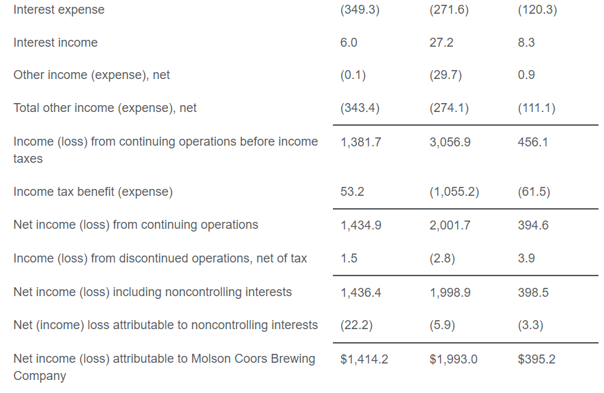
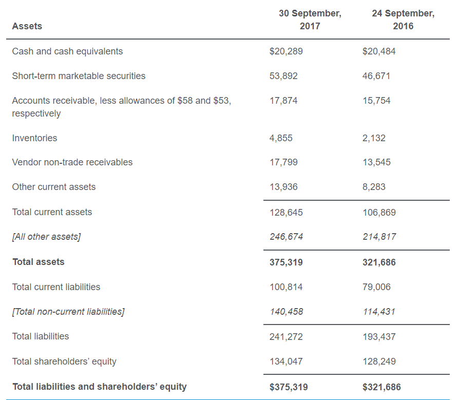
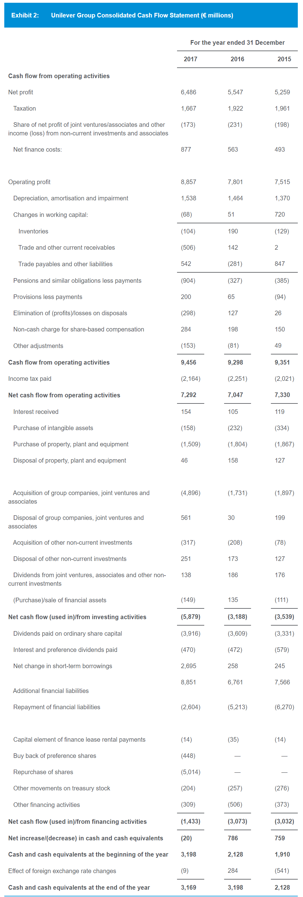

# Financial Statement Analysis
- Pay attention to the year above each column

## Income statement analysis
- Example:
  - 
  - 
- Dividends are not included in income stm or other comprehensive income
- -> Only used for calculating retained earnings, should not deduce it to get net income
- Calculate diluted EPS:
  - Number of new shares from stock option:
  num of options - num of options * option price / average market price (not end of period price)
  - Always calculate basic EPS and compare with diluted EPS, in case diluted EPS > basic EPS
  - Weighted average number of share calculation (p.42 Notes):
  weighted average number of share before the dividend date x dividend rate + weighted average number of share after dividend
- Trading securities unrealized gain affects net income,
available for sale unrealized gain affects equity via other comprehensive income

## Balance sheet analysis
- Example:
  - 
- Trade receivables are reported at net realizable value, un-collectability already accounted for

## Cash flow statements
- Example:
  - 
- Types of activities classified by types of cash flow:
  - Operating:
    - Current assets & current liabilities
    - Net income
    - Interest received, dividends received
    - Interest paid
    - Tax paid
  - Investing:
    - Non-current assets
  - Financing:
    - Non-current liabilities
    - Issue/repurchase stocks
    - Dividends paid
  - IFRS:
    - **Received** interest, dividends can be operating/investing
    - **Paid** interest, dividends can be operating/financing
- Conversion of bonds into common stock is non-cash transaction, whether or not there is difference in value
- -> Disclose only in footnote to cash flow stm

## Financial ratios
- Total debt only include interest-bearing short/long debts (not account payable and other long-term debts)
- Interest coverage ratio: EBIT / actual interest payment

## Inventories
- Types of costs included in inventory:
  - Purchase
  - Conversion
  - Other costs to bring inventory to the present location & condition
- Types of costs expensed (not included):
  - Abnormal waste of inventory
  - Storage costs of inventory
  - Administrative & selling
- Type of inventory reporting that result in lowest write down:
  - Price increasing: LIFO: lowest inventory cost
  - Price decreasing: FIFO: lowest inventory cost
- Convert LIFO to FIFO:
  - Increase in net income = decrease in COGS * (1 - tax rate)
  - Lower cash: more tax paid: tax paid = LIFO reserve * tax rate
  - Increase in current asset: LIFO reserve - tax paid
- Reversal of inventory write-down: decrease cost of sales
- Inventory write-down: decrease inventory -> decrease COGS & higher net income compared to normal in later period
- Inventory write-up: maximum is previous write down
- Inventory valuation:
  - IFRS: lower of cost and net realizable value
  - GAAP: lower of cost, market value, or net realisable value depending upon the inventory method used

## Long-lived assets
- Cost that can be capitalized: interest paid - interest received from temporarily investing.
Preferred dividend cost can't be capitalized.
- Fair value model (can be used for investment property): increase/decrease in value reflected directly in income
- Asset purchase/development effect on cash flow:
  - Purchase: expense reduce operating cash flow
  - Capitalize: expense reduce investing cash flow & create asset for depreciation
- Useful lives must be disclosed when using cost model under IFRS
- Long-term contract revenue recognition method doesn't affect cash flow
- Revenue recognition methods:
  - Completed contract (GAAP): only recognize revenue when the entire project is completed
  - Percentage of completion (ie progress toward satisfying performance obligations):
  recognize profit corresponding to the costs incurred as a proportion of estimated total costs
  - Installment method: recognize profit in proportion to cash collected

## Income tax
- Higher tax base of asset = less depreciation = higher taxable income = more tax paid = tax asset
- Income tax expense (provision for income tax) = tax payable + dDTL - dDTA

## Concept review
- Statement of change in equity
- Auditor's:
  - Qualified
  - Adverse
  - Disclaimer of opinion
- Proxy stm
- 6 steps of FSA framework
- Standard-setting bodies vs regulatory authorities
- Chars of financial stms:
  - Fundamental
  - Enhancing
- Multistep income stm
- Expense categorization
- Matching principle
- Position in income stm of:
  - Discontinued operation
  - Unusual/infrequent items
- Prospective change cases
- Vertical common size income stm
- Comprehensive income
- Other comprehensive income
- Classified balance sheet
- Current asset
- Cash equivalents
- Cost model
- Accrued liabilities
- Unearned revenue
- Components of owner's equity:
  - Contributed capital
  - Preferred stock
  - Retained earning
  - Treasury stock
  - Non-controlling (minority) interest
  - **Accumulated** other comprehensive income
- Vertical common size balance sheet
- CFO
- CFI
- CFF
- Position of non-cash investing/financing activities
- Advs of direct/indirect method of presenting CFO
- Common size cash flow stms
- Conversion from indirect to direct
- Business/geographic segment of a firm
- Pro forma financial stm
- Inventory write up
- Treatment of:
  - Internally developed asset cost
  - Research cost
  - Development cost
- Classification of cash outflow for capitalized asset
- Component depreciation
- Cash flow under dif depreciation methods
- Impairment's effect:
  - Net income, asset, equity, ROA, ROE
  - Cash flow stm
- De-recognition (disposal by sale)
- Revaluation model. Disclosure.
- Impairment treatment. Effect. Disclosure.
- Investment property:
  - Def
  - Report
  - Treatment of increase in value for fair value model
- Taxable income
- Tax payable
- Income tax expense
- Valuation allowance
- Treatment of deferred tax liabilities for analytical purpose
- Asset's tax base, calculation
- Temporary difference
- Statutory tax rate
- Effective tax rate
- Bond's proceed value
- Gain/loss when redeem bond early
- Position of details about long-term debt's
- Net pension liability/asset calculation, * report
- Financial reporting quality spectrum
- Low quality report conditions
- Mechanisms to discipline reporting quality
- Treatment of non GAAP measure
- Accounting treatments by types of leases: lessee & lessor
- Lease disclousure

## Concept answers
- 17: statement of change in equity: amount & sources of changes in equity
- 18:
  - Auditor's:
    - Qualified: notes any exceptions to accounting principles
    - Adverse: stms not presented fairly
    - Disclaimer of opinion: unable to express an opinion
  - Proxy stm: matters to be voted at shareholder's meeting
  - 6 steps of FSA framework:
    - State objective
    - Gather data
    - Process data -> ratios, graph, common size
    - Analyze & interpret data
    - Report conclusions/recommendations
    - Update the analysis
- 26:
  - Standard-setting bodies vs regulatory authorities
  - Chars of financial stms:
    - Fundamental: relevance (decision-useful) & faithful representation (complete, no bias, no error)
    - Enhancing: comparability, verifiability, timeliness, understandability
- 51:
  - Multistep income stm: provide subtotal for gross profit
  - Expense categorization: by nature (eg depreciation), by function (eg COGS)
- 52:
  - Matching principle: match revenue with expense required to generate them
  - Position in income stm of:
    - Discontinued operation: below income from continuing operations, net of tax
    - Unusual/infrequent items: above income from continuing operations, before tax
  - Prospective change cases: an accounting estimate (eg useful life of asset), inventory cost flow method (GAAP)
- 53:
  - Vertical common size income stm: divide by revenue
  - Comprehensive income = net income + other comprehensive income, measure all changes to equity
  - Other comprehensive income: transactions that affect equity but not net income
- 74:
  - Classified balance sheet: separate current/non-current assets/liabilities
  - Current asset: asset expected to be used up/converted to cash in less than max(1 year, the firm's operating cycle)
  - Cash equivalents: short-term, highly liquid financial assets readily convertible to cash
  - Cost model: historical cost - depreciation
- 75:
  - Accrued liabilities: expenses recognized in income stm but not yet contractually due
  - Unearned revenue: cash collected in advance of providing goods & services
  - Components of owner's equity:
    - Contributed capital: amount contributed by common shareholders
    - Preferred stock
    - Retained earning
    - Treasury stock: issued common stock issued that has been repurchased by the firm
    - Non-controlling (minority) interest: portion of a subsidiary that is not owned by the parent
    - **Accumulated** other comprehensive income
  - Vertical common size balance sheet: divide by total assets
- 100:
  - CFO: affect net income, related to current assets/liabilities
  - CFI: related to long term assets & certain investments
  - CFF: related to non-current liabilities & equity (eg issue/repaying debt & stock)
  - Position of non-cash investing/financing activities: footnotes/supplemental schedule to cash flow stm
- 101: advs of direct/indirect method of presenting CFO
- 102:
  - Common size cash flow stms: either:
    - Divide by revenue
    - Divide each cash inflow/outflow by total of inflows/outflows
  - Conversion from indirect to direct: use sale & COGS, add/subtract reported figures in indirect stm or balance sheet items
- 132:
  - Business/geographic segment of a firm: portion of a firm that:
    - Have risk & return chars distinguishable from the rest of the firm
    - Account for more than 10% of the firm's sales or assets
  - Pro forma financial stm: forecast sales growth -> adjust income stm & balance sheet items
- 154: inventory write up (IFRS only): only to the extent of a previous write-down
- 183:
  - Treatment of:
    - Internally developed asset cost: expense
    - Research cost: expense
    - Development cost: IFRS can be capitalized, GAAP expense. Exception: software created for sale.
  - Classification of cash outflow for capitalized asset: CFI
- 184:
  - Component depreciation (IFRS)
  - Cash flow under dif depreciation methods: unaffected: same tax payable, dif income tax expense
  - Impairment's effect:
    - Decrease net income -> lower ROA, ROE
    - Increase asset & equity: revaluation surplus in other comprehensive income. Asset increased in value on balance sheet.
    - Cash flow stm: no effect
  - De-recognition (disposal by sale): gain/loss = selling price - book value. Reported on income stm & CFI (affecting net income).
- 185:
  - Revaluation model (IFRS, can be used for PP&E):
    - Revalue assets based on fair value
    - Gain:
      - First recognized in income stm as gain to the extent of previous loss
      - Extra reported as revaluation surplus in shareholder's equity (other comprehensive income)
    - Loss:
      - First reduce revaluation surplus
      - Extra reported as loss in income stm
    - Disclosure:
      - Revaluation date
      - How fair value was determined
      - Carrying value using cost model
  - Impairment treatment:
    - IFRS:
      - When carrying value > recoverable amount (ie max(fair value - selling cost, value in use (ie NPV of future cash flow)))
      - Write down to recoverable amount
    - GAAP:
      - When carrying value > undiscounted future cash flows
      - Write down to fair value, or PV of future cash flow if fair value is not known
    - Effect:
      - Loss in income stm: recorded as operating expense -> reduce net income
      - No effect on cash flow: not reduce taxable income
      - Reduce asset value
      - -> Lower depreciation & higher net income in subsequent periods
    - Disclosure: loss amount & circumstances that caused the loss
- 186: investment property (IFRS):
  - Def: property owned for the purpose of earning rent, capital appreciation, or both
  - Report: fair value or cost model
  - Treatment of increase in value for fair value model: directly in income stm
- 204:
  - Taxable income: income subjected to tax on the tax return
  - Tax payable:
    - Tax liabilities on the tax return
    - Tax due but not paid (on balance sheet)
  - Income tax expense: expense recognized in income stm
  - Valuation allowance: reduction of deferred tax assets based on likelihood that future tax benefit will not be realized
  - -> Reduce earning
  - Treatment of deferred tax liabilities for analytical purpose:
    - Not expected to reverse: as equity
    - Expected to reverse: as liabilities
- 205:
  - Asset's tax base (value for tax purposes), calculation: cost - accumulated depreciation on the tax return
  - Temporary difference: dif between tax base & carrying value of asset/liability
    that will result in taxable amounts/deductible amounts in the future
- 201:
  - Statutory tax rate: tax rate of the jurisdiction where the firm operates
  - Effective tax rate: net income/EBT
- 224: bond's proceed value: PV using market rate at issuance
- 225:
  - Gain/loss when redeem bond early: book value - redeem price
  - Position of details about long-term debt's: footnote
- 219: treatment of lease IFRS/GAAP for leasee, leasor
- 226: net pension liability/asset:
  - = fair value of defined benefit plan's asset - estimated pension obligation
  - Change reported in other comprehensive income
- 239: financial reporting quality spectrum:
  - Compliant > not compliant > fraudulent
  - Decision useful > bias reporting choice & estimate (aggressive/conservative) > actively managed earning
  - Earning quality
- 240:
  - Low quality report conditions: motivation, opportunity, rationalization
  - Mechanisms to discipline reporting quality: regulation, auditing, private contract
  - Treatment of non GAAP measure: explanation & reconciliation
- Accounting treatments by types of leases:
  - Short-term, low-value lease: report rent expense in income statement
  - For lessee, operating & financing lease:
    - Record right-of-use asset & lease liability on balance sheet. Value = PV of lease payments.
    - (Basically) Amortize the asset & reduce lease liability by each lease payment
  - For lessor:
    - Financing (capital) lease:
      - Remove lease asset, add lease receivable (value = PV of lease payments) to balance sheet
      - -> Record gain/loss = lease receivable value - lease asset book value
      - For each lease payment:
        - Amortize the lease receivable (as revenue)
        - Record interest amount as income
      - -> All are recorded as operating cash flow
    - Operating lease:
      - Keep leased asset on balance sheet, record depreciation expense normally
      - Lease payments reported as income, operating cash
- Lease disclosure: min lease payment in next 5 years & sum lease payment more than 5 years into the future