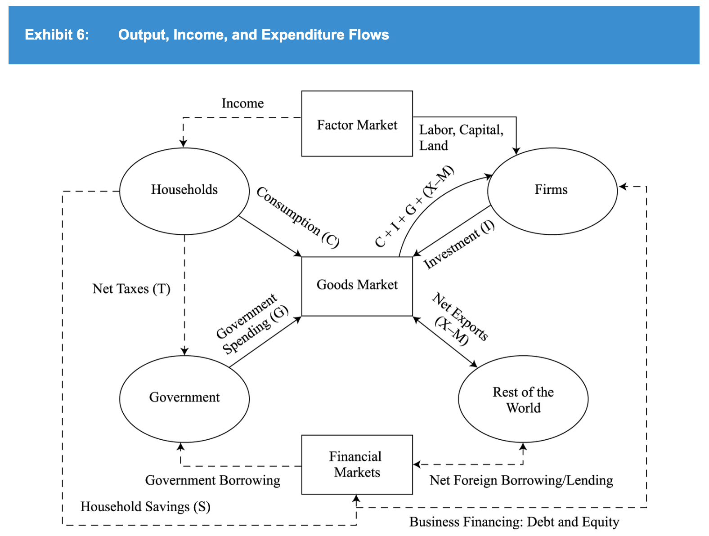

# Economics
## Demand & supply analysis
- Price elasticity for Q = b - a x P: P0 / Q0 x a. P0: price at point x0.
- Normal profit is the level of accounting profit such that implicit opportunity costs are just covered
- -> = 0 economic profit
- Giffen good: inferior good with income effect > substitution effect
- -> Increase in price increase quantity demanded
- Veblen goods: highly valued, high-priced "status" goods
- -> Consumers may tend to buy more if its price rises
- Slope of demand curve is slope of function of price in term of demand (b) : P = a - b.Q
- -> Demand curve: P is y-axis, Q is x- axis -> present P in term of Q
## Business structure
- Collusion is less likely when companies have similar market shares -> higher competitive force
- Dif degree of price discrimination for monopoly:
  - First degree: a monopolist can charge each customer the highest price the customer is willing to pay
  - -> Capture all consumer surplus
  - Second degree: monopolist offers a menu of quantity-based pricing options designed to
    induce customers to self-select based on how highly they value the product (eg volume discount, bundling)
  - Third degree: customers are segregated by demographic or other traits
## Aggregate output, prices, and economic growth
- GPD by consumption = C + G + I + (X - M)
- C + S + T (national income) = C + G + I + (X - M)
- -> (X - M) = (S - I) + (T - G)
- GDP inclusion criteria:
    - Within the period
    - Has market value. Exception: owner-occupied housing & gov services
    - Final good, not intermediate
- GPD as income/output:
    - 
- GPD calculation:
  - Expenditure approach: add statistical discrepancy
  - Income approach: add capital consumption allowance
- Mixed income = income from unincorporated business (eg farm, rental)
- Neoclassical/Solon growth model: Y = total factor productivity/tech level x f(capital, labor)
- Money neutrality: M x V = P x Y
- -> Change in money supply increase P, not Y
## Business cycles
- Cycle: recovery -> expansion (peak) -> slowdown -> contraction (bottom/trough)
- Draw a 4-column table for the 4 phases:
    - 
    - 
- Economics indicators:
  - 
- Austrian school: gov intervention as primary cause of business cycle. Not intervene when there is cyclical downturn.
- Credit cycles tend to be  longer, deeper, and sharper than business cycles
## Geopolitics
- Tools of geopolitics:
    - 
## Balance of payments
- Foreign direct investment increases capital account surplus -> increase current account deficit
- International monetary fund (IMF) aids countries that are experiencing an economically detrimental current account deficit
## Currency exchange rate
- Appreciation to be affective to reduce trade surplus -> decrease in capital account deficit
- (export = + current acc, buy capital abroad = -capital acc) -> export decrease = buy less capital abroad
- -> Domestic sell more capital to foreign/foreign sell less capital to domestic
- Quote: price/base currency
- Direct & indirect quote:
  - Direct quote: domestic/foreign
  - Indirect quote: foreign/domestic
- Forward premium/discount is relative to the base currency (B in A/B quote). Quote by:
  - Point: add/subtract directly
  - Percent: multiply