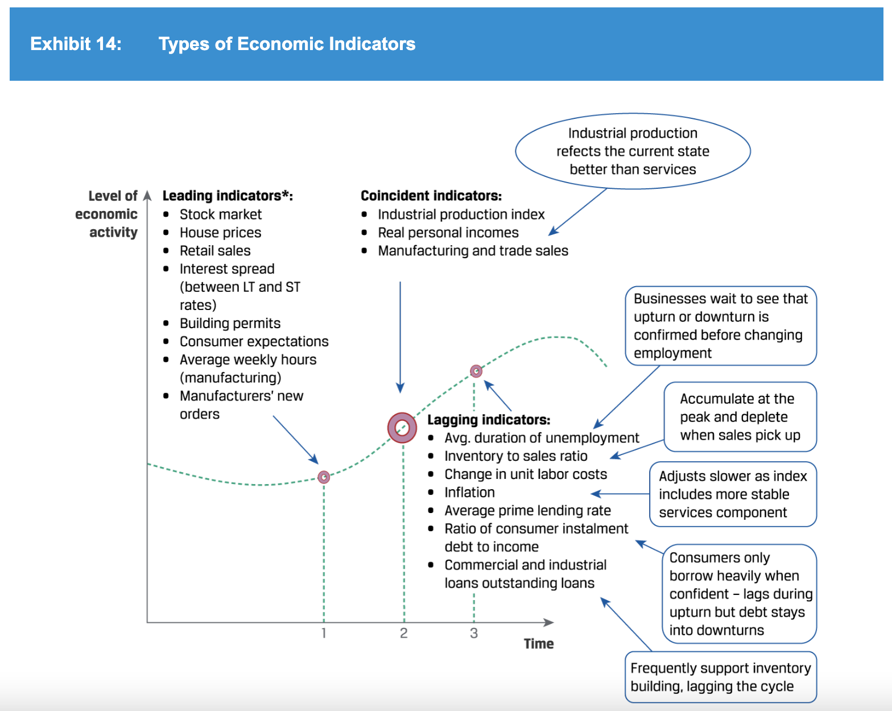
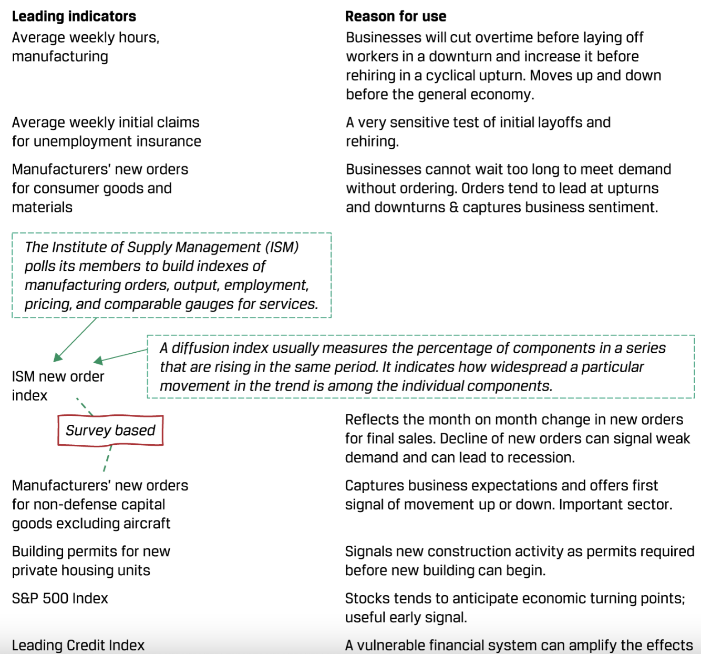
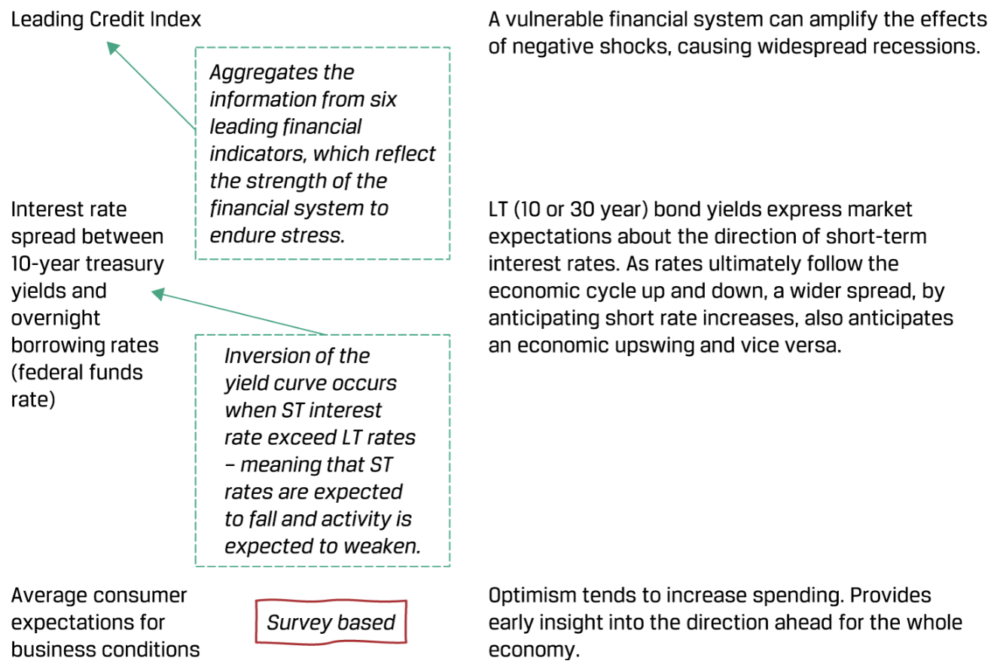
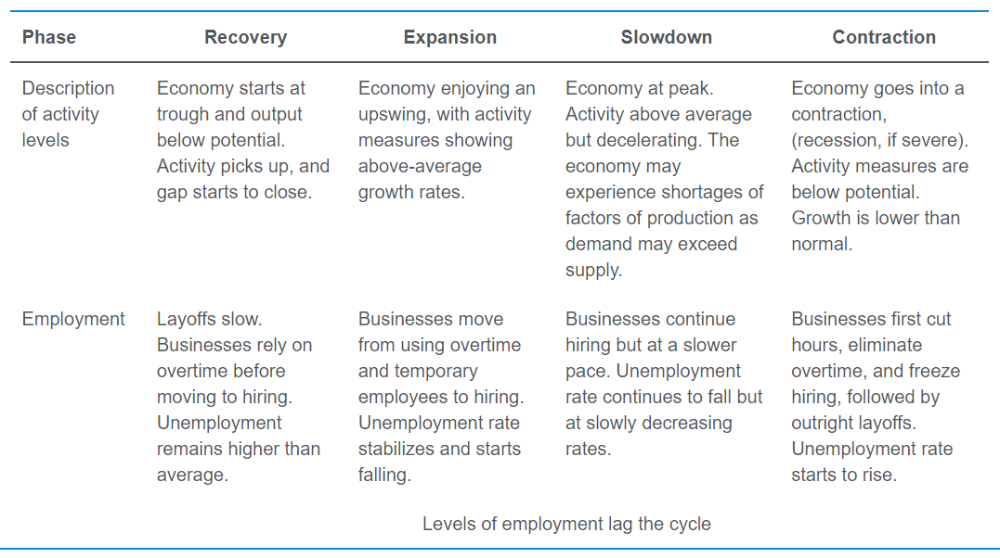
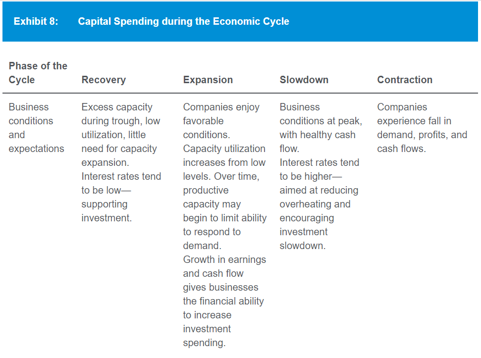
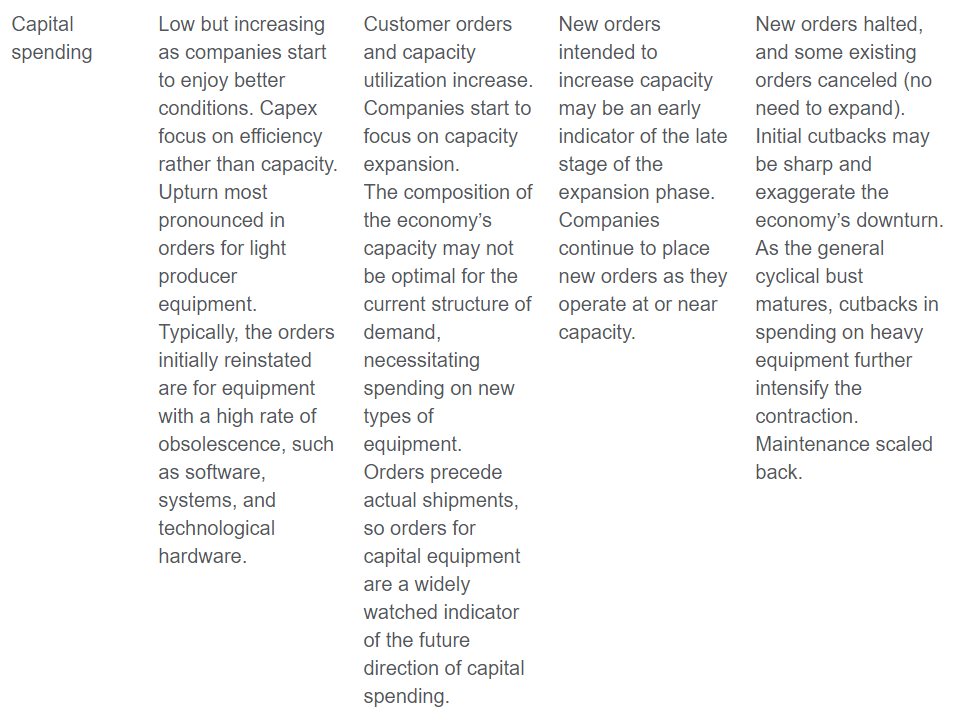

# Economics
## Demand & supply analysis
- Price elasticity for Q = b - a x P: P0 / Q0 x a. P0: price at point x0.
- Normal profit is the level of accounting profit such that implicit opportunity costs are just covered
- -> = 0 economic profit
- Giffen good: inferior good with income effect > substitution effect
- -> Increase in price increase quantity demanded
- Veblen goods: highly valued, high-priced "status" goods
- -> Consumers may tend to buy more if its price rises
- Dif degree of price discrimination for monopoly:
    - First degree: a monopolist can charge each customer the highest price the customer is willing to pay
    - -> Capture all consumer surplus
    - Second degree: monopolist offers a menu of quantity-based pricing options designed to
      induce customers to self-select based on how highly they value the product (eg volume discount, bundling)
    - Third degree: customers are segregated by demographic or other traits
- Neoclassical/Solon growth model
- Money neutrality
- Direct & indirect quote
- Quote: price/base currency
## Aggregate output, prices, and economic growth
- GPD by consumption = C + G + I + (X - M)
- C + S + T (national income) = C + G + I + (X - M)
- -> (X - M) = (S - I) + (T - G)
- GDP inclusion criteria:
    - Within the period
    - Has market value. Exception: owner-occupied housing & gov services
    - Final good, not intermediate
- GPD as income/output:
    - 
- Mixed income = income from unincorporated business (eg farm, rental)
## Business cycles
- Cycle: recovery -> expansion (peak) -> slowdown -> contraction (bottom)
- Economics indicators:
    - 
- Leading economics indicators & reasons to use:
    - 
    - 
- Draw a 4-column table for the 4 phases:
    - 
    - 
    - 
    - 
- Business cycle & inventory-sale ratio:
    - 
## Geopolitics
- Tools of geopolitics:
    - 
## Balance of payments
- Foreign direct investment increases capital account surplus -> increase current account deficit
## Currency exchange rate
- Appreciation to be affective to reduce trade surplus -> decrease in capital account deficit
- (export = + current acc, buy capital abroad = -capital acc) -> export decrease = buy less capital abroad
- -> Domestic sell more capital to foreign/foreign sell less capital to domestic
## Detailed points
- International monetary fund (IMF) aids countries that are experiencing an economically detrimental current account deficit
- Austrian school: gov intervention as primary cause of business cycle. Not intervene when there is cyclical downturn.
- Collusion is less likely when companies have similar market shares -> higher competitive force