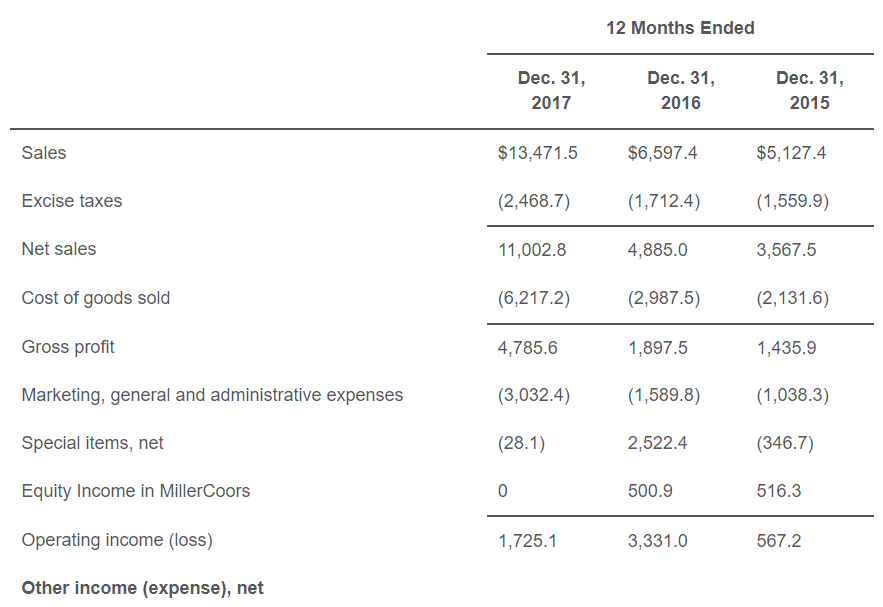
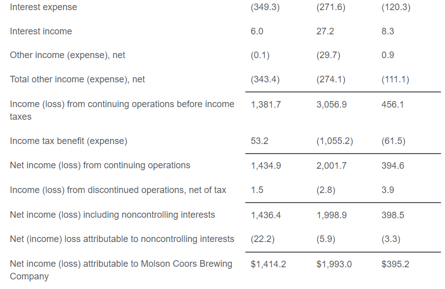
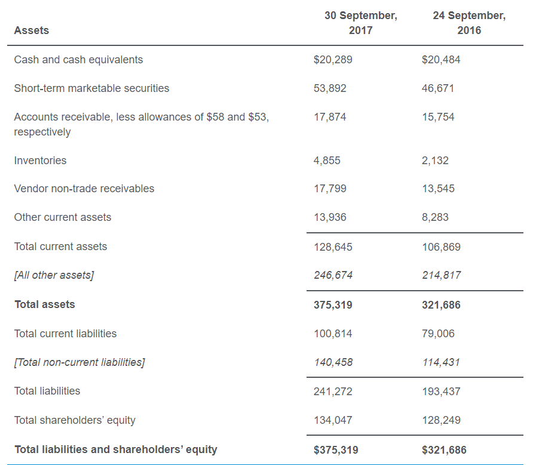
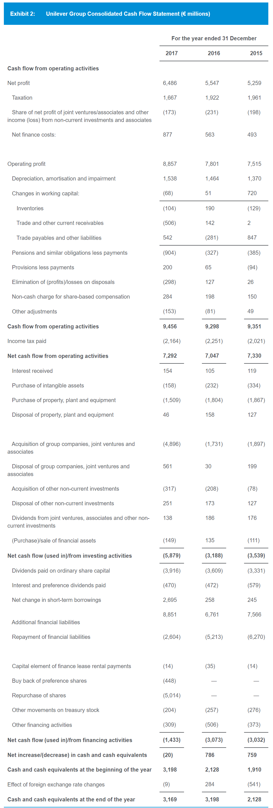

# Financial statement analysis
- Pay attention to the year above each column
## Income statement analysis
- Example:
  - 
  - 
- Dividends are not included in income stm or other comprehensive income
- -> Only used for calculating retained earnings, should not deduce it to get net income
- Basic P/E ratio: (net income - preferred dividends) / num of common shares outstanding
- Calculate diluted EPS:
  - Number of new shares from stock option:
  num of options - num of options * option price / average market price (not end of period price)
  - Numerator: net income - preferred dividends + convertible preferred dividends + debt interest * (1 - tax rate)
  - Always calculate basic EPS and compare with diluted EPS, in case diluted EPS > basic EPS
  - Weighted average number of share calculation (p.42 Notes):
  weighted average number of share before the dividend date x dividend rate + weighted average number of share after dividend
- Trading securities unrealized gain affects net income, available for sale unrealized gain affects equity via other comprehensive income
## Balance sheet analysis
- Example:
  - 
- Remember all types of assets/liabilities/equities & their examples
- Trade receivables are reported at net realizable value, uncollectability already accounted for
## Cash flow statements
- Example:
  - 
- Types of activities classified by types of cash flow:
  - Operating:
    - Current assets & current liabilities
    - Net income
    - Interest received, dividends received
    - Interest paid
    - Tax paid
  - Investing:
    - Non-current assets
  - Financing:
    - Non-current liabilities
    - Issue/repurchase stocks
    - Dividends paid
  - IFRS:
    - **Received** interest, dividends can be operating/investing
    - **Paid** interest, dividends can be operating/financing
- Conversion of bonds into common stock is non-cash transaction, whether or not there is difference in value
- -> Disclose only in footnote to cash flow stm
## Financial ratios
- Total debt only include interest-bearing short/long debts (not account payable and other long-term debts)
- Interest coverage ratio: EBIT / actual interest payment
- Operating cycle: days of sales outstanding + days of inventory on hand
- Cash conversion cycle: days of sales outstanding + days of inventory on hand - days payable
## Inventories
- Types of costs included in inventory:
  - Purchase
  - Conversion
  - Other costs to bring inventory to the present location & condition
- Types of costs expensed (not included):
  - Abnormal waste of inventory
  - Storage costs of inventory
  - Administrative & selling
- Type of inventory reporting that result in lowest write down:
  - Price increasing: LIFO: lowest inventory cost
  - Price decreasing: FIFO: lowest inventory cost
- Convert LIFO to FIFO:
  - Increase in net income = decrease in COGS * (1 - tax rate)
  - Lower cash: more tax paid: tax paid = LIFO reserve * tax rate
  - Increase in current asset: LIFO reserve - tax paid
- Reversal of inventory write-down: decrease cost of sales
- Inventory write-down: decrease inventory -> decrease COGS & higher net income compared to normal in later period
## Long-lived assets
- Cost that can be capitalized: interest paid - interest received from temporarily investing.
Preferred dividend cost can't be capitalized
- Impairment loss calculation:
  - IFRS: write down to recoverable amount: max(value in use, fair value - selling costs).
  Value in use = PV of future cash flow.
  - GAAP:
    - Write down when carrying value > un-discounted future cash flow
    - Write down to: fair value, or PV of future cash flow if fair value is not known
- Impairment effect:
  - Reduce asset value
  - -> Lower depreciation & higher net income in subsequent periods
  - Loss in income statement: recorded as operating expense -> reduce net income
  - No impact on cash flow: not reduce taxable income
- Revaluation (can be used for PP&E) effect:
  - Has effect on net income to the extent of previous revaluation reduce net income
  - Increase asset & equity: revaluation surplus in other comprehensive income. Asset increased in value on balance sheet.
- Fair value model (can be used for investment property): increase/decrease in value reflected directly in income
- Asset purchase/development effect on cash flow:
  - Purchase: expense reduce operating cash flow
  - Capitalize: expense reduce investing cash flow & create asset for depreciation
- Useful lives must be disclosed when using cost model under IFRS
- Long-term contract revenue recognition method doesn't affect cash flow
## Income tax
- Higher tax base of asset = less depreciation = higher taxable income = more tax paid = tax asset
- Income tax expense (provision for income tax) = tax payable + dDTL - dDTA
## Long-term liabilities
- Accounting treatments by types of leases:
  - Short-term, low-value lease: report rent expense on income statement
  - For lessee, operating & financing lease:
    - Record right-of-use asset & lease liability on balance sheet. Value = PV of lease payments.
    - (Basically) Amortize the asset & reduce lease liability by each lease payment
  - For lessor:
    - Financing lease:
      - Remove lease asset, add lease receivable (value = PV of lease payments) to balance sheet
      - -> Record gain/loss = lease receivable value - lease asset book value
      - For each lease payment:
        - Amortize the lease receivable (as revenue)
        - Record interest amount as income
      - -> All are recorded as operating cash flow
    - Operating lease:
      - Keep leased asset on balance sheet, record depreciation expense normally
      - Lease payments reported as income, operating cash