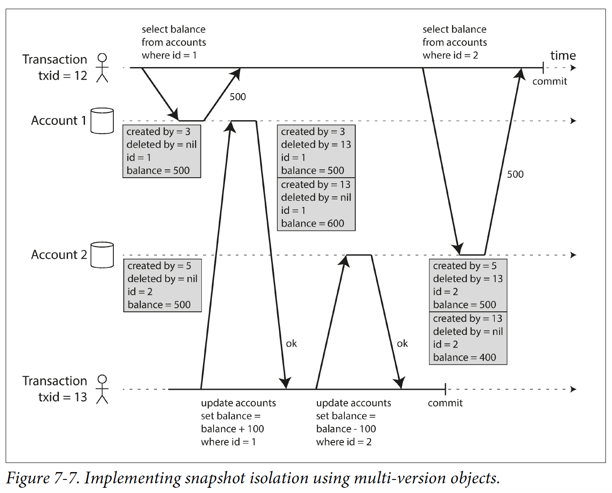

## 7. Transactions
### 7.1. Concept
- Def: group several reads & writes into 1 logical unit, executed as one operation 
- -> No partial failure
- To simplify programming model for app accessing a DB 
- -> Can ignore certain error scenarios & concurrency issues
- ACID (BASE = not ACID):
  - Atomicity = abort-ability: undo partial changes when error occurs
  - Consistency: consistent states are defined by app and violable by codes. DB can't fully ensure.
  - Isolation: handle concurrency: concurrently executed trans are isolated from each other
  - Durability: data written by trans are not lost:
    - 1 node: eg write-ahead logs, in case data structures on disk are corrupted
    - Distributed: copy to a number of nodes
- Single vs multi-object operations: trans needed for multi-object operations because:
  - Relational data: several related tables
  - Denormalized data in document data: need to update several docs in 1 go
  - Update secondary indexes
- Handle error: retry trans after abort. Not effective when:
  - Only fail to ack the completed trans
  - Overload
  - Permanent errors (constraint violation)
  - Side effects are performed (call to external systems)
  - Client process fails when retrying -> the retry is lost
- Anomalies:
  - Dirty read: read uncommitted value:
    - T1: set x = 1->2-----------------------set y = 1->2
    - T2: -------------read x = 2, read y = 1
    - -> Inconsistent: x must = y
    - Problems:
      - Read partially updated state
      - Read value of aborted trans
  - Dirty write: overwrite uncommitted value:
    - T1: set x = 1->2--------------------------set y = 1->2
    - T2: ------------set x = 1->3, set y = 1->3
  - -> Inconsistent: x = 3, y = 2
  - Read skew (timing anomaly/non-repeatable read): observe the DB in an inconsistent state
    - T1: read acc1 = 500----------------------------------------read acc2 = 400
    - T2: ---------------set acc1 (500) += 100, acc2 (500) -= 100
    - Problems:
      - Inconsistent backups
      - Inconsistent analytic queries & integrity checks
  - Lost update: 2 concurrent trans do read-modify-write cycle (eg counter increment):
    - T1: read x = 1-------------------------set x = x + 1
    - T2: ----------read x = 1, set x = x + 1
  - -> Inconsistent: x = 2 instead of 3
  - Write skew: 2 trans read the same object, then update some of those objects:
    - T1: count (A, B)--check count > 1 OK-----------------------write (remove A)
    - T2: count (A, B)-----------------------check count > 1 OK  write (remove B)
  - -> When write change result of count, premise count > 1 is no longer true (phantom)
  - Phantom read: check for the absence of row matching some search condition (eg booking, check username existed)
  - -> No row to lock to
### 7.2. Weak (non-serializable) isolation levels
- Protect against some concurrency issues
- Can lead to subtle bugs
#### Read uncommitted
- Prevent dirty writes
- Allow dirty reads
- Implementation:
  - Prevent dirty write: use row-level locks. Trans hold lock until committed/aborted.
#### Read committed
- No dirty reads & no dirty writes
- Implementation:
  - Prevent dirty write: same as read commited impl
  - Prevent dirty read:
    - Use row-level lock for read: performance cost
    - Versioning: keep old value for read
#### Snapshot isolation (repeatable read)
- Read from a consistent snapshot of the DB -> no read skew
- Implementation:
  - Write lock for write (same as read committed implementation)
  - Multi-version concurrency control (MVCC) for read:
    - Use increasing trans ID (txid)
    - Each row has multiple versions corresponding to each update trans
    - Each version has `created by` & `deleted by` (txid) columns
  - Visibility rules: ignore writes/deletions made by trans with higher ID
  - 
  - Indexing:
    - Index point to all versions, filter not-visible versions
    - Copy-on-write/append-only
#### Prevent lost updates
- Atomic write operations:
  - Lock
  - Use 1 thread
- Explicit locking (SELECT FOR UPDATE = lock all rows returned by the query from being read)
- Auto-detect by DB
- Compare-and-set (CAS) value: allow update only if the value has not changed since you last read it
- Conflict resolution: merge conflicting writes, used in multi-leader/leaderless DB replication
#### Write skew & phantoms
- Write skew can be resolved by locking all read rows when update 
- -> Can't apply to phantom reads
- Solution: materializing conflicts: create artificial locks in DB:
  - Example: booking: 15-min time slots, table containing combinations of room & time slot 
  - -> Lock on this table's rows when read
  - Problems:
    - Difficult to figure out
    - Concurrency control mechanism affects data model
### 7.3. Serializable isolation
- Trans executed in parallel result the same as executed serially
- Types of concurrency control mechanisms:
  - Pessimistic (eg 2PL): wait until safe to execute trans
  - Optimistic (eg SSI): continue trans without blocking, check for isolation violation when committing, abort if needed
#### Actual serial execution
- Execute in 1 thread, serially
- Requirements for performance:
  - All data loaded to RAM
  - Short transactions -> encapsulate in stored procedures. Problems:
    - Old language
    - Difficult to manage/debug
    - Affect entire DB
- Scale to multi nodes/CPU cores: partition data to make trans read/write data in only 1 partition using 1 CPU core
- -> Cross-partition coordination is costly
#### Two-phase locking (2PL)
- Allow concurrent read
- When write:
  - Apply row lock (no dirty write)
  - Reads wait for writes of same objects
  - Writes wait for reads of same objects
- -> Pessimistic concurrency control
- Implementation:
  - Lock on rows with 2 modes: shared (for read) & exclusive (for write)
  - Multi trans can hold lock in shared mode
  - To acquire lock in exclusive mode, the lock must be free (not held by any trans, in any mode)
  - A trans hold locks till the end
- -> 2 phases: acquire when executing, release when ending
- -> DB needs automatic deadlock detection & resolution
- Performance problems:
  - Acquire/release locks overhead
  - Reduced concurrency
  - Abortion due to deadlocks 
- -> Unstable latency due to effect of slow trans
- Handle phantoms:
  - Predicate locks: belong to all rows that match a search condition 
  - -> Check for matching locks is costly
  - Index-range locks: simplify predicate to match greater set of rows, attached to existing indexes 
  - -> Lock the entire table if no suitable index found
#### Serializable snapshot isolation (SSI)
- Check for outdated premise:
  - Detect read of stale MVCC object version (uncommitted write before the read):
    - T1: count  update----------------commit 
    - T2: -------------count--update----------abort
  - Detect write affecting prior read (write after the read):
    - T1: count------update------commit 
    - T2: ------count------update------abort
- -> Optimistic concurrency control
- Performance:
  - No blocking: suitable for read-heavy workload
  - Affected by rate of aborts (high in long-running trans)
