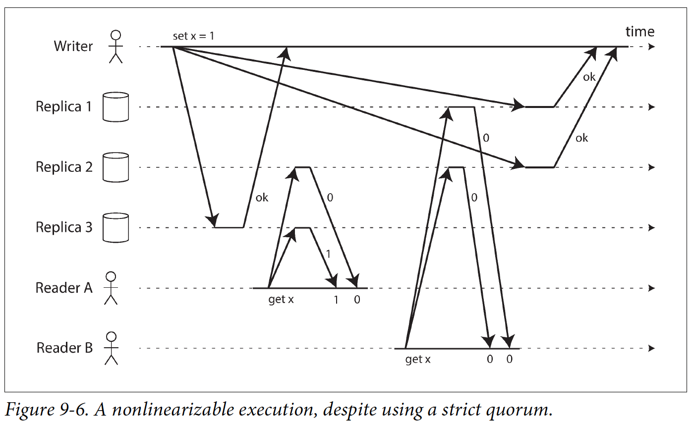
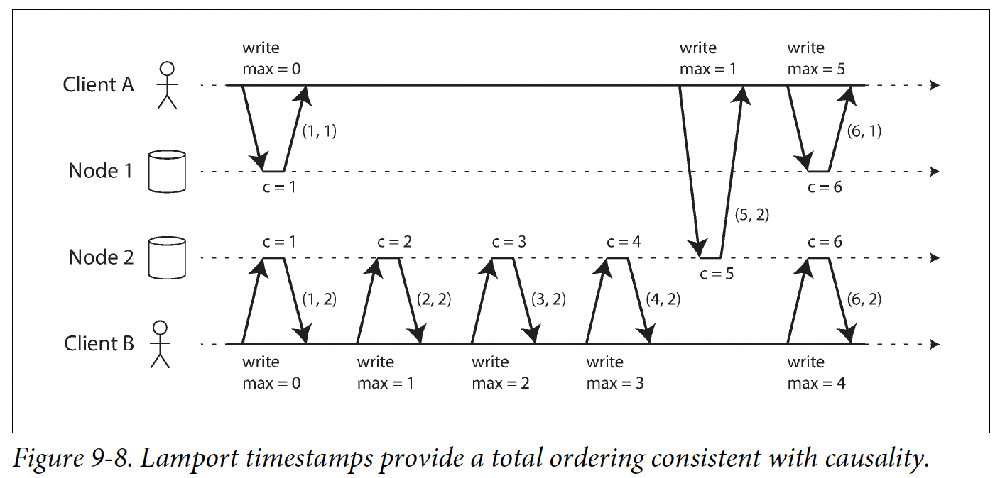

## 9. Consistency & consensus
- Aim: seek abstractions that can allow app to ignore some problems of distributed systems
### 9.1. Linearizability (strongest consistency model)
- Make a system appear as if:
  - There were only 1 copy of the data
  - All operations on it are atomic
- Cross-channel timing dependency: not allow to read an old value after other client has read a new value
- Linearizable systems:
  - Single-leader replication: with sync write or read from leader
  - System with consensus algorithms
- Not linearizable systems:
  - Multi-leader replication: no single copy of data
  - Leaderless replication: can't solve cross-channel timing dependency even with strict quorum:
    - 
- CAP: choose either consistency or availability when partitioned 
- -> Old theorem, not practical because it ignores other faults
- Cost of linearizability: performance
### 9.2. Ordering guarantees
- Ordering preserves causality
- Linearizability (total order - all operations are ordered) > causal consistency
- Causal consistency: partial order - concurrent operations exist:
strongest consistency model that incurs no performance cost & can be available
- Determine causal dependency: version vector to keep track of prior read -> overhead
#### Sequence number ordering
- Lamport timestamp: pair (counter, node ID):
  - Every node & client keep track of max counter value it has seen so far & update stale current value
  - 
- -> Ensure total ordering but can't detect concurrent operations
- Only work after the fact, not for operation that need immediate result (eg check for unique username to create)
#### Total order broadcast
- 2 safety properties:
  - Reliable delivery: no message lost
  - Total ordered delivery: messages are delivered to all nodes in the same order (fixed at delivered time)
- Implement linearizable storage (compare-and-set operation) using total order broadcast as an append-only log:
  - Append a "set username" mes to the log
  - Read the log, wait for the mes you just append to be delivered back
  - Check for messages contain the same username: if the first mes is your mes -> success 
- -> Not ensure linearizable reads: changes are not immediately visible when reading from a data store updated async with the log
- Ways to implement linearizable reads:
  - Append a dummy mes, read the log & wait -> do the actual read when the mes is delivered back
  - Fetch last mes position, wait until all mes up to that pos is delivered
  - Read from a sync replica
- Implement total order broadcast using linearizable storage (the other way around):
  - Append a linearizable int to order mes
  - If node receive mes n + 2, must wait for n + 1 to arrive
- Make all nodes agree on a linearizable int, even in case of failure -> consensus algo
### 9.3. Distributed transactions & consensus
- Situations when consensus is important:
  - Leader election
  - Atomic commit: either all nodes commit or abort
#### Two-phase commit (2PC)
- Split commit/abort process into 2 phases
- Use a coordinator (transaction manager)
- Steps:
  - App read/write data on multiple nodes
  - App commit -> coordinator send prepare request to each node to check if node can commit
  - Send commit request if all nodes can commit, abort otherwise
- Coordinator write commit/abort decision to disk & retry sending commit/abort request to all nodes until success
- Problem:
  - Coordinator failure: nodes must wait until coordinator recovers 
  - -> Blocking atomic commit protocol
  - Coordinator app become stateful
#### Fault-tolerant consensus
- Decide on a sequence of values
- -> Total order broadcast algo
- Need leader to decide on the order
- 2 voting steps:
  - Decide a leader: use an epoch number, ensure that within each epoch, the leader is unique
  - Leader proposal: must wait for a quorum of nodes to response: leader with the highest epoch win
#### Coordination services
- Design to hold small amount of (not frequently changed) data in memory (disk for persistent),
replicated across all nodes using fault-tolerant total order broadcast algo
- Features:
  - Linearizable atomic operations: need total order broadcast
  - Total ordering of operations: use increasing trans id
  - Failure detection
  - Change notifications
- Usage:
  - Allocate work to nodes
  - Service discovery
  - Membership services
- 1 way of ensuring order: choose leader by consensus algo -> order other operations by writing to the leader
