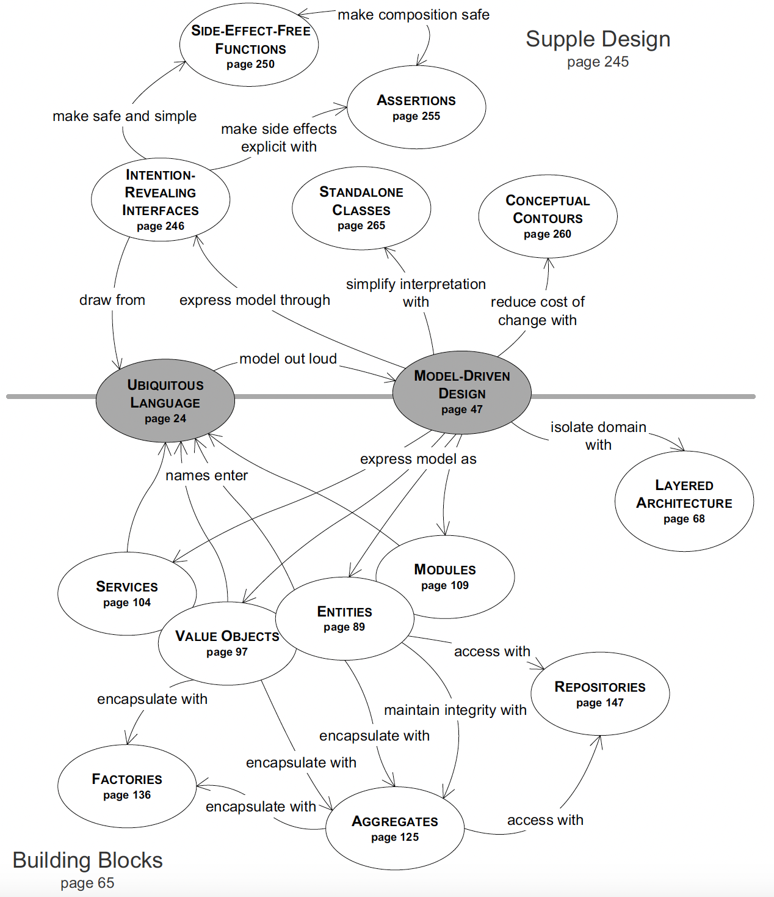
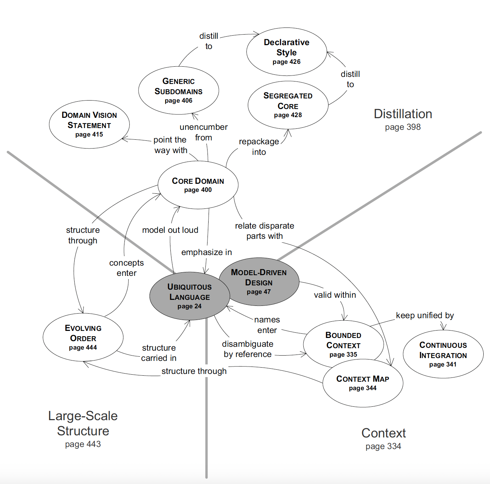

# Domain-Driven Design

## Info
- Type: book
- Author: Eric Evans

## Category
- SE
- Design
- Best practices

## Structure

### Outline
- Part 1:
  - Basic goals of domain-driven development
  - Terms
  - Overview of the implications of using the domain model to drive communication & design
- Part 2: basic building blocks: condensed from a core of best practices in object-oriented domain modeling:
  - Bridge the gap between models & practicals, running software
  - Keep the model & implementation aligned with each other, each reinforcing the other's effectiveness
- Part 3: modeling principles & techniques to be used in:
  - Model discovery process
  - Assembling building blocks into practical models
- Part 4: system principles to deal with situations that arise in:
  - Complex systems
  - Larger orgs
  - Interactions with external/legacy systems

### Detailed structure
- Foreword: Fowler's thoughts about the book:
  - Problem
  - Goals
- Preface:
  - Problem
  - Goal
  - Style
  - Relation between design & dev process
  - Structure
  - Audience
- Part 1: putting the domain model to work:
  - Chap 1: knowledge crunching: model distills business knowledge:
    - Example modeling work & discussion
    - Modeling principles
    - Evolution of model
  - Chap 2: communication and the use of language:
    - Ubi lang: adv, vocab, difficulty, example
    - Document, diagram, code: relation to ubi lang, best practices
    - Explanatory models: def, use case
  - Chap 3: binding model and implementation:
    - Imp of tight association between model and impl
    - Suitable programming paradigm & tools
    - Implication for team's division of responsibility
- Part 2: the building blocks of a model-driven design:
  - Chap 4: isolating the domain:
    - Layered architecture: def, layers, adv
    - Domain layer
    - Smart UI pattern (vs DDD) discussion: use case & disadvs
  - Chap 5: a model expressed in software:
    - Object associations: difficulty, mitigation
    - 3 model elements: def, chars, design:
      - Entity
      - Value object
      - Service
    - Module (package) best practices
    - Modeling paradigms: suitability, use cases: OOP vs others
  - Chap 6: the life cycle of a domain object:
    - Managing complex objects life cycle: challenges & design patterns
    - Aggregate: problem, invariants, impl
    - Factory: goal, design
    - Repository:
      - 3 ways of getting ref to an obj
      - Problem
      - Advs
      - Design
  - Chap 7: using the language: an extended example:
    - Design
    - Scenarios walk through & refactoring
- Part 3: refactoring toward deeper insight:
  - Chap 8: breakthrough:
    - Chars
    - How to approach it
  - Chap 9: making implicit concepts explicit:
    - Goal
    - Where to discover new concepts, with examples
    - Modeling non-obvious concepts, with examples:
      - Constraints
      - Processes
      - Specifications
  - Chap 10: supple design:
    - Problems of bad design
    - -> Advs of supple design
    - Scope of application, iterative process
    - Patterns of supple design, with examples:
      - Intention-revealing interfaces:
        - Side-effect-free functions
        - Assertions
      - Decomposition: conceptual contours, standalone classes, closure of operations
    - Discussion of declarative design tools & DSL
    - Approaches to make big system supple
    - Examples: patterns usage & combination
  - Chap 11: applying analysis patterns:
    - Analysis pattern def
    - Chars
    - Components
    - Example of application in DDD process
    - Advs
    - Best practices
  - Chap 12: relating design patterns to the model:
    - Design vs domain patterns
    - Design patterns usage in DDD
    - Example of application: strategy & composite pattern
  - Chap 13: refactoring toward deeper insight:
    - Process
    - Best practices & experience
- Part 4: strategic design:
  - Chap 14: maintaining model integrity:
    - Model unification: def, risk, process
    - Bounded context: goal, components, motivation, process
    - Patterns to relate 2 models (model context strategies):
      - Shared kernel
      - Customer/supplier
      - Conformist
      - Anti-corruption layer
      - Separate ways
      - Open host service
      - Published language
    - -> Transformation (refactoring)
  - Chap 15: distillation:
    - Distillation: problem, advs, goal
    - Core domain: problem, def, goals, process
    - Distillation techniques:
      - Domain vision statement
      - Highlighted core:
        - Distillation doc
        - Flagged core
      - Generic subdomains
      - Cohesive mechanisms
      - Segregated core
      - Abstract core
  - Chap 16: large-scale structure:
    - Large-scale structure: def, problems, goal, advs, chars, usage, evolution
    - Patterns: problem, def, usage, design:
      - System metaphor
      - Responsibility layers
      - Knowledge level
      - Pluggable component framework
    - Design: restrictiveness, best practices
  - Chap 17: bringing the strategy together:
    - Combinations:
      - Principles
      - LSS & bounded context
      - LSS & distillation
    - Strategic design:
      - Assessment
      - Process
      - Decision-making

## Goals
- Problem: sources of complexity:
  - Technological (eg network, DB)
  - Business domain (most imp)
- -> Advs of a good design: control & exploit complexity
- Premises:
  - For most software projects, the primary focus should be on the domain & domain logic
  - Complex domain designs should be based on a model
- Goals:
  - Provide a framework for making design decisions
  - Provide a technical vocab for discussing domain design, including design practices, techniques & principles

## Style
- Expositional
- Code example: Java, old version
- Author's claim:
  - Contain:
    - Best practices
    - Author's own insights & experiences
  - Design & process are inextricable (how things are done)
  - -> Talk about process when necessary. Oriented towards Agile.
  - -> Use XP as the basis for discussion of the interaction of design & process
  - Discussions are illustrated with realistic examples adapted from actual projects
  - Written as a set of patterns (format see Appendix)
  - Require some knowledge of OO modeling

## Terms (see also Glossary)
- Model: a simplification. An interpretation of reality
that abstracts the aspects relevant to solving the problem at hand and ignores extraneous detail.
- Domain: a subject area to which the user applies the program
- -> Usually have little to do with computers
- Domain model: a rigorously organized and selective abstraction of domain knowledge
- Domain modeling: loosely representing reality to a particular purpose
- Entity: an object defined primarily by its identity (not attributes)
- Value object: an object that represents a descriptive aspect of the domain with no conceptual identity
- Service: an operation offered as an interface that stands alone in the model, without encapsulating state
- Aggregate: a cluster of associated objects treated as a unit for the purpose of data changes
- Factory: a program element whose responsibility is the creation of other objects
- Reconstitution: the creation of an instance from stored data
- Repository: a mechanism for encapsulating storage, retrieval & search behavior which emulates a collection of objects
- Designing (software) vs modeling (domain)
- Breakthrough: an oppo opens up to transform the software into something more expressive and versatile
- -> Can mean new features or the replacement of a big chunk of rigid code with a simple, flexible expression of the model
- Making implicit concepts explicit: represent concepts hinted at discussion or present implicitly in the design
  explicitly in the model with one or more objects or relationships
- Specification: a predicate-like value object that determines if an object does or does not satisfy some criteria
- Analysis patterns: patterns based on accumulated exp solving problems in one/some particular domains
- Model unification: the internal consistency of a model, such that each term is unambiguous and no rules contradict
- Context:
  - Informal: where a model applies (eg a certain part of the code or the work of a particular team)
  - Formal: a set of conditions must apply in order to be able to say that the terms in a model have a specific meaning
- Duplication of concepts: there are 2 model elements (and attendant impls) that actually represent the same concept
- Shared kernel: designate some subset of the domain model that the 2 teams agree to share, including code & DB design
- Core domain: those parts of the model distinctive and central to the purposes of the intended apps
- Generic subdomains: general principles everyone knows or details that belong to supporting specialties
- Large-scale structure (LSS):
  - Informal: a language that lets you discuss and understand the system in broad strokes
  - Formal: a set of high-level concepts or rules or both that establishes a pattern of design for an entire system
- Stratification: division into layers

## Criticism
- Some parts are too abstract. Hard to understand/apply given only 1 example.
- Chap 9: the coordination between specs & repo seems awkward
- Chap 10: conceptual contour explanation is too abstract
- Chap 14: shared kernel pattern seems outdated with the introduction of API

## Takeaway
- Best practices & patterns to organize the codebase for extensibility & maintainability
- Motivations & suggestions for applying model driven design & related patterns
- Opportunities for reflection upon past work & points of improvement
- Intro to fundamental books

## Content

### Summary map
- 

### Graphs
- 
- 

### Foreword
- Problem: main source of complexity in SE is the intricacy of the problem domain
- -> Need a good model with an underlying structure
- Goals:
  - Describe & build a vocab about the art of domain modeling
  - Provide a frame of reference to explain domain modeling activity
  - Teach domain modeling skill
  - Share lessons about domain modeling:
    - Shouldn't separate concepts from implementation
    - Domain models need refinement after a system is released

### Preface
- Rela between design & development process:
  - Process necessary to apply DDD:
    - Iterative development
    - Close rela between devs & domain experts throughout the project's life
  - On XP:
    - Resist upfront design
    - Emphasize communication & ability to change project's course rapidly
  - Design affect Agile process in:
    - Ease of refactoring
    - Easy of communication
- Audiences:
  - Developers of OO software
  - Analysts & relatively technical project managers
- Reading recommendation:
  - Core: intro to part 1, chap 1, 2, 3, 9, 14
  - Advanced topic: part 3, 4
- Imp of adopting DDD for the whole team: better comm, better design & impl, better collaboration with other teams

### Conclusion
- Call for creating tools to facilitate DDD
- Advs of patterns:
  - Offer solutions to known problems
  - -> Facilitate higher level thinking
  - Facilitate comm