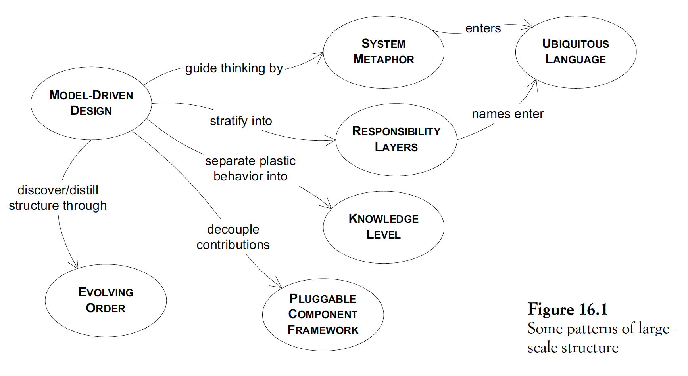
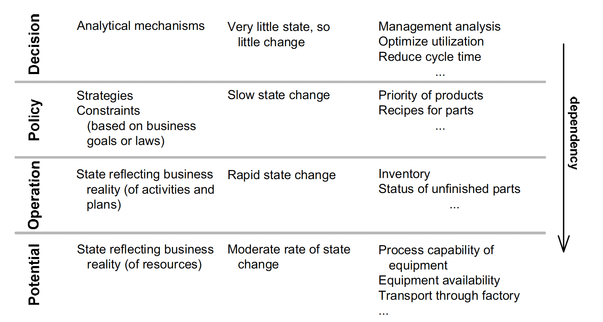
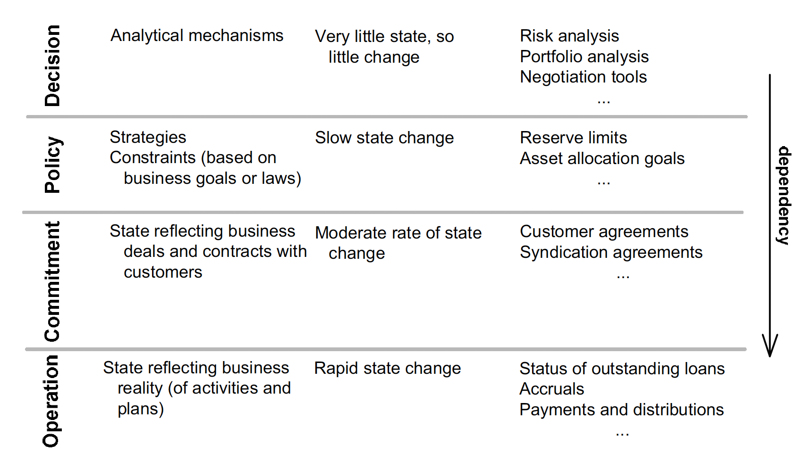

## 16. Large-scale structure
- Problem: too many modules
- Goal: see & understand the system as a whole, including role of individual parts
- Advs: guide design
- Def
- Advs:
  - Guide design
  - Aid understanding
  - Coordinate independent works
- Chars:
  - Usually span several contexts, providing the conceptual organization
  to hold together all the teams & subsystems involved in the project
  - Shape and explain the model & design but do not appear in it
  - -> Shouldn't be presented in UML
- 

### Evolving order (evolution)
- Limitation: rigidity
- When to use:
  - Provide more benefit than cost
  - The system is too complex to be understood after being broken into modules
  - A fitting structure is found
- -> Chars to avoid limitation:
  - Should evolve with the app
  - Should not force unnatural constraints on model development
  - Should allow but have few exceptions
  - -> Otherwise, need to change/discard it
  - Should impose on the whole but leave freedom to individual parts

### Patterns

#### System metaphors
- Def: a concrete analogy to the system
- Usage:
  - Organize design & development
  - Adopt into ubi lang to facilitate comm
- Limitation:
  - Inexact to some extent
  - -> Should continually reexamine it for overextension/inaptness, and be ready to drop it if it gets in the way
  - Hard to find one

#### Responsibility layers
- Layers requirement: dependency directions are one-way
- Process:
  - Identify broad abstract responsibilities of the model as layers
  - Refactor the model so that the responsibilities of each domain object, agg & module
  fit neatly within the respon of 1 layer
- Chars of useful layers:
  - Story telling: reflect the priorities of the business
  - Conceptual dependency:
    - Lower layers concepts can have meaning on their own
    - Upper layers concepts should have meaning against the backdrop of the lower layer
  - Conceptual contours: dif rates of change between layers
- Common layers appearing in many domains:
  - Business based on exploiting large fixed capital assets (eg factories, cargo ships, logistical software):
    - Potential/capability layer: what can be done with existing resources & third-party vendors
    - Operation: what is being done using the resources
    - Decision support: analysis & decision-making, using historical data & info from lower layers
  - Software that enforces elaborate business rules or legal requirements:
  add a policy layer: specifying business rules & goals
  - 
  - For business with less fixed assets (eg financial service, insurance):
    - Can merge operation & potential layer
    - Introduce commitment layer: reflecting agreements with customers/other businesses
  - 
- Design:
  - Should stay within 4-5 layers
  - Should not force designs into layers when it is not natural

#### Knowledge level
- Def: a group of objects that describes how another group of objects should behave
- Problem: allow users to configure the software while still maintaining a set of rules
- Chars:
  - Keep the concerns separate as 2 levels, one very concrete,
  the other reflecting rules and knowledge that a user or superuser is able to customize
  - The restricted edits were in the knowledge level, while the day-to-day edits were in the operational level
  - Dependencies run in both directions between the levels
  - Can coexist with most other large-scale structures
- Limitations:
  - Require configuration skill when the system behavior becomes complex
  - Complication/unexpected behaviors when changing structure in knowledge level
  - -> Lots of foresight needed when designing knowledge level

#### Pluggable component framework
- Problem: high cost of integrating multiple bounded context
- Components:
  - An abstract core of interfaces & interactions
  - Dif impl of those
- -> Can be used by dif clients
- Limitations:
  - Hard to apply, requires:
    - Design skill
    - Deep, mature model
  - Rigidity

### Design
- Dif level of restrictiveness at:
  - LSS patterns
  - Rules of each pattern
- -> Should focus on developer exp: guide toward a good design while retaining flexibility
- General ways of controlling cost & maximizing gain while evolving the structure:
  - Minimalism: keep the structure simple & lightweight: address the most serious concerns
  - Process:
    - The entire team must follow the structure in new development & refactoring
    - -> The structure must be understood by the entire team
    - Terminology & relas must enter ubi lang
    - Restructuring yields supple design as the model improves
    - Distillation lightens the load:
      - Smaller core domain
      - Easy-to-replace supporting components