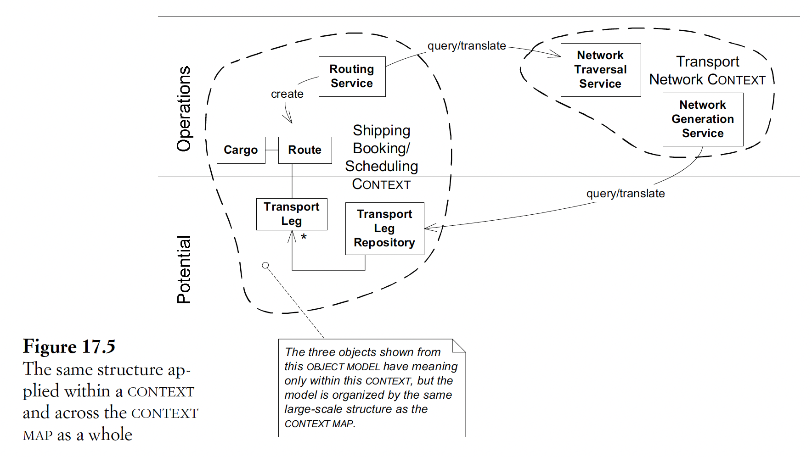

## 17. Bringing the strategy together

### Combinations
- 3 principles of strategic design (context, distillation, LSS) are not substitutes for each other
- -> They are complementary & interact in many ways
- LSS & bounded context
  - LSS can:
    - Exist within 1 bounded context
    - Cut across many of them & organize the context map
  - 
  - Can use dif LSS for dif context, but risk losing significance
- LSS & distillation: LSS roles:
  - Help explain the relas within the core domain & between generic subdomains
  - Can be an imp part of the core domain

### Strategic design
- When tackling strategic design on a project, need to start from a clear assessment of the current situation:
  - Availability of strategic map
  - Dev skills & interests
- 2 suggestions for strategic design process:
  - Emergent structure from app development: decision makers from dev teams
  - -> Can make decisions in each team & joint decisions about cross-team LSS
  - Customer-focused architecture team:
    - With focus on app development (impl)
    - Coordinate & organize LSS & context boundaries
- Essentials of strategic design decision making:
  - Decisions must reach the entire team
  - The decision process must absorb feedback
  - The plan must allow for evolution
  - Architecture & app team must have:
    - Strong designers
    - Devs with good domain knowledge
    - Domain experts with technology understanding
  - -> Avoid overspecialization
  - Strategic design requires minimalism & humility
  - -> Avoid being restrictive
- -> Can be applied to design of technical frameworks