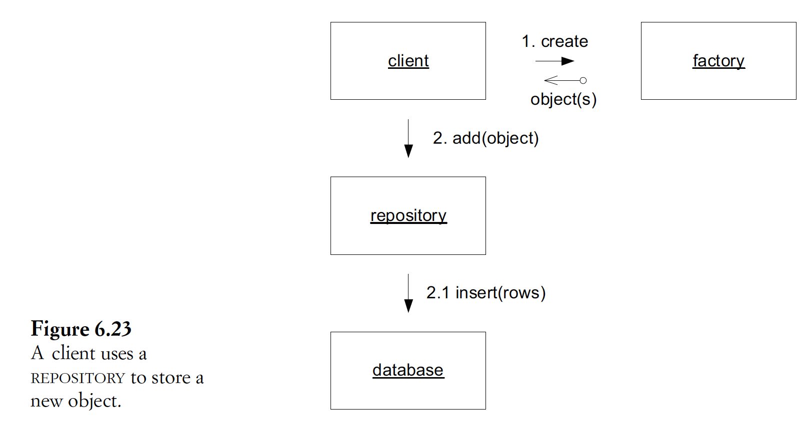
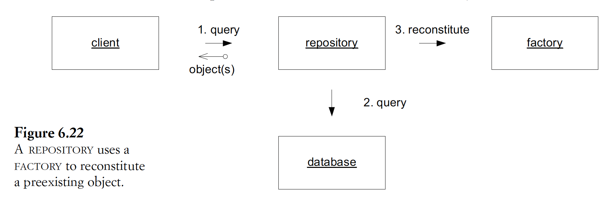

## 6. The life cycle of a domain object
- 2 challenges of managing complex object:
  - Maintaining integrity throughout the life cycle
  - Preventing the model from getting swamped by the complexity of managing the life cycle

### Aggregate
- Problem: complex interconnected objects:
  - Hard to maintain consistency & manage invariants
  - Hard to allow multiple clients to access those objects while using strict locking schemes
  - -> DB lock is technical & adhoc
  - -> Deeper understanding of the domain is required
- Aggregate def
- Goal: encapsulate refs within the model
- Components:
  - Root: a single, specific entity contained in the aggregate
  - Boundary: define what is inside the aggregate, including entities & value objects
- Constraints:
  - Root is the only member of the agg that outside objects are allowed to hold refs to
  - Objects within the boundary may hold refs to each other
  - Other entities:
    - Have local identities & are distinguishable locally
    - Not visible to the outside
  - Objects within the agg can hold refs to other agg roots
  - A delete operation must remove everything within the agg boundary at once
- Invariants:
  - Inside agg must be maintained by the root within a transaction
  - Inter-agg can be less strict (eg eventual consistency)
- Impl:
  - Preferably with the support of a framework
  - Otherwise, must define & enforce explicitly

### Factory
- Goal: isolate complex creation logic (each object is created only once)
- Advs:
  - Object can focus on its meaning & role (mid-life cycle responsibility)
  - Client doesn't have to create the object or know about its internal structure
  - -> Object creation should be responsibility of the domain layer
- Def
- Design:
  - Should return abstract classes, not concrete classes
  - Objects returned should be fully initialized to the correct state, with invariants satisfied
  - Impl patterns: factory method, abstract factory, builder
  - Where to place factory:
    - Factory method in agg root: create inner objects
    - Factory method in an object that is closely involved in spawning other objects
    - Separate factory class: when there is no proper host (host with close natural rela with the product)
  - When to use normal public constructor instead of factory:
    - Simple construction
    - Concrete class used/decided directly by the client
  - Creation interface: atomic
  - Avoid coupling with input param (eg creating with part of the arguments)
  - -> Should pass in closely related abstract object
  - Invariants checking logic:
    - Agg rules: inside factory
    - Other domain objects: within the object
    - Rules applied only in object creation: inside factory
  - Entity factory vs value object factory:
    - Value object factory output: complete, immutable
    - Entity factory output: only the essential within attributes. Details can be added later.
  - Reconstituting stored/network transmitted objects: use a factory designed for reconstitution:
    - Not assigning new ID
    - -> Pass in ID as param
    - Handling invariant violation: must repair the inconsistency
    - -> Can use ORM/parser instead if available
  - Should contain ID generation logic

### Repository
- 3 ways of getting ref to an object:
  - Creation
  - Traversing object association
  - DB query & object reconstitution
- Problem: focusing too much on technical aspect of querying DB
- -> Lose focus on the model, domain rules embedded in query code or lost
- -> Data-processing software
- Reconstitution def
- Functions:
  - Encapsulate underlying DB access logic & object mapping
  - Implement all dif updates/queries/info summary (eg count, sum) required by client
  - -> Act like an in-memory collection of all objects of one type (eg concrete class/abstract super class/interface)
- Advs:
  - Encapsulation -> simplify clients
  - Communicate design decisions about object access
- Design:
  - Provide global object access (ie access to repo) via DB search to agg root only
  - Testing: should fake using an in-memory collection
  - Implement query operation:
    - Hardcoded query
    - Encapsulate query condition in a specification object (eg criteria)
    - -> Declarative, flexible queries
    - -> Still need to support some specialized hardcoded query (eg count)
  - Devs implementing/using repo need to be aware of its usage/implementation
  - -> Avoid potential performance problems
  - Transaction control should be handled by client, where domain logic lies
  - Choose framework that facilitates repo impl. Adapt if needed.
  - Relationship between factory & repo:
    - Object initialization:
    - 
    - Object reconstitution:
    - 
  - Design object for relational DB:
    - Might need to compromise to handle object-relational mismatch or to optimize performance
    - A table row should contain an object, perhaps along with subsidiaries in an agg
    - A foreign key in the table should translate to a ref to another entity object