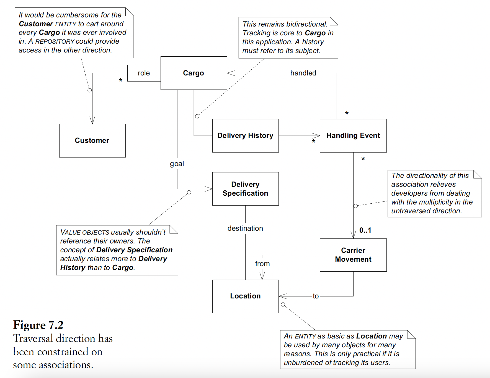
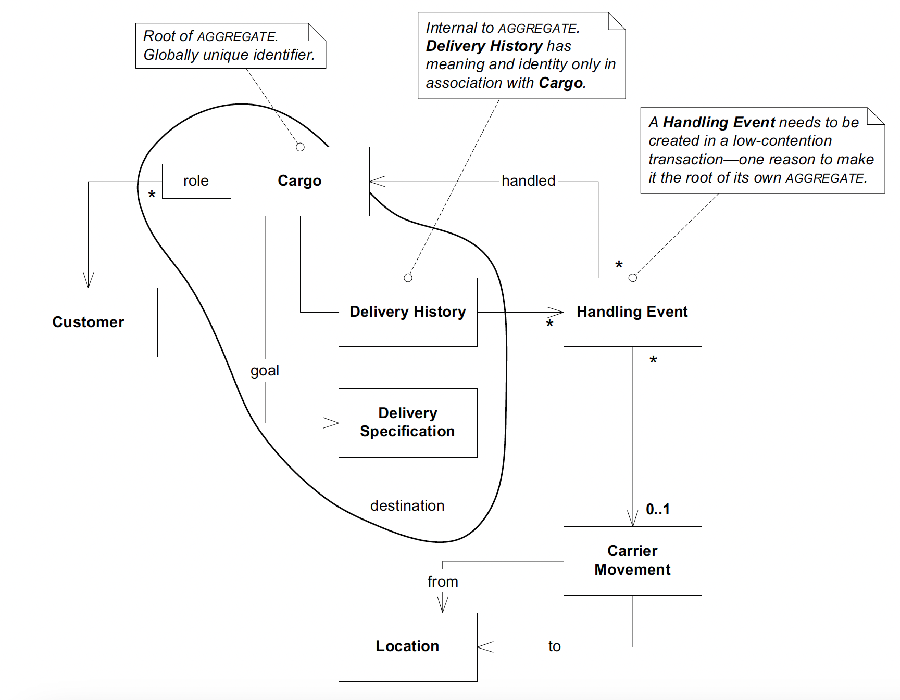
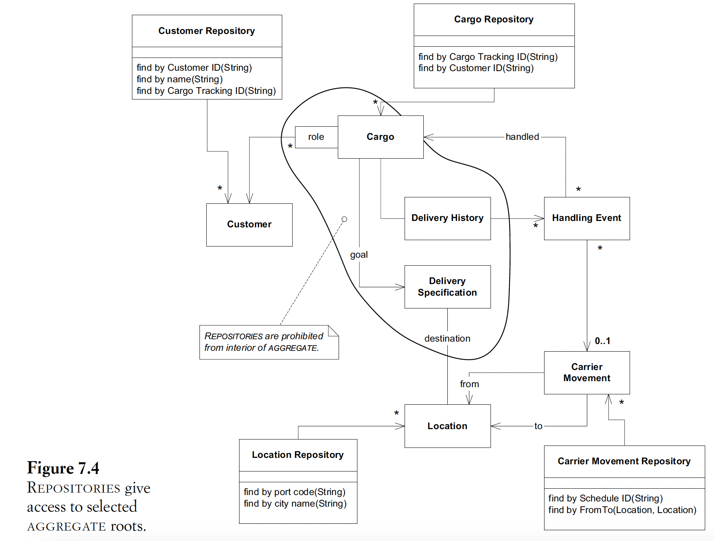
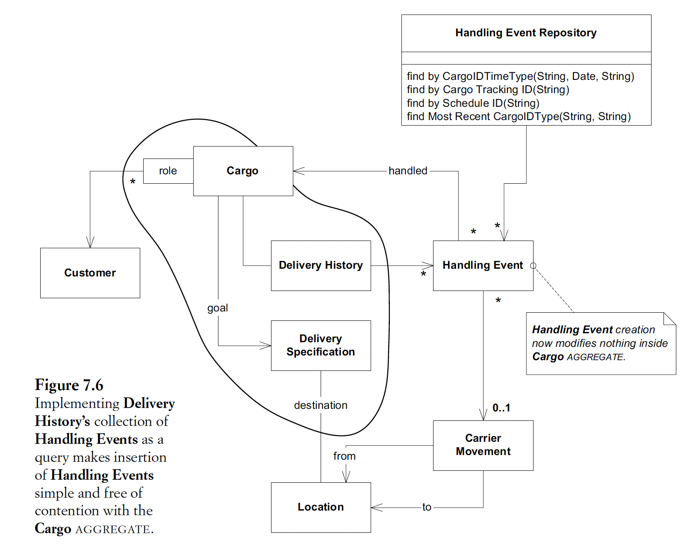

## 7. Using the language: an extended example
- Intro: provide a close-to-real-life example of how to apply & combine the patterns
in the previous 3 chapters to handle requirements
- Normally model refinement, design & implementation should go hand in hand in an iterative development process
- Refine model to:
  - Support design -> support practical impl (chapter's focus)
  - Reflect new domain insight
- Apply layered-architecture:
  - Step 1: app layer: identify user-level app functions
  - Step 2: domain layer:
    - Distinguish entities/value objects in the model
    - Design association: traversal direction
    - Decide which entities need repo: consider user flow in app requirement
    - Use service to encapsulate functions of other systems & specify their responsibilities in our system
    - -> Can have a lower level class to handle communicating with the other program
- 
- 
- 
- Walk through design scenarios to cross-check design decisions
- Considerations for designing one to many association:
  - Frequent update, rare retrieval of the collection: replace collection with a query to avoid contention
  - Infrequent update, frequent retrieval of the collection: use object ref collection
- 
- Model partitioning: look for the cohesive concepts
& focusing on what we want to comm to others on the project using ubi lang
- Enterprise segment as a pattern to encapsulate type information
- -> Should be derived by the domain layer, not the app layer

### Additional info
- Delivery specification in shipping domain: advs:
  - Separation of concerns: cargo object & spec object
  - -> Easier to change
  - Encapsulation: easier to reason about the model
- 