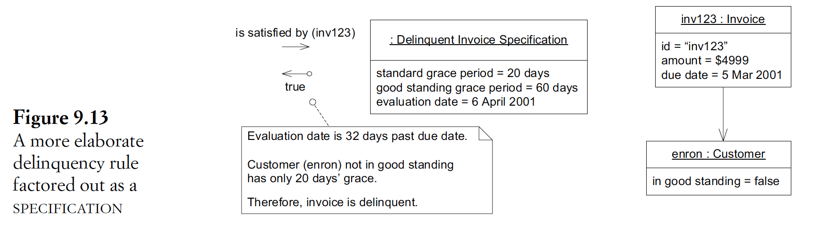

## 9. Making implicit concepts explicit
- Def
- -> Transform the model, facilitate refinement into a deeper model

### Where to discover new concepts
- Language of domain experts: not simple as "nouns are objects" notion
- -> Need to follow up with conversation and knowledge crunching to carve out a clean, useful concept
- Awkwardness/complication in the design
- -> Engage the domain experts to search/invent the missing concept
- Contradictions in statements of experts
- Reading books/literature/SE books written by devs with domain experience
- -> Coherent, considered view
- -> Need to distill relevant parts & integrate into OO design
- Need repeated trials & errors to gain exp & refine ideas

### 3 non-obvious (ie not nouns and verbs) categories of concepts
- Constraints: make explicit by:
  - Refactor into its own method
  - Explicit object/set of objects. When:
    - Separation of responsibility: host object doesn't need to access unrelated data
    - Reuse between dif objects
    - Make the constraint explicit in the code & design
- Processes:
  - Distinguish between process & procedure:
    - Process: have business meaning, mentioned by domain experts
    - -> Need to make explicit
    - Procedure: computer program mechanism
    - -> Should be encapsulated in objects
  - Make process explicit by:
    - Encapsulate in a Service
    - Make the algo itself, or some key part of it, an object in its own right
    when there is more than one way to carry out a process
- Specifications:
  - Def
  - Problem: which class/layer should own/implement complex rules
  - Design:
    - Simple rule: simple test
    - Complex rule: combination of specs (~ combination of logical operations)
    - Construction: can use a factory to configure a spec using info from other sources (eg an object, DB, config)
    - 
  - Need to apply the pattern appropriately in the code, not only in the design
  - Specs use cases:
    - Validation: whether an object satisfies some criteria
    - Selection from a collection. Difficulty: integrate with DB query (see p.232 for some example solutions).
    - Object creation: specify the criteria (~options)

### Additional info
- Use dummy prototype of a key component to facilitate early integration & feedback