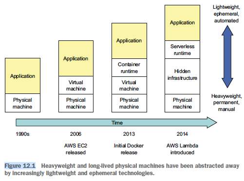
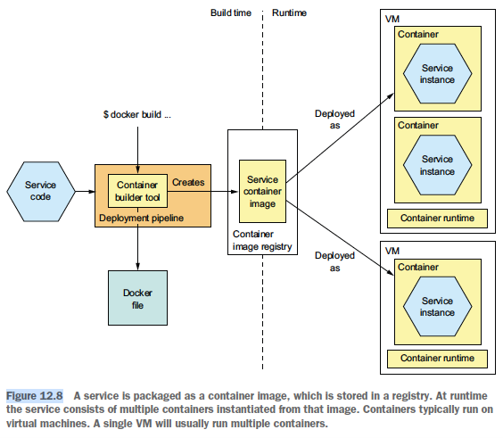
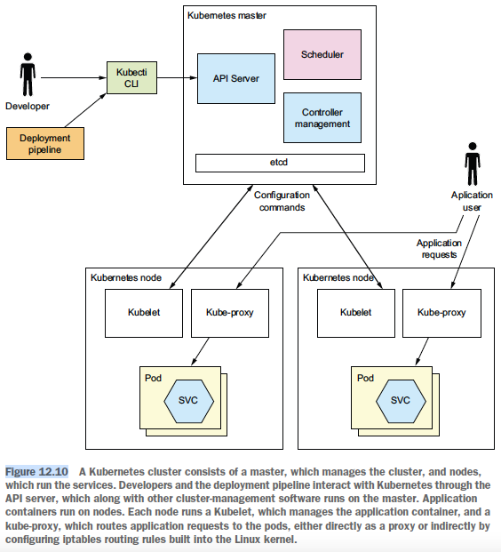
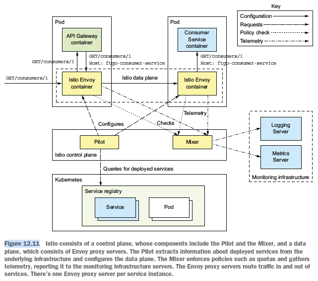

## 12. Deploying microservices
### Deployment overview
- History:
  - Evolution of deployment architecture:
    - 
  - Evolution of deployment process:
    - Devs give app & operating instructions to operations
    - -> DevOps: dev team is also responsible for deployment:
      - Operation team provide console for dev to deploy code
      - -> Deployment pipeline: test & deploy
- Big app contain hundreds of microservices -> can't hand config servers & services
- -> Need highly automated deployment process & infra to scale
- 4 main functions of a production env:
  - Service management interface:
    - Enable devs to create, update & config services
    - Ideally a REST API invoked by command-line & GUI deployment tools
  - Runtime service management: ensure that the desired number of service instances is running at all time
  - Monitoring (aka observability):
    - Provide devs with insight into what their services are doing, including log files & metrics
    - Alert devs if there is problem
  - Request routing: route user requests to the services
- How to prevent bugs in new deployment from affecting users: separate deployment from release:
  - Use service mesh feature: rule-based load balancing & traffic routing
  - -> Can safely run multiple versions of the services simultaneously
  - Steps:
    - Deploy new version into production without routing any end-user requests to it
    - Test it in production
    - Incrementally release the new version until it handles all the production traffic
    - Rollback to the old version if there is an issue at any point
    - Delete the old version when confident that the new version is working correctly
### 4 deployment patterns
#### Deploy service as a language-specific package
- Steps:
  - Install the necessary runtime in the machine (eg JDK, Node)
  - Copy the package to the machine & start the service
- Pipeline:
  - Build an executable
  - Invoke the production env's service management interface to deploy the new version
- Can deploy multiple service instances on the same machine
- Advs:
  - Fast deployment:
    - Package transferred over the network is small
    - Start time is low
  - Efficient resource utilization if allocate properly
- Disadvs:
  - Lack of encapsulation of the tech stack:
    operation team must know the details of how to deploy each service (eg languages, frameworks, runtime versions)
  - -> Increase risk of error during deployment
  - Lack of isolation of the service instance: can consume all resources of the machine
  - Difficult to allocate instances to machines to utilize it efficiently
#### Deploy service as a virtual machine
- Services are packaged as VM images & deployed. Each instance is a VM.
- Pipeline:
  - Build VM image:
    - Content: service's code & required runtime software
    - Config the VM image machine to run the app when the VM boots
  - Deploy the VM image to machine
- Advs:
  - Encapsulate technology stack: in the VM
  - Isolate service instance
  - Use mature cloud infra, which supports:
    - Resource allocation
    - Load balancing
    - Autoscaling
  - -> Easier to deploy small, simple app using VM than using Docker orchestration framework (need lots of set up)
- Disadvs:
  - Less efficient resource utilization:
    - Overhead of the VM, including its operating system
    - Limited choice of VM sizes -> underutilized VM
  - Slow deployment: cost lots of time to:
    - Build VM image
    - Transfer it over the network
    - Start the VM
  - System administration overhead: patch the operating system & runtime
#### Deploy service as a container
- Services are packaged as container images & deployed. Each instance is a container.
- 
- Pipeline:
  - Build image: use container image-building tool:
    - Create image using service code & image description
    - Store image in a registry
  - Deploy: pull image from the registry & create container
- Advs: same as VM, but faster deployment
- Disadv: operational complexity:
  - Administer the container images
  - Patch operating system & runtime
  - Administer the container infra & possibly VM infra the container runs on
#### Deploy serverless service
- Use a serverless deployment mechanism provided by a public cloud
- Advs:
  - Integrated with the cloud's services
  - Remove many system administration tasks
  - Elastic
  - Usage-based pricing
- Disadvs:
  - Long-tail latency: due to elasticity, it takes time for the cloud to provision & start an instance of the service
  - -> Not suitable for latency-sensitive services
  - Limited event/request-based programming model: not suitable for long-running services (eg message consumer)
- Should consider whether this option meets the service requirements before consider other deployment patterns
### Technologies
- Docker (containerization tech):
  - Dockerfile:
    - Describes how to build a Docker container image
    - Specify:
      - Base container image
      - Instructions for installing software & config the container
      - Shell command to run when the container is created
  - Steps to push an image into the registry:
    - Tag the image using `docker tag` command: using registry address & service version
    - Push the image using `docker push` command
  - Steps to run a container (`docker run` command):
    - Container infra pulls the image from the registry
    - Container infra creates containers from the image
  - `docker run` arguments:
    - Image name
    - Port mapping
    - Env variables
- Kubernetes (Docker orchestration framework):
  - 3 main functions of Docker orchestration framework:
    - Resource management: treat a cluster of machines as a pool of CPU, memory & storage volumes,
    turning it into a single machine
    - Scheduling: select the machine to run a container
    - Service management:
      - Ensure that the desired number of healthy instances is running at all times
      - Load balance request across the instances
      - Perform rolling upgrades of services & allow to roll back the upgrades
  - Key concepts:
    - Pod: Kubernetes's unit of deployment,
    consists of a set of containers (usually 1) that share an IP address & storage volumes:
      - Can contain one or more sidecar containers which implement supporting functions
      - Ephemeral
    - Deployment:
      - Def: a controller that ensures the desired number of instances of the pod (service instances) are running at all time
      - Support versioning with rolling upgrades & rollbacks
      - Declared in YAML file, specifying configs of a pod
    - Service: a form of infra-provided service discovery:
      - Has an IP address & a DNS name that resolves to that IP address. Both are only accessible within Kubernetes.
      - Function: provide clients of a service with a static/stable network location
    - ConfigMap:
      - A named collection of name-value pairs that defines the external config for one or more app services
      - Definition of a pod's container can reference a ConfigMap to:
        - Define the container's env variables
        - Create config files inside the container
  - Architecture:
    - 
    - Run on a cluster of machines
    - Type of machines:
      - Master: manage the cluster. Components in master:
        - API server: REST API for deploying & managing services (eg called by kubectl command-line interface)
        - Etcd: key-value NoSQL DB storing the cluster data
        - Scheduler: select a node to run a pod
        - Controller manager: run the controllers, which ensure that the state of the cluster matches the intended state
      - Node: worker that runs one or more pods. Components in node:
        - Kubelet: create & manage the pods running on the node
        - Kube-proxy: manage networking, including load balancing across pods
        - Pods
  - Deployment steps:
    - Define deployment in a YAML file
    - Create or update the deployment by using the `kubectl apply` command
    - -> Result: running pods with dynamic address
    - Define service in a YAML file
    - Create service using `kubectl apply` command
    - -> Result: service with a stable address, accessible inside the cluster
  - 2 ways to make service accessible from outside the cluster:
    - Use NodePort service: accessible via a cluster-wide port on all the nodes in the cluster
    - -> Use load balancer to balance requests from the Internet across the all the nodes
    - Use LoadBalancer service: automatically config a cloud-specific load balancer
    - -> Less config needed but less control over the load balancer config
  - Upgrade running service steps:
    - Build a new container image (tagged with a dif version tag) & push it to the registry
    - Edit Deployment YAML file to refer to the new image
    - Update the deployment using `kubectl apply` command
  - -> Result: Kubernetes will perform a rolling upgrade of the pods
  - Handle issues occur during upgrade: either:
    - Fix the YAML file & rerun `kubectl apply` to update the deployment
    - Rollback using `kubetcl rollout undo deployment <service name>` command
- Istio (service mesh):
  - Architecture:
    - 
    - *Note*: typo in Key box: req - straight line, config: -- line
  - Concepts:
    - Istio Envoy proxy:
      - Def: a modified version of Envoy: high-performance proxy that supports a variety of protocols
      - Support robust interservice communication using such as circuit breaker, rate limiting, automatic retries
      - Used by Istio as a sidecar:
        - When used with Kubernetes: run in a container within the service's pod
        - When used in other env without the pod concept: run in the same container as the service
    - DestinationRule:
      - Basically a wrapper around *service* definition, map subset to deployment's label
      - Define one or more *subsets* of pods for a service (usually service versions)
      - Can also define traffic policies (eg load-balancing algo)
    - VirtualService: define how to route requests for one or more hostnames
    (eg load balancing weight for each destination rule's subset)
  - Deployment steps:
    - Create routing rules to route to the v1
    - Deploy with Istio
    - Route test traffic to v2 by modifying rules in VirtualService. Can route by:
      - Request header
      - Weight
    - Route production traffic to v2
    - Delete v1 deployment (eg by running `kubetcl delete deploy <name>` command)
- AWS lambda:
  - Service development:
    - Must use a dif programming model
    - Code & packaging depend on the programming language
  - 4 ways to invoke:
    - HTTP requests: config AWS API gateway to route HTTP requests to the lambda function
    - Events generated by AWS services
    - Scheduled invocations: use Linux cron-like schedule
    - Direct API calls in other services (HTTP req/res)
  - Serverless: serverless deployment framework, supports many platforms
  - -> Can be used to make lambda function deployment easier
  - Deployment steps using Serverless:
    - Write serverless.yml file to define:
      - The lambda functions
      - Their RESTful endpoints
    - Deploy the lambda functions using `serverless deploy`
    - Create & config an API gateway to route requests to them
  - Update steps using Serverless:
    - Rebuild the lambda function's package
    - Rerun `serverless deploy`