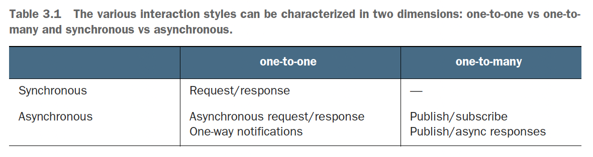
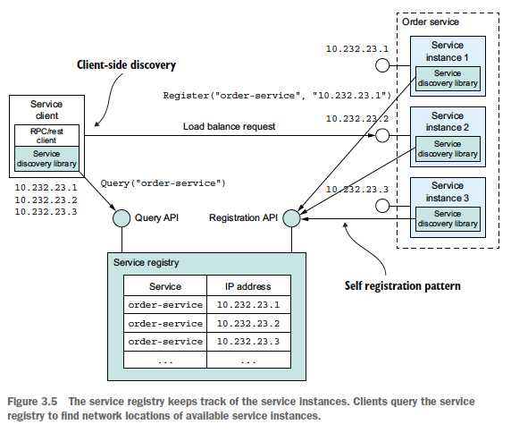
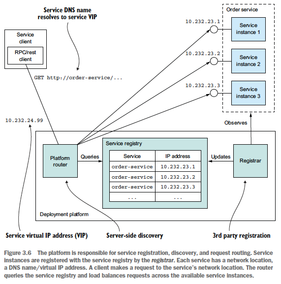
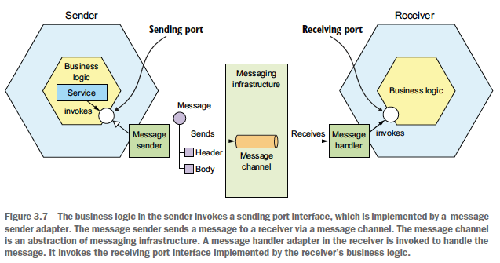
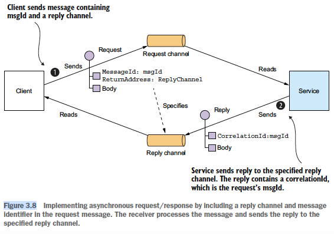
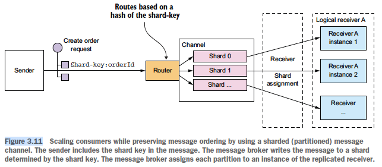
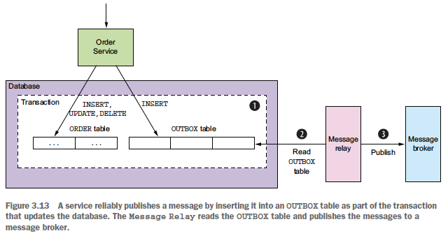

## 3. Interprocess communication in a microservice architecture
### IPC design issues
- Interaction styles:
  - 
  - Mostly not related to IPC techs (eg can use messaging for req/res style by blocking waiting for a res)
- API definition: API-first design:
  - Steps:
    - Write interface definition
    - Review it with client devs
  - -> Only implement the service after that
- Evolve API:
  - Use semantic versioning
  - Strive to make backward-compatible changes:
    - Add optional attributes to the request. Provide default values for missing attributes.
    - Add attributes to a response. Clients should ignore extra response attributes.
    - Add new operations
  - For major, breaking changes:
    - Embed the major version number in the URL (eg /v2/...)
    - Support old versions by putting version-translating logic in the service's *API adapter*
- Messaging formats:
  - Use cross-language message format
  - Types:
    - Text-based (eg JSON, XML):
      - Advs:
        - Readable by human
        - Self-describing
      - Disadv: big & costly-to-parse message
    - Binary: advs & disadvs: reverse of text-based. Additional advs:
      - Enforce API-first design
      - Can be statically checked in compiling languages
### Remote procedure call communication
- Characteristic: client assumes the res will arrive in a timely fashion
- Advs:
  - Familiar & easy to test
  - Simple architecture
- Disadvs:
  - Reduced availability
  - Clients need to know location of the service -> need service discovery
- Design issues:
  - Handle partial failure & protect caller:
    - Develop robust RPC proxies using:
      - Request timeout
      - Limit number of outstanding requests from a client to a service
      - Circuit breaker
    - Recover from an unavailable service:
      - Return error to client
      - Return a fallback value
      - Return cached data or omit the field from the response
  - Service discovery:
    - Why service discovery is needed: in modern, cloud-based microservice app:
      - Service instance have dynamically assigned network locations
      - Set of service instances changes dynamically because of autoscaling, failures & upgrades
    - Mechanism:
      - When service instances start and stop: update the *service registry*
      - When a client invokes a service:
      query the service registry to obtain a list of available service instances & routes the request to one of them
    - 2 types:
      - Application-level service discovery:
        - 
        - Need health check mechanism
        - Client can cache service instances to improve performance
        - Adv: can handle scenario when services are deployed on multiple deployment platforms
        - Disadvs:
          - Need service discovery lib for every language/framework
          - Need to set up & manage the service registry
      - Platform-provided service discovery:
        - 
        - Adv: all aspects of service discovery are handled by the deployment platform
        - -> Service discovery is available to all services and clients regardless of their language/framework
        - Disadv: only support discovery of services that have been deployed using the platform
### Async messaging communication
- 
- 2 types of channels:
  - Point to point: 1 message consumed by only 1 of the consumers (eg same consumer group in Kafka)
  - Publish-subscribe
- Use messaging to implement dif interaction styles:
  - Req/res & req/async res:
    - 
    - For sync req/res, client blocks until it receives the response
  - One-way noti & publish/subscribe: supported by messaging infra
  - Publish/async responses: similar to async req/res. Client gather responses with matching correlation ID.
- API definition:
  - Async operations API:
    - Req/async res:
      - Service's command mes channel
      - Types & formats of command message
      - Types & format of reply message
    - One-way noti:
      - Service's command mes channel
      - Types & formats of command message
  - Published events API:
    - Event channel
    - Types & formats of event messages
- 2 types of architecture:
  - Broker-less: direct communication, client doesn't wait for response:
    - Advs:
      - Of direct communication
      - No disadv of centralized broker
    - Disadvs:
      - Same as RPC
      - Hard to implement mechanisms such as guarantee delivery
  - Broker-based: use a message broker:
    - Main consideration when choosing message broker: message ordering & scalability
    - Advs:
      - Loose coupling: publishers don't need to be aware of consumers -> no need for service discovery
      - Message buffering -> increased availability
      - Allow 1 to many
    - Disadvs:
      - Potential performance bottleneck/single point of failure
      - Additional operational complexity
- Design issues:
  - Competing receivers & message ordering:
    - How to scale out receivers while preserving message ordering
    - How to process message concurrently in each consumer
  - -> Solution: sharded (partitioned) channels:
    - 
    - Related messages -> same partition (eg partitioned by key)
    - 1 partition : 1 consumer instance
  - -> Same approach can be applied to multi threading handlers in each service
  - Handle duplicate messages:
    - Most mes broker deliver at least once
    - Duplicate example: crash before ack-ing
    - Solutions:
      - Write idempotent message handlers. Requirements:
        - Logic can be called multiple times with no additional effect
        - Message broker preserves ordering when redelivering messages
      - Track messages & discard duplicates:
        - Store processed message ids in dedicated table
        - Store processed message in app table (eg when using NoSQL DB with limited transaction model)
  - Transactional messaging:
    - Use distributed trans spanning the DB & the broker
    - -> Problem: many modern brokers don't support distributed trans
    - Use *transactional outbox pattern*:
      - 
      - Publish message using *Polling publisher* or *Transaction log tailing* pattern
  - Choose lib:
    - Use broker's client lib: require effort to implement high level mechanisms
    - -> Should use higher level library/framework that support higher level interaction styles
- How to replace sync interaction to improve availability:
  - Use async interaction styles
  - -> Disadv: services often have external API that uses sync protocol (eg REST) -> must respond immediately
  - Replicate data:
    - Mechanism:
      - Maintain a replica of the needed data when processing requests
      - Subscribe to events published by data owner to keep the replica up to date
    - Disadv: might require replication of large amount of data
  - Finish processing after returning a response:
    - Mechanism:
      - Respond to client immediately (eg in PENDING state)
      - Send CONFIRMED state later
    - Disadv: require corresponding client flow/logic
### Additional info
- Factors to consider when choosing message broker:
  - Supported programming language
  - Supported messaging standard (eg AMQP, STOMP)
  - Message ordering
  - Delivery guarantees
  - Persistence
  - Durability: disconnected consumer can receive prev messages after reconnecting
  - Scalability
  - Latency
  - Competing consumers