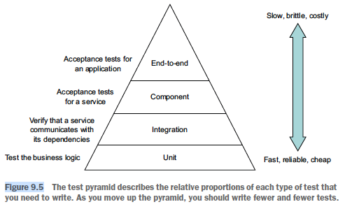
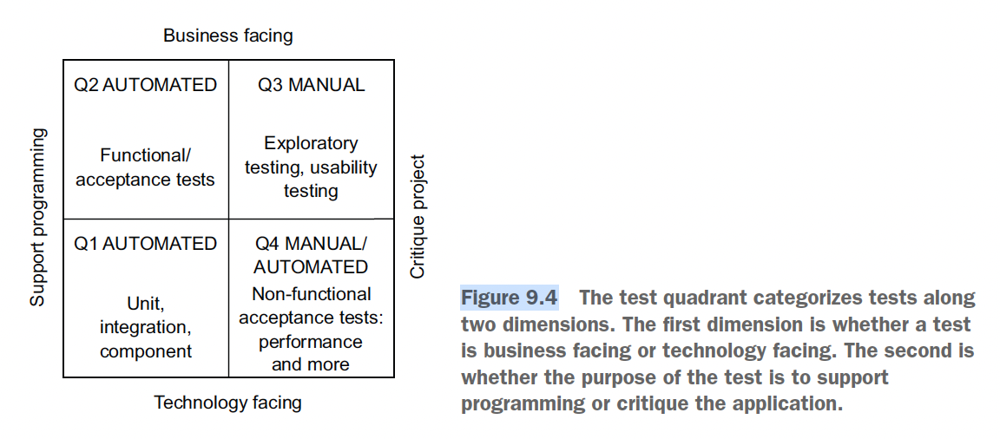
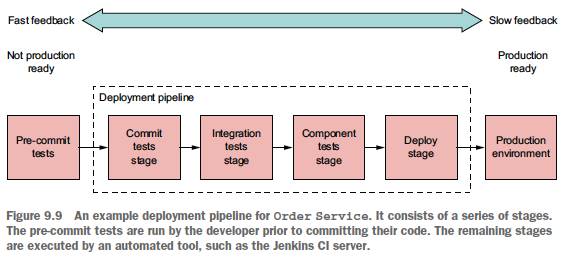

## 9. Testing microservices: Part 1
### Automated testing vs manual testing
- Disadvs of manual testing:
  - Inefficient: human limit
  - Done too late in the delivery process
- Advs of automated testing:
  - Deliver software quickly and reliably: from code to production
  - Force you to develop a testable application: difficult to introduce auto testing into an already large app
- Problems:
  - How to write fast-running tests?
  - Are they sufficient or more comprehensive tests are needed?
### Testing microservices overview
- 4 phases of an automated test:
  - Setup: initialize the SUT & its dependencies to the desired initial state
  - Execute: invoke the SUT
  - Verify: make assertions about the invocation's outcome and the state of the SUT
  - Teardown: clean up the SUT & its dependencies if needed (eg rollback DB changes)
- -> Can reuse setup & teardown methods to avoid code duplication
- Test double:
  - Goal: to test an SUT in isolation -> faster test
  - -> Replace the SUT's dependencies with test doubles
  - 2 types (the terms are usually used interchangeably):
    - Stub: return value to the SUT
    - Mock: verify that the SUT correctly invoke a dependency. Often also a stub.
- 4 types of tests:
  - Unit test: test a small part of a service (eg a class)
  - Integration test: verify that a service can interact with infrastructure services (eg DB, other services)
  - Component tests: verify the behavior of a service in isolation
  - End-to-end tests: verify the behavior of the entire app
- -> Testing strat: write more small tests:
  - 
- Categorize test using test quadrant:
  - 
- Test driven way to fix bug: write a test that reproduces the bug and write code that fixes it
- Deployment pipeline:
  - 
  - Test stages in deployment pipeline:
    - Pre-commit: run unit tests
    - Commit: compile service, run unit tests, perform static code analysis
    - Integration: run integration tests
    - Component: run component tests
    - Deploy: deploy into production
  - Can have a manual testing stage: testers to promote to the next stage
### Unit tests
- 2 types of unit tests:
  - Solitary: test a class in isolation using mock objects for the class's dependencies
  - Sociable: test a class and its dependencies
- Entity & value object test: logic only
- Saga test:
  - Setup: mock classes interacting with DB & message broker
  - Execute: create saga
  - Verify: the saga sends the expected sequence of messages to the saga participant for both happy & failure paths
- Domain service test:
  - Setup: mock service's dependencies
  - Execute: invoke service method
  - Verify:
    - The value returned by the service method is correct
    - The dependencies have been invoked correctly
- HTTP request handler test:
  - Setup: mock services & repositories
  - Execute: use mock MVC testing framework to send mock HTTP request to the handler
  - Verify: the response
- Event & message handler test:
  - Setup: mock service & messaging infra
  - Execute: send a message to a channel
  - Verify: the service mock is invoked correctly