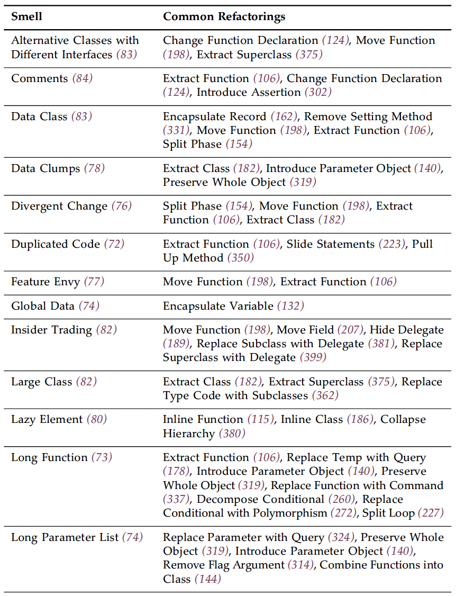
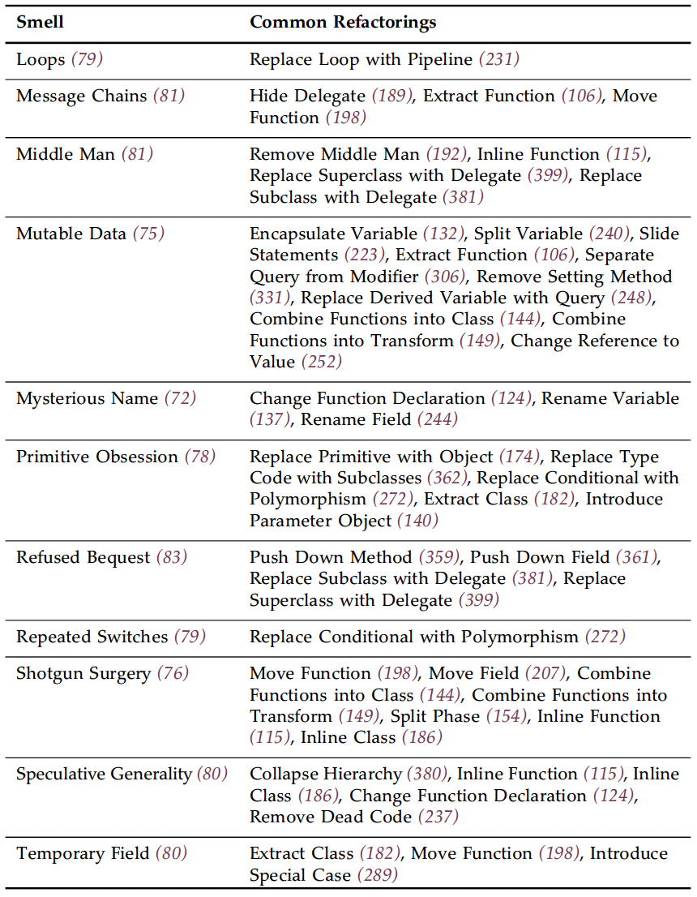

# Refactoring

## Info
- Type: book
- Author: Martin Fowler

## Category
- SE
- Design

## Sharing agenda
1. An objective summary of the book
2. My opinions
3. Demo some Golang automated refactoring features of IntelliJ

## Structure
- Chap 1: an example
- Chap 2: principles, defs, reasons, challenges
- Chap 3: code smells & how to clean up
- Chap 4: testing: imp to refactoring & best practices
- The rest: catalog of refactorings

## Goal
- Refactoring method:
  - Avoid bugs
  - Controlled, efficient refactoring
- -> Usage: development, design, mentoring

## Theme
- Encapsulate mutable data
- Improve understanding of the software overtime -> refactor continuously

## Takeaway
- Refactoring principles
- Catalog of refactorings

## Content

### Overview
- Refactoring definitions:
  - Def 1: a continuous process of:
    - Maintain external behavior
    - Improve design/internal structure
  - Def 2: a refactoring technique
- 2 steps of refactoring:
  - Identify target (via Code smells)
  - Transform code (via Refactoring catalog)
- Goals:
  - Improve internal design:
    - Remove duplication
    - Increase modularity
  - Better understandability
  - -> Avoid & find bugs
- -> Modifiable code = good code
- -> Speed up development
- 2 coding activities (MECE, switch frequently):
  - Add functionality -> add tests
  - Refactor: only add tests when changing interface

### Principles
- Small steps
- Run tests after each step
- -> Find & fix issue quickly

### When to refactor
- Opportunistic:
  - Preparatory: before adding new feature/bug fix
  - -> Make code easier to change
  - Comprehension: when trying to understand code
  - -> Side effect: provide new design insights
  - Litter-pickup (variation of comprehension): for small, easy change
  - -> Do big changes as separate tasks
  - During code review:
    - Should be done while pair-programming
    - Process: ideas `<->` refactor to test ideas -> make suggestions
    - -> Adv: implemented suggestions
- Long-term, planned refactoring:
  - Avoid all-in refactoring
  - Team to agree on the change direction -> refactor when work on refactoring zone
- When not to refactor:
  - Modification not needed
  - Ugly code encapsulated as API
  - Rewrite is easier: need judgement, might try to refactor first

### Problems & tradeoffs
- Slow down development:
  - Pain of ugly code vs effort
  - Long term vs short term velocity
- Lack of ownership of client code & backward compatibility
- -> Shared ownership, cross-team contribution
- DB change: need to handle backward compatibility
- Need comprehensive, fast tests:
  - Lack of tests -> automated refactoring by tools
  - TDD
- Legacy systems:
  - Not designed for tests -> can't add tests
  - -> Try to refactor to add tests: difficult
  - -> (Another strategy - my own opinion): cover by higher level tests
  - Lack of tests (see above)
- Feature branch & complicated merges
- -> CI & trunk-based development (also supported by TDD)

### Implications
- Code design:
  - Design for current needs -> no speculative flexibility
  - Add flexibility only for ease of later refactoring
- Process: agile:
  - TDD: tests, embrace refactoring
  - CI
- Automated refactoring:
  - Easier with:
    - IDE
    - Static typing
    - Language server
  - Leverage syntax tree
- Performance: 3 approaches:
  - Time budgeting: for hard real-time systems
  - Constant attention:
    - Code hard to work with
    - Not coordinated
    - Not work/justified
  - Well-factored code, ignore performance: slower but easy to isolate hotspot & to tame
  - -> Deliberate performance optimization: run profiler, fix hotspot, verify
  - -> Justified by data

### Code smells
- Def: indicators for refactoring
- -> Need to decide when to refactor
- Quick intro: chap 3
- Details of techniques: chap 5-12
- Summary: smells & refactoring suggestions:
  - 
  - 

### Building tests
- TDD: test-code-refactor cycle
- Lack of tests? -> add tests before refactoring
- Best practices:
  - Focus on where the risk is
  - Avoid duplicated validation, esp in internal modules

### Refactoring catalog
- Criteria to be included in the catalog:
  - Improve general refactoring skills
  - High impact on design of code
  - Not too small/obvious/straightforward
- Refactoring structure:
  - Name & common aliases
  - Sketch = memory-jogger
  - Motivation:
    - Why refactor
    - When shouldn't
  - Mechanics = small steps: also include special cases if any
- [Link to the web catalog](https://refactoring.com/catalog)
- [Basic](https://refactoring.com/catalog/?filter=tags-basic):
  - Extract function -> abstract intention from impl
  - Inline function (merge):
    - Function body as clear as name
    - Group badly extracted functions for later extraction
    - Too much indirection
  - Extract variable:
    - Simplify expression -> easy to debug
  - Inline variable:
    - When name doesn't communicate more than the expression itself
    - Help refactor the neighboring code
  - Change func declaration/signature:
  - Encapsulate var:
    - Move widely accessed mutable data
    - Monitor changes & use of the data
    - Easy to add validation/logic on the update
  - Rename var: for large-scope vars & persistent attributes
  - Introduce parameter object:
    - Make explicit the relationship of the items
    - Potential for abstraction: add behavior to the class/function handling the data
  - Combine functions into class:
    - Encapsulation, explicit grouping
    - -> Potential for extension
  - Combine functions into transform:
    - Group transformation logic
    - Use class for mutable logic, transform for immutable logic
  - Split phase: into sequential steps dealing with different things (eg process input, main processing)
- [Encapsulation](https://refactoring.com/catalog/?filter=tags-encapsulation):
  - Encapsulate record (eg naked mutable struct in JS)
  - Encapsulate collection (modifier methods): return a deep copy of the collection in getter
  - Replace primitive with object:
    - Add new behaviors to data, avoid duplication
  - Replace temp with query (temp = local read-only var):
    - Clarity: function name instead of var name
    - Allow easy function extraction: don't need to pass the var as a param
    - Reuse calculation logic
  - Extract class:
    - Enforce single responsibility
  - Inline class (merge class):
    - Clean up simple class
    - Merge before extraction
  - Hide delegate (see diagram):
    - Avoid propagation of downstream changes to upstream clients
  - Remove middleman (inverse of Hide delegate):
    - When there are too many delegations
  - Substitute algo:
    - Replace with simpler algo
    - Replace with library use
  - -> Decompose first
- [Moving features](https://refactoring.com/catalog/?filter=tags-moving-features):
  - Move function/method (to other class):
    - Group together related elements
    - Hide sub-functions called by the moved function
    - Expose useful sub-functions
  - Move field (to other class)
  - Move statements into function:
    - Remove duplication for statement & function call that always go together
    - -> Inverse: move statements to callers
    - Move varied behavior out
  - Replace inline code with function call:
    - Improve understanding
    - Reuse code (esp library)
  - Slide statements:
    - Group related statements
    - Help with function extraction
  - Split loop:
    - Single responsibility for each loop
    - Help with function extraction
  - Replace loop with pipeline (eg map, filter):
    - Clarity
  - Remove dead code
- [Organizing data](https://refactoring.com/catalog/?filter=tags-organizing-data):
  - Split variable (with dif responsibilities)
  - Renaming field (also getter/setter)
  - Replace derived var with query:
    - Remove easy-to-calculate var
    - -> Avoid coupling mutable derived var with source var
  - Change reference to value (immutability)
  - -> Inverse: change value to ref: when need to update shared data
- [Simplifying conditional logic](https://refactoring.com/catalog/?filter=tags-simplify-conditional-logic):
  - Decompose conditional (ie extract condition & conditional body as function)
  - Consolidate conditional expression (using & or ||):
    - Group related checks for clarity
    - Help extract function of the consolidated expression
  - Replace nested conditional with guard clauses (guard clause = return early for unusual behavior)
  - -> Communicate the core part of a function
  - Replace conditional with polymorphism:
    - Replace type switch with dif classes
    - Introduce base case & variations
  - -> Make the separation more explicit
  - Introduce special cases (as a class-value object):
    - Replace duplicated special-case with simple call
    - Encapsulate special case behavior/data
  - Introduce assertion:
    - Communicate about input assumption
    - Help catch error
- [Refactoring APIs](https://refactoring.com/catalog/?filter=tags-refactoring-apis):
  - Separate query from modifier (side effect)
  - Parameterize function (add param for flexibility)
  - Remove flag argument (ie bool/enum controlling function flow, passed as literal):
    - Simplify understanding & improve ease of use
  - Preserve whole object:
    - Flexible for future change
    - Reduce number of params
  - Replace params with query:
    - Simplify caller
    - Remove dependant, redundant param
  - -> Inverse: Replace query with param:
    - Make the target function independent of the param element
    - Achieve referential transparency: function behaves the same with the same param values
  - Remove setting method:
    - Make a field immutable after construction
  - Replace constructor with factory function:
    - Have a constructor more flexible than the language basics
  - Replace function with command (object with a single command method):
    - Easy to extend capability: inheritance, undo
    - Encapsulate sub-functions, share states with them
  - Replace command with function: for simple command
- [Dealing with inheritance](https://refactoring.com/catalog/?filter=tags-dealing-with-inheritance):
  - Pull up method:
    - Remove duplication
    - Form template method
  - Pull up field:
    - Remove duplication for fields used in a similar way
    - Help move behavior that uses the field to superclass
  - Pull up constructor body
  - Push down method: for methods only relevant to 1 or a few subclasses
  - Push down field
  - Replace type code with subclasses (apply to the class or the type):
    - Help apply Replace conditional with polymorphism
    - Allow extension of specific subclasses
  - -> Inverse: Remove subclass (replace with type field): for subclasses too small to maintain
  - Extract superclass (alt: extract class (strategy pattern)): remove duplication, reuse common behavior
  - Collapse hierarchy: merge subclasses not too different from parent
  - Replace subclass with delegate (strategy pattern):
    - Take adv of *strategy* combination: avoid large amount of subclasses
    - Easy to change parent (not affecting children)
  - Replace superclass with delegate (make superclass a field of subclass):
    - When operations of superclass don't make sense of subclass
    - Follow LISKOV substitution
    - Avoid coupling between 2 classes
  - -> Use inheritance first for simplicity, then refactor later if necessary

## Criticism
- Tests are poorly written
- Extract function as nested one increase variable scope significantly
- Hard to understand the first few chapters without knowing the refactorings
- Mechanism part has too many unnecessary steps
- Approach to performance:
  - Focus on measurement & actual data: agree
  - Not think of performance during coding/design: only work when there are abundant performance tests
  - -> More practical approach: have an understanding of costly operations
  - -> Avoid during the first time writing a piece of code -> don't have to clean up later, esp when issues already built up
- Techniques focus on low (code) level refactoring, not higher level (design, inter-service) refactoring