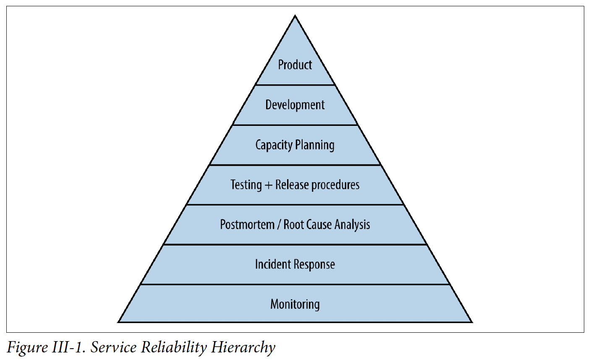

# III - Practices
- Img: bottom: most basic requirements:
  - 

## 10. Practical alerting from time-series data
- Borgmon difference vs Prometheus:
  - Can collect from other Borgmon -> can build hierarchies
  - Internal metrics on the runtime of rules are exported for performance debugging & for monitoring the monitoring
  - Alert: for low QPS API, alert when the total number of errors exceeds 1
  - Alert manager features:
    - Main function: route the alert noti to the correct destination
    - Inhibit certain alerts when others are active
    - Deduplicate alerts from multiple Borgmon that have the same label sets
    - Fan-in or fan-out alerts based on their label sets when multiple alerts with similar label sets fire
- Blackbox monitoring:
  - Disadvs of whitebox:
    - Not aware of what the users see
    - Only see the queries that arrive at the target -> not work when there is network error
  - Collections & alerting functions:
    - Run a protocol check against a target and reports success or failure
    - Send alerts directly to Alertmanager, or its own vars can be collected by a Borgmon
  - Types of validations:
    - Response payload of the protocol
    - Extract & report values as time-series
  - Targets:
    - Frontend domain
    - Behind the load balancer
    - -> Can know if traffic still serve & can isolate failure
- Maintain config:
  - Separately -> can reuse rules
  - Write tests to validate rules behavior
  - Types of lib:
    - Metric export lib
    - Generic aggregation rules for exported vars
- Adv compared to check-and-alert per target:
allow the system being monitored to scale independently of the size of alerting rules