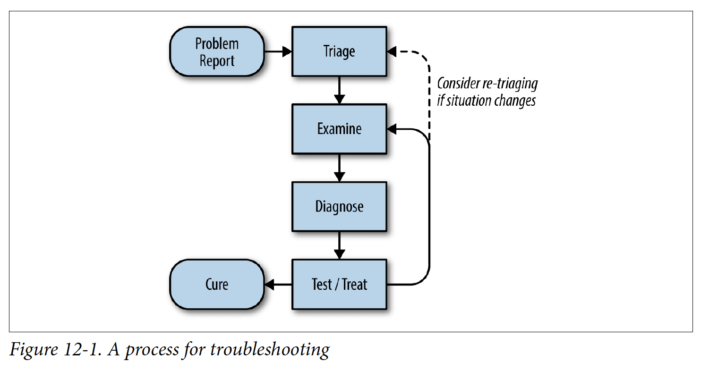

## 12. Effective troubleshooting
- Triage def: find out how serious the situation is
- 
### Principle: hypothetico-deductive method: iteratively test hypothetical causes of the failure:
- Form hypotheses using:
  - Observations of the system
  - Theoretical basis for understanding system behavior
- 2 approaches to test hypotheses:
  - Compare the observed state of the system against our theories to find confirming or disconfirming evidence
  - Change the system in a controlled way and observe the results
### Common pitfalls:
- (1) Look at symptoms that aren't relevant or misunderstand the meaning of system metrics
- (2) Misunderstand how to change the system, its inputs/envs to safely and effectively test hypotheses
- (1) & (2) -> Require general distributed system knowledge & knowledge of this particular system
- Come up with wildly improbable theories about what's wrong, or latching on to causes of past problems
- -> Require common sense: think about probable causes first
- Spurious correlation: due to large amount of data or mistaking correlation with causation
### Best practices:
- Problem report:
  - Chars of effective report:
    - Expected behavior
    - Actual behavior
    - Optional:
      - How to reproduce the behavior
      - Reports have a consistent form and stored in a searchable location
    - -> Jira
  - Avoid direct messaging: less visibility, more workload to popular team member
- Triage:
  - Assess the severity:
    - Low impact problems
    - High impact problems: emergency call/meeting
  - Deal with major outage:
    - Don't start troubleshooting and try to find a root cause as quickly as possible
    - Make the system work as well as it can under the circumstances
    - -> Can take steps to preserve evidence of what's going wrong (eg logs) to help with subsequent root-cause analysis
- Examine:
  - Tools:
    - Monitoring system
    - Logging & distributed tracing
    - Health check & state-exploring endpoints
  - Logging best practices:
    - Have multiple verbosity levels available, along with a way to increase these levels on the fly
    - High volume of traffic -> use statistical sampling
    - Add details to distinguish types of operation/request
  - Instrument test clients to invoke the components (eg curl)
- Diagnose:
  - Knowledge requirements:
    - Thorough understanding of the system's design (more imp)
    - Generic practices
  - Simplify & reduce:
    - Blackbox testing individual components
    - For big systems, can recursively divide into half & test
  - A malfunctioning system is often still trying to do sth
  - -> Find out what it's doing, then ask why it's doing that and where its resources are being used or where its output is going
  - What touched it last -> need to store operation history
  - Specific diagnoses: build tools and systems to help with diagnosing your particular services
  - -> Need to look for commonalities between services adn teams to avoid duplicating effort
- Test and treat:
  - Considerations when designing tests:
    - Test should have mutually exclusive alternatives
    - -> Can rule 1 group of hypos in & rule another group out
    - -> Difficult to achieve
    - Consider the obvious first: perform the tests in decreasing order of likelihood/risk to the SUT
    - An experiment may provide misleading results due to confounding factors
    - Active tests may have side effects that change future test results
    - Some tests may not be definitive, only suggestive (eg reproducing deadlock)
  - Take clear notes of:
    - What ideas you had
    - Which tests you ran
    - What results you saw
  - -> Aid memory & allow reverting the change made by the test
- Cure:
  - Prove the cause. Difficult to do with absolute certainty due to:
    - Complex systems
    - Reproducing the problem in a live production system may not be an option
    - -> Can use test env (costly to maintain)
  - Fix
  - Write postmortem:
    - What went wrong with the system
    - How you tracked down the problem
    - How you fixed the problem
    - How to prevent it from happening again