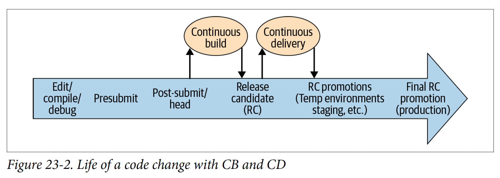

## 23. Continuous integration
### Overview
- CI from a testing perspective: decide:
  - Which tests to run when in the dev/release workflow, as code & other changes are continuously integrated to it
  - How to compose the SUT at each point, balancing concerns like fidelity and setup cost
- Function: automate the build & release processes, with continuous build & CD. Continuous testing is applied throughout.
- CI encourages fast feedback loops, with detailed (eg which build, by whom) & actionable feedback
- Tradeoff: effort to build CI system vs early detection of problems
- 
### Continuous testing
- Tests to run at:
  - Pre-submit: fast, reliable & related to the change/project
  - Post-submit: can run larger scoped test, but must be either hermetic or ignorable
  - Release candidate (RC) testing: run larger test against the entire RC,
  promoting it through a series of test envs & test at each deployment:
    - Can include manual QA testing
    - Need to also run the same tests as in CB
### CI Challenges
- Pre-submit optimization: which tests to run & how to run them
- Culprit finding & failure isolation
- Resource constraints
- Failure management: what to do when tests fail
- Test instability
### CI at Google
- Failure isolation: run the same test suite against production
and a post-submit CI with newly built binaries but the same production BE
- Disabling & tracking tests that can't be immediately fixed is a practical approach to keeping the test suite green