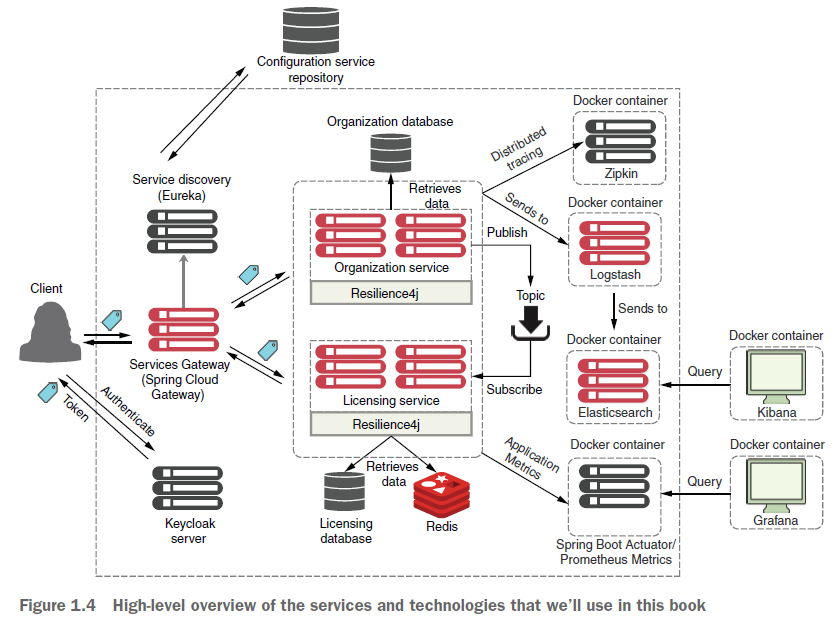

# 1. Welcome to the cloud, Spring
- Spring core: DI
- Spring Boot:
  - Dif version of Spring, focusing on REST microservices, some "enterprise" feature removed
  - Consist of many dependent projects ("starter" kits) -> allow customization
  - REST tasks performed:
    - Parse HTTP params from URL
    - Route to business logic
    - Map JSON to/from Java objects
  - Features:
    - Embedded web server (Tomcat - default, Jetty, Undertow)
    - Suggested config
    - Auto config of Spring
    - Production ready feature (eg metrics, security, external config)
  - -> Fast dev time, leveraging existing Spring functionality
- System architecture of example:
  - 
- Spring profile: allow mapping beans to different environments (eg dev, production)