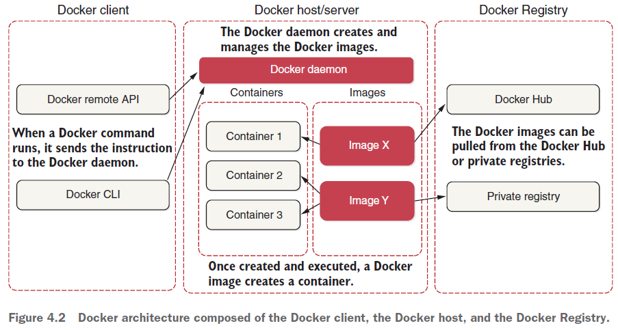

# 4. Welcome to Docker
- Container (virtualization at the OS level) advs over VM (virtualization at the hardware level):
  - No need to specify CPU & memory
  - No need to specify disk space. Use only what is needed.
  - No overhead of guest OS
- -> VM use case: when need a complete OS
- Docker architecture:
  - 
- Can build image using:
  - Basic Dockerfile: copy the entire JAR file
  - Multistage build Dockerfile: copy only the essential part of the app