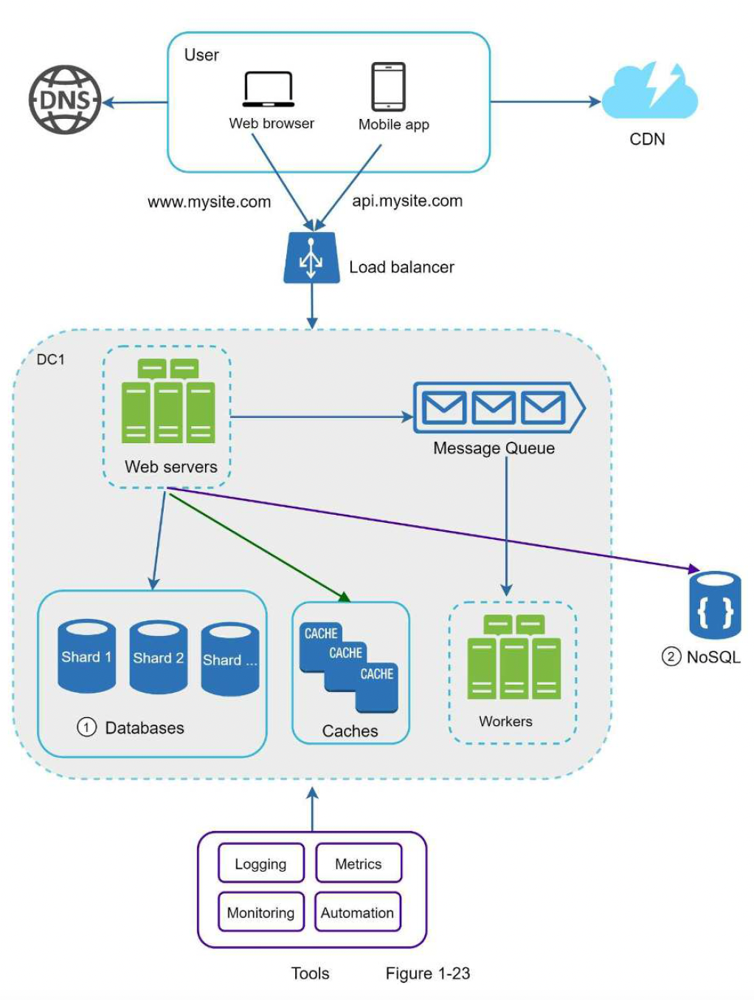
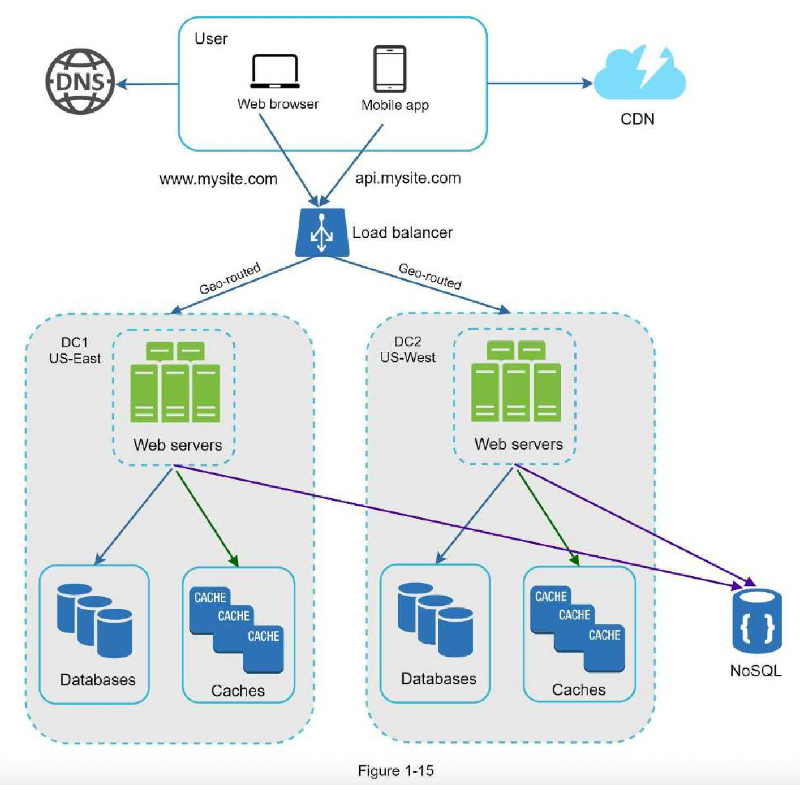

## 1. Scaling techniques
### Overall Diagram
- 
### Multi data centers diagram
- 
### Notes
- Split DB server - service server: scale independently
- Disadvs of vertical scaling:
  - Hardware limit
  - No failover/redundancy
  - Non-linear cost
- Load balancer:
  - Scalability: add/remove server easily (auto-scaling)
  - Performance: distribute traffic, reduce load to single server
  - Availability: redirect in case of failure
- Master (write) - slave (read) DB replication:
  - Better performance
  - Availability
- Sharding DB: scale horizontally. Design issues:
  - Reshard (move) data
  - Celebrity key: overload 1 shard
  - Join operation across shard: complex
  - -> Need de-normalization to reduce write to only 1 table/row
- Cache tier:
  - Adv: performance: faster read, lower DB read
  - Design issues:
    - Usage: frequent read, infrequent write
    - Availability
    - Consistency
    - Eviction policy: when cache is full, need to discard data when add new data:
      - Least recently used (LRU): most common
      - Least frequently used (LFU)
      - First in first out (FIFO)
- CDN for static content:
  - Mechanism: when content not exist/expire, CDN requests to file server & cache the file
  - Adv: faster read for static content
  - Considerations:
    - Cost of using CDN: should only cache frequently used data
    - Availability: fallback to file server when CDN is unavailable
    - File invalidation:
      - Choose cache expiry time -> avoid stale data
      - Call CDN APIs to invalidate objects
      - Use object version, request by version
- Stateless server: move session data out to NoSQL, memcache/redis:
  - Scale servers
  - No need to direct same user to same server
- Multiple data centers:
  - Each with server, DB, cache. Need DB sync.
  - Use geoDNS to route to the closest data center.
- -> Availability, better response time
- Message queue:
  - Availability: request not lost in case of failure
  - Scalability: scale producer/consumer independently
- Logging (detect issues), metric (system status, business) & automation (CI/CD to improve productivity)
### Materials
- [Should you go beyond relational databases?](https://blog.teamtreehouse.com/should-you-go-beyond-relational-databases)
- [Caching strategies and how to choose the right one](https://codeahoy.com/2017/08/11/caching-strategies-and-how-to-choose-the-right-one/)
- [Netflix multi-regional resiliency solution](https://netflixtechblog.com/active-active-for-multi-regional-resiliency-c47719f6685b)
- [What it takes to run Stack Overflow](https://nickcraver.com/blog/2013/11/22/what-it-takes-to-run-stack-overflow/)
- [Common NoSQL use cases by survey](http://highscalability.com/blog/2010/12/6/what-the-heck-are-you-actually-using-nosql-for.html)
- [Scaling memcached at Facebook](https://www.cs.bu.edu/~jappavoo/jappavoo.github.com/451/papers/memcache-fb.pdf)