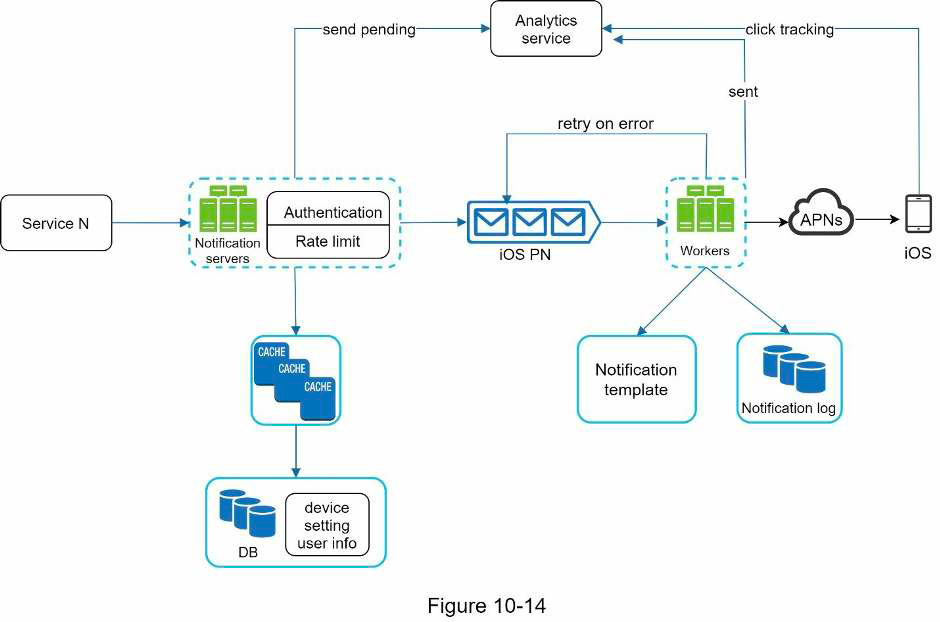

## 10. Noti system
### Requirements
- Noti type: push noti, SMS, email?
- Real time?
- Type of supported device?
- Triggering mechanisms:
  - Other services
  - Scheduled noti
- Allow users to unsubscribe?
- Num noti/day
### High-level design
- 2 flows:
  - Gather contact info
  - Send noti
- Gather info: 1/N user -> N devices:
  - Client -> Load balancer -> API servers -> DB
  - User schema: userid, phone, email
  - Device schema: device token
- Send noti:
  - 
### Details
- Noti template for consistency & performance
- Retry mechanism
- Deduplicate message mechanism
- Rate limit
- Authenticate sender services with app key & app secret
- Monitor: user engagement, num noti sent
- Check user settings before sending
### Materials
- [You cannot have exactly once delivery in distributed system](https://bravenewgeek.com/you-cannot-have-exactly-once-delivery/)