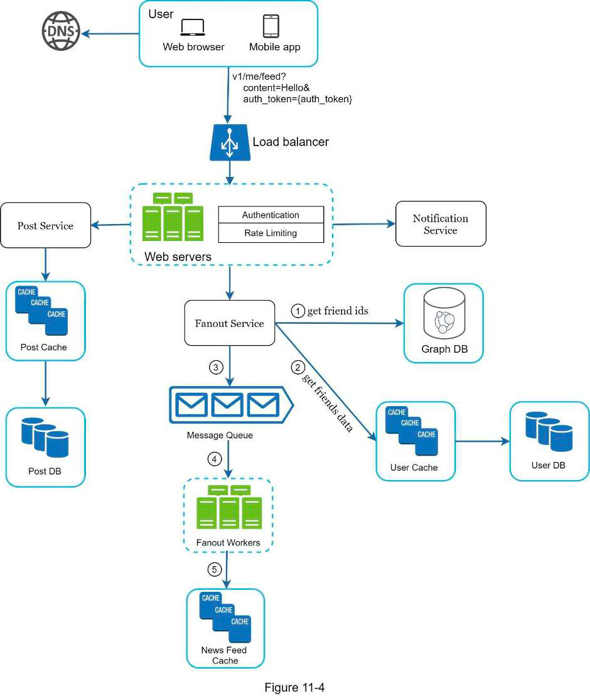
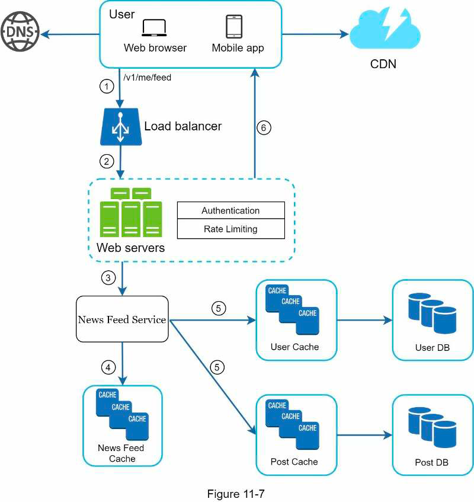

## 11. News feed system
### Requirements
- What does news feed mean?
- Supported clients?
- Main features?
- News feed order: chronological or by weight?
- Num friends of user
- Traffic volume: num DAU
- Feed content: text, image, video?
- Send notification to followers when feed is published?
- Support muting? Support selective sharing with some friends only?
### High level design
- 2 flows:
  - Feed publishing
  - Feed building
### Details
- News feed cache: store post ID by user ID
- Post cache, DB: store post content by post ID
- User cache, DB: store user info, follow/unfollow info…
- Feed publishing design:
  - Fanout on write: fast retrieval, heavy computation, waste resource on inactive use
  - Fanout on read
  - 
- -> Should use hybrid approach: fanout on read for users with many followers, otherwise fanout on write
- Retrieval:
  - 
  - CDN for media content
- Cache architecture:
  - News feed: feed IDs
  - Content: hot, normal
  - Social graph: followers, following
  - Action: like, rep…
  - Counter: like, reply
### Materials
- [How facebook newsfeed works](https://www.facebook.com/help/327131014036297/)