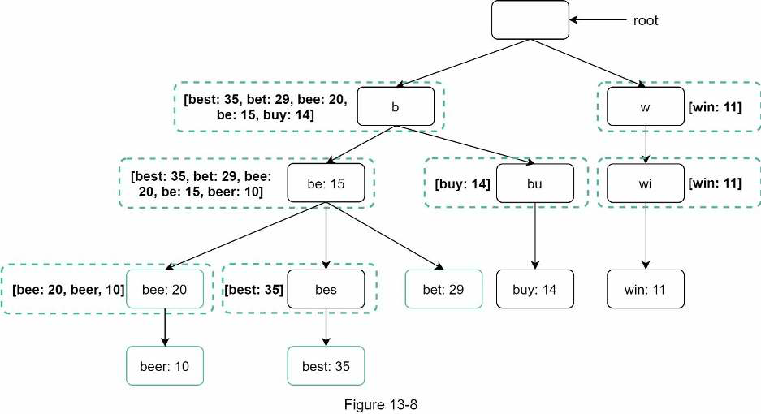
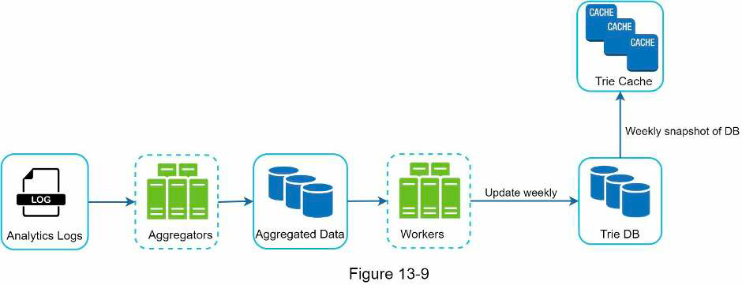

## 13. Search autocomplete system
### Requirements
- Matching: beginning/middle?
- Num of suggestions
- Sort by?
- Spell check?
- English or multi languages?
- Case sensitive?
- Num users/day
- Response time
- -> Estimation: num of search query -> num of search autocomplete request -> amount of data saved (eg 20% search queries are new)
### High level design
- Data gathering service:
  - Gather & aggregate search queries
  - Data model: query, frequency
- Query service: return n suggestions sorted by popularity
### Details
- Trie
  - Use to store string compactly & retrieve it quickly
  - Basic usage: traverse using prefix, get all children, sort children by popularity
  - Optimizations:
    - Limit prefix max length -> traverse take O(1)
    - Cache top search query at each node
    - -> No need to search and sort all children
    - -> Trade space for time complexity
    - 
- Data gathering service:
  - Top searches are unlikely to change & updating tree for every search is costly
  - -> Need optimization
  - 
  - Log search data: sampling to reduce amount of logs
  - Store trie data:
    - Document store
    - Key-value store: prefix:data
- Query service:
  - User -> Load balancer -> API servers -> Filter layer -> Trie cache -> Trie DB
  - Other optimizations:
    - Efficient dynamic content update (React)
    - Browser caching
- Approaches to scale data layer:
  - Shard by n first level (eg aa-ac in 1 node)
  - -> Can result in uneven distribution
  - Store mapping from prefix to shard using a shard-manager DB/service
- Support real-time update:
  - Aggregate more frequently
  - Stream processing
  - Reduce amount of data updated by sharding
  - Change ranking model: more weight to recent search
### Materials
- [The life of a typehead query FB](https://www.facebook.com/notes/10158791367817200/)
- [Prefix service sharing Medium](https://medium.com/@prefixyteam/how-we-built-prefixy-a-scalable-prefix-search-service-for-powering-autocomplete-c20f98e2eff1)
- [Prefix hash tree paper](https://people.eecs.berkeley.edu/~sylvia/papers/pht.pdf)