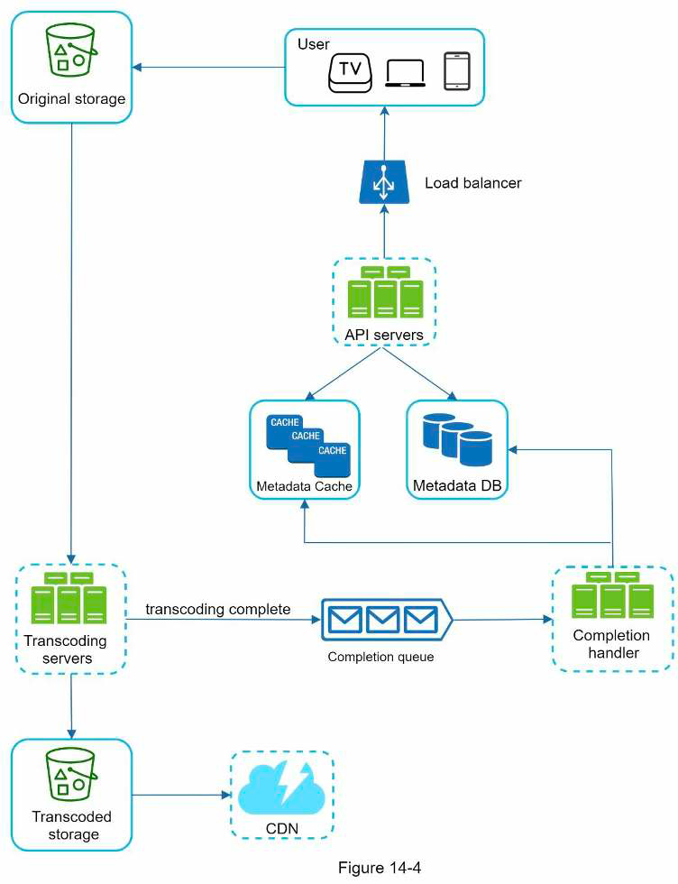
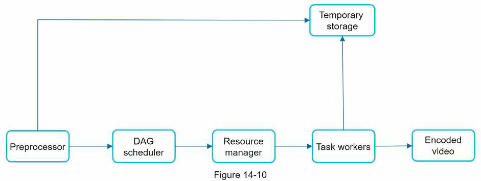
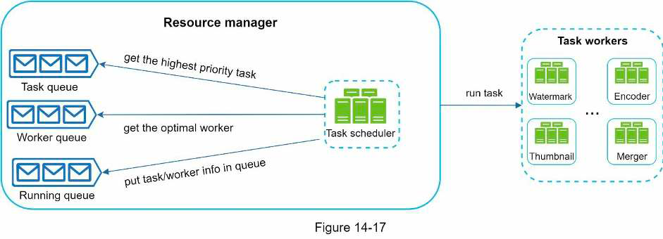

## 14. Video sharing platform
- Example: Youtube, Netflix
### Requirements
- Main features: eg share/watch video, subscribe, comments, like, save to playlist
- Supported FE clients
- Scale: DAU, average time spent/user/day
- Supported video resolutions
- Video size restriction?
- Can leverage existing cloud infra? Need to optimize cost?
- Quality requirement: upload speed, streaming quality
- -> Estimation: average video size, average uploads/user
  - Amount of storage each day
  - Amount of data stream each day -> CDN cost
### High level design
- Cloud services to leverage: CDN & blob storage
- 3 main components:
  - FE
  - CDN: stream video
  - API servers: serve other requests
- 2 main flows:
  - Video uploading flow:
    - 
  - Video streaming flow: need to understand & choose the right video streaming protocol
### Details
- Use DAG to determine & parallelize video-transcoding tasks
- Video transcoding architecture:
  - 
  - DAG scheduler decide tasks to run & put tasks into task queue
  - Resource scheduler:
    - Get task from task queue, pick the suitable worker from worker queue to run the task
    - 
- Upload flow:
  - Steps:
    - FE -> API server: pre-signed URL: give access permission to the object in the URL (eg object in Amazon S3)
    - FE -> Object storage: upload using pre-signed URL
  - Split & upload video in small chunks
  - -> Fast & resumable upload
  - Upload to close data center
- Copyright/permission:
  - Use digital right management system (eg Google Widevine)
  - Encrypt when uploading & decrypt when playing back
  - -> Only authorized users can access
  - Watermarking
- Reduce CDN cost:
  - Serve frequently accessed video from CDN, serve other videos from your own video server
  - Store less encoded versions for short video
  - Store region-specific video in one region only
  - Build your own CDN
- -> Need to analyze historical viewing patterns
- Live streaming: dif latency requirement, smaller chunks of data
- Analyze videos & users to flag & take down unwanted video
### Materials
- [Netflix on AWS](https://aws.amazon.com/solutions/case-studies/netflix/)
- [Streaming protocols](https://www.dacast.com/blog/streaming-protocols/)
- [Distributed video processing on FB paper](https://www.cs.princeton.edu/~wlloyd/papers/sve-sosp17.pdf)
- [Delegate data access with shared access signature](https://docs.microsoft.com/en-us/rest/api/storageservices/delegate-access-with-shared-access-signature)
- [Scaling Youtube](https://www.youtube.com/watch?v=w5WVu624fY8)
- [Internet short video sharing paper](https://arxiv.org/pdf/0707.3670.pdf)
- [Predict content popularity to maximize infra efficiency at Netflix](https://netflixtechblog.com/content-popularity-for-open-connect-b86d56f613b)