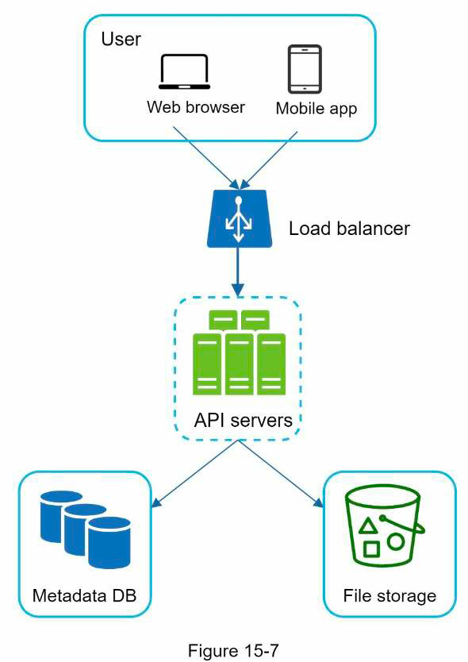
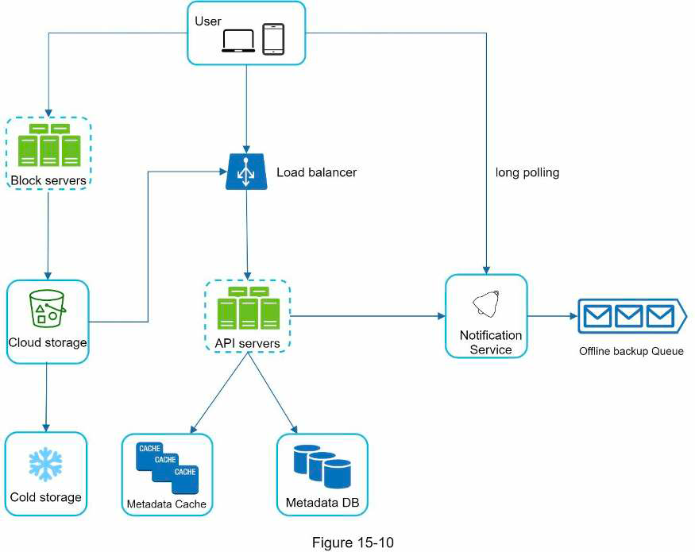
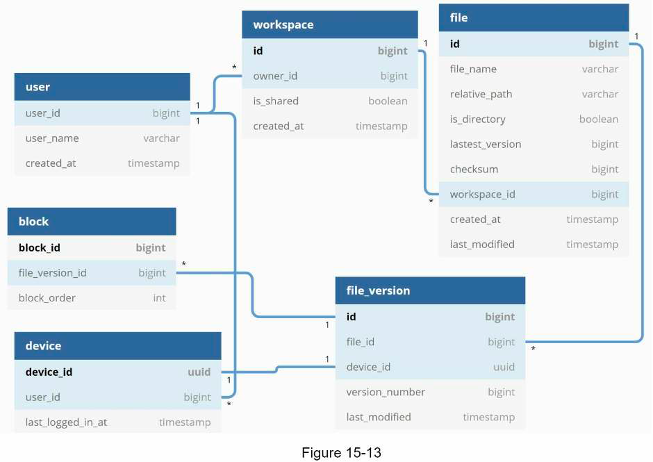

## 15. Cloud storage service
### Requirements
- Main features: upload/download files, view file info, sync files, share files
- Supported clients?
- Supported file formats?
- Need encryption?
- File size limit?
- Scale: DAU, number of requests or uploads each day
- -> Estimation:
  - Storage needed
  - Upload QPS
### High level design
- Simple design:
  - 
- 3 main APIs:
  - Upload file
  - Download file
  - Get file's metadata
- Resolve conflict:
  - First version that got processed win
  - Second version will be presented with the original file. User manually resolves the conflict.
- High level design:
  - 
  - Block server:
    - Break files into small blocks before uploading to cloud storage
    - Reconstruct file from blocks when requested
### Details
- Block server: split -> compress -> encrypt -> upload changed blocks to cloud storage (delta sync)
- Data schema:
  - 
- Fetch new data flow:
  - Block service -> file meta service -> noti service -> client: file uploaded
  - Client -> file meta service: changed blocks
  - Client -> block service: download changed blocks
- Save storage:
  - Limit number of file versions
  - Deduplicate unchanged blocks
  - Move data to cold storage
### Materials
- [Differential synchronization](https://neil.fraser.name/writing/sync/)
- [Differential sync Youtube video](https://www.youtube.com/watch?v=S2Hp_1jqpY8)
- [Scaling dropbox talk](https://www.youtube.com/watch?v=PE4gwstWhmc)
- [Rsync algo paper](https://www.andrew.cmu.edu/course/15-749/READINGS/required/cas/tridgell96.pdf)
- [Rsync lib github](https://github.com/librsync/librsync)
- [Dropbox security whitepaper](https://www.dropbox.com/static/business/resources/Security_Whitepaper.pdf)