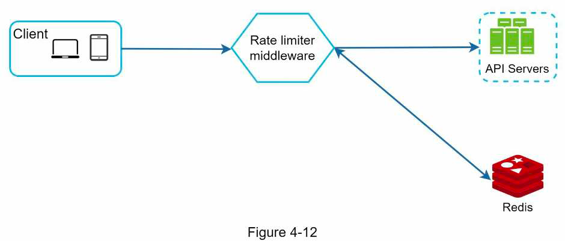
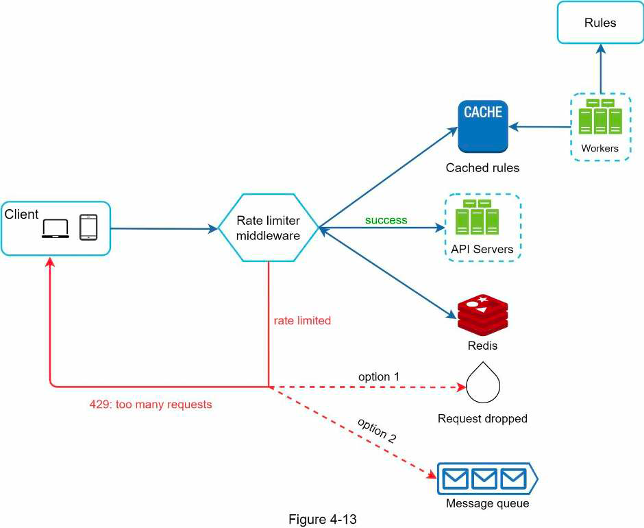

## 4. Rate limiter
### Overall
- Def: used to control the rate of traffic sent by a client or a service
- Mechanism: block excess request when threshold is reached
- Advs:
  - Prevent resource starvation/server overload (eg when there is DDoS attack)
  - Reduce cost (eg there is cost to call third party API)
### Requirements
- Client side or server side?
- Throttle based on which attribute of the request? (eg user ID, IP)
- Scale of the system? (eg QPS, distributed?)
- Infra level or app level rate limiter?
- Need to inform throttled users?
- Resource usage?
### High level
- Considerations whether to implement in API gateway or in service:
  - Service tech stack
  - Currently have an API gateway?
  - Rate-limiting algo that fits business needs supported by API gateway?
  - Dev effort
- Rate limiting algorithms:
  - Token bucket
  - Leaking bucket
  - Fixed window counter
  - Sliding window log
  - Sliding window counter
- High-level design:
  - 
### Details
- Info to return to client (via header for flexibility):
  - Request remaining
  - Limit
  - Retry after
- Handle throttle request:
  - Return error
  - Add to queue to be processed later
- Where to store rule:
  - In files on disk with workers read & update to cache frequently
  - Configuration server
- Prevent lost update when updating counter:
  - Lock
  - Lua script?
  - Redis sorted set
- Multi data centers: sync rate limiting data using eventual consistency model
- Monitoring: gather data about num of dropped requests & window to ensure rate limiting rules & algo are effective
- Soft (vs hard) rate limiting: request can exceed threshold for a short period
- Rate limit at upper-layer (eg by IP at layer 3 using IP table)
- Client logic to avoid being rate limited:
  - Caching
  - Adjust request rate based on limit
  - Retry with backoff
- Detailed design:
  - 
### Materials
- [Rate limiting with Redis sorted set](https://engineering.classdojo.com/blog/2015/02/06/rolling-rate-limiter/)