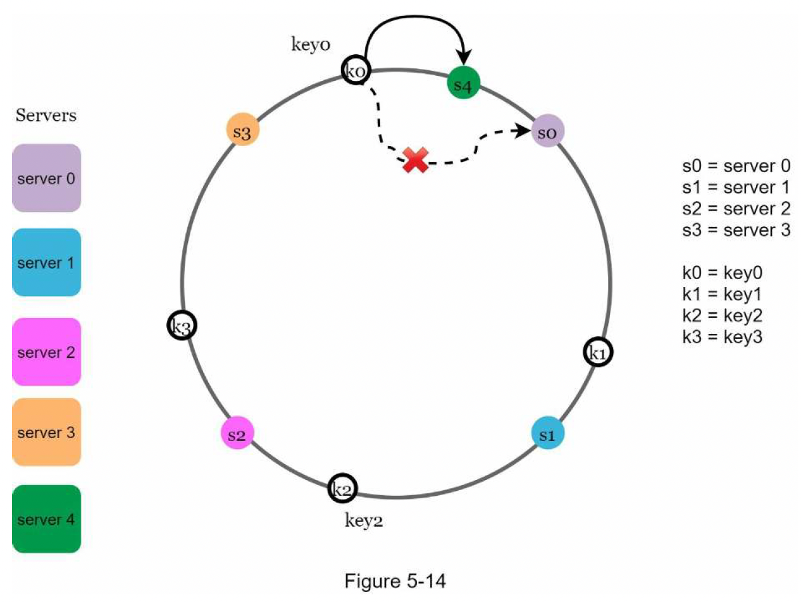

## 5. Consistent hashing
- Problem: use normal hash function eg hash(key) % num server
- -> Most key are redistributed when add/remove server
- Hash space -> connect 2 ends to create hash ring
- Basic approach:
  - Hash server by name or IP -> map to the hash ring
  - Find a server by going clockwise, get the closest server
  - Problem: server hashes distribute not uniformly when init/add/remove
  - -> Most key end up in one server
- Virtual node approach:
  - Add virtual nodes for each server, num nodes depend on server capacity
  - Adv: balanced distribution, based on server capacity
- Add/remove node:
  - Straightforward for cache system: don't need to care about moving keys
  - Storage system:
    - Remove: straightforward: run background task, write all keys in removed node to other nodes?
    - Add:
      - Index keys in each node by key range, then query keys to be moved?
      - Not possible for hash index: need to scan all keys in all node?
- 
### Materials
- [Wiki consistent hashing](https://en.wikipedia.org/wiki/Consistent_hashing)
- [Amazon Dynamo paper](https://www.allthingsdistributed.com/files/amazon-dynamo-sosp2007.pdf)
- [Cassandra paper](http://www.cs.cornell.edu/Projects/ladis2009/papers/lakshman-ladis2009.pdf)
- [Stanford consistent hashing lecture](http://theory.stanford.edu/~tim/s16/l/l1.pdf)