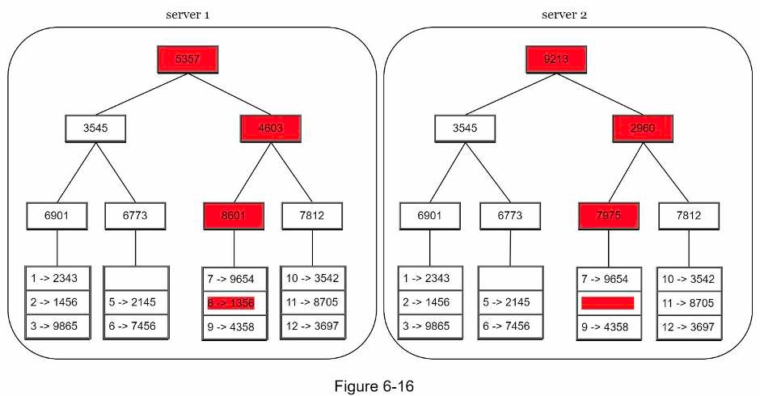
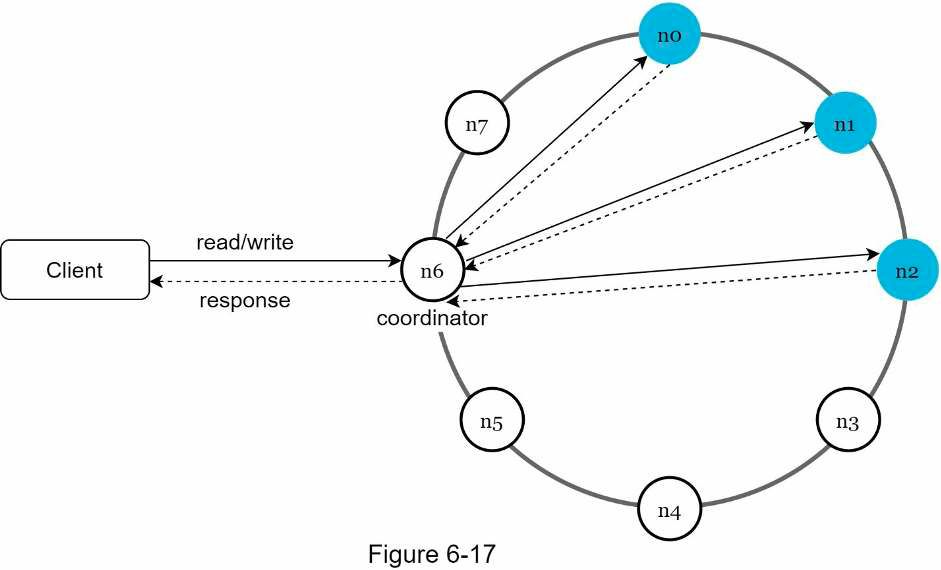
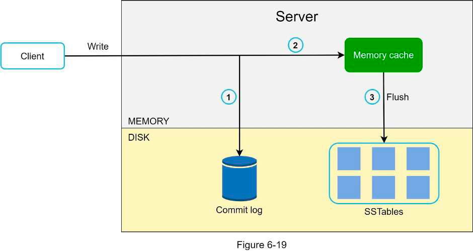

## 6. Key-value store
### Requirements
- Main operations: get & set
- Read, write latency
- Memory usage
- Consistency vs availability
- Amount of data
- Autoscale?
### High level design
- Design issues:
  - Data partitioning & auto-scaling: consistent hashing with virtual nodes
  - Data replication: store in the first x unique servers on the hash ring
  - Tunable consistency: read & write quorum, CAP
  - Inconsistency resolution: version vector
  - Availability: handling failure:
    - Failure detection: gossip protocol
    - Handle partial failure: sloppy quorum & hinted handoff
    - Handle permanent failure: sync data using anti entropy background process, comparing hash tree of buckets in each node
      - 
    - Multi-datacenter replication
- Design:
  - Overall architecture:
    - 
  - Write path:
    - 
  - Read path:
    - Read from in-memory SSTable if found
    - Read from disk if not found in SSTable
      - 
### Additional info
- CAP theorem:
  - Def: it is impossible for a distributed system to simultaneously provide more than 2 of 3 guarantees:
    - Consistency: client always sees the same data no matter which node it reads from
    - Availability: the system continues to work (eg support read, write) even if some nodes are down
    - Partition tolerance: the system can handle network partition (some nodes can't communicate with others)
  - For distributed system, network partition is unavoidable. So the system must choose between consistency and availability.
  - For distributed data system:
    - Choosing consistency = blocking all writes to avoid unavailable node serving stale data
    - Choose availability = allow writes, unavailable node continues to serve stale data, then sync later
### Materials
- [BigTable paper](https://static.googleusercontent.com/media/research.google.com/en//archive/bigtableosdi06.pdf)
- [Cassandra architecture](https://cassandra.apache.org/doc/latest/architecture/)