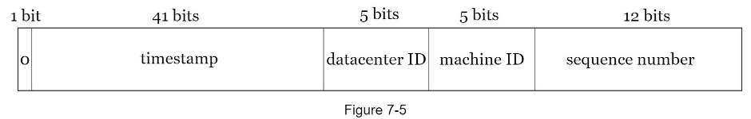

## 7. Distributed unique ID generator
### Requirements
- Chronologically ordered?
- Increment by?
- Numerical?
- ID length/size?
- Scale: how many IDs/s?
### High level design
- Approaches:
  - Multi leader replication:
    - Mechanism: k DB, each auto increment by k
    - Disadvs:
      - Not chronologically ordered
      - Hard to add/remove ID gen server
  - UUID:
    - Advs:
      - Easy to generate
      - Easy to scale
    - Disadvs:
      - Not chronologically ordered -> can use UUID v6
      - 128 bit long
  - Ticket server:
    - Mechanism: ticket servers use a single DB server. Use auto increment feature.
    - Disadvs:
      - Single point of failure: DB
      - Performance bottleneck: DB
  - Twitter snowflake:
    - 
    - Timestamp: from a defined epoch
    - Constraints:
      - 41 bit timestamp -> ~69 years
      - 32 datacenters, 32 machines each center
      - 4096 IDs/s each machine
    - -> Tunable by changing the number of bits
    - Problem: sync time between different machines
### Materials
- [Twitter snowflake](https://blog.twitter.com/engineering/en_us/a/2010/announcing-snowflake)
- [UUID v6](https://www.percona.com/blog/2014/12/19/store-uuid-optimized-way/)