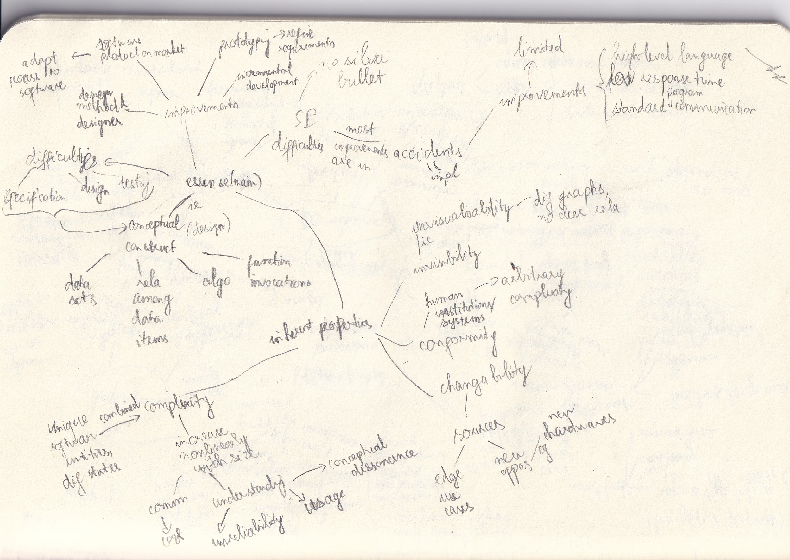

# The Mythical Man-month

## Info
- Type: book
- Author: Frederick P. Brooks, Jr

## Category
- Software engineering
- Project management

## Goals
- Discuss managing software project
- Provide lore of the field & a personal view

## Style
- Expositional
- Good prose writing

## Takeaway
- Overview of the software industry from the 1970s, and imp changes 20 years after
- Historical ideas that persist up to present day: documentation, team structure, schedule estimation, prototype
- Imp & difficulty of specification

## Criticism
- Age of waterfall, slow supercomputer & batch programming
- -> Many problems are obsolete
- Mostly use a single example -> not too convincing
- The assumption that conceptual unity can be achieved by 1 designer is not guarantee: human is inconsistent

## Terms
- Software architect: specify external specifications of a system
- -> Seems to be like:
  - The modern product designer/PM for products with UI
  - The modern system architect for software systems
- Conceptual integrity vs disunity

## Theme
- Conceptual integrity
- Surgical team
- Estimation & schedule slippage
- Organization & communication
- Management & engineering tools & techniques

## Main content
- Chap 1: production-ready & integration-ready system vs a private program
- Chap 2: project-estimation issues:
  - Optimism
  - Diminishing return of adding man
  - Underestimation of system test time
  - Estimation method is not rigorous, derived by patron's wish
- Chap 3: surgical team:
  - Superior-subordinate rela
  - Highly specialized -> effective comm & administration
- Chap 4, 5: issues of surgical team model & resolutions:
  - Democracy of creative activity -> implementation is also a creative activity
  - The specs lack practicality:
    - Early continuous discussion with implementers of the practicality of the design
  - Implementers sit idly waiting for design -> not hire implementers immediately or start in parallel
  - Second-system effect: adding too many ornamentation functions in the second system
  - -> Self-discipline is required
- Chap 6: best practices for external specifications manual
- Chap 7: communication in large projects:
  - Internal documentation best practices
  - Organization:
    - Specialization
    - Tree-like structure of organization, network-like structure of communication
- Chap 8: research & data on programmer productivity by team size, task type, tools, etc
- -> Used for estimation
- Chap 9: reduce memory & disk size: techniques, management & coordination
- Chap 10: managerial document template
- Chap 11: prototyping
- Chap 12:
  - Tooling best practice: build common tools to aid comm & efficiency, while allow specialized tools
  - Imp & promising tools
- Chap 13: techniques for debugging/avoiding bugs:
  - Top down design approach: main steps -> independent modules -> details
  - ...
- Chap 14: schedule slippage:
  - Observation: day-by-day slippage
  - Solution:
    - Have a schedule with concrete milestones
    - Dependency graph -> prioritization
  - Problem of subordinate managers hiding true status
  - -> Techniques for reducing conflict of interest & increase transparency
- Chap 15: documentation template & best practices
- Chap 16: no silver bullet:
  - 