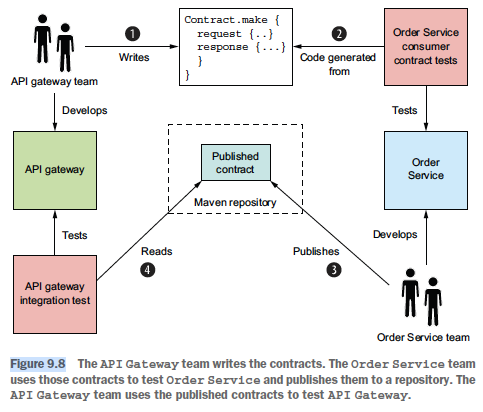

## 10. Testing microservices: Part 2
### Integration tests
- Strats to simplify the tests:
  - Test each of the service's adapters
  - Use contracts to verify interactions between services
- Persistence test:
  - Steps:
    - Setup: setup DB: create DB schema & init it to a known state. Might begin a DB trans.
    - Execute: perform a DB operation
    - Verify: make assertions about the state of the DB & objects retrieved from the DB
    - Teardown (optional): undo changes made to the DB (eg rollback the trans)
  - How to provision DB: run the DB instance using Docker. Use Docker Compose to run tests & DB together.
- Consumer-driven contract testing:
  - Goal: test services in isolation
  - Scope: shape of API only, not business logic (handled by unit tests). eg: HTTP:
    - Have expected method & path
    - Accept expected headers (optional)
    - Accept a request body (optional)
    - Return a response with the expected status code, headers & body
  - Process:
    - Consumer devs write a contract test suite & add it (eg via pull request) to the provider's test suit
    - Execute the test suites in the deployment pipeline of provider
    - -> If a consumer contract test fails -> provider has made a breaking change to the API
    - -> Need to fix or talk to consumer team
    - 
  - Contract:
    - Consists of example messages that are exchanged during one interaction (eg HTTP req & res)
    - RPC: consist of example req & response
      - Provider side: invoke the provider with the contract req & verifies that it returns a res that match the contract's res
      - Consumer side: config a stub simulating provider's behavior
      - 
    - Messaging: consist of example domain event
      - Provider side: verify that the test causes the provider to emit an event & the event match es the contract's event
      - Consumer side: verify that consumer can handle the event
      - 
    - Async req/res: consist of req mes & res mes
      - Provider side: invoke the API with the contract req mes & verify that the res matches the contract res
      - Consumer side: config a stub subscriber which listens for contract req mes & reply with the specified res
      - 
### Component tests
- Implementation options:
  - Code: disadv:
    - Risk of scenarios & tests diverge
    - Disconnection between high-level scenarios & low-level tests
    - Risk of scenario lacking precision or ambiguous & can't be translated into code
  - Use domain specific language (DSL). Steps:
    - Define tests using English-like scenarios
    - Execute the specifications using test automation framework
  - -> Don't need to manually translate scenarios into runnable code
- 
- Steps:
  - Setup:
    - Replace a service's dependencies with stubs that simulate their behavior
    - DB & messaging infra
    - 2 options:
      - In-process test: use in-memory stubs & mocks for dependencies:
        - Adv: simpler to write & faster
        - Disadv: not testing the deployable service
      - Out of process test:
        - Pack the service in a production ready format & run it in a separate process
        - Use real infra services (eg DB & messaging)
        - Use stubs for dependencies that are services
        - Disadv & adv: opposite of in-process test
  - Run: use Docker Compose
### End-to-end test
- Use user journey test to write a single test that does multiple user actions
- -> Reduce the number of tests & shorten execution time
- Implementation (~ component test): write in high level DSL & execute
- Execute: use Docker Compose to run all the services