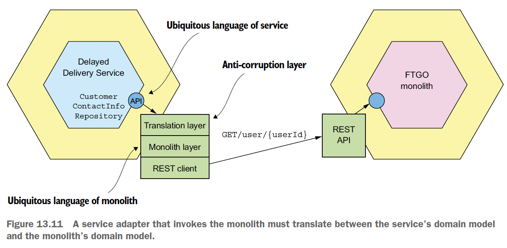

## 13. Refactoring to microservices
- Goal: refactor from monolith to microservices without having to rewrite app from scratch
### Overview of refactoring to microservices
- Consideration before refactoring: make sure business problems arise because of monolith architecture, not because of:
  - Poor software dev process (eg manual testing)
  - Not try all scalability solution
- Non-strategy: dev new microservice app from scratch. Reasons:
  - Lots of time wasted not implementing features that the business needs
  - New features still developed in the monolith -> effort diverted, constant moving target
  - Might implement features that are no longer needed
- Overall strat:
  - Incrementally refactor the monolith & build stranger app
  - -> Stop when the monolith is small enough/no longer an obstacle to ongoing dev
  - Migrate high value or constantly changing areas of the app first
  - -> Increase dev velocity, maintain business support for the migration
  - Avoid making widespread changes to the monolith
  - Avoid building deployment infra upfront: only need a deployment pipeline with automated testing
  - Reduce effort, have time to gain real exp to pick technologies
### Strategies for refactoring a monolith to microservices
- Implement new features as services:
  - Benefits:
    - Stop the monolith from growing
    - Accelerate dev of new features
    - Demonstrate business value
  - Need 2 other elements to integrate the new service into the app:
    - API gateway: to route request to service & monolith
    - Integration glue code:
      - Allow service to access the monolith data & invoke its functionality
      - Consist of adapters in the monolith & the service that communicate via IPC
    - 
  - Non-usage:
    - New feature is too small to be a meaningful service
    - New feature is too tightly coupled with the monolith
    - -> Performance problem due to excessive IPC
    - Data consistency problem
  - -> Need to implement in the monolith, extract later
- Separate presentation tier from the backend:
  - 
  - Benefits:
    - Dev, deploy & scale 2 apps independently
    - Expose remote API of monolith that can be called by new microservices
  - -> Only a partial solution
- Extract business capabilities into services:
  - 
  - Parts to extract to the new service:
    - Inbound adapters containing API endpoints
    - Domain logic
    - Outbound adapters (eg DB access logic)
    - DB schema of the monolith
  - Likely to be time-consuming: monolith code base is likely to be messy
  - -> Need to decide which service to extract first
  - Might do over many iterations: each iteration extract several functionalities
  - Design issues:
    - How to split the domain model:
      - Remove object references:
        - Use aggregate concept
        - Avoid having large impact on clients of the class on the monolith: replicate data
      - Split class: extract functionality from a class that has other responsibilities
    - How to refactor the database: changing all clients of the DB to use the new schema takes lots of time
    - -> Solutions:
      - Migrate then replicate data from service back to monolith to avoid large impact
      - Migrate the clients incrementally (might not need to when client code is extracted into a new service)
    - What is the sequence of service extraction:
      - Design the new architecture -> revise it as you gain migration experience
      - Strats:
        - Freeze monolith dev/bug fix and extract services on demand:
          - Adv: force you to break up the monolith
          - Disadv: service extraction is driven by short-term requirements
          - -> Risk of small benefit in exchange for lots of effort
        - Rank services by the benefit from extraction:
          - Accelerates development: when business roadmap suggests lots of dev in such part
          - Solve performance/scaling/reliability problem
          - Enable extraction of other services
        - -> More strategic & closely align with business' needs
  - Design steps:
    - Review code related to the service business and identify participating entities & their fields
    - Decide which data to migrate to the service. Need to consider:
      - How monolith and service access each other's data
      - How to maintain data consistency
    - Design service domain logic: mostly copy code from the monolith
### Designing how the service and the monolith collaborate
- Design integration glue:
  - Design API that the glue provides to the domain logic: encapsulate in an interface:
    - Query API: Repository interface
    - Command API: Service interface. Changes in the monolith to call the Service interface:
      - Identify all places in the monolith that invoke such business logic to call the interface
      - Implement the interface with:
        - Existing monolith logic
        - Proxy to new service
      - Use feature toggle to dynamically switch between the 2 implementations
      - Remove the existing monolith implementation when the service is considered working as expected
      - 
  - Pick interaction style & IPC mechanism:
    - Query data:
      - Option 1: consumer invoke RPC API of data provider:
        - Adv: simple to implement
        - Disadv:
          - Inefficient if consumer makes lots of requests
          - Reduced availability
      - Option 2:
        - Provider is monolith: service implement CQRS
        - Provider is service: service publish domain events for monolith to consume and update its DB
        - Adv: efficient
        - Disadv:
          - Increased complexity
          - Might need to modify monolith to publish domain event
    - Update data: use transactional messaging
      - Transaction required: use saga
      - Transaction not required: publish event
  - Implement anti-corruption layer:
    - When:
      - Develop new domain model in the service, dif from monolith domain model
      - Need to communicate with monolith
    - Goal: prevent legacy monolith's domain model from polluting service's domain model
    - Anti corruption layer def: layer of code that translates between dif domain models
    - 
    - Functions:
      - Map class/attribute names/values
      - Map status code
    - Where to implement:
      - In service:
        - When receive monolith domain event
        - When invoke monolith API
      - In monolith:
        - When subscribe to service event
        - When invoke service API
  - Publish/consume domain event in the monolith:
    - Publish:
      - Sol 1: in the code:
        - Adv: can publish high level domain event
        - Disadv:
          - Need to locate all the places to publish. Potentially huge change.
          - Can't deal with cases using stored procedure
      - Sol 2: use DB event via transaction log tailing/polling
        - Adv: don't have to change the monolith
        - Disadv:
        - Low level event
        - Don't know reason for the update
    - Consume problem: monolith written in language without message broker client
    - -> New helper service to subscribe to event & update monolith DB directly
- Maintain data consistency across service and monolith:
  - Problem: introducing saga's compensating transaction in the monolith might require numerous, risky code change (eg new "state" field in DB model)
  - Approach: ensure monolith transactions are either pivot or retriable transactions by:
    - Design saga
    - Decide service extraction order
- Handle authentication & authorization:
  - Problem: support both monolith and JWT-based security mechanisms simultaneously
  - Solution:
    - Monolith login handler returns an additional cookie to be included in every request. Cookie content: JWT token.
    - API gateway validate the token in the cookie, set it in authorization header and send to services
    - Services validate the token and extract info
    - 
### Refactoring examples of strat 1 and 3: skipped
