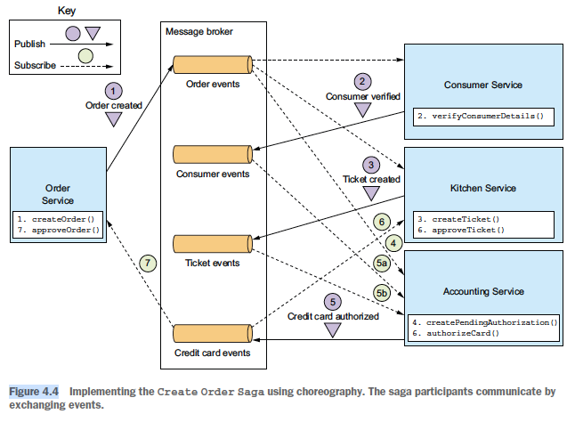

## 4. Managing transactions with sagas
### Overview of transaction management in microservice architecture
- Characteristic: transactions span multiple services, each has its own database
- -> Need to maintain data consistency across the databases
- Disadvs of distributed transaction:
  - Not supported by many modern tech (Kafka, NoSQL), which usually choose availability over consistency
  - Reduced availability
- Saga:
  - Define one for each system command that updates data in multiple services
  - Mechanism:
    - The system operation initiates the first step of the saga
    - Completion of a local transaction triggers the execution of the next local transaction
  - Adv: high availability
  - Design issues:
    - Lack of isolation
    - Need to be able to roll back using compensating trans since each local trans commits its changes:
      - Approach: roll back the committed transactions in the reverse order
      - Types of trans & need to rollback:
        - Need compensating transaction: compensatable trans
        - Not required: read-only, pivot, retriable trans
  - Implementation: contain logic that coordinate the steps of the saga
### 2 ways to structure saga's coordination logic:
- Choreography: distribute decision making and sequencing among the saga participants
  - Main communication method: events
  - 
  - Disadv: risk of interaction being too complex for complex saga
  - Usage: simple sagas
- Orchestration: centralize saga coordination logic in a saga orchestrator class
  - Mechanism: orchestrator sends command messages to saga participants telling them which operations to perform
  - 
    - *Note*: Order service sends its own event to be consistent: saga treats Order service as just another participant
  - How to model the orchestrator: as state machine:
    - 
    - Action: invoke a saga participant
    - Transition between states: triggered by completion of a local trans by a saga participant
    - -> Current state & outcome of local trans determine state transition & action to perform
    - Advs state machine:
      - Model dif scenarios for a saga
      - Can be tested effectively
  - Adv: ess complex interaction & coupling
  - Disadv: risk of centralizing too much business logic in the orchestrator
  - -> Need to design orchestrators that are solely responsible for sequencing & don't contain any other business logic
### Handle the lack of isolation in sagas
- Problem: updates made by each local trans, after committed, are immediately visible to other sagas
- Anomalies caused by lack of isolation:
  - Lost update
  - Dirty read
  - Non-repeatable read
- Type of saga transactions:
  - Compensatable: can be rolled back using a compensating trans
  - Pivot: if pivot trans commit, the saga will run until completion
  - Retriable: trans following pivot trans, guaranteed to succeed
- Countermeasures:
  - Semantic lock: a saga's compensatable trans sets a flag in any record that it creates or updates (eg in *state* field)
  - -> Need to decide how a saga should deal with a locked record:
    - Command returns error, client retry later -> easy to implement but complex client with retry logic
    - Command blocks until the lock is released -> serialized saga, easy to implement but have to manage locks & handle deadlocks
  - Commutative update: update operations can be executed in any order
  - Pessimistic view: reorder the steps of a saga to minimize business risk due to a dirty read (eg put update in retriable trans)
  - Reread value:
    - Reread a record before updating it, verify that it's unchanged, then updates the record
    - If the record has changed, the saga aborts & possibly restarts
  - Version file: record the operations that are performed on a record so that it can reorder them (eg already cancelled? -> won't update to *created* state)
  - By value: select concurrency mechanism (saga or distributed trans) based on business risk
### Saga code example: skipped