# Arguments
## Preface
- Enterprise applications are typically large monoliths (is it?)

## 1. Escaping monolithic hell
- Monolithic architecture:
  - 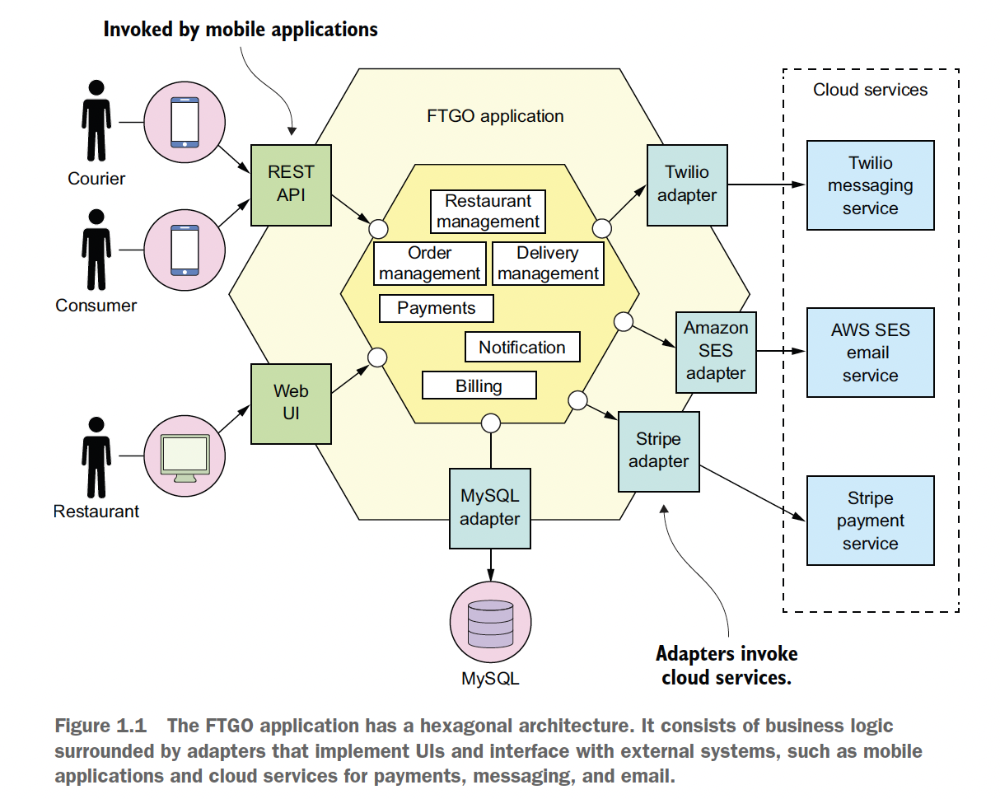
  - Suitable for new, small app
  - Benefits when the app is small:
    - Simple to dev: suitable for IDE & dev tools
    - Easy to make radical changes
    - Easy to test
    - Easy to deploy
    - Easy to scale
  - Drawbacks when the app is big:
    - Too complex -> difficult to dev & debug
    - Dev is slow: lag IDE, slow build, long start up time -> edit, build, run, test loop takes a long time
    - Path from commit to deployment is long:
      - Many devs -> hard to merge & need further testing
      - Complex -> need careful, system testing
    - Difficult to scale: conflicting resource requirements from dif modules
    - Not reliable:
      - Hard to test thoroughly
      - Lack of fault isolation
    - Locked into an obsolete tech stack: rewrite whole app is risky
- Software architecture mainly affect nonfunctional requirements (maintainability, extensibility, testability), not functional requirements
- 3 ways to scale an app:
  - Load balance requests across multiple instances:
    - Randomly
    - Based on request's attribute
  - Decompose by function into multiple services. Can be combined with load balancing.
- Microservice architecture:
  - 
  - Suitable for large, complex app
  - Benefits: of small, independent services:
    - Enables the continuous delivery and deployment of large, complex apps (most imp benefit):
      - Testability
      - Deployability: usually don't require coordination
      - Autonomous, loosely coupled teams
    - Maintainability
    - Scalability: based on resource requirement of each service
    - Easy to experiment & adopt new techs
    - Reliability:
      - Better fault isolation
      - Easier to test
  - Drawbacks:
    - Difficult to find the right set of services
    - -> Can result in distributed monolith
    - Complex distributed system:
      - IPC
      - Partial failures
      - Transactions & queries spanning multiple services
      - Dev: not supported by IDE, hard to do automated testing multiple services
      - Operational complexity: management & deployment
    - -> Require sophisticated dev & operation skills
    - Need coordination when deploying features spanning many services
    - Difficult to decide when to adopt 
  - -> Many issues has multiple solutions, each with different set of tradeoffs
- Pattern:
  - Describe:
    - Issues
    - Result:
      - Benefit: solved issues
      - Drawback: unsolved issues
      - New issues
    - Related patterns
  - -> Objective -> better decision making
  - Can be organized into group: handle problems in a particular area
  - Pattern language: collection of related patterns that solve problems within a particular domain
- Microservice pattern language:
  - Software pattern: solves a software architecture or design problem by defining a set of collaborating software elements:
    - Object-oriented pattern: contains collaborating classes
    - High level design pattern: contains collaborating services
  - 3 layers:
    - Infra patterns: solve infra issues outside development
    - App infra patterns: solve infra issues related to development
    - App patterns: solve development problems
    - 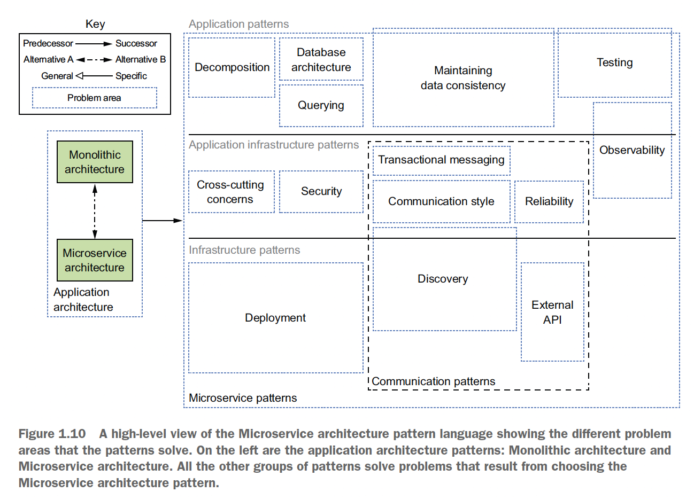
  - Groups:
    - Decomposition:
      - 
    - Communication:
      - 
    - Data consistency:
      - 
    - Data query:
      - 
    - Deployment:
      - 
    - Observability
    - Automated testing
    - Crosscutting concerns
    - Security
- Process & organization:
  - Imp for success, beside architecture
  - 
  - Organization: team of teams, each 8-12 people:
    - Each team has clear business-oriented goal:
    developing and possibly operating one or more services that implement a feature or a business capability
    - Cross-functional, can develop, test, and deploy its services without having to frequently communicate or coordinate with other teams 
    - Grow: adding teams
  - -> Higher dev velocity, clear point of contact
  - Development & delivery process: agile dev & deployment practices (eg Scrum, Kanban)
  - Transition from monolithic to microservice architecture: need to consider reaction & emotion of people

## 2. Decomposition strategies
### Architectural view & architectural style
- Architectural view in 4+1 model: describes a particular aspect of the architecture
  - 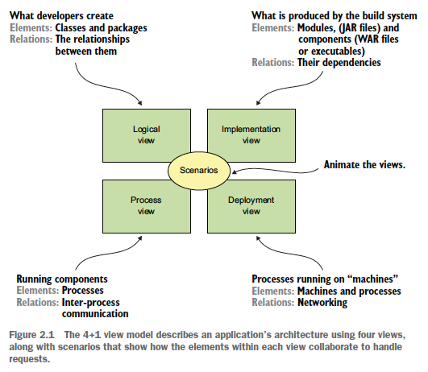
- Architectural style:
  - Provide a limited set of elements (components) and relations (connectors) from which a **view** of an app's architecture can be defined
  - An app usually uses a combination of archi styles
### Styles apply to the logical view
- Layered (eg 3-tier architecture)
- Hexagonal:
  - Business logic at the center, has ports, interact with the outside via ports
  - 
  - Port:
    - Defines a set of operations
    - Usually interface
    - Types:
      - Inbound: API exposed by business logic (eg service interface), allow it to be invoked by external apps
      - Outbound: define how business logic invoke external systems (eg repository interface)
  - Adapter types:
    - Inbound: handle outside requests by invoking business logic via inbound port (eg MVC controller)
    - Outbound: implements outbound port, invoked by business logic and invoke external apps (eg data access object DAO)
  - -> Adapters depend on business logic
  - Advs:
    - Decouple business logic from presentation & data access logic in the adapters
    - -> Easier to test business logic in isolation
    - Flexible, reflect modern app architecture: multiple, exchangeable adapters
    - Usage: design each service in a microservice archi
### Styles apply to the implementation view:
- Monolithic archi
- Microservice archi:
  - Component: service:
    - With its own logical view archi (usually hexagonal) & potentially separate technology stack
    - Implementation view can take many form (see Chap 12)
    - Correspond to business capabilities
    - Has an API to provide client access to its functionality. API consists of:
      - Commands: perform action & update data
      - Queries: retrieve data
      - Events: published by service, consumed by its clients
    - Size of service:
      - Mostly unimportant, compared to clear, focused responsibility of each service
      - Sign of well-designed service:
        - Can be developed by a small team with minimal lead time and collaboration with other teams
        - A team might only be responsible for a single service
      - Sign of badly designed service:
        - Requires a large team
        - Take a long time to test
        - Constantly need to change because of changes to other services or trigger changes in other services -> distributed monolith
  - Connector: communication protocol that services use to communicate, implemented using IPC mechanism
  - Key constraint: services are loosely coupled:
    - Services as units of modularity, API as boundary: all interactions with the service happen via its API
    - -> Easier to preserve modularity
    - Restrict how services collaborate: not via DB
    - -> Each service has its own database
    - Advs:
      - Encapsulate implementation details -> can change without impacting clients
      - Improve app dev time attribute (eg understandability maintainability, testability)
      - Improve runtime isolation: can't lock DB of other services
  - Should only use shared libs for functionality that is unlikely to change
### Steps to define an app's microservice architecture:
- Not a process to follow mechanically, but likely to be iterative and requires creativity
- 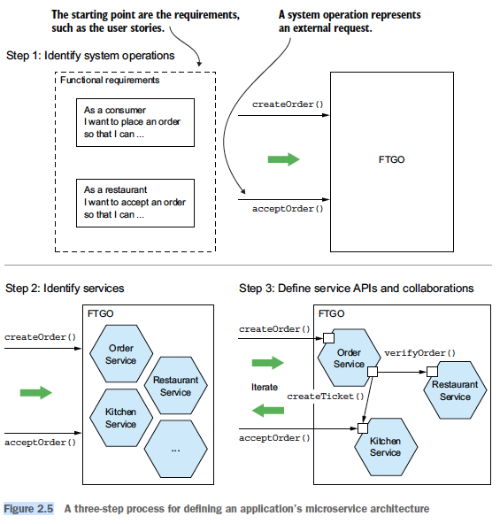
- Step 1: identify the system operations:
  - System operation def: abstraction of a request that the app must handle. Can be either:
    - Command: update data
    - Query: retrieve data
  - 
  - Steps:
    - Create a high-level domain model: by analyzing the nouns in the user stories/scenarios and talking to domain experts
    - -> Result: domain models containing classes 
    - Define system operations:
      - 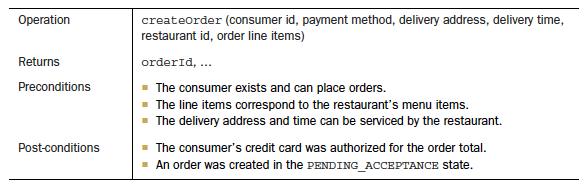
      - Derive from verbs in user stories
      - Describe the operation's behavior in terms of effect on domain objects and their rela: create, update, delete domain objects; create/destroy rela between them
- Step 2: define services by business capability:
  - Adv: business capabilities are stable -> resulting archi is stable
  - The resulting services are only the first attempt at defining the archi
  - -> May evolve over time as more is learned about the domain:
    - Combine services due to excessive IPC
    - Split services due to high complexity
  - Use domain driven design (DDD) as an alternative:
    - Domain def: app's problem space
    - Define a separate domain model for each subdomain -> service correspond to subdomain
    - Identify subdomain by business capability
  - Decomposition design issues:
    - Network latency: combine service to reduce IPC
    - Sync IPC reduces latency: use async messaging
    - Managing data consistency: distributed trans or saga
    - Obtain a consistent view of the data: rarely a problem in practice
    - God classes prevent decomposition: apply DDD and use a separate domain model for each service
    - -> Each service has its own domain model with its own version of the god class
- Step 3: define service APIs: steps:
  - Assign system operations to services
  - Determine the APIs required to support collaboration between services for each system operation: independent of IPC technology

## 3. Interprocess communication in a microservice architecture
### IPC design issues:
- Interaction styles:
  - 
  - Mostly not related to IPC techs (eg can use messaging for req/res style by blocking waiting for a res)
- API definition: API-first design
  - Steps:
    - Write interface definition
    - Review it with client devs
  - -> Only implement the service after that
- Evolve API:
  - Use semantic versioning
  - Strive to make backward-compatible changes:
    - Add optional attributes to the request. Provide default values for missing attributes.
    - Add attributes to a response. Clients should ignore extra response attributes.
    - Add new operations
  - For major, breaking changes:
    - Embed the major version number in the URL (eg /v2/...)
    - Support old versions by putting version-translating logic in the service's *API adapter*
- Messaging formats:
  - Use cross-language message format
  - Types:
    - Text-based (eg JSON, XML):
      - Advs:
        - Readable by human
        - Self-describing
      - Disadv: big & costly-to-parse message
    - Binary: advs & disadvs: reverse of text-based. Additional advs:
      - Require API-first design
      - Can be statically checked in compiling languages
### Remote procedure call communication
- Characteristic: client assumes the res will arrive in a timely fashion
- Advs:
  - Familiar & easy to test
  - Simple architecture
- Disadvs:
  - Reduced availability
  - Clients need to know location of the service -> need service discovery
- Design issues:
  - Handle partial failure & protect caller:
    - Develop robust RPC proxies using:
      - Request timeout
      - Limit number of outstanding requests from a client to a service
      - Circuit breaker
    - Recover from an unavailable service:
      - Return error to client
      - Return a fallback value
      - Return cached data or omit the field from the response
  - Service discovery:
    - Why service discovery is needed: in modern, cloud-based microservices app:
      - Service instance have dynamically assigned network locations
      - Set of service instances changes dynamically because of autoscaling, failures & upgrades
    - Mechanism:
      - When service instances start and stop: update the *service registry*
      - When a client invokes a service: query the service registry to obtain a list of available service instances & routes the request to one of them
    - 2 types:
      - Application-level service discovery:
        - 
        - Need health check mechanism
        - Client can cache service instances to improve performance
        - Adv: can handle scenario when services are deployed on multiple deployment platforms
        - Disadvs:
          - Need service discovery lib for every language/framework
          - Need to set up & manage the service registry
      - Platform-provided service discovery:
        - 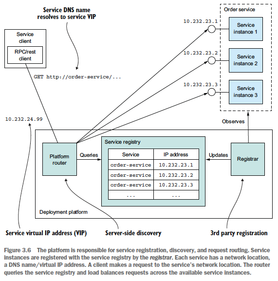
        - Adv: all aspects of service discovery are handled by the deployment platform
        - -> Service discovery is available to all services and clients regardless of their language/framework
        - Disadv: only support discovery of services that have been deployed using the platform
### Async messaging communication
- 
- 2 types of channels:
  - Point to point: 1 message consumed by only 1 of the consumers (eg same consumer group in Kafka)
  - Publish-subscribe
- Use messaging to implement dif interaction styles:
  - Req/res & req/async res:
    - 
    - For sync req/res, client blocks until it receives the response
  - One-way noti & publish/subscribe: supported by messaging infra
  - Publish/async responses: similar to async req/res. Client gather responses with matching correlation ID.
- API definition:
  - Async operations API:
    - Req/async res:
      - Service's command mes channel
      - Types & formats of command message
      - Types & format of reply message
    - One-way noti:
      - Service's command mes channel
      - Types & formats of command message
  - Published events API:
    - Event channel
    - Types & formats of event messages
- 2 types of architecture:
  - Broker-less: direct communication, client doesn't wait for response:
    - Advs:
      - Of direct communication
      - No disadv of centralized broker
    - Disadvs:
      - Same as RPC
      - Hard to implement mechanisms such as guarantee delivery
  - Broker-based: use a message broker:
    - Main consideration when choosing message broker: message ordering & scalability
    - Advs:
      - Loose coupling: publisher don't need to be aware of consumers -> no need for service discovery
      - Message buffering -> increased availability
    - Disadvs:
      - Potential performance bottleneck/single point of failure
      - Additional operational complexity
- Design issues:
  - Competing receivers & message ordering: 
    - How to scale out receivers while preserve message ordering
    - How to process message concurrently in each consumer
  - -> Solution: sharded (partitioned) channels:
    - 
    - Related messages -> same partition (eg partitioned by key)
    - n partition : 1 consumer service (eg same consumer group)
  - -> Same approach can be applied to multi threading handlers in each service
  - Handle duplicate messages:
    - Most mes broker deliver at least once
    - Duplicate example: crash before ack-ing
    - Solutions:
      - Write idempotent message handlers. Requirements:
        - Logic can be called multiple times with no additional effect
        - Message broker preserves ordering when redelivering messages
      - Track messages & discard duplicates:
        - Store processed message ids in dedicated table
        - Store processed message in app table (eg when using NoSQL DB with limited transaction model)
  - Transactional messaging:
    - Use distributed trans spanning the DB & the broker
    - -> Problem: many modern brokers don't support distributed trans
    - Use *transactional outbox pattern*:
      - 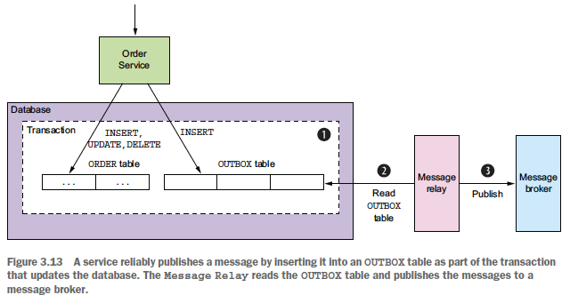
      - Publish message using *Polling publisher* or *Transaction log tailing* pattern
  - Choose lib:
    - Use broker's client lib: require effort to implement high level mechanisms
    - -> Should use higher level library/framework that support higher level interaction styles
- How to replace sync interaction to improve availability:
  - Use async interaction styles
  - -> Disadv: services often have external API that uses sync protocol (eg REST) -> must respond immediately
  - Replicate data:
    - Mechanism:
      - Maintain a replica of the needed data when processing requests
      - Subscribe to events publish by data owner to keep the replica up to date
    - Disadv: might require replication of large amount of data
  - Finish processing after returning a response:
    - Mechanism:
      - Respond to client immediately (eg in pending state)
      - Send confirmed state later
    - Disadv: require corresponding client flow/logic
### Additional info
- Factors to consider when choosing message broker:
  - Supported programming language
  - Supported messaging standard (eg AMQP, STOMP)
  - Message ordering
  - Delivery guarantees
  - Persistence
  - Durability: disconnected consumer can receive prev messages after reconnecting
  - Scalability
  - Latency
  - Competing consumers

## 4. Managing transactions with sagas
### Overview of transaction management in microservice architecture
- Characteristic: transactions span multiple services, each has its own database
- -> Need to maintain data consistency across the databases
- Disadvs of distributed transaction:
  - Not supported by many modern tech (Kafka, NoSQL), which usually choose availability over consistency
  - Reduced availability
- Saga:
  - Define one for each system command that updates data in multiple services
  - Mechanism:
    - The system operation initiates the first step of the saga
    - Completion of a local transaction triggers the execution of the next local transaction
  - Adv: high availability
  - Design issues:
    - Lack of isolation
    - Need to be able to roll back using compensating trans since each local trans commits its changes:
      - Approach: roll back the committed transactions in the reverse order
      - Types of trans & need to rollback:
        - Need compensating transaction: compensatable trans
        - Not required: read-only, pivot, retriable trans
  - Implementation: contain logic that coordinate the steps of the saga
### 2 ways to structure saga's coordination logic:
- Choreography: distribute decision making and sequencing among the saga participants
  - Main communication method: events
  - 
  - Disadv: risk of interaction being too complex for complex saga
  - Usage: simple sagas
- Orchestration: centralize saga coordination logic in a saga orchestrator class
  - Mechanism: orchestrator sends command messages to saga participants telling them which operations to perform
  - 
    - *Note*: Order service sends its own event to be consistent: saga treats Order service as just another participant
  - How to model the orchestrator: as state machine:
    - 
    - Action: invoke a saga participant
    - Transition between states: triggered by completion of a local trans by a saga participant
    - -> Current state & outcome of local trans determine state transition & action to perform
    - Advs state machine:
      - Model dif scenarios for a saga
      - Can be tested effectively
  - Adv: ess complex interaction & coupling
  - Disadv: risk of centralizing too much business logic in the orchestrator
  - -> Need to design orchestrators that are solely responsible for sequencing & don't contain any other business logic
### Handle the lack of isolation in sagas
- Problem: updates made by each local trans, after committed, are immediately visible to other sagas
- Anomalies caused by lack of isolation:
  - Lost update
  - Dirty read
  - Non-repeatable read
- Type of saga transactions:
  - Compensatable: can be rolled back using a compensating trans
  - Pivot: if pivot trans commit, the saga will run until completion
  - Retriable: trans following pivot trans, guaranteed to succeed
- Countermeasures:
  - Semantic lock: a saga's compensatable trans sets a flag in any record that it creates or updates (eg in *state* field)
  - -> Need to decide how a saga should deal with a locked record:
    - Command returns error, client retry later -> easy to implement but complex client with retry logic
    - Command blocks until the lock is released -> serialized saga, easy to implement but have to manage locks & handle deadlocks
  - Commutative update: update operations can be executed in any order
  - Pessimistic view: reorder the steps of a saga to minimize business risk due to a dirty read (eg put update in retriable trans)
  - Reread value:
    - Reread a record before updating it, verify that it's unchanged, then updates the record
    - If the record has changed, the saga aborts & possibly restarts
  - Version file: record the operations that are performed on a record so that it can reorder them (eg already cancelled? -> won't update to *created* state)
  - By value: select concurrency mechanism (saga or distributed trans) based on business risk
### Saga code example: skipped

## 5. Designing business logic in a microservice architecture
- Design issues:
  - Eliminate object references spanning service boundaries
  - Design business logic that works within the transaction management constraints of microservice architecture
### Business logic organization patterns
- Transaction script pattern:
  - Archi:
    - Scripts locate in service classes as methods, once for each request/system operation, containing business logic of the request
    - Service method accesses DB via data access objects
    - Data objects are pure data with little/no behavior
  - Adv: simple to write
  - Disadv: hard to extend & maintain
  - Usage: simple business logic
- Domain model pattern:
  - Archi (~object oriented design):
    - Business logic consists of an object model - network of relatively small classes
    - Classes correspond directly to concepts from problem domain, most contain both state and behavior
    - -> Simple service methods: business logic delegated to domain objects
    - Service method's logic: ~aggregate pattern (below)
  - Advs:
    - Modular
    - Easy to understand
    - Easy to test each class individually
    - Easy to change/extend
- Domain driven design:
  - Building blocks:
    - Entity: an object with a persistent identity. 2 entities with same attribute values are dif objects.
    - Value object: an object as a collection of values. 2 values object with same attribute values can be used interchangeably.
    - Factory
    - Repository
    - Service
  - Fuzzy boundaries problem: when updating a business object:
    - What to load/delete?
    - What rules to enforce?
  - -> Solution: aggregate pattern:
    - Focus of design: identify aggregates, their boundaries & roots
    - Characteristics:
      - (1) Operations are invoked on the aggregate root (via a method), acting on the entire aggregate rather than parts of it
      - An aggregate is the object of storage, often loaded entirely from the DB -> avoid complication; scaling DB by sharding agg is straightforward
      - Concurrency is handled by locking the aggregate root (eg version number/DB level lock)
    - Advs:
      - Decompose a domain model into chunks, which are easier to understand
      - (1) advs:
        - Clarify the scope of operations (eg load, update, delete)
        - Enforces rules: no accidental update of a dif agg
    - Aggregate rules:
      - Client can only update an agg by invoking a method on the agg root
      - Inter-agg references must use primary keys instead of object references. Advs:
        - Loosely coupled
        - Ensure boundaries
        - Ref can span services
      - One transaction creates or updates one agg. Advs:
        - Trans is contained within a service
        - Match the limited trans model of most NoSQL DB
    - Agg size consideration: small (vs big):
      - Advs: scalable, modular, reduce update conflicts
      - Disadv: trans updating multiple aggs is not atomic
    - Design business logic:
      - Bulk of business logic: in aggs
      - The rest of business logic:
        - Sagas: orchestrating logic
        - Services:
          - Load agg from DB using Repository, invoke one of its methods, then save it using Repository
          - Invoke external services
          - Publish events
          - Create saga if update spans multiple services
### Publish domain event
- If there are interested consumers, agg publish event each time its state changes or when it is created
- Domain event presentation:
  - By a class in the domain model (eg OrderCreated), with properties that convey the event meaningfully
  - Has metadata (eg event ID & timestamp, auditing data). Can be put in:
    - The event class
    - Super class
    - Wrapper class
- Approaches to identify domain events:
  - Find in requirement for notification
  - Use event storming meeting with domain experts. Steps:
    - Brainstorm events
    - Identify event triggers: user actions, external system, another domain event, passing of time
    - Identify aggs that consumes each command and emits the corresponding event
- Approaches to generate domain events:
  - Agg invoke message API directly
  - -> Problem: agg loaded from DB, not created -> can't use dependency injection to pass the messaging API
  - Split responsibility between the agg and the service:
    - Agg generate events whenever its state changes, return to service. Service publishes domain events as message:
      - Adv: simple
      - Disadv: agg's non-void methods is more complex -> not a problem for multiple-return-value languages
    - Agg root accumulate events in a field. Service retrieves the events & publishes them.
    - -> Difficult to implement
- Publish event: service invoke domain event publisher interface (~command publisher interface)
- Consume event: event consumer class (~command handler class) invoke service interface
### Example: skipped
- 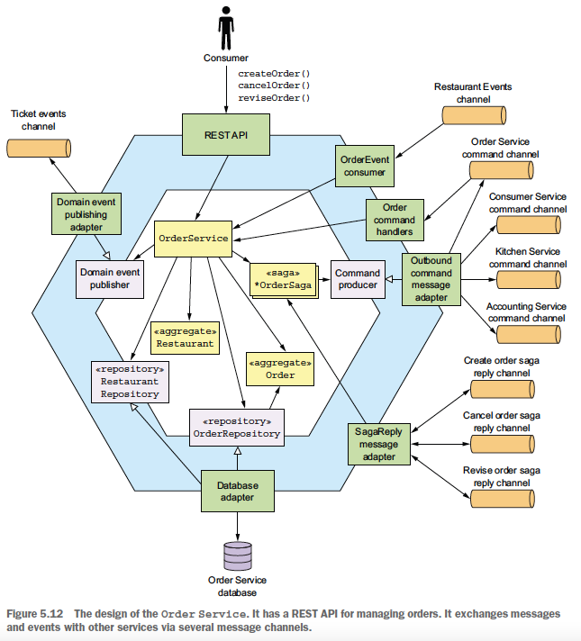

## 6. Developing business logic with event sourcing: skipped

## 7. Implementing queries in a microservice architecture
### Query using API composition pattern
- Types of composer:
  - FE client (eg web app)
  - Service: API gateway/BFF variant
- Design issues:
  - Decide which component to act as API composer:
    - Frontend client: not practical for clients accessing services via the internet: slow network
    - API gateway -> allow clients accessing the gateway via the internet to efficiently retrieve the data
    - Standalone API composer: usage:
      - For queries used internally by multiple services
      - Externally accessible queries with logic too complex to be part of API gateway
  - Query performance: should call provider services in parallel
- Adv: simple to implement
- -> Should consider first when design queries
- Disadvs:
  - Costly query
  - Reduced availability: involve multiple services. Solution: see chap 3 - RPC design issues: recover from an unavailable service
  - Lack of transactional data consistency
### Query using CQRS pattern
- Usages:
  - When API composition can't efficiently perform a query: not all services store attributes that can be used to filter or sort:
    - 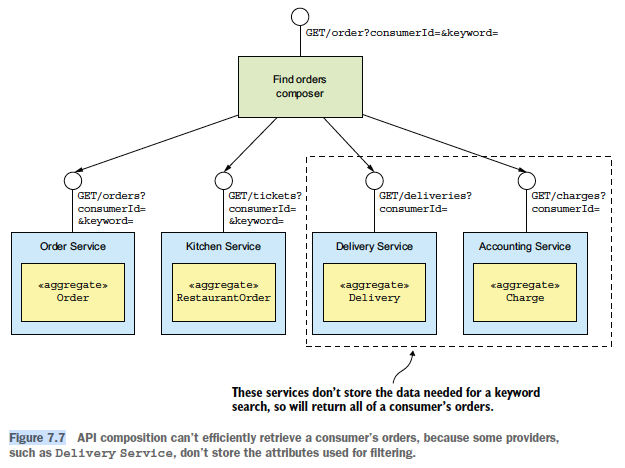
    - Solution:
      - API composer retrieve & join large data set -> inefficient
      - Fetch IDs, then bulk fetch other services -> require bulk fetch API
  - Service data model doesn't efficiently support the query (eg geospatial/text search query)
  - Need to separate concerns: service responsibility is maintaining business data, not querying data
- Archi:
  - 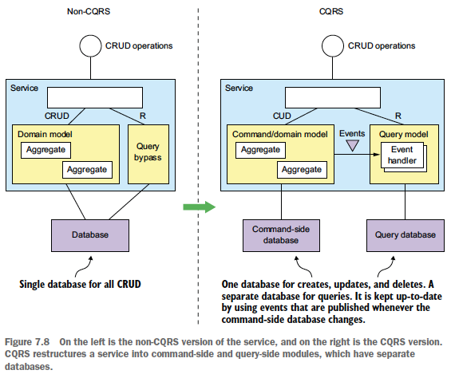
  - 
  - Command/domain model:
    - Handle CUD operations using its own database
    - Can handle simple queries (eg non-join, primary key-based query)
  - Query model: handle nontrivial queries
  - Can be applied within a service or to define query services: build DB by subscribing to events published by multiple services
- Advs:
  - Enable efficient queries
  - Enable efficient implementation of diverse queries using dif types of DB
  - Make querying possible in an event sourcing app
  - Improve separation of concerns: both command side & query side are simpler & easier to maintain
- Disadvs:
  - Complex archi -> increased dev & operational effort
  - Replication lag -> client must handle inconsistency by:
    - Command side & query side APIs return version. When out of date, client poll the query side.
    - Update local model using data returned by the command
    - -> UI code might need to duplicate server side code
- Design issues:
  - Choose datastore tech for the view:
    - Consideration:
      - Characteristics of queries
      - How to efficiently implement update operations when receiving events
    - NoSQL advs: richer data mode, higher performance
    - SQL advs: familiar, BI, non-primary key-based update
  - Design data access module:
    - Handle concurrency: use lock or update DB records without reading them first
    - Handle duplicate event:
      - Idempotent
      - Record max event ID or map of (agg type-agg ID, max event ID)
    - Build & update CQRS view: use archived event. Use snapshot when don't have all events.

## 8. External API patterns
### Problems with client-invoking-services approach
- Multiple requests via the Internet: inefficient & poor UX
- Coupling -> hard to change APIs/architecture
- Services might use client-unfriendly IPC mechanisms
- It's ok for web app running in same data center to access the backend directly
### API gateway pattern
- API gateway's functions:
  - Request routing
  - API composition
  - Protocol translation
  - Edge functions (eg authentication, rate limiting, caching)
  - -> Alternative: implement in an upstream service:
    - Adv: separate concern
    - Disadvs: increase network latency & complexity
- Archi:
  - 
- Ownership model:
  - 
  - *Note: common layer functions: request routing, authen...
  - Deployment pipeline must be fully automated to avoid blocking
- Backend for frontend pattern:
  - Archi:
    - 
    - Use shared lib for common functionality
  - Advs: of microservices
- Advs:
  - Encapsulate internal structure of the app
  - Provide client-specific API -> reduce number of round-trips & simplify client code
- Disadvs:
  - Add a new highly available component
  - Risk of becoming a dev bottleneck
  - -> Updating process should be lightweight
- Design issues:
  - Performance & scalability: use async IO (eg Node) for IO intensive logic
  - Need to invoke services concurrently to improve performance
  - -> Need to write maintainable concurrent code (eg reactive programming, JS promise) to avoid callback hell
  - Handle partial failure: use techniques in chap 3
  - Fit the current archi: need to consider when choose tech/framework

## 11. 

## 13. Refactoring to microservices
- Goal: refactor from monolith to microservices without having to rewrite app from scratch
### Overview of refactoring to microservices
- Consideration before refactoring: make sure business problems arise because of monolith architecture, not because of:
    - Poor software dev process (eg manual testing)
    - Not try all scalability solution
- Non-strategy: dev new microservices app from scratch. Reasons:
    - Lots of time wasted not implementing features that the business needs
    - New features still developed in the monolith -> effort diverted, constant moving target
    - Might implement features that are no longer needed
- Overall strat:
    - Incrementally refactor the monolith & build stranger app
    - -> Stop when the monolith is small enough/no longer an obstacle to ongoing dev
    - Migrate high value or constantly changing areas of the app first
    - -> Increase dev velocity, maintain business support for the migration
    - Avoid making widespread changes to the monolith
    - Avoid building deployment infra upfront: only need a deployment pipeline with automated testing
    - Reduce effort, have time to gain real exp to pick technologies
### Strategies for refactoring a monolith to microservices
- Implement new features as services:
    - Benefits:
        - Stop the monolith from growing
        - Accelerate dev of new features
        - Demonstrate business value
    - Need 2 other elements to integrate the new service into the app:
        - API gateway: to route request to service & monolith
        - Integration glue code:
            - Allow service to access the monolith data & invoke its functionality
            - Consist of adapters in the monolith & the service that communicate via IPC
        - 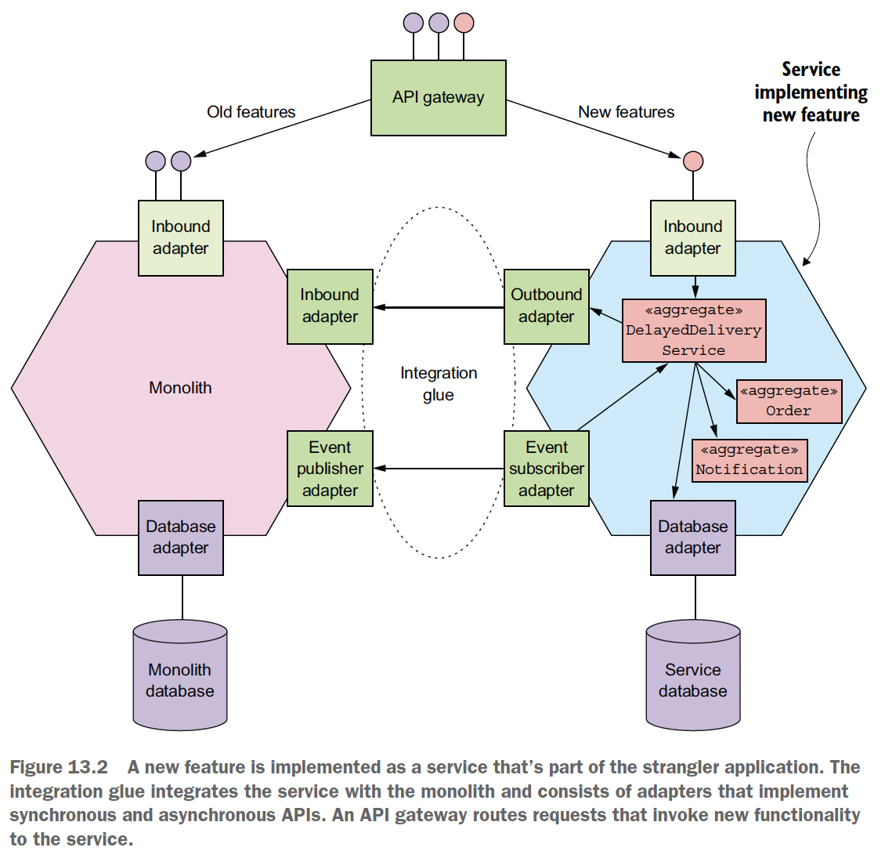
    - Non-usage:
        - New feature is too small to be a meaningful service
        - New feature is too tightly coupled with the monolith
        - -> Performance problem due to excessive IPC
        - Data consistency problem
    - -> Need to implement in the monolith, extract later
- Separate presentation tier from the backend:
    - 
    - Benefits:
        - Dev, deploy & scale 2 apps independently
        - Expose remote API of monolith that can be called by new microservices
    - -> Only a partial solution
- Extract business capabilities into services:
    - 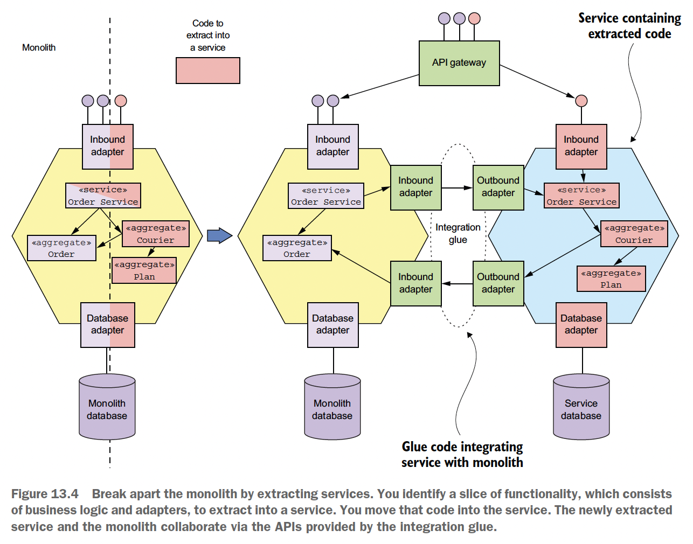
    - Parts to extract to the new service:
        - Inbound adapters containing API endpoints
        - Domain logic
        - Outbound adapters (eg DB access logic)
        - DB schema of the monolith
    - Likely to be time-consuming: monolith code base is likely to be messy
    - -> Need to decide which service to extract first
    - Might do over many iterations: each iteration extract several functionalities
    - Design issues:
        - How to split the domain model:
            - Remove object references:
                - Use aggregate concept
                - Avoid having large impact on clients of the class on the monolith: replicate data
            - Split class: extract functionality from a class that has other responsibilities
        - How to refactor the database: changing all clients of the DB to use the new schema takes lots of time
        - -> Solutions:
            - Migrate then replicate data from service back to monolith to avoid large impact
            - Migrate the clients incrementally (might not need to when client code is extracted into a new service)
        - What is the sequence of service extraction:
            - Design the new architecture -> revise it as you gain migration experience
            - Strats:
                - Freeze monolith dev/bug fix and extract services on demand:
                    - Adv: force you to break up the monolith
                    - Disadv: service extraction is driven by short-term requirements
                    - -> Risk of small benefit in exchange for lots of effort
                - Rank services by the benefit from extraction:
                    - Accelerates development: when business roadmap suggests lots of dev in such part
                    - Solve performance/scaling/reliability problem
                    - Enable extraction of other services
                - -> More strategic & closely align with business' needs
    - Design steps:
        - Review code related to the service business and identify participating entities & their fields
        - Decide which data to migrate to the service. Need to consider:
            - How monolith and service access each other's data
            - How to maintain data consistency
        - Design service domain logic: mostly copy code from the monolith
### Designing how the service and the monolith collaborate
- Design integration glue:
    - Design API that the glue provides to the domain logic: encapsulate in an interface:
        - Query API: Respository interface
        - Command API: Service interface:
            - Changes in the monolith to call the Service interface:
                - Identify all places in the monolith that invoke such business logic to call the interface
                - Implement the interface with:
                    - Existing monolith logic
                    - Proxy to new service
                - Use feature toggle to dynamically switch between the 2 implementations
                - Remove the existing monolith implementation when the service is considered working as expected
                - 
    - Pick interaction style & IPC mechanism:
        - Query data:
            - Option 1: consumer invoke RPC API of data provider:
                - Adv: simple to implement
                - Disadv:
                    - Inefficient if consumer makes lots of requests
                    - Reduced availability
            - Option 2:
                - Provider is monolith: service implement CQRS
                - Provider is service: service publish domain events for monolith to consume and update its DB
                - Adv: efficient
                - Disadv:
                    - Increased complexity
                    - Might need to modify monolith to publish domain event
        - Update data: use transactional messaging
            - Transaction required: use saga
            - Transaction not required: publish event
    - Implement anti-corruption layer:
        - When:
            - Develop new domain model in the service, dif from monolith domain model
            - Need to communicate with monolith
        - Goal: prevent legacy monolith's domain model from polluting service's domain model
        - Anti corruption layer def: layer of code that translates between dif domain models
        - 
        - Functions:
            - Map class/attribute names/values
            - Map status code
        - Where to implement:
            - In service:
                - When receive monolith domain event
                - When invoke monolith API
            - In monolith:
                - When subscribe to service event
                - When invoke service API
    - Publish/consume domain event in the monolith:
        - Publish:
            - Sol 1: in the code:
                - Adv: can publish high level domain event
                - Disadv:
                    - Need to locate all the places to publish. Potentially huge change.
                    - Can't deal with cases using stored procedure
            - Sol 2: use DB event via transaction log tailing/polling
                - Adv: don't have to change the monolith
                - Disadv:
                    - Low level event
                    - Don't know reason for the update
        - Consume problem: monolith written in language without message broker client
        - -> New helper service to subscribe to event & update monolith DB directly
- Maintain data consistency across service and monolith:
    - Problem: introducing saga's compensating transaction in the monolith might require numerous, risky code change (eg new "state" field in DB model)
    - Approach: ensure monolith transactions are either pivot or retriable transactions by:
        - Design saga
        - Decide service extraction order
- Handle authentication & authorization:
    - Problem: support both monolith and JWT-based security mechanisms simultaneously
    - Solution:
        - Monolith login handler returns an additional cookie to be included in every request. Cookie content: JWT token.
        - API gateway validate the token in the cookie, set it in authorization header and send to services
        - Services validate the token and extract info
        - 
### Refactoring examples of strat 1 and 3: skipped
